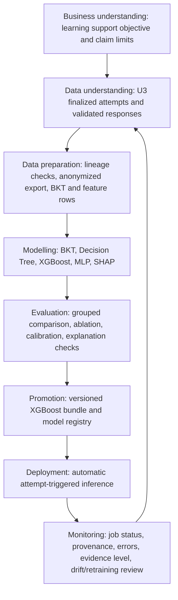

# Logic Oasis AI Pipeline CRISP-DM Lifecycle - Plan

## Goal Capsule

Standardize the Logic Oasis explainable adaptive-learning pipeline using CRISP-DM, from the educational problem through controlled automatic deployment.

This document is the detailed AI-methodology companion to `docs/plans/2026-07-05-001-feat-fyp1-prototype-development-plan(2)(1).md`.

The canonical FYP1 plan controls scope, priority, estimates, and U4-U9 sequencing.

This document controls the detailed AI evidence, model, evaluation, deployment, and claim boundaries for those units.

The pipeline must only use U3 server-finalized attempt and response evidence for runtime learning decisions.

It must not claim that the existing developer-run `ai_pipeline/run_ai_pipeline.py` or legacy `ai_pipeline/xgboost_logic_oasis_model.pkl` is the final automatic FYP1 system.

---

## Product Contract

### Problem Frame

Logic Oasis must identify when a student is likely to need support in a mathematics subtopic, explain the evidence in child-appropriate and parent-appropriate language, and choose the next question bank safely.

A quiz score by itself is not sufficient evidence because it loses response order, skill context, response time, hints, content version, and the difference between a one-off poor result and a repeated learning difficulty.

The pipeline therefore combines BKT, XGBoost, SHAP, and a guarded adaptive policy.

### Requirements

**Educational and claim boundary**

- R1. Define the AI purpose as evidence-supported learning assistance and weak-topic detection, not diagnosis, grading automation, or a claim that a single low score proves a weakness.
- R2. Use BKT to maintain a chronological student-skill mastery estimate, XGBoost to estimate the frozen future-facing support-risk target, SHAP to explain XGBoost output, and a separate guarded policy to select the next bank.
- R3. Keep Q&A Naive Bayes separate from the quiz-learning models because it classifies explanation quality rather than mathematical mastery or next-attempt risk.

**Trusted data**

- R4. Accept runtime learning evidence only when U3 created a `quizAttempts` document with `finalizationStatus: finalized`, `validationStatus: finalized`, and `dataSource: runtime_callable`, together with the matching validated `questionResponses` lineage.
- R5. Exclude `seed_demo`, `synthetic_test`, manually seeded AI evidence, and legacy client-created attempts from final model training, comparison, and final performance claims.
- R6. Export approved real evidence to CSV only through an anonymized, versioned export that contains pseudonymous student keys and no raw student identifier.

**Preparation and modelling**

- R7. Use one versioned feature schema and one frozen prediction contract for Decision Tree, XGBoost, and MLP comparison.
- R8. Construct `next_attempt_support_needed` only from a later chronological attempt in the same student/subtopic sequence, never from future features or a current final score label.
- R9. Compare Decision Tree, XGBoost, and MLP using the same student-grouped split, target, feature rows, metrics, random seed, and limitations statement. Evaluate BKT contribution as a named ablation rather than treating BKT as a directly comparable classifier.

**Runtime and presentation**

- R10. Trigger automatic inference only after U3 finalizes an attempt. The runtime must update BKT, create an observable AI job, load only a promoted and manifest-compatible model, compute SHAP, persist derived records idempotently, and create the guarded next-bank assignment.
- R11. Present only safe, evidence-level-aware explanations to students and parents. The mobile client must never receive answer keys, raw model artifacts, training data, internal error traces, or unreviewed free-form explanations.
- R12. Keep model training and promotion controlled and versioned. Quiz completion may run inference but must never retrain, silently promote, or replace a model artifact.

### Scope Boundaries

- The current manual Firestore batch script remains a development/audit utility only. It is not the normal quiz-completion path.
- The legacy `Weak`/`Moderate`/`Strong` `.pkl` model is excluded from the active runtime registry and from final FYP1 superiority claims.
- A real-data shortage may permit a pipeline demonstration and preliminary report, but not an unsupported statement that XGBoost is more accurate than the baselines.
- This document does not activate reserved Stage 3 onboarding records or change the approved FYP1/FYP2 boundary for Team Challenge and Study Buddy.

### Key Flow

- F1. Trusted attempt to parent/student insight
  - **Trigger:** `finalizeQuizSession` commits one U3 trusted `quizAttempts/{attemptId}` document.
  - **Steps:** An automatic backend job validates response lineage, updates BKT, constructs features, runs the promoted XGBoost model, obtains SHAP values, applies the next-bank guardrails, and writes derived records once for the attempt.
  - **Outcome:** The student sees the next mission and processing state. The parent sees only safe, supported insight after the job completes or a clearly declared fallback state.
  - **Covers:** R2, R4, R10, R11, R12.

---

## Planning Contract

### CRISP-DM Lifecycle



### 1. Business Understanding

The product decision is not “predict a student label.”

It is “use repeated, validated learning evidence to decide whether the student should receive more support, remain at the current question-bank level, or advance one level.”

The frozen supervised target is `next_attempt_support_needed`.

For a current attempt, the label is derived only from the next chronological attempt in the same student/subtopic sequence using the supervisor-approved `masteryCriterion`.

The educational success criteria are useful support, conservative progression, clear explanations, and no unsupported high-confidence diagnosis.

### 2. Data Understanding

The authoritative runtime source is U3 evidence:

```text
quizAttempts (finalized runtime_callable)
  + questionResponses (validated, ordered, matching attempt)
  + immutable question-bank/content version context
```

`ai_pipeline/logic_oasis_ai/sources/firestore_source.py` validates this source contract before feature construction.

`ai_pipeline/logic_oasis_ai/sources/csv_source.py` must reconstruct the same contract from an approved anonymized export, so offline training and Firestore runtime do not use different data semantics.

The minimum accepted operational fields are the attempt/session/response IDs, student identity inside the protected backend boundary, topic/subtopic/skill, bank and content version, validated correctness, response order, response time, hint count, and server timestamps.

Seed and emulator data may test source parsing and runtime mechanics, but only consented, anonymized, approved real data may support final evaluation claims.

### 3. Data Preparation

Preparation creates reproducible feature rows rather than editing data manually in a notebook.

The authoritative feature schema is `ai_pipeline/configs/feature_schema.yaml` and the code contract in `ai_pipeline/logic_oasis_ai/features.py`.

The initial declared features are `total_questions`, `correct_count`, `correct_rate`, `mean_response_time_ms`, `mean_hint_count`, and the separately evaluated `bkt_mastery_probability` feature.

Preparation must reject a record when response lineage is incomplete, finalization or validation status is wrong, provenance is not approved, timestamp parsing fails, content/schema versions conflict, or a feature would use future evidence.

`ai_pipeline/training/export_real_attempts.py` creates versioned anonymized `attempts.csv`, `responses.csv`, and `manifest.json` artifacts. The manifest records source schema, feature schema, provenance, counts, and the absence of raw student IDs.

### 4. Modelling

BKT processes ordered responses per student and skill to produce an interpretable mastery posterior.

Decision Tree, XGBoost, and MLP solve the same binary `next_attempt_support_needed` task. They receive identical feature columns and the same student-grouped train/test split.

SHAP is generated only for the promoted XGBoost model. Its values explain the specific risk prediction; they do not independently prove mastery and do not choose a bank.

The adaptive policy in `ai_pipeline/logic_oasis_ai/adaptive_policy.py` combines BKT, XGBoost risk, minimum evidence, bank exposure, and frozen guardrails. It may move only one bank level at a time. It records whether a BKT/rule fallback was used because no promoted model is available.

### 5. Evaluation

Evaluation is reproducible and fair before any model is promoted.

`ai_pipeline/training/evaluate_models.py` must produce one comparison report containing the prediction contract, dataset version, anonymized attempt IDs, grouped split, random seed, feature list, class counts, metrics, data-sufficiency level, limitations, and BKT ablation result.

Report accuracy, precision, recall, F1, ROC-AUC where valid, log loss, Brier score, confusion matrix, inference latency, and serialized size for the three classifier baselines.

Evaluate BKT separately through expected mastery-sequence behaviour and, where enough real data exists, calibration or predictive utility. Its BKT-feature ablation measures the change to classifier results with and without the BKT feature on the same rows.

An explanation review samples SHAP results and confirms that the displayed reasons correspond to stored values from the promoted model/version and do not overstate certainty.

### 6. Deployment and Monitoring

Training, evaluation, promotion, and runtime inference are separate operations.

Offline training may generate candidate artifacts but cannot make them active automatically.

Only an evaluated XGBoost artifact whose manifest matches the active prediction contract and passes promotion gates can become the promoted runtime model.

At deployment, `tools/build_function_bundle.py` packages the authoritative `ai_pipeline/logic_oasis_ai/` source and promoted model manifest into the Firebase Functions deployment boundary. A source/bundle/registry mismatch fails closed to the documented BKT/rule fallback.

The automatic runtime records `aiJobs/{attemptId}` states, idempotently materializes `masterySnapshots`, `subtopicMastery`, `aiModelRuns`, and `adaptiveAssignments`, and exposes only safe status/explanation fields to Flutter.

Operational monitoring records job state, retry count, error code, source attempt, model/feature/schema versions, policy reason, fallback status, and completion time. It does not log raw answer keys or raw personal data.

### Key Technical Decisions

- KTD1. Trusted U3 evidence is the only runtime and final-evaluation source. This prevents the client, seed data, or manual pipeline from creating model truth.
- KTD2. BKT and XGBoost have different jobs. BKT estimates sequential mastery; XGBoost predicts future support risk; SHAP explains XGBoost; the guarded policy selects a bank.
- KTD3. CSV and Firestore use one source validation contract. Offline experiments must not become a second, weaker interpretation of quiz evidence.
- KTD4. The prediction contract is frozen before comparison. The target, criterion, feature schema, split grouping, and metrics cannot change after test results are seen.
- KTD5. Promotion is deliberate. Only a versioned evaluated XGBoost bundle can be active; a quiz may infer but never retrain or promote a model.
- KTD6. Runtime failure is safe and visible. A failed/mismatched model falls back to documented BKT/rule guidance, records the reason, and never invents a result.

## Operational Protocol and Change Control

This section is the tracked protocol for changing, training, evaluating, and
deploying the quiz-learning pipeline. It supplements the canonical FYP1 plan;
it does not itself approve a target, model, or deployment.

### Status at 2026-07-16

| Area | Status | Evidence |
| --- | --- | --- |
| U6 trusted source/export/candidate lifecycle | Implemented | `sources/`, `features.py`, `model_registry.py` |
| U7 target/comparison harness | Implemented with fixtures | `prediction_contract.py`, `training/`, U7 tests |
| Real dataset and final performance claim | Pending consent/approval and collection | Release manifest and report |
| Runtime promotion | Blocked until evaluation gates and named approval pass | `ModelRegistry.promote()` |
| U8 jobs, SHAP review, retries, dashboard statuses | Pending U8 | Canonical plan U8 |

No fixture, `seed_demo`, `synthetic_test`, legacy batch result, or legacy
`Weak`/`Moderate`/`Strong` artifact can become final evaluation evidence by
editing this document.

### 1. Dataset Specification

#### Inclusion and exclusion

- Include only a U3 `quizAttempts/{attemptId}` record with
  `finalizationStatus: finalized`, `validationStatus: finalized`, and
  `dataSource: runtime_callable`, together with its matching ordered
  `questionResponses` carrying `validationStatus: validated`.
- The U6 adapter must validate session/student/response lineage, response order,
  correct count, timestamps, bank/content version, response time, and hints.
- Exclude `seed_demo`, `synthetic_test`, emulator fixtures, manual AI rows,
  legacy client-created attempts, incomplete sessions, duplicates, orphan
  responses, and any required-field failure.
- Exclude a row from final evaluation without `real` provenance, consent/ethics
  approval, and an assigned dataset release ID. `emulator_verified` is for
  mechanics tests only, never a final performance claim.

| Field group | Required values | Missing/invalid policy |
| --- | --- | --- |
| Lineage | Pseudonymous `studentKey`, attempt/session/response IDs, ordered response IDs | Reject; never impute lineage. |
| Trust | Finalization/validation status, data source, provenance | Reject from final evaluation. |
| Context | Topic, subtopic, skill, bank, difficulty, content version, year level | Reject the affected attempt; do not guess context. |
| Outcome/telemetry | Server correctness/counts/order, response time, hints, timestamps | Reject missing correctness/order/timestamp; timing/hints must be non-negative integers. |
| Derived features | Frozen feature row and optional BKT posterior | Rebuild from accepted evidence; never hand-edit. |

Use `real_attempts_v<major>_<YYYY-MM>` (for example
`real_attempts_v1_2026-08`). Before a real release, its manifest must include
dataset/export/source/feature schema versions, export and collection dates, row
counts, file hashes, `provenance: real`, consent/ethics reference, data steward,
storage location, and retention/deletion review date. The anonymization method
is salted SHA-256 pseudonyms for student, attempt, session, and response IDs;
the salt stays outside the export, repository, and report. No raw student ID,
display name, answer text/key, or unnecessary personal data may appear.

### 2. Target-Label Declaration

| Item | Declared rule |
| --- | --- |
| Target | `next_attempt_support_needed` |
| Unit | One server-validated student-subtopic attempt at time *t*. |
| Current default `masteryCriterion` | `0.60` correct rate on the next eligible attempt; implementation default, not final supervisor approval. |
| Label | `true` when the direct next eligible chronological attempt for the same student/subtopic has `correct_rate < masteryCriterion`; otherwise `false`. |
| Observation window | Evidence available at or before current attempt completion only. |
| No later attempt | Censored/unlabelled and excluded; never assumed success/failure. |
| Repeated attempts | Keep sequence order; each current attempt uses only its direct next eligible attempt. |

Before real training, the supervisor must approve `0.60` with a curriculum
rationale or approve a new criterion and label version. Record approver, date,
and rationale with the dataset/evaluation report; do not tune after final-test
results are seen. `contentVersion` is retained on each U3/U6 row. U7 currently
groups labels by student/subtopic, so real-data training must first resolve
content transitions. Recommended initial policy: label only same-version pairs
and censor cross-version pairs until an approved equivalence policy exists.

### 3. Feature Protocol

The frozen first-evaluation feature allowlist is
`total_questions`, `correct_count`, `correct_rate`, `mean_response_time_ms`,
and `mean_hint_count`. The named BKT ablation adds only
`bkt_mastery_probability`. The U7 ablation rejects a comparison if row identity,
target, student/subtopic, timestamp, contract, or base features differ besides
adding a finite BKT value in `[0, 1]`.

Every feature must be available when the current attempt is finalized. Exclude
next-attempt score/correctness/responses/timing/hints/BKT, future mastery,
post-outcome rewards, assignments, diagnoses, SHAP output, raw answer/question
text, answer keys, names, raw identifiers, and unapproved sensitive attributes.
Pseudonymous IDs and timestamps are audit metadata, never model features.

For real evaluation, `bkt_mastery_probability` means the posterior after the
current attempt's server-sealed responses but before any later attempt. Record
its source response/attempt IDs and BKT version. U8 must source it from
chronological U4 replay/snapshots, never a future stored snapshot.

### 4. Training Protocol

- Group by `studentKey`; no student may appear in both training and validation/
  held-out test partitions. Preserve chronology while deriving the target.
- Fit scaling, imputation, encoding, sampling, and class-weight decisions using
  training data only; apply them unchanged to validation/test data.
- Use the same filtered labelled rows, random seed, target version, feature
  set, and split manifest for Decision Tree, XGBoost, and MLP. BKT is an
  explicitly named base-versus-BKT ablation.

U7 currently implements deterministic grouped holdout with
`random_seed = 20260716` and downgrades a held-out claim when its test group
lacks both classes. Before a supervisor-facing claim, add grouped validation or
repeated evaluation when real data permits and record group IDs.

| Model | Current controlled configuration |
| --- | --- |
| Decision Tree | `max_depth=4`, `min_samples_leaf=2`, balanced class weights, shared seed. |
| XGBoost | 40 estimators, depth 3, learning rate 0.08, 0.9 subsample/column sample, one worker, shared seed. |
| MLP | One layer of 8 units, `alpha=0.01`, standard scaling, shared seed; early stopping at 30+ training rows. |

Measure class imbalance in every report. Any XGBoost/MLP class weighting,
sampling, stopping, or tuning change needs a versioned training-manifest entry
and must be fit on training data only. Current U4 BKT defaults are
`pKnown=0.35`, `pLearn=0.18`, `pGuess=0.20`, and `pSlip=0.10` (`bkt-v1`). They
are reproducible defaults, not calibrated child-learning claims. Calibration
must record parameter version, source, objective, bounds, grouped split, and
comparison with defaults; never calibrate against the untouched final test set.

### 5. Evaluation and Promotion Protocol

| Gate | Required evidence | Permitted claim |
| --- | --- | --- |
| Pipeline demo | One real trusted attempt completes the protected path. | Architecture works; no performance claim. |
| Preliminary comparison | Both classes and more than one student group support a non-overlapping grouped split. | Preliminary metrics with limits. |
| Held-out comparison | Untouched student-grouped test contains both classes and leaves viable training data. | Held-out metrics, group/sample counts, limitations. |
| Cautious advantage | Repeated grouped/held-out results show a stable practical benefit. | Cautious measured advantage, never "proven superior." |

Every report records accuracy, precision, recall, F1, ROC-AUC when valid, log
loss, Brier score, confusion matrix, inference latency, serialized size,
target/label/schema/dataset versions, split IDs, seed, class counts, and limits.
There is no automatic numeric promotion threshold. A named project owner and
supervisor must review evidence, trade-offs, safety/explanation review, and
rollback plan. Record approver/date, report/artifact hashes, dataset version,
target/criterion/schema versions, and promotion/rejection rationale.

`ModelRegistry` blocks activation unless an artifact is evaluated XGBoost, has
a passing promotion-gate flag, and matches the frozen target, label version,
mastery criterion, and feature schema. U8 must persist approval/audit fields;
U7 fixtures do not create a real promoted model.

Before parent-facing SHAP text is enabled, review samples from the exact
promoted bundle for feature names, values, directions, source attempt, and
model/schema versions. Text must be supportive and evidence-aware. This SHAP
sanity review is pending U8. Rollback deactivates the version, keeps its audit,
uses the last compatible approved model or BKT/rule fallback, and never loads
the legacy `.pkl` on bundle/registry/schema mismatch.

### 6. Deployment Test Protocol (U8 Pending)

```text
finalizeQuizSession commits trusted finalized quizAttempts/{attemptId}
  -> creates or reuses exactly one aiJobs/{attemptId}
  -> validates lineage and promoted model/bundle/registry compatibility
  -> writes one derived result set or declared fallback/failed job
```

| Test | Required result |
| --- | --- |
| Valid finalized attempt | `queued -> processing -> completed`; one trusted model run and next-bank assignment. |
| Duplicate delivery | Same job/source attempt; no duplicate mastery, model run, reward, or assignment. |
| Invalid/untrusted attempt | No inference; sanitized `failed` job. |
| Missing/incompatible bundle | Declared `fallback`/`failed`; no legacy-model load. |
| Transient failure | Retries only to configured U8 limit, then stops in `failed` or fallback. |
| Parent/student read | Result remains immediate; UI shows processing/completed/fallback/failed without raw model/error data. |

Expected U8 outputs are `aiJobs`, versioned BKT/mastery records, `aiModelRuns`,
and `adaptiveAssignments`, each with source attempt, model/schema, policy,
timestamp, status, and idempotency lineage. Status meanings: `queued` or
`processing` = analysis in progress; `completed` = verified derived insight;
`fallback` = guarded BKT/rule guidance; `failed` = no AI claim and safe retry/
support message. Exact collection shapes, retry limit, and sanitized error
vocabulary must be recorded here during U8 before deployment.

---

## Implementation Units

### U4. BKT Mastery Package and Sequence Evidence

- **Goal:** Turn validated response sequences into versioned BKT mastery records per student/skill.
- **Requirements:** R2, R4, R7, R10.
- **Files:** `ai_pipeline/logic_oasis_ai/bkt.py`, `ai_pipeline/logic_oasis_ai/schemas.py`, `ai_pipeline/logic_oasis_ai/validators.py`, `ai_pipeline/tests/test_bkt.py`, `ai_pipeline/tests/test_source_parity.py`.
- **Approach:** Freeze BKT priors and process only chronological, de-duplicated validated response rows. Record observation count, source attempt ID, model version, and evidence level.
- **Test scenarios:** Known correct/incorrect sequences produce expected posteriors; duplicate or unordered responses fail; foreign, seed, incomplete, or mismatched lineage cannot update mastery.
- **Verification:** BKT tests and source-parity tests pass; stored mastery links to one finalized source attempt.

### U5. Guarded Adaptive Assignment

- **Goal:** Convert BKT, risk, and exposure evidence into the next question-bank assignment without returning to the former `>= 80` automatic promotion rule.
- **Requirements:** R1, R2, R10, R11.
- **Files:** `ai_pipeline/logic_oasis_ai/adaptive_policy.py`, `ai_pipeline/tests/test_adaptive_policy.py`, `functions/main.py`.
- **Approach:** Use explicit versioned thresholds, minimum evidence, one-level movement, unseen-bank preference, and a recorded BKT/rule fallback when no promoted risk model is available.
- **Test scenarios:** Strong evidence advances by one level; weak/high-risk evidence supplies or steps down by one level; insufficient evidence stays; repeated retry/event delivery does not create another assignment.
- **Verification:** Policy tests identify the exact policy version and human-readable reason for every outcome.

### U6. Real-Data Source, Export, and Candidate Lifecycle

- **Goal:** Produce anonymized, versioned, validated evidence for training and candidate artifacts.
- **Requirements:** R4, R5, R6, R7, R12.
- **Files:** `ai_pipeline/logic_oasis_ai/sources/firestore_source.py`, `ai_pipeline/logic_oasis_ai/sources/csv_source.py`, `ai_pipeline/training/export_real_attempts.py`, `ai_pipeline/logic_oasis_ai/model_registry.py`, `ai_pipeline/configs/feature_schema.yaml`, `ai_pipeline/tests/test_source_parity.py`.
- **Approach:** Enforce the U3 trusted gate for every source, export pseudonymous CSV with a manifest, and register candidate metadata without allowing automatic promotion.
- **Test scenarios:** Firestore and CSV produce equal validated datasets; raw student IDs never appear in export; rejected provenance is refused; a candidate missing its manifest/evaluation metadata cannot become active.
- **Verification:** Export manifest and registry metadata contain schema, dataset, artifact, and evaluation hashes.

### U7. Frozen Prediction Contract and Fair Comparison

- **Goal:** Evaluate Decision Tree, XGBoost, and MLP fairly and decide whether an XGBoost candidate is promotable.
- **Requirements:** R7, R8, R9, R12.
- **Files:** `ai_pipeline/logic_oasis_ai/prediction_contract.py`, `ai_pipeline/training/train_decision_tree.py`, `ai_pipeline/training/train_xgboost.py`, `ai_pipeline/training/train_mlp.py`, `ai_pipeline/training/evaluate_models.py`, `ai_pipeline/reports/model_comparison.md`, `ai_pipeline/models/README.md`, `ai_pipeline/tests/test_prediction_contract.py`.
- **Approach:** Build labels from the later same-subtopic attempt, group the split by student, use one random seed/feature set/metrics suite, state data sufficiency honestly, and run the BKT-feature ablation separately.
- **Test scenarios:** Future leakage is rejected; final attempts without a later label are excluded; every model receives identical feature names and split; insufficient data blocks superiority claims and promotion.
- **Verification:** The comparison report includes all required metrics and limitations; only an evaluated candidate passing promotion gates can be marked promoted.

### U8. Automatic Inference Runtime

- **Goal:** Replace manual post-quiz AI execution with one idempotent automatic backend path.
- **Requirements:** R4, R10, R11, R12.
- **Files:** `functions/main.py`, `functions/ai_runtime.py`, `functions/vendor/logic_oasis_ai/`, `tools/build_function_bundle.py`, `tools/tests/test_function_bundle_parity.py`, `functions/tests/test_ai_runtime.py`, `firestore.rules`.
- **Approach:** Trigger from the server-created finalized attempt, create an `aiJobs/{attemptId}` record, validate source lineage, load only a manifest-compatible promoted model, calculate BKT/risk/SHAP/policy output, and write each derived document with attempt-based idempotency.
- **Test scenarios:** Valid attempt completes once; duplicate delivery produces no duplicate outputs; invalid source fails; missing/mismatched promoted model follows the declared fallback; job retries stop at the configured limit; SHAP, model, and feature-schema versions match stored output.
- **Verification:** Firebase Emulator executes the same `functions/main.py` runtime entry point as cloud deployment and demonstrates a complete trusted attempt-to-job-to-insight path.

### U9. Student and Parent AI Presentation

- **Goal:** Turn backend AI records into understandable, evidence-aware student missions and parent dashboard insight.
- **Requirements:** R1, R3, R11.
- **Files:** `lib/features/quiz/quiz_page.dart`, `lib/features/quiz/result_page.dart`, `lib/features/parent/parent_dashboard_page.dart`, `lib/shared/models/ai_diagnosis.dart`, `lib/shared/repositories/learning_repository.dart`, `test/ai_diagnosis_test.dart`, `test/parent_dashboard_time_test.dart`.
- **Approach:** Show server-validated immediate quiz feedback first, then `analysis in progress`, completed, fallback, or failed state. Render supportive SHAP-backed reason text only when its model/version/evidence fields are valid.
- **Test scenarios:** Parent view never shows seed data as live evidence; completed/fallback/failed states are distinct; insight refers to the matching finalized attempt; low evidence is described as preliminary; no raw SHAP array or protected data appears in UI.
- **Verification:** Widget/model tests cover safe text and state handling; an emulator/cloud demonstration proves the parent dashboard receives the latest derived record.

---

## Verification Contract

| Gate | Applies to | Evidence of success |
|---|---|---|
| U3 evidence gate | U4-U9 | Every input attempt is finalized `runtime_callable`, every response is validated, and lineage is complete. |
| Source parity | U6 | Firestore and anonymized CSV adapters accept/reject the same records and yield equivalent prepared datasets. |
| Leakage guard | U7 | No feature or label uses later attempt data; rows without a later same-subtopic attempt are excluded. |
| Fair comparison | U7 | Decision Tree, XGBoost, and MLP share target, student-grouped split, feature set, metrics, seed, and limitation statement. |
| Promotion gate | U7-U8 | Runtime loads only an evaluated promoted XGBoost artifact whose manifest matches the frozen prediction contract. |
| Runtime idempotency | U8 | Duplicate trigger delivery creates no duplicate job, mastery update, model run, or assignment. |
| Explanation traceability | U8-U9 | Stored/displayed reasons trace to the same promoted model, feature schema, attempt, and SHAP output. |
| Safe fallback | U5, U8, U9 | Missing model, mismatch, or controlled failure uses documented BKT/rule guidance and exposes a safe status. |
| Privacy and claims | U6-U9 | Final evaluation exports contain no raw student ID; seed/demo data is excluded; report wording matches the available evidence level. |

Expected commands as each unit becomes active are `py -3.11 -m unittest discover -s ai_pipeline/tests`, `py -3.11 -m unittest discover -s functions/tests`, `flutter analyze`, and the matching Firebase Emulator invocation defined by U8.

---

## Definition of Done

- The AI methodology can be explained end-to-end using the six CRISP-DM stages and the declared target/runtime boundaries.
- U3-finalized response evidence is the only accepted source for runtime learning decisions and final evaluation.
- The feature schema, target, dataset version, model artifact, evaluation report, policy, and runtime output all have versioned lineage.
- Decision Tree, XGBoost, and MLP are compared fairly before any final model superiority claim or XGBoost promotion.
- BKT sequence tests, source-contract tests, prediction-contract tests, adaptive-policy tests, runtime idempotency tests, and safe presentation tests pass for their implemented units.
- Automatic deployment uses the same packaged runtime code in Firebase Emulator and cloud, without a developer manually running the normal quiz-completion AI path.
- A model mismatch, inadequate data, or runtime failure has a recorded, safe fallback rather than an invented diagnosis or silent model substitution.
- Student and parent surfaces show only safe, evidence-aware explanations linked to a trusted finalized attempt.
- Report wording distinguishes implemented pipeline mechanics, preliminary evaluation evidence, and deferred/unimplemented work.

---

## Appendix

### Current Implementation Boundary

`ai_pipeline/run_ai_pipeline.py` and `ai_pipeline/xgboost_training_validation.ipynb` remain legacy development evidence.

They are useful for studying the existing BKT/XGBoost/SHAP-shaped prototype, but they do not automatically run after a student completes a U3 quiz and cannot be presented as the final deployed FYP1 runtime.

The new source, training, registry, and comparison modules establish the target implementation path but do not by themselves mean the automatic U8 cloud/emulator runtime is complete.

### Report Claim Wording

Use “planned” for automatic runtime behaviour until U8/U9 verification is complete.

Use “preliminary comparison” when there are too few independent students or both target classes are not adequately represented.

Use “implemented and evaluated” only when real approved evidence, grouped evaluation, promotion, automatic inference, and presentation verification have all passed.

### Sources

- Canonical FYP1 implementation plan: `docs/plans/2026-07-05-001-feat-fyp1-prototype-development-plan(2)(1).md`.
- Firestore security and evidence contract: `docs/architecture/logic-oasis-firestore-database-schema.md`.
- Legacy boundary: `ai_pipeline/README.md`.
- Current feature schema and prediction contract: `ai_pipeline/configs/feature_schema.yaml` and `ai_pipeline/logic_oasis_ai/prediction_contract.py`.
- Current candidate lifecycle and comparison implementation: `ai_pipeline/logic_oasis_ai/model_registry.py` and `ai_pipeline/training/evaluate_models.py`.
