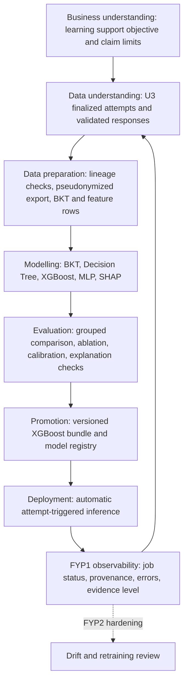

# Logic Oasis AI Pipeline CRISP-DM Lifecycle - Plan

## Goal Capsule

Standardize the Logic Oasis explainable adaptive-learning pipeline using CRISP-DM, from the educational problem through controlled automatic deployment.

This document is the detailed AI-methodology companion to `docs/plans/2026-07-05-001-feat-fyp1-prototype-development-plan(2)(1).md`.

The canonical FYP1 plan controls scope, priority, estimates, and U4-U10 sequencing.

This document controls the detailed AI evidence, model, evaluation, deployment, and claim boundaries for those units.

The pipeline must only use U3 server-finalized attempt and response evidence for runtime learning decisions.

It must not claim that the existing developer-run `ai_pipeline/run_ai_pipeline.py` or legacy `ai_pipeline/xgboost_logic_oasis_model.pkl` is the final automatic FYP1 system.

---

## Product Contract

### Problem Frame

Logic Oasis must identify when a student is likely to need support in a mathematics subtopic, explain the evidence in child-appropriate and parent-appropriate language, and choose the next question bank safely.

A quiz score by itself is not sufficient evidence because it loses response order, skill context, response time, hints, content version, and the difference between a one-off poor result and a repeated learning difficulty.

The pipeline therefore combines BKT, XGBoost, SHAP, and a guarded adaptive policy.

### Requirements

**Educational and claim boundary**

- R1. Define the AI purpose as evidence-supported learning assistance and weak-topic detection, not diagnosis, grading automation, or a claim that a single low score proves a weakness.
- R2. Use BKT to maintain a chronological student/subtopic/skill mastery estimate, XGBoost to estimate the frozen future-facing support-risk target, SHAP to explain XGBoost output, and a separate guarded policy to select the next bank. A versioned weak-topic ranking combines the BKT mastery gap, XGBoost support risk, and evidence count; these inputs are related but not interchangeable.
- R3. Keep Q&A Naive Bayes separate from the quiz-learning models because it classifies explanation quality rather than mathematical mastery or next-attempt risk.

**Trusted data**

- R4. Accept runtime learning evidence only when U3 created a `quizAttempts` document with `finalizationStatus: finalized`, `validationStatus: finalized`, and `dataSource: runtime_callable`, together with the matching validated `questionResponses` lineage.
- R5. Exclude `seed_demo`, `synthetic_test`, manually seeded AI evidence, and legacy client-created attempts from final model training, comparison, and final performance claims.
- R6. Export approved real evidence to CSV only through a pseudonymized, versioned export that contains protected student keys and no raw student identifier.

**Preparation and modelling**

- R7. Use one versioned feature schema and one frozen prediction contract for Decision Tree, XGBoost, and MLP comparison.
- R8. Construct `next_attempt_support_needed` only from a later chronological attempt in the same student/subtopic sequence, never from future features or a current final score label.
- R9. Compare Decision Tree, XGBoost, and MLP using the same student-grouped split, target, feature rows, metrics, random seed, and limitations statement. Evaluate BKT contribution as a named ablation rather than treating BKT as a directly comparable classifier.

**Runtime and presentation**

- R10. Trigger automatic inference only after U3 finalizes an attempt. The runtime must update BKT, create an observable AI job, verify compatible package, feature-schema, model-artifact, ranking-policy, and adaptive-policy manifests, compute SHAP, persist derived records idempotently, and create the guarded next-bank assignment.
- R11. Present only safe, evidence-level-aware explanations to students and parents. The mobile client must never receive answer keys, raw model artifacts, training data, internal error traces, or unreviewed free-form explanations.
- R12. Keep model training and promotion controlled and versioned. Quiz completion may run inference but must never retrain, silently promote, or replace a model artifact.
- R13. Treat client-reported response-time telemetry as advisory rather than trusted learning truth. FYP1 has no hint interaction, so `hintCount` is compatibility-only and excluded from the feature schema until a later version implements auditable hint telemetry.

### Scope Boundaries

- The current manual Firestore batch script remains a development/audit utility only. It is not the normal quiz-completion path.
- The legacy `Weak`/`Moderate`/`Strong` `.pkl` model is excluded from the active runtime registry and from final FYP1 superiority claims.
- A real-data shortage may permit a pipeline demonstration and preliminary report, but not an unsupported statement that XGBoost is more accurate than the baselines.
- This document does not activate reserved Stage 3 onboarding records or change the approved FYP1/FYP2 boundary for Team Challenge and Study Buddy.

### Key Flow

- F1. Trusted attempt to parent/student insight
  - **Trigger:** `finalizeQuizSession` commits one U3 trusted `quizAttempts/{attemptId}` document.
  - **Steps:** An automatic backend job validates response lineage, updates BKT, constructs features, runs the promoted XGBoost model, obtains SHAP values, materializes the versioned weak-topic ranking, applies the next-bank guardrails, and writes derived records once for the attempt.
  - **Outcome:** The student sees the next mission and processing state. The parent sees only safe, evidence-supported weak-topic insight after the job completes or a clearly declared fallback state.
  - **Covers:** R2, R4, R10, R11, R12.

---

## Planning Contract

### CRISP-DM Lifecycle



### 1. Business Understanding

The product decision is not “predict a student label.”

It is “use repeated, validated learning evidence to decide whether the student should receive more support, remain at the current question-bank level, or advance one level.”

The frozen supervised target is `next_attempt_support_needed`.

For a current attempt, the label is derived only from the next chronological attempt in the same student/subtopic sequence using the supervisor-approved `masteryCriterion`.

The educational success criteria are useful support, conservative progression, clear explanations, and no unsupported high-confidence diagnosis.

### 2. Data Understanding

The authoritative runtime source is U3 evidence:

```text
quizAttempts (finalized runtime_callable)
  + questionResponses (validated, ordered, matching attempt)
  + immutable question-bank/content version context
```

`ai_pipeline/logic_oasis_ai/sources/firestore_source.py` validates this source contract before feature construction.

`ai_pipeline/logic_oasis_ai/sources/csv_source.py` must reconstruct the same contract from an approved pseudonymized export, so offline training and Firestore runtime do not use different data semantics.

The minimum accepted operational fields are the attempt/session/response IDs, student identity inside the protected backend boundary, topic/subtopic/skill, bank and content version, validated correctness, `sequenceIndex`, `sourceAttemptSequence`, response time with quality status, and server timestamps. Within one BKT state, the only replay order is the lexicographic tuple `(sourceAttemptSequence, sequenceIndex)`; all responses in one quiz share its attempt sequence, so attempt sequence alone is not a response-order key.

Server-finalized correctness and lineage are authoritative. Response time is client-reported telemetry, labelled `client_reported_unverified`, and may be excluded from the real-data feature set if its readiness audit fails. FYP1 writes `hintTelemetryStatus: not_supported` and does not treat default `hintCount: 0` as evidence.

Seed and emulator data may test source parsing and runtime mechanics, but only consented, pseudonymized, approved real data may support final evaluation claims.

### 3. Data Preparation

Preparation creates reproducible feature rows rather than editing data manually in a notebook.

The authoritative feature schema is `ai_pipeline/configs/feature_schema.yaml` and the code contract in `ai_pipeline/logic_oasis_ai/features.py`.

The executable FYP1 schema identifier is `quiz-attempt-features-v2`. It replaces the five-feature development-only `quiz-attempt-features-v1`; it is the physical release identifier for the reduced feature contract referred to elsewhere in this document as `feature_schema_v1`.

The initial declared features are `correct_rate`, `mean_response_time_ms`, and the separately evaluated `bkt_mastery_probability` feature. `mean_hint_count` is deferred to a future schema version after a real, privacy-safe hint interaction exists.

Preparation must reject a record when response lineage is incomplete, finalization or validation status is wrong, provenance is not approved, timestamp parsing fails, content/schema versions conflict, or a feature would use future evidence.

`ai_pipeline/training/export_real_attempts.py` creates versioned pseudonymized `attempts.csv`, `responses.csv`, and `manifest.json` artifacts. The manifest records source schema, feature schema, provenance, counts, source-attempt ordering, the absence of raw student IDs, and the required real-data release governance metadata.

### 4. Modelling

BKT processes ordered responses per student and skill to produce an interpretable mastery posterior.

Decision Tree, XGBoost, and a small regularized MLP neural-learning baseline solve the same binary `next_attempt_support_needed` task. They receive identical feature columns and the same student-grouped train/test split. The MLP comparison is not a claim that a deep architecture has been exhaustively optimized or that neural learning is unsuitable.

SHAP is generated only for the promoted XGBoost model. Its values explain the specific risk prediction; they do not independently prove mastery and do not choose a bank.

The evidence-supported weak-topic ranking combines the current BKT mastery gap, XGBoost support risk, and evidence count under a versioned rule. It must not present one low score as an AI-confirmed weakness.

The adaptive policy in `ai_pipeline/logic_oasis_ai/adaptive_policy.py` uses these related outputs with minimum evidence, bank exposure, and frozen guardrails. XGBoost does not directly choose a bank. The policy may move only one bank level at a time and records whether a BKT/rule fallback was used because no promoted model is available.

### 5. Evaluation

Evaluation is reproducible and fair before any model is promoted.

`ai_pipeline/training/evaluate_models.py` must produce a fixture/mechanics report and, for approved real data, a separate release report containing the prediction contract, dataset version, pseudonymized attempt IDs, grouped split, random seed, feature list, class counts, metrics, data-sufficiency level, limitations, BKT ablation result, pair-transition/repeat audit, telemetry-readiness result, fallback rate, and promotion decision.

Report accuracy, precision, recall, F1, ROC-AUC where valid, PR-AUC when the support-needed class is imbalanced, log loss, Brier score, confusion matrix, inference latency, and serialized size for the three classifier baselines. Use repeated student-grouped evaluation or uncertainty/distribution reporting when the available approved data supports it.

Evaluate BKT separately through expected mastery-sequence behaviour and, where enough real data exists, calibration or predictive utility. Its BKT-feature ablation measures the change to classifier results with and without the BKT feature on the same rows.

An explanation review samples SHAP results and confirms that the displayed reasons correspond to stored values from the promoted model/version and do not overstate certainty.

### 6. Deployment and Monitoring

Training, evaluation, promotion, and runtime inference are separate operations.

Offline training may generate candidate artifacts but cannot make them active automatically.

Only an evaluated XGBoost artifact whose manifest matches the active prediction contract and passes the promotion gates can become the promoted runtime model. For FYP1, one server-only `modelRegistry` version records `isActive`, `approvedBy`, `approvedAt`, the evaluation-report hash, training-dataset version, target, label version, and exact package, feature-schema, artifact, ranking-policy, and adaptive-policy hashes. Clients cannot read or write this registry.

U8 loads XGBoost only when every registry binding matches the bundled release. Missing approval, an inactive record, an unsupported target, or any hash/version mismatch fails closed to the declared BKT/rule fallback. Signed approval/revocation documents, signing keys, and key rotation are deferred production hardening rather than FYP1 acceptance requirements. This preserves an auditable supervisor-approved release without introducing a cryptographic governance subsystem that the prototype cannot fully exercise or explain.

At deployment, `tools/build_function_bundle.py` packages the authoritative `ai_pipeline/logic_oasis_ai/` source, promoted model manifest, feature schema, active ranking-policy configuration, and active adaptive-policy configuration into the Firebase Functions deployment boundary. The Functions runtime manifest records package, feature-schema, model-artifact, ranking-policy, and adaptive-policy versions and file hashes. Before writing a weak-topic projection or assignment, runtime verifies all five are compatible. A missing or mismatched ranking/adaptive policy must produce the declared `fallback` or `failed` state and must not silently use hardcoded weights or thresholds; it may preserve safe BKT/rule guidance only when its separately declared compatible policy remains available.

The U8 automatic runtime will record `aiJobs/{attemptId}` states, idempotently materialize `masterySnapshots`, `subtopicMastery`, `aiModelRuns`, and `adaptiveAssignments`, and write separate safe status/projection documents for Flutter. `aiJobs`, `aiModelRuns`, model registry records, SHAP arrays, feature vectors, hashes, and error traces are never client-readable because Firestore Rules cannot redact selected fields from a readable document.

`subtopicMastery/{studentId}_y{yearLevel}_{topicId}_{subtopicId}` is the one
authoritative current weak-topic projection. It stores
`lastSourceAttemptId`, `rankingVersion`, `bktVersion`, `riskModelVersion`,
`bktMasteryGap`, `supportRisk`, `evidenceCount`, `evidenceLevel`,
`weakTopicPriorityScore`, `reasonCodes`, `sourceAttemptSequence`,
`sourceFinalizedAt`, and `updatedAt`, alongside its BKT summary. The Parent
Dashboard orders the student's subtopic projections by
`weakTopicPriorityScore` rather than relying on a persisted ordinal rank that
could become stale when another subtopic changes. `aiModelRuns` retains the
per-attempt ranking snapshot for audit only; it is not a competing current
ranking source. FYP1 does not create a separate weak-topic-ranking collection.

`weakTopicPriorityScore` is calculated only through the versioned
`ai_pipeline/configs/weak_topic_ranking_v1.yaml` policy. The policy declares
input definitions, normalization rules, combination/weight configuration,
minimum evidence, missing-risk and fallback behaviour, score range, and
reason-code mapping. It separates `weaknessSeverity` (BKT mastery gap plus a
usable XGBoost risk signal) from `evidenceReliability` (evidence count/level).
Evidence count must not independently increase weakness severity; it only
permits, moderates, or withholds priority ordering through reliability
guardrails. If XGBoost is not acceptably calibrated, use its output only as a
qualitative risk band or ordering signal, never as an exact numeric probability
inside the ranking formula. Exact weights are configuration, not hard-coded
plan constants. Select the policy using training/validation evidence and freeze
the version before final-test review. A ranking policy is immutable after
evaluation review; any change creates a new `rankingVersion` and requires a
documented evaluation/release decision.

A `subtopicMastery` projection update may commit only when its backend-assigned
`sourceAttemptSequence` is newer than the stored source for that student and
subtopic. `sourceFinalizedAt` remains audit evidence. A delayed retry for an
older attempt may complete its `aiModelRuns` audit record, but it must not
replace a newer current projection. When the active ranking policy changes,
the backend must regenerate all affected current projections or mark them
`rankingStatus: pending`/incompatible. The Parent Dashboard orders only
projections that carry the active compatible `rankingVersion`; it must not
compare scores from different ranking policies.

Because the minimum FYP1 slice has one fully adaptive subtopic, FYP1 verifies
ranking-score generation, lineage, and presentation for that subtopic only. It
must not claim validated weak-topic ordering across all Year 4-6 topics.

FYP1 operational observability records job state, retry count, error code, source attempt, model/feature/schema versions, policy reason, fallback status, and completion time. It does not log raw answer keys or raw personal data. Production-grade drift dashboards, alerting, long-term distribution monitoring, and operational retraining review are FYP2 hardening, not FYP1 completion gates. Neither scope permits automatic retraining or promotion.

### Key Technical Decisions

- KTD1. Trusted U3 evidence is the only runtime and final-evaluation source. This prevents the client, seed data, or manual pipeline from creating model truth.
- KTD2. BKT and XGBoost have different jobs. BKT estimates sequential mastery; XGBoost predicts future support risk; SHAP explains XGBoost; a versioned ranking combines the BKT mastery gap, risk, and evidence count; the guarded policy selects a bank.
- KTD3. CSV and Firestore use one source validation contract. Offline experiments must not become a second, weaker interpretation of quiz evidence.
- KTD4. The prediction contract is frozen before comparison. The target, criterion, feature schema, split grouping, and metrics cannot change after test results are seen.
- KTD5. Promotion is deliberate. Only a versioned evaluated XGBoost bundle can be active; a quiz may infer but never retrain or promote a model.
- KTD6. Runtime failure is safe and visible. A failed/mismatched model falls back to documented BKT/rule guidance, records the reason, and never invents a result.
- KTD7. The reduced FYP1 feature contract is physically versioned as `quiz-attempt-features-v2`. The prior five-feature U7 fixture contract is development-only and cannot be reused for real-data evaluation or runtime inference.
- KTD8. Cross-bank outcomes are valid adaptive-learning observations but are reported as a separate stratum. Only incompatible curriculum/content transitions and immediate identical-question repeats are censored from the primary label set.
- KTD9. Client-reported response-time telemetry is never elevated to trusted evidence. It is included only after the readiness audit records collection semantics, plausibility rules, coverage, and acceptable variation. FYP1 does not include hint count because the application has no real hint interaction.

## Operational Protocol and Change Control

This section is the tracked protocol for changing, training, evaluating, and
deploying the quiz-learning pipeline. It supplements the canonical FYP1 plan;
it does not itself approve a target, model, or deployment.

### Status at 2026-07-17

| Area | Status | Evidence |
| --- | --- | --- |
| U3-R trusted attempt lineage reconciliation | Planned and mandatory | It must add server-owned sequence and telemetry-quality fields before U4/U6/U7 real-data work or U8 can consume new attempts. |
| U6 trusted source/export/candidate lifecycle | Core mechanics implemented; reconciliation planned | RD2, RD3, RD6, and RD8 must be implemented before an approved real-data release. Fixture/source-contract verification does not support performance claims. |
| U7 target/comparison harness | Core mechanics implemented; reconciliation planned | RD1 and RD3-RD6 must be implemented and verified before an approved real-data grouped evaluation, promotion, or supervisor-facing performance claim. |
| Real dataset and final performance claim | Pending consent/approval and collection | Release manifest and report; only this gate supports a final performance claim. |
| Runtime promotion | Planned/blocked until evaluation gates and named approval pass | `ModelRegistry.promote()` evidence plus approval record. |
| U8 jobs, SHAP review, retries, dashboard statuses | Planned for U8 | Automatic emulator/cloud-compatible demonstration and runtime evidence remain pending. |

### Implementation-Readiness Decisions (2026-07-17)

The following decisions reconcile the detailed target protocol with the U3-U7 code already present in the repository. They are approved for implementation planning by the project owner. Supervisor approval of the final mastery criterion, real-data use, and promotion remains a release gate; it does not block the engineering work described below.

| ID | Approved decision | Execution owner and proof |
| --- | --- | --- |
| RD1 | Replace the five-feature development-only schema with the reduced FYP1 schema: `correct_rate` and `mean_response_time_ms`. `mean_hint_count` is excluded because FYP1 has no real hint interaction. The executable identifier is `quiz-attempt-features-v2`; no `v1` fixture, report, or bundle may be relabelled as v2. | U7 updates schema/configuration, feature construction, prediction contract, fixtures, bundle checks, and comparison tests. A full U7 fixture comparison is rerun under v2 before any real-data run. |
| RD2 | Add immutable server-owned `sourceAttemptSequence` per student/subtopic in the U3 finalization transaction using `studentSubtopicSequenceStates/{studentId}/subtopics/{subtopicId}`. BKT state is explicitly scoped to `(studentId, subtopicId, skillId)`. Duplicate finalization returns the original sequence and does not increment it. Older trusted attempts without this field are `legacy_no_sequence` and excluded from final training, BKT replay, and runtime projection lineage. | U3-R adds the server-only counter/state document, attempt field, schema validation, Rules denial, CSV parity, and duplicate/consecutive finalization tests. |
| RD3 | Require compatible student, year level, topic, subtopic, skill coverage, and content version for a label pair. Same-bank and cross-bank pairs are report strata, not automatic exclusions. Censor incompatible curriculum/content transitions and immediate repeats of the identical question; retain question IDs/version and prior exposure for audit. Adaptive-policy version is recorded and reported; it only excludes a pair when policy semantics changed incompatibly. | U6/U7 add pair-audit fields, eligibility filtering, repeat detection, and report counts. The FYP1 primary report may be same-bank only when enough student groups exist; otherwise it remains preliminary. |
| RD4 | Represent BKT ablation input as typed, auditable evidence rather than an unproven attempt-to-float map. It records `sourceAttemptSequence`, `(studentId, subtopicId, skillId)` scope, source attempt/response IDs, BKT version, `pKnownAfterAttempt`, and separately calculated next-response probability. | U4 defines the evidence contract and replay tests; U7 accepts only evidence whose lineage ends at the current attempt. |
| RD5 | Disable MLP early stopping for the FYP1 comparison. It may be enabled only in a later version with a viable group-disjoint inner validation partition and tests proving no student overlap. | U7 sets a fixed regularized MLP configuration and reports early stopping as disabled. |
| RD6 | Keep fixture/model-mechanics output separate from the real-data evaluation release report. Only the latter carries PR-AUC where appropriate, BKT ablation, dataset/release metadata, transition and repeat rates, telemetry status, stability, fallback rate, and a promotion decision. | U6 produces the release manifest; U7 produces the release report and blocks promotion when any required evidence is absent. |
| RD7 | Move adaptive-assignment and weak-topic ranking parameters into immutable YAML configuration. U8 verifies their versions and hashes with the package, feature schema, model artifact, and protected model-approval record before writing derived records. | U5 owns policy loading and fallback semantics; U8 owns bundle parity, authorization, and runtime rejection tests. |
| RD8 | Extend the approved real-data manifest with consent/ethics reference, steward, protected storage location, collection window, retention/deletion rule, and file hashes. It remains protected project evidence, not repository data. | U6 owns manifest construction and validation before an approved export. |
| RD9 | U8 remains planned until emulator or cloud evidence proves the automatic job path. All target runtime wording uses `will` or `must`; only U3-U7 mechanics verified in code use `implemented`. | U8 completion requires the automatic attempt-to-job-to-safe-insight demonstration. |
| RD10 | The canonical FYP1 plan remains the authority for scope, priority, and dependencies. This companion supplies implementation detail and must map every added control to an existing canonical unit rather than creating a parallel workstream. | The traceability table below is maintained whenever this companion adds a requirement. |

### Canonical Traceability

| Companion control | Canonical unit | Status and boundary |
| --- | --- | --- |
| Server-owned attempt ordering and legacy exclusion | U3 via U3-R | Required reconciliation before U4/U6/U8 consume new trusted attempts. |
| BKT replay/evidence contract | U4 | Required FYP1 implementation detail. |
| YAML adaptive policy and safe fallback | U5 | Required FYP1 implementation detail; existing Flutter-facing assignment work remains in the canonical plan. |
| Pseudonymized export, governance manifest, candidate lifecycle | U6 | Required before an approved real-data release; not a reason to claim performance from fixtures. |
| Reduced feature schema, labels, BKT ablation, grouped MLP, release report | U7 | Required before promotion or a model-comparison claim. |
| Bundle parity, ranking policy, idempotent automatic runtime | U8 | Required for the normal automatic path; a manual post-quiz script is never an equivalent fallback. |
| Safe student/parent states and compatible ranking display | U9 | Existing canonical presentation scope; no Stage 3 onboarding scope is introduced. |
| Q&A Naive Bayes privacy and evaluation boundary | U10 | Separate text-classification work; it does not affect quiz risk, BKT, or assignment. |

#### Risks if the target protocol is implemented without reconciliation

| Risk | Consequence | Preventive control |
| --- | --- | --- |
| Feature-contract drift | Training, reports, and promoted bundles can refer to different inputs, so comparisons cannot be reproduced or trusted. | Freeze one versioned schema before real training and make the report, registry, and runtime verify it. |
| Invalid future label | Cross-content, repeated-question, or incompatible policy-transition pairs can be treated as comparable learning evidence when they are not. | Enforce compatible curriculum/content rules and immediate-repeat censoring before final-test review; report same-bank and cross-bank observations separately rather than treating every bank transition as invalid. |
| Sequence/retry corruption | A delayed retry can overwrite a newer mastery/projection result or produce a BKT value that includes later evidence. | Introduce server-owned ordering/idempotency lineage before U8, then test duplicate and out-of-order delivery. |
| Group leakage in model selection | A student's rows can influence MLP stopping/selection while also appearing in its held-out evaluation. | Keep every outer and inner validation partition student-disjoint. |
| Unsupported performance or explanation claim | Fixture-only metrics, uncalibrated risk, or unverified SHAP output could be presented as reliable child/parent insight. | Require approved real data, grouped evaluation, calibration/SHAP review, and named promotion approval before presentation. |
| Telemetry quality or tampering | Client-submitted response-time and hint values can distort a model if backgrounding, missing events, or manipulation are not handled. | Mark telemetry client-reported, define start/stop semantics and plausibility rules, audit coverage and variation, then cap, exclude, or omit a feature when its quality is not demonstrated. |
| Governance/privacy gap | A pseudonymized CSV may be mistaken for anonymous, or lack the consent, retention, and location evidence needed for approved research use. | Keep the salt outside exports and record consent/ethics, release, stewardship, storage, retention, and deletion controls in the real-data manifest. |
| Scope drift and delivery delay | New ranking/configuration requirements may silently enlarge U8/U9 while canonical Flutter, bundle, runtime, and test deliverables are missed. | Amend the canonical plan for approved additions; otherwise defer them and keep U8 implementation aligned to its existing dependency order. |

### Readiness Decision

This companion is implementation-ready because every reconciliation item now has an executable decision, named canonical owner, file boundary, dependency order, and verification outcome. This readiness means an implementer can begin the work; it does not mean the listed changes, real-data evaluation, promotion, or U8 runtime already exist.

Each implementation unit must still reach one of these evidence states before it is described as complete:

1. **Implemented and verified:** the code, schema, tests, and evidence satisfy
   the stated control.
2. **Approved future requirement:** it is mapped to a canonical unit, has its
   dependency order and deliverables recorded, and is not described as current
   behaviour.
3. **Deferred:** it is out of FYP1 scope or blocked by consent/data collection,
   and all reports/UI use the corresponding safe fallback and claim wording.

No fixture, `seed_demo`, `synthetic_test`, legacy batch result, or legacy `Weak`/`Moderate`/`Strong` artifact can become final evaluation evidence by editing this document.

### 1. Dataset Specification

#### Inclusion and exclusion

- Include only a U3 `quizAttempts/{attemptId}` record with
  `finalizationStatus: finalized`, `validationStatus: finalized`, and
  `dataSource: runtime_callable` and immutable `sourceAttemptSequence`, together with its matching ordered
  `questionResponses` carrying `validationStatus: validated`.
- The U6 adapter must validate session/student/response lineage, response order,
  correct count, timestamps, bank/content version, pair-audit context, response
  time and `responseTimeQuality`; FYP1 hint telemetry must be `not_supported`.
- Exclude `seed_demo`, `synthetic_test`, emulator fixtures, manual AI rows,
  legacy client-created attempts, incomplete sessions, duplicates, orphan
  responses, and any required-field failure.
- Exclude a row from final evaluation without `real` provenance, consent/ethics
  approval, and an assigned dataset release ID. `emulator_verified` is for
  mechanics tests only, never a final performance claim.

| Field group | Required values | Missing/invalid policy |
| --- | --- | --- |
| Lineage | Pseudonymous `studentKey`, attempt/session/response IDs, ordered response IDs | Reject; never impute lineage. |
| Trust | Finalization/validation status, data source, provenance | Reject from final evaluation. |
| Context | Topic, subtopic, skill, bank, difficulty, content version, year level | Reject the affected attempt; do not guess context. |
| Outcome/telemetry | Server correctness/counts/order, response time with `client_reported_unverified` quality, `hintTelemetryStatus: not_supported`, timestamps | Reject missing correctness/order/timestamp; response time must be an integer in `0..900000`; FYP1 does not use hint count as evidence. |
| Derived features | Frozen feature row and optional BKT posterior | Rebuild from accepted evidence; never hand-edit. |

Use `real_attempts_v<major>_<YYYY-MM>` (for example
`real_attempts_v1_2026-08`). Before a real release, its manifest must include
dataset/export/source/feature schema versions, export and collection dates, row
counts, file hashes, `provenance: real`, consent/ethics reference, data steward,
storage location, and retention/deletion review date. The pseudonymization
process uses HMAC-SHA-256 identifiers for student, attempt, session, and
response IDs. Its versioned secret is `logic-oasis-export-pseudonymization-key-vN`
in Secret Manager; only
`logic-oasis-data-export@logic-oasis-fyp.iam.gserviceaccount.com` has
`roles/secretmanager.secretAccessor`. The export job writes only to
`gs://logic-oasis-fyp-protected-data/real-data-releases/{releaseId}/`; neither
the secret nor raw identifiers may enter the export, repository, report, or
developer workstation. One key version is retained for one approved release
series so joins are reproducible, rotates before a new series and immediately
after suspected disclosure, and is disabled/destroyed only after its release
series is deleted. The named data steward approves the release and its
retention date but does not receive the key. At that date,
`logic-oasis-data-retention@logic-oasis-fyp.iam.gserviceaccount.com` executes
the approved deletion workflow and records the deletion evidence; the steward
verifies completion. No raw student ID, display name, answer text/key, or
unnecessary personal data may appear. Where project-level report wording says
"anonymized export", it must also disclose this actual pseudonymization method.
This terminology does not relax consent, ethics, approved-source, retention, or
final-claim gates.

### 2. Target-Label Declaration

| Item | Declared rule |
| --- | --- |
| Target | `next_attempt_support_needed` |
| Unit | One server-validated student-subtopic attempt at time *t*. |
| Current default `masteryCriterion` | `0.60` correct rate on the next eligible attempt; implementation default, not final supervisor approval. |
| Label | `true` when the direct next eligible chronological attempt for the same student/subtopic has `correct_rate < masteryCriterion`; otherwise `false`. |
| Observation window | Evidence available at or before current attempt completion only. |
| No later attempt | Censored/unlabelled and excluded; never assumed success/failure. |
| Repeated attempts | Keep sequence order; each current attempt uses only its direct next eligible attempt. |
| Pair audit metadata | Retain current/next bank IDs and difficulty levels, content versions, assignment sources, and adaptive-policy versions for evaluation only; none of these next-attempt values may become current-attempt features. |

`sourceAttemptSequence` is a server-owned, immutable, monotonically increasing integer within each student-subtopic sequence. The U3 `finalizeQuizSession` transaction reads and updates `studentSubtopicSequenceStates/{studentId}/subtopics/{subtopicId}` in the same transaction that creates the trusted finalized attempt. Clients and parents cannot read or write the counter. A duplicate finalization first returns the existing attempt and cannot allocate another value. U4-U8 validation preserves this field through Firestore reads, pseudonymized CSV export, model-run lineage, and projection writes.

BKT state is keyed by `(studentId, subtopicId, skillId)`, not merely student/skill. This makes the per-student/subtopic sequence authoritative for replay while keeping a skill that appears in another subtopic as a distinct state. Pre-amendment attempts without `sourceAttemptSequence` are `legacy_no_sequence` and cannot enter final BKT replay, training, or runtime projection logic.

Before real training, the supervisor must approve `0.60` with a curriculum
rationale or approve a new criterion and label version. Record approver, date,
and rationale with the dataset/evaluation report; do not tune after final-test
results are seen. `contentVersion` is retained on each U3/U6 row. U7 currently
groups labels by student/subtopic, so real-data training must first resolve
content transitions. Recommended initial policy: label only same-version pairs
and censor cross-version pairs until an approved equivalence policy exists.

Every evaluation report must disclose the distribution of same-bank and
cross-bank transitions. A next-attempt outcome observed after an Easy,
Moderate, or Hard bank change must not be interpreted as if it were observed
against an equivalent question set. This is audit context for the target, not a
future-data input to the model.

An eligible label pair must share the student, year level, topic, subtopic,
skill coverage, and compatible content version. Store `questionId`,
`questionVersion`, prior-exposure metadata, and adaptive-policy version for
audit. Same-bank and cross-bank pairs are valid but separately reported
strata. Censor a pair only when its curriculum/content mapping is incompatible,
its adaptive-policy semantics changed incompatibly, or its next attempt is an
immediate repeat of the identical question. If too few same-bank student
groups exist, retain the grouped experiment as preliminary rather than
relaxing these eligibility rules.

### 3. Feature Protocol

The selected FYP1 first-real-training feature contract is the reduced `feature_schema_v1`, physically released as `quiz-attempt-features-v2`.
Each FYP1 quiz samples five questions, so `total_questions` is constant and
`correct_count` duplicates `correct_rate`. The base allowlist therefore retains only `correct_rate` and `mean_response_time_ms`. FYP1 has no hint interaction, so `mean_hint_count` is not a valid feature despite the compatibility `hintCount: 0` field. The named BKT ablation adds only `bkt_mastery_probability`. The U7 ablation rejects a
comparison if row identity, target, student/subtopic, timestamp, contract, or
base features differ besides adding a finite BKT value in `[0, 1]`.

Every feature must be available when the current attempt is finalized. Exclude
next-attempt score/correctness/responses/timing/hints/BKT, future mastery,
post-outcome rewards, assignments, diagnoses, SHAP output, raw answer/question
text, answer keys, names, raw identifiers, and unapproved sensitive attributes.
Pseudonymous IDs and timestamps are audit metadata, never model features.

For real evaluation, `bkt_mastery_probability` means the posterior after the
current attempt's server-sealed responses but before any later attempt. Record
its source response/attempt IDs and BKT version. U8 must source it from
chronological U4 replay/snapshots, never a future stored snapshot.

Before training, complete a telemetry-readiness audit for `mean_response_time_ms`. The callable accepts only `0..900000` milliseconds and stamps `responseTimeQuality: client_reported_unverified`; the audit declares client collection start/stop semantics, app lifecycle/background handling, plausibility bounds, coverage, and acceptable variation. Exclude backgrounded, invalid, or network-corrupted measurements and define an approved cap for remaining valid outliers. Do not silently impute meaningless telemetry: any readiness-driven feature correction occurs before the untouched final test is inspected, increments the schema version, and restarts the comparison under that version. A future hint feature requires an actual interaction, its own collection contract, and a new schema version.

#### Feature-Contract Decision Before Real Training

The project has selected the reduced `feature_schema_v1` (`quiz-attempt-features-v2`) for FYP1 because the first real dataset is expected to be small. This preserves a lower-variance, more explainable comparison, removes the fixed-question-count and count-versus-rate redundancy, and avoids adding a constant non-observed hint field or sparsely observed context before enough independent student groups are available. FYP1 operates within the declared Year 4 subtopic; current bank/difficulty and accumulated evidence remain target-audit and evaluation metadata, not model features.

FYP2 may propose a new `feature_schema_v2` only after sufficient approved real
data exists. It may add strictly current-attempt, leakage-safe context such as
one ordinal current difficulty feature and an evidence-count feature, but not
both raw bank ID and its duplicate difficulty meaning. A future proposal must
define the fields, approve the version before training, rebuild all eligible
rows, and rerun Decision Tree, XGBoost, MLP, BKT ablation, calibration, and
promotion evaluation under the new contract. Results from different feature
schema versions must not be presented as one directly comparable experiment.

Do not add `next_bank`, next-attempt performance, future assignment outcomes,
or any other later-derived value. The project owner and supervisor must record
confirmation of the reduced `quiz-attempt-features-v2` contract before the first
FYP1 real-data training run, and the schema must not change after final-test evidence is inspected. If
FYP2 introduces variable quiz lengths, it must version the feature schema and
re-evaluate whether `total_questions` adds non-redundant value.

### 4. Training Protocol

- Group by `studentKey`; no student may appear in both training and validation/
  held-out test partitions. Preserve chronology while deriving the target.
- Fit scaling, imputation, encoding, sampling, and class-weight decisions using
  training data only; apply them unchanged to validation/test data.
- Use the same filtered labelled rows, random seed, target version, feature
  set, and split manifest for Decision Tree, XGBoost, and MLP. BKT is an
  explicitly named base-versus-BKT ablation.

U7 currently implements deterministic grouped holdout with
`random_seed = 20260716` and downgrades a held-out claim when its test group
lacks both classes. Before a supervisor-facing claim, add grouped validation or
repeated evaluation when real data permits and record group IDs.

| Model | Current controlled configuration |
| --- | --- |
| Decision Tree | `max_depth=4`, `min_samples_leaf=2`, balanced class weights, shared seed. |
| XGBoost | 40 estimators, depth 3, learning rate 0.08, 0.9 subsample/column sample, one worker, shared seed. |
| MLP | Small neural-learning baseline: one layer of 8 units, `alpha=0.01`, standard scaling, fixed iteration limit, and shared seed. Early stopping is disabled for FYP1. |

Measure class imbalance in every report. Any XGBoost/MLP class weighting,
sampling, stopping, or tuning change needs a versioned training-manifest entry
and must be fit on training data only. Current U4 BKT defaults are
`pKnown=0.35`, `pLearn=0.18`, `pGuess=0.20`, and `pSlip=0.10` (`bkt-v1`). They
are reproducible defaults, not calibrated child-learning claims. Calibration
must record parameter version, source, objective, bounds, grouped split, and
comparison with defaults; never calibrate against the untouched final test set.

The MLP outer held-out test partition is never used for early stopping. FYP1
keeps early stopping disabled and reports that fixed configuration. If FYP2
later considers early stopping, it must create an inner validation partition
from the outer training data using whole student groups, require viable class
representation in both inner-training and inner-validation data, and fit the
scaler on the inner-training portion only. A row count such as `30+` is not
sufficient by itself.

### 5. Evaluation and Promotion Protocol

| Gate | Required evidence | Permitted claim |
| --- | --- | --- |
| Pipeline demo | One real trusted attempt completes the protected path. | Architecture works; no performance claim. |
| Preliminary comparison | Both classes and more than one student group support a non-overlapping grouped split. | Preliminary metrics with limits. |
| Held-out comparison | Untouched student-grouped test contains both classes and leaves viable training data. | Held-out metrics, group/sample counts, limitations. |
| Cautious advantage | Repeated grouped/held-out results show a stable practical benefit. | Cautious measured advantage, never "proven superior." |

Every report records accuracy, precision, recall, F1, ROC-AUC when valid,
PR-AUC when the support-needed class is imbalanced, log loss, Brier score,
confusion matrix, inference latency, serialized size, target/label/schema/
dataset versions, split IDs, seed, student and attempt counts, class counts,
same-bank versus cross-bank results, repeated-question rate,
difficulty-transition appropriateness, fallback/failure rate, and limits.
Where feasible, report distributions or confidence intervals from repeated
student-grouped evaluation rather than one isolated split. There is no
automatic numeric promotion threshold. A named project owner and supervisor
must review evidence, trade-offs, safety/explanation review, and rollback plan.
Record approver/date, report/artifact hashes, dataset version,
target/criterion/schema versions, and promotion/rejection rationale.

`ModelRegistry` blocks activation unless an artifact is evaluated XGBoost, has
a passing promotion-gate flag, and matches the frozen target, label version,
mastery criterion, and feature schema. U8 must persist approval/audit fields;
U7 fixtures do not create a real promoted model. Do not promote XGBoost when
held-out grouped evaluation is unavailable, calibration or false-negative
behaviour is unacceptable, results are unstable, or it is materially worse than
Decision Tree without a documented compensating benefit. Retain the versioned
BKT/rule fallback and report that no supervised candidate passed promotion.

Before parent-facing SHAP text is enabled, review samples from the exact
promoted bundle for feature names, values, directions, source attempt, and
model/schema versions. Text must be supportive and evidence-aware. This SHAP
sanity review is pending U8. Rollback deactivates the version, keeps its audit,
uses the last compatible approved model or BKT/rule fallback, and never loads
the legacy `.pkl` on bundle/registry/schema mismatch.

### 6. Deployment Test Protocol (U8 Pending)

```text
finalizeQuizSession commits trusted finalized quizAttempts/{attemptId}
  -> creates or reuses exactly one aiJobs/{attemptId}
  -> validates lineage and promoted model/bundle/registry compatibility
  -> writes one deterministic derived result set or declared fallback/failed job
```

| Test | Required result |
| --- | --- |
| Valid finalized attempt | `queued -> processing -> completed`; one trusted model run, compatible ranking policy, weak-topic projection, and next-bank assignment. |
| Duplicate delivery | Same job/source attempt; no duplicate mastery, model run, reward, or assignment. |
| Invalid/untrusted attempt | No inference; sanitized `failed` job. |
| Missing/incompatible bundle, ranking policy, or adaptive policy | Declared `fallback`/`failed`; no legacy-model load, no hardcoded ranking weights/thresholds, and no incompatible weak-topic projection or assignment. |
| Source sequence | Consecutive trusted attempts receive increasing per-student/subtopic sequences; duplicate finalization retains its original value; Firestore and CSV values are identical. |
| Out-of-order/partial reconciliation | A delayed older attempt cannot roll back current mastery, projection, or assignment; a retried partial write completes all required deterministic records without duplicates before its job becomes `completed`. |
| Transient failure | Cloud event delivery, or the Emulator retry adapter around the same handler, retries automatically to the three-attempt U8 limit and then stops in `failed` or fallback. Deterministic IDs and the terminal transaction make duplicate delivery safe. |
| Parent/student read | Result remains immediate; UI reads only safe status, assignment, and mastery projection documents without raw model/error data. |

Expected U8 outputs are server-only `aiJobs`, versioned BKT/mastery records,
`aiModelRuns`, and `modelRegistry`; safe
`studentAiStatuses`, `adaptiveAssignments`, and `subtopicMastery` projections;
each carries source attempt, model/schema, ranking-policy, assignment-policy,
timestamp, status, and idempotency lineage.
Status meanings: `queued` or
`processing` = analysis in progress; `completed` = verified derived insight;
`fallback` = guarded BKT/rule guidance; `failed` = no AI claim and safe retry/
support message. Exact collection shapes, retry limit, and sanitized error
vocabulary must be recorded here during U8 before deployment.

### 7. Model-Specific Assessment Protocols

The four AI responsibilities use different evidence and must not share a
single accuracy score. BKT estimates a latent learning state from a sequence,
XGBoost estimates a future support-risk label, SHAP explains one XGBoost
output, and Naive Bayes classifies Q&A explanation quality. A result from one
of these tasks must never be presented as evidence for another.

#### 7.1 BKT Sequential Assessment and Calibration

- Evaluate BKT with one-step-ahead validated response prediction: for each
  held-out response, replay only earlier responses for that student and skill,
  then calculate predicted correctness before the response as
  `pCorrect = pMasteryBeforeResponse * (1 - pSlip) + (1 - pMasteryBeforeResponse) * pGuess`.
  Score `pCorrect`, not raw mastery probability, against observed correctness;
  only then update the mastery posterior and learning transition. Never replay
  a student's future response before scoring an earlier one.
- Report response count, student/subtopic/skill sequence count, Brier score, log loss,
  and a reliability summary where the sample is sufficient. These assess how
  well the probability tracks subsequent responses; they do not establish a
  ground-truth psychological mastery diagnosis.
- Retain `bkt-v1` as the reproducible default until real, consented sequences
  support calibration. Any candidate values for `pKnown`, `pLearn`, `pGuess`,
  or `pSlip` must be selected offline using training/validation sequences only,
  then compared with `bkt-v1` on a student-grouped held-out sequence set.
- A new BKT version requires a parameter manifest, source/evaluation dataset
  versions, chronological split definition, metrics, reviewer decision, and
  rollback path. Runtime inference must only read the selected version; it
  must never tune BKT parameters from a child's live completion event.
- Unit and integration tests must cover all-correct, all-incorrect, alternating,
  duplicate, unordered, and retry-delivered sequences. They must prove that a
  sequence is materialized once and that its posterior references the exact
  validated response lineage. One focused test must prove raw mastery and
  predicted correctness are not treated as interchangeable.

#### 7.2 XGBoost Risk, Calibration, and Decision-Threshold Assessment

- The model score is a probability estimate for
  `next_attempt_support_needed`, not an automatic bank-selection command. The
  adaptive policy continues to combine this score with BKT, evidence count,
  bank exposure, and one-level movement guardrails.
- Choose any `supportRiskThreshold` using the training/validation process, not
  the untouched final test set. The versioned selection record must state the
  false-negative versus unnecessary-support trade-off, class distribution,
  selected threshold, policy version, approver, and rationale.
- Evaluate probability calibration separately from ranking metrics. A sigmoid
  or isotonic calibration transform may be considered only when enough
  independent student groups exist; it must be fitted without exposing held-out
  groups and must improve or preserve held-out calibration evidence. Otherwise
  retain an uncalibrated internal score and expose only qualitative evidence
  wording in the UI.
- The comparison report must include the simple score-threshold/rule fallback
  alongside Decision Tree, XGBoost, and MLP as a non-ML reference. It is not a
  fourth promoted model and does not change the declared XGBoost promotion
  path.
- Before a model is promoted, inspect performance by declared non-sensitive
  operational slices that have enough evidence, such as year level, topic,
  difficulty bank, and language. Record unavailable or too-small slices rather
  than inferring fairness from overall metrics. Do not use demographic or
  personally identifying fields as model features.

#### 7.3 SHAP Explanation Integrity Assessment

- Persist an explanation audit payload for each completed XGBoost run:
  source attempt ID, promoted model artifact/version/hash, feature-schema
  version, ordered feature names and values, SHAP values, expected value, and
  the model-output space used for the explanation.
- Before a reason is displayed, verify that feature order and schema match the
  promoted model, all explanation values are finite, and the expected value
  plus SHAP contributions reconstructs the recorded model output within a
  documented tolerance in the same output space. No SHAP explanation is
  generated for a fallback or failed run.
- Review representative explanations from the exact promoted bundle for each
  supported topic/bank and both risk outcomes. Reject wording that treats a
  feature contribution as a cause, a diagnosis, or a certainty. Parent and
  student text must remain supportive, concise, and tied to the source attempt.
- During FYP1, retain per-run feature and contribution audit evidence so a
  supervisor can inspect the promoted bundle's explanations. Production-grade
  aggregate drift dashboards, alerting, and long-term distribution monitoring
  are FYP2 hardening. Any later material shift may trigger a documented offline
  review, never automatic retraining or promotion.

#### 7.4 Q&A Naive Bayes Assessment and Release Contract

- Keep the Q&A corpus, vectorizer, classifier, jobs, runs, labels, and reports
  separate from quiz attempts, BKT, XGBoost, SHAP, and adaptive assignments.
  Naive Bayes may classify only `explanation_sufficient` versus
  `answer_only_or_insufficient` under the approved written rubric.
- Build each training row from the submitted answer text and reasoning text,
  with an optional language marker for analysis. Do not use author ID,
  acceptance/helpful status, reward outcome, moderation decision, answer key,
  or future revision as a feature or label shortcut.
- Before Q&A text is exported for training, apply a versioned
  de-identification and safety-preprocessing step that removes or flags names,
  contact details, and other unnecessary personal information. Raw forum text
  remains only in approved protected storage, is never committed to the
  repository, and is excluded from training exports unless it has passed this
  step. Record the preprocessing version and flagged/excluded-row counts in
  the dataset manifest.
- Require independently reviewed labels for a representative subset and retain
  the original rubric reason. When four review categories are used, map them
  before training as declared in the canonical plan and record reviewer
  agreement/disagreement. Synthetic samples may test the pipeline but cannot
  support the final evaluation claim.
- Compare versioned `CountVectorizer`/`TfidfVectorizer` plus `MultinomialNB`;
  evaluate `ComplementNB` when the labels are imbalanced. Keep duplicate or
  near-duplicate answer text in one partition, and split by answer author where
  data permits, so repeated writing patterns do not leak across evaluation.
- Report per-class precision, recall, F1, confusion matrix, class counts,
  English/Bahasa Melayu error review, calibration status, and false-rejection
  review. Select a supportive uncertain/revision path before release; the
  classifier must never silently reject an answer, grant Mutual Aid Energy, or
  replace deterministic safety/moderation rules.
- A promoted Q&A pipeline is one versioned vectorizer-plus-classifier bundle
  with its rubric, preprocessor, data, evaluation, and approval manifests.
  Each `forumAiJobs` run records the bundle version and safe feedback code. A
  missing or incompatible bundle must leave the answer safely saved and route
  it through the declared deterministic/uncertain fallback.

---

## Implementation Units

### U3-R. Trusted Attempt Lineage Reconciliation

- **Goal:** Amend the completed U3 callable finalization path so every new trusted attempt has immutable ordering and enough non-answer-key context for U4-U8.
- **Requirements:** R4, R6, R7, R8, R13. **Dependencies:** Completed U3 callable session flow. **Blocks:** U4, U6, U7 real-data release, and U8.
- **Files:** `functions/main.py`, `functions/tests/test_quiz_session.py`, `functions/tests/test_attempt_validation.py`, `ai_pipeline/logic_oasis_ai/schemas.py`, `ai_pipeline/logic_oasis_ai/sources/firestore_source.py`, `ai_pipeline/logic_oasis_ai/sources/csv_source.py`, `ai_pipeline/tests/test_source_parity.py`, `firestore.rules`, and `docs/architecture/logic-oasis-firestore-database-schema.md`.
- **Approach:** `submitQuizResponse` alone receives client `responseTimeMs`, validates that it is an integer in `0..900000`, and writes the sealed response with server-owned `responseTimeQuality: client_reported_unverified` and `hintTelemetryStatus: not_supported`; it ignores client quality/status values and retains `hintCount: 0` for compatibility only. `finalizeQuizSession` accepts no timing/telemetry payload and consumes only these sealed validated responses. In its transaction, read/write `studentSubtopicSequenceStates/{studentId}/subtopics/{subtopicId}`. If the session is already finalized, return its attempt before allocating. Otherwise write `sourceAttemptSequence = lastAllocatedSequence + 1` into the new attempt and update `lastAllocatedSequence` in the same transaction. Deny all client/parent reads and writes to this state path. Mark pre-amendment attempts without the sequence as `legacy_no_sequence` at adapter level; do not fabricate a backfilled order.
- **Test scenarios:** Consecutive attempts for one student/subtopic receive increasing values; different subtopics have independent sequences; a duplicate finalization keeps its original value; only `submitQuizResponse` accepts/timestamps telemetry; finalization rejects timing fields and cannot alter sealed response telemetry; a client cannot supply or alter sequence/telemetry status; invalid timing fails; Firestore and CSV preserve identical values; Rules deny client/parent state-counter access; an old sequence-less record is excluded from final evidence.
- **Verification:** Callable, source-contract, schema, CSV-parity, and Firestore Emulator Rules tests prove exact transaction, telemetry, security, and safe legacy exclusion. Update the Firestore schema document with the server-owned fields and exclusions.

### U4. BKT Mastery Package and Sequence Evidence

- **Goal:** Turn validated response sequences into versioned BKT mastery records per student/subtopic/skill.
- **Requirements:** R2, R4, R7, R8, R10.
- **Files:** `ai_pipeline/logic_oasis_ai/bkt.py`, `ai_pipeline/logic_oasis_ai/schemas.py`, `ai_pipeline/logic_oasis_ai/validators.py`, `ai_pipeline/tests/test_bkt.py`, `ai_pipeline/tests/test_source_parity.py`.
- **Approach:** Freeze BKT priors and process only chronological, de-duplicated validated response rows within `(studentId, subtopicId, skillId)`. For each materialization, deterministically replay the student's trusted ordered responses by `(sourceAttemptSequence, sequenceIndex)` so runtime arrival order cannot determine mastery. `createdAt` is audit evidence only and is never an ordering tie-breaker. Emit typed BKT evidence containing state scope, both ordering fields, source attempt/response IDs, model version, `pKnownAfterAttempt`, and separately calculated next-response probability.
- **Test scenarios:** Known correct/incorrect sequences produce expected posteriors; two responses in one attempt replay in `sequenceIndex` order; duplicate or unordered tuple keys fail; foreign, seed, incomplete, sequence-less, or mismatched lineage cannot update mastery; raw mastery and predicted correctness are distinct; delayed attempt arrival yields the same replayed state as chronological arrival; ablation evidence cannot include a later response.
- **Verification:** BKT tests and source-parity tests pass; stored mastery links to one finalized source attempt.

### U5. Guarded Adaptive Assignment

- **Goal:** Convert BKT, risk, and exposure evidence into the next question-bank assignment without returning to the former `>= 80` automatic promotion rule.
- **Requirements:** R1, R2, R10, R11.
- **Files:** `ai_pipeline/logic_oasis_ai/adaptive_policy.py`, `ai_pipeline/configs/adaptive_policy_v1.yaml`, `lib/shared/models/adaptive_assignment.dart`, `lib/shared/services/adaptive_assignment_service.dart`, `functions/main.py`, `ai_pipeline/tests/test_adaptive_policy.py`, `test/adaptive_assignment_service_test.dart`.
- **Approach:** Load explicit versioned move-up/stay/move-down thresholds, minimum evidence, one-level movement, anti-oscillation, unseen-bank preference, cold-start behaviour, fallback, and reason codes from `adaptive_policy_v1.yaml`. Python defaults exist only for fixture compatibility and cannot be used by the runtime after configuration loading is implemented. Record a BKT/rule fallback when no promoted risk model is available.
- **Test scenarios:** Strong evidence advances by one level; weak/high-risk evidence provides support or steps down by one level; insufficient evidence stays; repeated retry/event delivery does not create another assignment; a missing/mismatched adaptive-policy configuration cannot silently use hardcoded thresholds.
- **Verification:** Policy tests identify the exact policy version and human-readable reason for every outcome.

### U6. Real-Data Source, Export, and Candidate Lifecycle

- **Goal:** Produce pseudonymized, versioned, validated evidence for training and candidate artifacts.
- **Requirements:** R4, R5, R6, R7, R12, R13.
- **Files:** `ai_pipeline/logic_oasis_ai/sources/firestore_source.py`, `ai_pipeline/logic_oasis_ai/sources/csv_source.py`, `ai_pipeline/training/export_real_attempts.py`, `ai_pipeline/training/delete_real_data_release.py`, `ai_pipeline/logic_oasis_ai/model_registry.py`, `ai_pipeline/configs/feature_schema.yaml`, `tools/deploy_real_data_iam.py`, `tools/tests/test_real_data_iam_contract.py`, `ai_pipeline/tests/test_source_parity.py`, and `ai_pipeline/tests/test_real_data_release_governance.py`.
- **Approach:** Enforce the U3 trusted gate for every source, reject `legacy_no_sequence` attempts from final evidence, preserve the immutable `sourceAttemptSequence`, and export pseudonymous CSV with the protected governance manifest. The export reads `logic-oasis-export-pseudonymization-key-vN` only as `logic-oasis-data-export@logic-oasis-fyp.iam.gserviceaccount.com`, writes to the declared protected release path, records key version but never key material, and requires a named steward approval before release. `tools/deploy_real_data_iam.py` grants the export identity project `roles/datastore.viewer`, `roles/storage.objectCreator` only on `gs://logic-oasis-fyp-protected-data`, and `roles/secretmanager.secretAccessor` only on the HMAC secret. It grants `logic-oasis-data-retention@logic-oasis-fyp.iam.gserviceaccount.com` `roles/storage.objectAdmin` only on that release bucket and `roles/secretmanager.secretVersionManager` only on the matching HMAC secret; retention may destroy a key version only after the deletion certificate exists. Retain pair-audit metadata and register candidate metadata without allowing automatic promotion.
- **Test scenarios:** Firestore and CSV produce equal validated datasets and identical source-attempt sequences; sequence-less legacy records are refused for final evaluation; pair audit fields survive export; raw student IDs, secret material, and local output paths never appear in exports/manifests; rejected provenance or a missing steward approval is refused; export and retention identities have only their declared role/resource bindings and fail denied cross-resource operations; an export/release key version is recorded; retention deletion creates evidence before key destruction; a candidate missing its manifest/evaluation metadata cannot become active.
- **Verification:** Export manifest and registry metadata contain schema, dataset, artifact, evaluation, consent/ethics, stewardship, storage, retention, file-hash, and export/retention IAM-contract evidence.

### U7. Frozen Prediction Contract and Fair Comparison

- **Goal:** Evaluate Decision Tree, XGBoost, and the small MLP neural-learning baseline fairly and decide whether an XGBoost candidate is promotable.
- **Requirements:** R7, R8, R9, R12, R13.
- **Files:** `ai_pipeline/configs/feature_schema.yaml`, `ai_pipeline/logic_oasis_ai/features.py`, `ai_pipeline/logic_oasis_ai/prediction_contract.py`, `ai_pipeline/training/train_decision_tree.py`, `ai_pipeline/training/train_xgboost.py`, `ai_pipeline/training/train_mlp.py`, `ai_pipeline/training/evaluate_models.py`, `ai_pipeline/reports/model_comparison.md`, `ai_pipeline/models/README.md`, `ai_pipeline/tests/test_prediction_contract.py`.
- **Approach:** Replace the five-feature fixture schema with `quiz-attempt-features-v2`, containing only `correct_rate` and `mean_response_time_ms`; the default `hintCount: 0` cannot become a feature. Build labels from the later compatible attempt, group the split by student, record same-bank/cross-bank strata and repeated-question audit data, use one random seed and one metrics suite, state data sufficiency honestly, and run the typed-evidence BKT ablation separately. MLP early stopping is disabled for FYP1.
- **Test scenarios:** The v1 schema cannot enter a v2 comparison; default hint count cannot enter v2 features; future leakage is rejected; final attempts without a later label are excluded; incompatible content/policy transitions and immediate duplicate-question evidence are censored; every model receives identical v2 feature names and split; MLP early stopping remains disabled; insufficient data blocks superiority claims and promotion.
- **Verification:** The real-data release report includes all required metrics, student/attempt counts, same-bank/cross-bank and repeated-question evidence, telemetry-readiness status, selected schema ID, BKT-ablation lineage, grouped-stopping status, promotion decision, and limitations; only an evaluated candidate passing promotion gates can be marked promoted.

### U8. Automatic Inference Runtime

- **Goal:** Replace manual post-quiz AI execution with one idempotent automatic backend path.
- **Requirements:** R4, R10, R11, R12.
- **Files:** `firebase.json`, `functions/main.py`, `functions/ai_runtime.py`, `functions/requirements.txt`, `functions/vendor/README.md`, `functions/vendor/logic_oasis_ai/`, `tools/build_function_bundle.py`, `tools/deploy_u8_runtime_iam.py`, `tools/tests/test_function_bundle_parity.py`, `tools/tests/test_u8_runtime_identity_contract.py`, `ai_pipeline/logic_oasis_ai/inference.py`, `ai_pipeline/logic_oasis_ai/explain.py`, `ai_pipeline/logic_oasis_ai/sinks/firestore_sink.py`, `ai_pipeline/logic_oasis_ai/model_registry.py`, `ai_pipeline/configs/weak_topic_ranking_v1.yaml`, `ai_pipeline/configs/adaptive_policy_v1.yaml`, `ai_pipeline/tests/test_weak_topic_ranking.py`, `functions/tests/test_ai_runtime.py`, `functions/tests/test_quiz_trigger.py`, and `firestore.rules`.
- **Approach:** Build the Functions vendor bundle from the authoritative package and expose one finalized-attempt Firestore trigger through `functions/main.py`. The same entry point runs in Firebase Emulator and cloud deployment. It creates or reuses deterministic `aiJobs/{attemptId}`, validates the trusted source, replays BKT by `(sourceAttemptSequence, sequenceIndex)`, and then attempts XGBoost/SHAP only when the active server-only registry matches the bundled package, `quiz-attempt-features-v2`, artifact, weak-topic ranking policy, adaptive policy, prediction target, and label version. The registry also records supervisor approval and evaluation-report evidence. Missing approval, inactive status, any incompatible binding, or model-load failure produces the versioned BKT/rule fallback. Job states are `queued|processing|completed|fallback|failed`; terminal jobs never restart. Event delivery may repeat or overlap, so raw and safe output IDs are deterministic and one final transaction accepts the first compatible terminal result. A projection write commits only when `sourceAttemptSequence` is newer than the current projection. Cloud deployment uses platform event retry and Emulator uses a controlled automatic retry adapter around the same handler. `attemptCount` is bounded at three; exhaustion writes fallback when compatible BKT/rule guidance exists, otherwise failed. Flutter reads only `studentAiStatuses`, `adaptiveAssignments`, and `subtopicMastery`; raw jobs, runs, SHAP arrays, features, registry, hashes, paths, and errors are server-only.
- **Mandatory deployment spike:** During the first U8 day, deploy or emulate a minimal handler that imports the bundled package, XGBoost, and SHAP and performs one representative inference. Record dependency/deployment success, bundle size, cold-start duration, memory use, and inference duration. If the chosen cloud runtime cannot load the bundle reliably, retain the same automatic Emulator entry point as the FYP1 evidence path and disclose the cloud limitation.
- **Test scenarios:** A valid attempt creates one safe `processing` status and reaches exactly one matching `completed` status; duplicate delivery creates no duplicate mastery, model-run, status, or assignment documents; transient claims one and two commit retry state then rethrow, while the third claim writes terminal fallback/failed state and returns success; invalid source fails; missing approval, inactive registry, incompatible package/schema/artifact/ranking/adaptive-policy/target/label binding, or model-load failure falls back without legacy-model loading or hardcoded production thresholds; a compatible model produces matching XGBoost/SHAP lineage; delayed attempt A cannot overwrite newer attempt B; terminal jobs do not restart; deployment configuration binds the named U8 service account and rejects the default compute/app-engine account; Rules deny all raw runtime/model data while owner/linked-parent reads access only safe projections.
- **Verification:** Bundle-parity tests cover the package, feature schema, model artifact, weak-topic ranking policy, and adaptive policy. Firebase Emulator or cloud deployment automatically executes the same packaged `functions/main.py` entry point from a finalized attempt. The deployment-spike report records whether cloud execution was demonstrated and its measured resource/latency results. Firestore Rules tests prove projection-only client access.

#### U8 Completion Contract

1. **Dedicated Functions identity:** The finalized-attempt trigger is deployed with the Python `service_account` option set to `logic-oasis-ai-runtime@logic-oasis-fyp.iam.gserviceaccount.com`. `tools/deploy_u8_runtime_iam.py` creates/binds this account with only project `roles/datastore.user`, model-bucket `roles/storage.objectViewer`, and project `roles/logging.logWriter`; `tools/tests/test_u8_runtime_identity_contract.py` asserts the declared function option and deployed Cloud Run revision service account are this exact principal, never the default Compute Engine or App Engine account.
2. **Safe status lifecycle:** The job-start transaction creates `studentAiStatuses/{attemptId}` once with `analysisState: processing`, `displayCode: analysis_in_progress`, source lineage, and `updatedAt`. The single winning terminal transaction atomically changes the same safe document to exactly one of `completed`, `fallback`, or `failed`, with only the corresponding safe display code and updated lineage. Terminal status never regresses to `processing`; duplicate/stale deliveries return the stored state.
3. **Retry acknowledgement:** `attemptCount` means total server claims, starting at one. For a transient fault on claims one or two, the transaction records sanitized retry state and leaves the safe status `processing`, then the handler rethrows a retryable exception so platform event delivery retries it. On claim three, or for a non-retryable fault, the transaction writes terminal `fallback` when compatible BKT/rule guidance exists, otherwise `failed`, and the handler returns normal success. A delivery that observes a terminal job also returns normal success. This prevents platform retry from reprocessing a terminal outcome.

#### U8 FYP1 Security and Execution Boundary

| Boundary | FYP1 requirement |
|---|---|
| Runtime identity | Deploy the U8 trigger with Python `service_account="logic-oasis-ai-runtime@logic-oasis-fyp.iam.gserviceaccount.com"`; grant only project `roles/datastore.user`, model-bucket `roles/storage.objectViewer`, and project `roles/logging.logWriter`. Contract tests reject the default Compute Engine/App Engine identity and broad `Owner`/`Editor` roles. Emulator execution uses the same server code. |
| Model approval | The server-only `modelRegistry` stores active status, supervisor approval, evaluation-report hash, target/label version, and package/schema/artifact/ranking/adaptive-policy hashes. Clients cannot read or write it. |
| Duplicate and retry safety | Use `attemptId` and deterministic output IDs. One final transaction accepts a compatible terminal result and rejects stale projection updates. Maximum runtime attempts: three. |
| Client access | Students and linked parents read only safe status, assignment, and mastery/ranking projections; raw jobs, runs, SHAP arrays, features, registry, hashes, paths, and errors are server-only. |
| Failure behaviour | Preserve the trusted attempt, use compatible BKT/rule guidance when possible, record only a sanitized reason code, and display an honest fallback or failed state. |

#### U8 Deferred Production Hardening

Cloud Tasks dispatch, Cloud Scheduler recovery, distributed leases/fencing, a transactional outbox, signed approval/revocation documents, approval-key rotation, and a multi-service-account IAM matrix are intentionally deferred from FYP1. They may be introduced when measured traffic, reliability objectives, or institutional deployment policy justify them. Their deferral does not relax the FYP1 requirements for automatic triggering, registry/bundle integrity, deterministic auditable output, safe fallback, or projection-only client access.

### U9. Student and Parent AI Presentation

- **Goal:** Turn backend AI records into understandable, evidence-aware student missions and parent dashboard insight.
- **Requirements:** R1, R11.
- **Files:** `lib/features/quiz/quiz_page.dart`, `lib/features/quiz/result_page.dart`, `lib/features/parent/parent_dashboard_page.dart`, `lib/shared/models/ai_diagnosis.dart`, `lib/shared/models/forum_participation_summary.dart`, `lib/shared/repositories/learning_repository.dart`, `functions/main.py`, `functions/parent_link_admin.py`, `tools/bootstrap_parent_link_admin.py`, `firestore.rules`, `docs/architecture/logic-oasis-firestore-database-schema.md`, `test/ai_diagnosis_test.dart`, `test/parent_dashboard_time_test.dart`, `test/forum_participation_summary_test.dart`, `functions/tests/test_parent_link_admin.py`, and `functions/tests/test_parent_link_rules.py`.
- **Approach:** Show server-validated immediate quiz feedback first, then `analysis in progress`, completed, fallback, or failed state. Render supportive SHAP-backed reason text and the versioned weak-topic ranking only when their matching model/version/evidence fields are valid. Read the current ranking from `subtopicMastery`, ordered by `weakTopicPriorityScore`; `aiModelRuns` is audit-only. The dashboard orders only projections compatible with the active `rankingVersion`; a pending/incompatible projection displays an updating state rather than being cross-ranked. One low score must never be presented as an AI-confirmed weakness. Parent authorization is derived only from `parentLinks/{parentId}_{studentId}` with `status: active`. Authenticated callable `manageParentLink`/`revokeParentLink` run as `logic-oasis-parent-link-admin@logic-oasis-fyp.iam.gserviceaccount.com`, configured with Python `service_account`; it has only project `roles/datastore.user` and `roles/logging.logWriter`, while the deployer receives scoped `roles/iam.serviceAccountUser` only on it. `tools/bootstrap_parent_link_admin.py` is the protected claim procedure: `logic-oasis-identity-admin@logic-oasis-fyp.iam.gserviceaccount.com` has `roles/firebaseauth.admin`, writes immutable `adminRoleAudits/{id}` after supervisor approval, and alone grants/revokes `parentLinkAdmin` while revocation invalidates refresh tokens. The callable verifies the token revocation state and claim, then creates/revokes links without deleting audit fields. U10 writes the count-only safe `forumParticipationSummaries/{studentId}` projection; it has question/answer/accepted/helpful counts and timestamps, but no text, peer identity, moderation, or model fields. Rules permit active linked parents to read only that summary plus `studentAiStatuses`, `adaptiveAssignments`, and `subtopicMastery`; raw attempts, jobs, runs, SHAP, registry, forum text, and foreign projections remain denied.
- **Test scenarios:** Parent view never shows seed data as live evidence; completed/fallback/failed states are distinct; insight and weak-topic ranking refer to the matching finalized attempt; ranking order follows `weakTopicPriorityScore` only within the active compatible ranking version; pending/incompatible rankings are not cross-compared; low evidence is described as preliminary; an active linked parent can read only the declared safe projections and their child's count-only participation summary; unrelated, cross-student, revoked, self-created, missing-claim, and revoked-token access are denied; bootstrap grant/revoke creates an immutable audit record; no raw SHAP, forum text, peer identity, moderation, or protected data appears in UI.
- **Verification:** Widget/model tests cover safe text and state handling; an emulator or cloud demonstration proves the parent dashboard receives the latest derived record.

### U10. Complete Q&A Forum and Naive Bayes Pipeline

- **Goal:** Deliver the complete Objective 3 feature with automatic, versioned explanation-quality feedback.
- **Requirements:** R3. **Dependencies:** U1, U8. **FYP1 status:** Mandatory Objective 3 evidence slice; Team Challenge and Study Buddy remain FYP2 work.
- **Files:** `lib/features/collaboration/qa_forum/`, `lib/shared/models/forum_question.dart`, `lib/shared/models/forum_answer.dart`, `lib/shared/repositories/collaboration_repository.dart`, `lib/shared/services/forum_ai_status_service.dart`, `ai_pipeline/logic_oasis_ai/forum_ai/`, `ai_pipeline/logic_oasis_ai/forum_ai/data/README.md`, `functions/main.py`, `functions/forum_runtime.py`, `functions/tests/test_forum_trigger.py`, `functions/tests/test_forum_runtime.py`, `test/qa_forum_flow_test.dart`, `ai_pipeline/tests/test_naive_bayes.py`.
- **Approach:** Implement post/filter/answer/reasoning/helpful/accept/report flows; retain labels in a pseudonymized offline dataset with a written rubric; de-identify and safety-preprocess Q&A text before export; train and evaluate one versioned vectorizer-classifier bundle; trigger automatic inference after safe submission through `functions/main.py` into `functions/forum_runtime.py`, deployed with Python `service_account="logic-oasis-forum-runtime@logic-oasis-fyp.iam.gserviceaccount.com"` and only project `roles/datastore.user` plus `roles/logging.logWriter`; the deployer receives scoped `roles/iam.serviceAccountUser` only on it. The runtime writes deterministic `forumAiJobs/{answerId}` (`queued -> processing -> completed|fallback|failed`), immutable `forumAiRuns/{answerId}`, a safe answer-feedback state, and the count-only `forumParticipationSummaries/{studentId}` projection. U10 ends at verified forum and advisory Naive Bayes behavior: it never creates wallet/ledger entries or awards Mutual Aid Energy; G6b alone consumes an accepted/moderated U10 output to award Energy.
- **Test scenarios:** Complete forum flow persists questions/answers, explanation-quality feedback, and count-only participation summaries without an Energy reward; answer-only text receives revision guidance; sufficient text publishes; uncertain output remains editable; duplicate trigger is idempotent; job/run/output IDs and `queued -> processing -> completed|fallback|failed` transitions are deterministic; the forum runtime identity is explicitly bound and rejects default/broad identities; bilingual examples are evaluated separately where data permits; uncalibrated probability is not labelled confidence; training export flags/removes personal-information examples and no raw forum text is written to version control.
- **Verification:** A newly submitted answer receives a real versioned prediction and supportive feedback through the emulator or cloud function. Naive Bayes metrics remain separate from quiz-learning-model metrics.

---

## Verification Contract

| Gate | Applies to | Evidence of success |
|---|---|---|
| U3 evidence gate | U3-R, U4-U9 | Only `submitQuizResponse` receives/validates/server-stamps `responseTimeMs` on sealed responses; finalization consumes sealed responses only. Every new input attempt is finalized `runtime_callable`, has immutable `sourceAttemptSequence`, every response is validated, and lineage is complete. Sequence-less legacy attempts are excluded from final evidence. |
| Source parity, ordering, and custody | U3-R, U6 | Firestore and pseudonymized CSV adapters accept/reject the same records, preserve identical immutable source-attempt sequences, retain required pair-audit fields, and yield equivalent prepared datasets. The protected manifest records HMAC key version, steward approval, storage path, retention date, and deletion certificate without raw IDs, secret material, or local paths. |
| Leakage and label comparability | U7 | No feature or label uses later attempt data; labels use compatible student/year/topic/subtopic/skill/content pairs; same-bank/cross-bank strata and policy versions are reported; rows without a later eligible attempt are censored. |
| Fair comparison | U7 | Decision Tree, XGBoost, and MLP share the reduced `quiz-attempt-features-v2` target, student-grouped split, metrics, seed, and limitation statement; same-bank/cross-bank, repeated-question, telemetry, and grouped-stopping evidence are reported. |
| BKT sequential assessment | U4, U6-U8 | One-step-ahead chronological replay sorts each state by `(sourceAttemptSequence, sequenceIndex)`, scores BKT-derived predicted correctness rather than raw mastery, and retains typed evidence ending at the current response. |
| Promotion and deployment parity | U7-U8 | Runtime loads only an evaluated active XGBoost artifact whose package, `quiz-attempt-features-v2`, model-artifact, ranking-policy, adaptive-policy, target, and label bindings match the server-only supervisor-approved registry; otherwise it uses fallback. |
| Risk and explanation integrity | U7-U9 | Risk threshold/calibration evidence is versioned, and SHAP values reconstruct the matching promoted-model output before safe text is displayed. |
| Ranking projection integrity | U8-U9 | A versioned policy keeps weakness severity separate from evidence reliability; delayed older attempts cannot overwrite a newer `subtopicMastery` source, and incompatible ranking versions are not cross-ordered. |
| Runtime idempotency and reconciliation | U8 | Platform event delivery or the Emulator retry adapter invokes the same handler up to three runtime attempts. Deterministic IDs and one terminal transaction prevent duplicate outputs; partial failures either retry automatically or end in declared fallback/failed state. |
| Safe runtime reads and authority | U8-U10 | Clients cannot read raw jobs, runs, SHAP, registry, hash, path, error documents, forum text, peer identities, moderation fields, or Q&A model records. Separate owner/linked-parent safe projections expose only declared display/status, assignment, bounded mastery/ranking, and count-only participation fields. The only parent authority is active `parentLinks/{parentId}_{studentId}`; protected bootstrap writes immutable `adminRoleAudits` for supervisor-approved `parentLinkAdmin` grant/revoke, invalidates revoked tokens, and Rules tests deny unrelated, cross-student, revoked, self-created, missing-claim, and revoked-token access. |
| Explanation traceability | U8-U9 | Stored/displayed reasons trace to the same promoted model, feature schema, attempt, and SHAP output. |
| Q&A Naive Bayes evidence | U10 | A labelled, author-aware evaluation and versioned vectorizer/classifier bundle support automatic advisory feedback; de-identified training export, deterministic safety, and moderation remain authoritative. |
| Safe fallback | U5, U8, U9 | Missing model, mismatch, or controlled failure uses documented BKT/rule guidance and exposes a safe status. |
| Privacy and claims | U6-U10 | Final evaluation exports are accurately described as pseudonymized, contain no raw student ID, exclude seed/demo data, and use report wording that matches the available evidence level. |
| Telemetry trust | U3-R, U6-U7 | Client-reported response time carries `client_reported_unverified` status and passes the readiness audit or is excluded before final-test inspection. Hint telemetry is `not_supported` and absent from FYP1 schema v2. |

Expected commands as each unit becomes active are `py -3.11 -m unittest discover -s ai_pipeline/tests`, `py -3.11 -m unittest discover -s functions/tests`, `flutter analyze`, and the matching Firebase Emulator invocation defined by U8. U3-R must run the callable quiz-session, source-parity, and Firestore Rules emulator tests together; U7 must run its prediction-contract suite after the schema v2 migration.

---

## Definition of Done

- The AI methodology can be explained end-to-end using the six CRISP-DM stages and the declared target/runtime boundaries.
- U3-finalized response evidence is the only accepted source for runtime learning decisions and final evaluation.
- Only `submitQuizResponse` receives and server-stamps response-time telemetry; `finalizeQuizSession` cannot supply or alter it and consumes sealed validated responses only.
- The feature schema, target, dataset version, model artifact, evaluation report, policy, and runtime output all have versioned lineage.
- The reduced physical schema `quiz-attempt-features-v2` contains only `correct_rate` and response-time features for the fixed five-question FYP1 quiz. It replaces the development-only v1 schema without relabelling old fixtures or bundles. `hintCount: 0` is compatibility-only because FYP1 has no hint interaction; adding it as a feature requires a later versioned experiment. Owner/supervisor confirmation is recorded before real training.
- Decision Tree, XGBoost, and MLP are compared fairly before any final model superiority claim or XGBoost promotion.
- The MLP outer test remains student-disjoint; early stopping is disabled and reported for FYP1. A later version may enable it only with a viable inner student-grouped validation split.
- Every active BKT version has chronological one-step-ahead assessment,
  BKT-derived predicted-correctness scoring, sequence-lineage tests, a
  parameter/evaluation manifest, and no live tuning.
- Every promoted XGBoost version has a documented risk-threshold/calibration
  decision, a safe fallback, and SHAP integrity evidence tied to the same
  model, feature schema, and source attempt.
- `subtopicMastery` is the sole current weak-topic projection, with ranking
  lineage, an active compatible ranking-policy version, and a versioned score;
  older delayed jobs cannot overwrite newer projections, and `aiModelRuns` is
  audit history only. The ranking policy separates weakness severity from
  evidence reliability and does not treat uncalibrated risk as an exact
  probability.
- U3 assigns one immutable increasing `sourceAttemptSequence` per trusted
  student-subtopic attempt; duplicate finalization retains it, pre-amendment
  sequence-less attempts are excluded, and U4 replays each BKT state only by
  `(sourceAttemptSequence, sequenceIndex)` while U6 export plus U8 projection
  logic preserves it.
- The deployment bundle and runtime manifest verify package, feature-schema,
  model-artifact, ranking-policy, and adaptive-policy hashes before a
  weak-topic projection or assignment is written; a missing/mismatched policy
  never falls back to hardcoded weights or thresholds.
- U7 reports student/attempt counts, PR-AUC where appropriate, grouped-result
  stability where feasible, same-bank/cross-bank and repeated-question
  evidence, telemetry readiness, fallback/failure rate, and an explicit
  promotion or non-promotion rationale.
- Client-reported response time is marked `client_reported_unverified`, passes the readiness audit before feature use, or is removed from the feature schema before final-test inspection. Hint telemetry is `not_supported` and cannot enter FYP1 schema v2.
- U8 uses automatic platform event delivery or the same-handler Emulator retry
  adapter, a three-attempt bound, deterministic output IDs, and the selected
  least-privilege Functions runtime identity; it deterministically replays BKT
  and reconciles all required derived records after retries. A job
  becomes `completed` only when compatible mastery, model-run, projection, and
  assignment records exist.
- Raw AI job/run, SHAP, registry, hash, path, and error records
  are server-only. Students and linked parents can read only the declared safe
  status, assignment, and mastery/ranking projections.
- Cloud deployment uses platform event retry and Emulator tests use a controlled
  automatic retry adapter around the same handler, bounded to three runtime
  attempts. Distributed recovery services remain production hardening.
- A parent link is active only at `parentLinks/{parentId}_{studentId}` and is
  created/revoked by protected server/admin operations. Linked-parent reads are
  limited to the declared safe child projections.
- Real-data exports use a release-only Secret Manager HMAC key, protected cloud
  storage, a recorded steward/retention decision, versioned rotation, and an
  audited service-account deletion workflow.
- The Q&A Naive Bayes pipeline has a written rubric, labelled-data provenance,
  author-aware evaluation where possible, a versioned vectorizer/classifier
  bundle, de-identified protected training export, and a supportive uncertain
  fallback. It remains advisory and cannot control rewards or quiz difficulty.
- BKT sequence tests, source-contract tests, prediction-contract tests, adaptive-policy tests, runtime idempotency tests, and safe presentation tests pass for their implemented units.
- Automatic inference uses the same packaged `functions/main.py` runtime boundary for Firebase Emulator and cloud deployment. FYP1 may demonstrate that automatic path through the Emulator when cloud deployment is unavailable, remains cloud-compatible, and discloses the limitation; a manually launched post-quiz script is not equivalent.
- A model mismatch, inadequate data, or runtime failure has a recorded, safe fallback rather than an invented diagnosis or silent model substitution.
- Student and parent surfaces show only safe, evidence-aware explanations linked to a trusted finalized attempt.
- Report wording distinguishes implemented pipeline mechanics, preliminary evaluation evidence, and deferred/unimplemented work.

---

## Appendix

### Current Implementation Boundary

`ai_pipeline/run_ai_pipeline.py` and `ai_pipeline/xgboost_training_validation.ipynb` remain legacy development evidence.

They are useful for studying the existing BKT/XGBoost/SHAP-shaped prototype, but they do not automatically run after a student completes a U3 quiz and cannot be presented as the final deployed FYP1 runtime.

The new source, training, registry, and comparison modules establish the target implementation path but do not by themselves mean the automatic U8 cloud/emulator runtime is complete.

### Report Claim Wording

Use “planned” for automatic runtime behaviour until U8/U9 verification is complete.

Use “preliminary comparison” when there are too few independent students or both target classes are not adequately represented.

Use “implemented and evaluated” only when real approved evidence, grouped evaluation, promotion, automatic inference, and presentation verification have all passed.

### Sources

- Canonical FYP1 implementation plan: `docs/plans/2026-07-05-001-feat-fyp1-prototype-development-plan(2)(1).md`.
- Firestore security and evidence contract: `docs/architecture/logic-oasis-firestore-database-schema.md`.
- Legacy boundary: `ai_pipeline/README.md`.
- Current feature schema and prediction contract: `ai_pipeline/configs/feature_schema.yaml` and `ai_pipeline/logic_oasis_ai/prediction_contract.py`.
- Current candidate lifecycle and comparison implementation: `ai_pipeline/logic_oasis_ai/model_registry.py` and `ai_pipeline/training/evaluate_models.py`.
