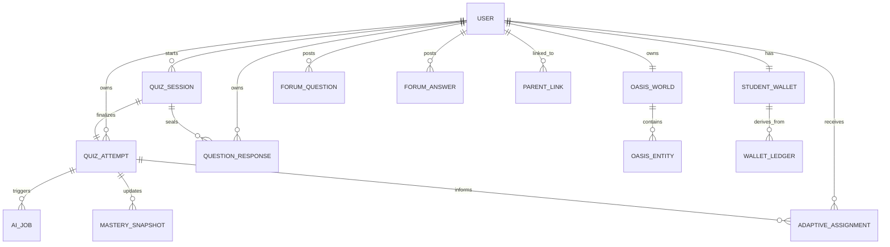

# Logic Oasis Firestore Database Schema and Security Contract

**Purpose:** This is the developer-facing Firestore schema for Logic Oasis. It records the implemented U2/U3 trusted-content and secure-quiz boundaries, plus the planned FYP1 database, ownership, access boundaries, document identities, and migration expectations for later units.

It is a contract, not a claim that every collection already exists. `Current prototype` records are the temporary repository behaviour observed on 2026-07-15. `Target FYP1` records are the design to implement through U2-U11. Stage 3 onboarding records remain reserved only and must not be created as active FYP1 scope unless Stage 3 is formally admitted.

## 1. Core Rules

1. Firebase Authentication `uid` is the identity key. Do not use display name, email, or a client-generated ID as an ownership key.
2. The Flutter client may submit untrusted choices and text, but it never creates trusted correctness, score, reward, AI, wallet, ledger, progression, or committed-world evidence.
3. Callable Functions or controlled administration create server-owned records using the Admin SDK. Firestore rules deny direct client writes to those records.
4. Timestamps are server timestamps. Monetary/reward-like values use integers, never floating-point values.
5. Keep immutable evidence as append-only documents. Materialized summaries such as mastery, wallet balance, and dashboard projections are derived and may be regenerated.
6. Store stable technical IDs and version fields. Do not store translated labels, Flutter widget names, or manifest frame names as durable identity.
7. Do not place passwords, Firebase Auth tokens, answer keys, raw child feedback, or model artifacts in client-readable documents.

## 2. Status Legend

| Status | Meaning |
|---|---|
| Current prototype | Exists in the repository/seed data today and may have weaker prototype behaviour. |
| Target FYP1 | Required planned schema for the final FYP1 architecture. |
| Derived target | Target FYP1 document regenerated from trusted source records. |
| Reserved | Architecture is approved but not active work or an FYP1 completion requirement. |
| Seed-only / retired | May exist in demo data but must not become trusted production evidence. |

## 3. Identity, Roles, and Relationships



### 3.1 Firebase Auth and profile documents

| Path | Status | Document ID | Required fields | Client access | Server/admin responsibility |
|---|---|---|---|---|---|
| Firebase Authentication user | Current prototype / Target FYP1 | Firebase `uid` | Auth provider identity, verified email where applicable | Auth SDK only | Authentication lifecycle. Do not mirror passwords into Firestore. |
| `users/{uid}` | Current prototype / Target FYP1 | Auth `uid` | `role` (`student` or `parent`), `displayName`, `yearLevel` for students, `preferredLanguage`, `createdAt`, `updatedAt`, `profileVersion` | Owner reads own profile. Owner may update safe presentation fields only. | Sets immutable role/ownership fields and validates profile shape. |
| `parentLinks/{parentId}_{studentId}` | Target FYP1 relationship contract | Stable pair ID | `parentId`, `studentId`, `status`, `createdAt`, `linkedBy`, `linkVersion` | Linked student and linked authenticated parent may read. Neither party may self-grant a link. | Creates/revokes approved links and verifies both identities. |
| `parentAccounts/{parentId}` | Current prototype transitional record | Existing parent ID | Prototype parent metadata only; never store plaintext password | Treat as transitional. Do not extend it as a production authentication design. | Replace unsafe prototype credential handling with authenticated UID plus `parentLinks` checks when U9 is secured. |
| `rememberedProfiles/{uid}` | Current prototype convenience record | Auth `uid` | Minimal display preference only, such as `displayName`, `yearLevel`, `updatedAt` | Owner only | Never store passwords, tokens, parent access secrets, trusted learning fields, or role grants. |

**Parent boundary:** Production-grade parent authentication remains deferred in the canonical plan. FYP1 parent-dashboard access still requires an authenticated UID and an approved parent-student link; a client-visible prototype password is not a durable database-security design.

## 4. Curriculum and Trusted Content

These are controlled reference records. They are versioned, client-readable only where the answer is safe, and never directly client-writable.

| Path | Status | Document ID | Required target fields | Read/write boundary |
|---|---|---|---|---|
| `topics/{topicId}` | Current prototype / Target FYP1 | Stable curriculum topic ID | `yearLevel`, `titleEn`, `titleMs`, `order`, `isActive`, `contentVersion` | Authenticated read; controlled seed/admin write only. |
| `subtopics/{subtopicId}` | Current prototype / Target FYP1 | Stable curriculum subtopic ID | `topicId`, `yearLevel`, `titleEn`, `titleMs`, `order`, `skillIds`, `activeBankCounts`, `contentVersion`, `isActive` | Authenticated read; controlled seed/admin write only. |
| `questionBanks/{bankId}` | Current prototype / Target FYP1 | Stable bank/version ID | `topicId`, `subtopicId`, `difficultyLevel` (`easy`, `moderate`, `hard`), `questionIds`, `version`, `isActive`, `createdAt` | Authenticated read; controlled seed/admin write only. |
| `questions/{questionId}` | Current prototype / Target FYP1 | Stable question/version ID | `topicId`, `subtopicId`, `skillId`, `bankId`, `difficultyLevel`, `prompt`, `options`, `estimatedDifficulty`, `contentVersion`, `isActive` | Authenticated read; controlled seed/admin write only. Must not contain `answerIndex` or authoritative explanation. |
| `questionAnswerKeys/{questionId}` | Target FYP1 | Same stable question ID | `answerIndex`, `explanation`, `contentVersion`, `isActive`, `updatedAt` | Client read/write denied. Callable Functions only. |

**Content invariant:** `questions/{questionId}` and `questionAnswerKeys/{questionId}` share a content version. A session records that version and rejects stale or mismatched content during U3 validation.

## 5. Quiz Session and Response Evidence (U3 Critical Path)

U3 replaces client-created quiz result records with this server-owned lifecycle:

```text
startQuizSession
  -> quizSessions/{sessionId} = active
  -> submitQuizResponse x expectedQuestionCount
  -> questionResponses/{responseId} = sealed immutable evidence
  -> finalizeQuizSession
  -> quizAttempts/{attemptId} = immutable final attempt
  -> later automatic BKT/AI processing
```

| Path | Status | Document ID | Required target fields | Writer and reader rules |
|---|---|---|---|---|
| `quizSessions/{sessionId}` | Target FYP1 | Server-generated session ID | `studentId`, `assignmentId`, `bankId`, `questionIds`, `contentVersion`, `status`, `validatedResponseCount`, `expectedResponseCount`, `startedAt`, `expiresAt`, `finalizedAt`, `attemptId` | Callable Functions create/transition states. Client direct reads/writes denied; safe state is returned by callable responses. |
| `questionResponses/{responseId}` | Target FYP1 | Deterministic session/question or idempotency identity | `sessionId`, `attemptId` after finalization, `studentId`, `questionId`, `skillId`, `bankId`, `selectedIndex`, `serverIsCorrect`, `validationStatus`, `responseTimeMs`, `hintCount`, `sequenceIndex`, `idempotencyKey`, `createdAt` | Callable Functions write once. Client direct reads/writes denied. A second sealed answer is rejected. |
| `quizAttempts/{attemptId}` | Current prototype -> Target FYP1 | Server-generated finalized attempt ID | `studentId`, `sessionId`, `topicId`, `subtopicId`, `bankId`, `difficultyLevel`, `contentVersion`, `validationStatus`, `processingStatus`, `trustedScore`, `trustedCorrectCount`, `responseCount`, `startedAt`, `finalizedAt`, `dataSource`, `deviceSessionId` | Backend creates once. Student reads own; linked parent reads only a safe dashboard projection or authorized attempt summary. Client writes denied. |
| `quizAttemptTelemetry/{telemetryId}` | Optional target only if needed | Generated ID | Untrusted UI timing/device telemetry, `studentId`, `sessionId`, `createdAt` | Client may submit only through a restricted validated path. Never use as correctness, score, reward, or model truth without server validation. |

### U3 invariants

- Valid session states are `active`, `finalizing`, `finalized`, and `expired`; only the backend may transition them.
- `idempotencyKey` maps retries to the original accepted response or result. It never creates another response, attempt, or reward.
- `selectedIndex` is client input; `serverIsCorrect`, trusted score, explanation, and finalization are server-derived.
- A final attempt exists only when every expected session question has one validated sealed response.
- Failed network submission remains pending on the client, but no local answer key is exposed while retrying.

## 6. Mastery, Adaptive Assignment, and AI Evidence

| Path | Status | Document ID | Required target fields | Writer and reader rules |
|---|---|---|---|---|
| `masterySnapshots/{studentId}_{skillId}` | Derived target | Student-skill pair | `studentId`, `skillId`, `pKnown`, `pLearn`, `pGuess`, `pSlip`, `observationCount`, `sourceAttemptId`, `modelVersion`, `updatedAt` | AI/BKT backend writes. Student reads own derived result; parents read authorized summaries. |
| `topicMastery/{studentId}_y{yearLevel}_{topicId}` | Current prototype -> Derived target | Student/year/topic pair | `studentId`, `yearLevel`, `topicId`, summary mastery fields, `sourceAttemptId`, `updatedAt` | Derived dashboard summary only; client writes denied. |
| `subtopicMastery/{studentId}_y{yearLevel}_{topicId}_{subtopicId}` | Current prototype -> Derived target | Student/year/topic/subtopic pair | `studentId`, `yearLevel`, `topicId`, `subtopicId`, BKT posterior, `observationCount`, `evidenceLevel`, `lastSourceAttemptId`, `updatedAt` | Derived dashboard summary only; client writes denied. |
| `adaptiveAssignments/{assignmentId}` | Target FYP1 | Generated assignment ID | `studentId`, `subtopicId`, `bankId`, `difficultyLevel`, `reasonCode`, `reasonText`, `policyVersion`, `sourceAttemptId`, `status`, `createdAt` | Adaptive-policy backend writes. Student reads own active assignment; client cannot choose or edit bank assignment. |
| `aiJobs/{attemptId}` | Target FYP1 | Attempt ID | `attemptId`, `studentId`, `status`, `retryCount`, `errorCode`, `startedAt`, `completedAt`, `pipelineVersion` | Trigger/worker writes. Student may read limited status for own attempt; no client writes. |
| `aiModelRuns/{runId}` | Current prototype -> Derived target | Generated run ID | `studentId`, `attemptId`, `modelVersion`, `featureSchemaVersion`, BKT/mastery output, struggle prediction, SHAP values, policy reason, `status`, lineage, `createdAt` | AI pipeline writes. Student reads only safe explanation; linked parent reads authorized dashboard fields; client writes denied. |
| `modelRegistry/{modelName}_{version}` | Target FYP1 | Model/version pair | `modelName`, `version`, `featureSchemaVersion`, `metrics`, `artifactPath`, `isActive`, `promotedAt` | Controlled model-promotion process only. No mobile client write. |

**AI evidence invariant:** `aiModelRuns` must identify its finalized `attemptId`, model version, feature schema, and data-source lineage. Seed/demo rows are marked `dataSource: seed_demo` and excluded from final performance claims.

## 7. Q&A and Naive Bayes Data

| Path | Status | Document ID | Required target fields | Writer and reader rules |
|---|---|---|---|---|
| `forumQuestions/{questionId}` | Target FYP1 | Generated ID | `authorId`, `topicId`, `subtopicId`, `body`, `attemptedExplanation`, `status`, `acceptedAnswerId`, `createdAt`, `updatedAt` | Author creates/edits allowed draft fields only; moderation/status fields are controlled. Do not expose unnecessary profile data. |
| `forumAnswers/{answerId}` | Target FYP1 | Generated ID | `questionId`, `authorId`, `body`, `reasoningText`, `qualityStatus`, `predictedProbability`, `evidenceState`, `forumModelVersion`, `helpfulCount`, `isAccepted`, `createdAt` | Author writes safe answer fields; backend/moderation owns prediction, acceptance, reward eligibility, and moderation fields. |
| `forumAiJobs/{answerId}` | Target FYP1 | Answer ID | `answerId`, `status`, `retryCount`, `modelVersion`, `errorCode`, `startedAt`, `completedAt` | Backend only. |
| `forumAiRuns/{runId}` | Target FYP1 | Generated ID | `answerId`, `predictedLabel`, `predictedProbabilities`, `evidenceState`, `isCalibrated`, `feedbackCode`, `modelVersion`, `preprocessorVersion`, `createdAt` | Backend only; client reads only safe feedback for the relevant answer. |
| `moderationLogs/{logId}` | Current prototype -> Target FYP1 | Generated ID | `targetType`, `targetId`, `action`, `actorId`, `reasonCode`, `createdAt` | Moderator/backend only. Do not make moderation notes public. |

Current seed names such as `forumPosts`, `forumReplies`, and `helperReputation` are prototype/seed-only names. Migrate only reviewed content into the target Q&A contract; do not treat seed text as training evidence.

## 8. Oasis Game Economy and World State

| Path | Status | Document ID | Required target fields | Writer and reader rules |
|---|---|---|---|---|
| `studentWallets/{studentId}` | Target FYP1 | Student Auth UID | `studentId`, `crystals`, `mutualAidEnergy`, `todayRestorationDate`, `todayRestorationCount`, `totalRestorations`, `level`, `nextLevelThreshold`, `economyPolicyVersion`, `progressionPolicyVersion`, `updatedAt` | Backend computes/writes. Student reads own projection; client cannot edit balances or level. |
| `walletLedger/{entryId}` | Target FYP1 | Generated or deterministic source ID | `studentId`, `entryType`, `resourceType`, integer `amount`, `sourceId`, `idempotencyKey`, `economyPolicyVersion`, `createdAt` | Backend append-only. Used to reconcile wallet balance. |
| `oasisActionCatalog/{catalogVersion}_{actionId}` | Target FYP1 materialization | Catalog/action pair | `catalogVersion`, `actionId`, `technicalSceneId`, `fromStage`, `toStage`, `resourceType`, `cost`, `allowedSlotIds`, `restorationUniquenessKey`, `styleVariantKey` | Controlled configuration deployment only; client read-only. Version-controlled YAML remains the authoring source. |
| `oasisWorlds/{studentId}` | Target FYP1 | Student Auth UID | `studentId`, `mapId`, `sceneSchemaVersion`, `contentCatalogVersion`, `economyPolicyVersion`, `progressionPolicyVersion`, `worldRevision`, `updatedAt` | Backend world commands write. Student reads own world. |
| `oasisWorlds/{studentId}/entities/{entityId}` | Target FYP1 | Stable entity/slot ID | `entityType`, `technicalSceneId`, `slotId`, `restorationStage`, `styleVariantKey`, `createdAt`, `updatedAt` | Backend world commands write. Never store a manifest atlas-frame filename. |
| `oasisRestorationEvents/{eventId}` | Target FYP1 | Deterministic qualifying action ID | `studentId`, `worldActionId`, `eventType`, `targetType`, `targetId`, `uniquenessKey`, `localDate`, `totalRestorationsAfter`, `levelAfter`, `progressionPolicyVersion`, `createdAt` | Backend append-only. Used to reconcile restoration totals/level. |
| `oasisProgress/{studentId}` | Current prototype -> Retired after migration | Student ID | Prototype Crystals, Energy, repaired-area map, and UI preferences | Do not extend. U3+ game work must migrate approved display state into separate wallet/world records through backend-owned commands. |

**World identity invariant:** `fraction_bridge`, `decimal_waterway`, `percentage_garden`, and `market_corner` are immutable `technicalSceneId` values. Display labels, art, and palettes come from a versioned presentation manifest and do not change saved-world identity.

## 9. Configuration, Preferences, and Reserved Stage 3 Records

| Path | Status | Document ID | Fields and boundary |
|---|---|---|---|
| Version-controlled `config/oasis/` YAML | Target FYP1 authoring source | Versioned files | Source of truth for Oasis catalogues, economy, progression, and presentation. Validated and deployed; no manual Firestore console authoring. |
| `onboardingPolicy/stage3` | Reserved | Fixed `stage3` | Read-only policy with `enabled`, active story/tour versions, rollout timestamp, minimum app version, fallback route, compatibility, and update timestamp. Create only if Stage 3 is formally admitted. |
| `studentPreferences/{studentId}/onboarding/current` | Reserved | Fixed `current` under student UID | Owner-scoped onboarding outcome/accessibility preferences. It must never contain global policy fields, wallet data, quiz evidence, AI output, or world mutation. |

The approved Stage 3 reservation does not change FYP1 database implementation. These documents are included for architectural completeness only and stay inactive unless a supervisor-approved `formally_admitted` decision occurs before U11 closure.

## 10. Firestore Security Matrix

| Data class | Client read | Client write | Backend/admin write | Rule/test expectation |
|---|---|---|---|---|
| Safe curriculum (`topics`, `subtopics`, `questions`, `questionBanks`) | Authenticated read | Denied | Controlled seed/deployment | Questions never include answer keys. |
| Answer keys, sessions, responses | Denied | Denied | Callable Functions only | Emulator denies direct access even to the owning student. |
| Final attempts, mastery, AI runs, assignments | Owner/authorized parent safe view | Denied | Backend only | Student cannot forge correctness, score, model output, or next bank. |
| User profile and preferences | Owner only | Restricted safe fields only | Server validates identity/role fields | Foreign UID access denied; role/link escalation denied. |
| Parent links | Linked parties may read | Denied | Approved server/admin flow | No self-linking or cross-student access. |
| Q&A source text | Role/visibility-based read | Author restricted fields or validated callable | Backend/moderation derived fields | Acceptance, AI quality, rewards, and moderation are not client-controlled. |
| Wallet, ledger, world, restoration | Owner read of projection | Denied | Backend commands only | Reconcile balances, events, level, and revision; reject duplicate source IDs. |
| Configuration and model registry | Read only where needed | Denied | Controlled deployment/promotion only | Client cannot activate policy/model/configuration. |

`firestore.rules` is the enforcement layer. Firebase Emulator tests must prove owner isolation, parent-link access, answer-key denial, direct trusted-write denial, and no access to another student's records.

## 11. Required Query Indexes

Create indexes only after the matching query is implemented and recorded in `firestore.indexes.json`. Expected target queries include:

| Collection | Query pattern | Expected composite index |
|---|---|---|
| `quizAttempts` | `studentId ==` plus latest finalized attempt | `studentId ASC, finalizedAt DESC` |
| `aiModelRuns` | `studentId ==` plus latest completed run | `studentId ASC, createdAt DESC` |
| `adaptiveAssignments` | active assignment for a student/subtopic | `studentId ASC, subtopicId ASC, status ASC, createdAt DESC` |
| `forumQuestions` | topic/subtopic/status feed | `topicId ASC, subtopicId ASC, status ASC, createdAt DESC` |
| `forumAnswers` | answers for a question in display order | `questionId ASC, createdAt ASC` |
| `walletLedger` | reconciliation by student/resource/time | `studentId ASC, resourceType ASC, createdAt DESC` |
| `oasisRestorationEvents` | daily or lifetime progress by student | `studentId ASC, localDate DESC, createdAt DESC` |

## 12. Current-Prototype Migration Boundaries

| Current behaviour | Target change | Owning unit |
|---|---|---|
| `LearningRepository` writes `quizAttempts`, topic mastery, and subtopic mastery from Flutter. | Replace with backend-owned session/response/finalization flow. Flutter reads safe derived results only. | U3, then U4/U8. |
| `oasisProgress` is client writable and mixes resources, repaired areas, and UI preferences. | Replace with backend-owned `studentWallets`, `walletLedger`, `oasisWorlds`, and `oasisRestorationEvents`. | G3-G7. |
| `aiModelRuns` can show seeded/manual evidence. | Require lineage to a finalized attempt and automatic job/run status. | U6-U9. |
| Seed `forumPosts`/`forumReplies` use prototype names. | Use the FYP1 `forumQuestions`/`forumAnswers` model with moderation and Naive Bayes job/run records. | U10. |
| `parentAccounts` uses a prototype parent-access flow. | Keep FYP1 parent access limited and authenticated; do not store/extend prototype passwords. | U9/U11. |
| Reserved onboarding policy/preferences are not active. | Do nothing in current FYP1 scope; create only after Stage 3 formal admission. | UI3 after formal admission. |

## 13. U2 and U3 Delivery Checklist

### U2 - trusted content (implemented and verified 2026-07-16)

- [x] Client-readable `questions` contain no authoritative answer index or explanation; matching `questionAnswerKeys` are server-only.
- [x] `firestore.rules` denies all client read/write access to `questionAnswerKeys`; the authenticated Rules Playground denial and `firebase_seed/tests/question_answer_keys_rules.test.js` Emulator test were confirmed.
- [x] Direct client writes to trusted quiz, mastery, and attempt records remain denied. Do not reintroduce client writes for trusted fields.

### U3 - trusted attempt creation (implemented and production-verified 2026-07-16)

- [x] Authenticated `startQuizSession`, `submitQuizResponse`, and `finalizeQuizSession` callable Functions create one server-owned session, ordered sealed responses, and one immutable finalized attempt.
- [x] Idempotent response identity, sequential response checks, expiry handling, and backend-controlled state transitions are enforced. `LearningRepository.saveQuizAttemptAndMastery` remains legacy/prototype behaviour and is not the U3 runtime path.
- [x] `firestore.rules` denies direct client access to `quizSessions` and `questionResponses`, and denies direct writes to `quizAttempts`, `topicMastery`, and `subtopicMastery`.
- [x] Production deployment: `firebase deploy --only functions,firestore:rules --project logic-oasis-fyp` completed on 2026-07-16. The released Rules compiled successfully; `startQuizSession`, `submitQuizResponse`, and `finalizeQuizSession` were confirmed at the reviewed deployed revision in `asia-southeast1`.
- [x] Production authenticated verification created `quizSessions/session_fd6f125780624def9ee1112e66d3c16a`, five validated `questionResponses` (`06133091547229544ce623d90b7b1ec4`, `01a5921b38e13f49e538fbdf8e5164b6`, `d33f5db033d164b9063597117ea81187`, `ebaad6761b26d7dccff2d8a2ad17468a`, and `008815b6a3b30b9ff546b6c07a06882d`), and `quizAttempts/attempt_f86136271a1b4ec6949a1aeefcfe3f8f` with `finalizationStatus: finalized`.
- [x] Focused Python U3 workflow tests passed (10 tests, OK). The authenticated Flutter app flow was also completed to the server-confirmed final-score dialog.

## 14. Security Review Questions Before U3 Sign-off

1. Does every client-readable question document exclude answer keys and authoritative explanations?
2. Can a student access only their own safe profile, attempts, mastery, AI insight, wallet projection, and world?
3. Can a linked parent read only the assigned student's permitted dashboard projection?
4. Can any client write trusted correctness, score, attempt finalization, reward, ledger, AI result, mastery, assignment, or world revision? The required answer is no.
5. Do all server-created evidence records include a source ID, version, server timestamp, and idempotency/immutability strategy where needed?
6. Are seed/demo rows marked and excluded from model-evaluation claims?
7. Are migrations from `oasisProgress` and client-created quiz records explicit, reversible where necessary, and tested in the Firebase Emulator?

## 15. Source Documents and Ownership

- Canonical architecture and implementation order: `docs/plans/2026-07-05-001-feat-fyp1-prototype-development-plan(2)(1).md`.
- Current enforced rule baseline: `firestore.rules`.
- U2 content source/deployment: `firebase_seed/seed_data.json`, `firebase_seed/seed_firestore.js`, and later controlled configuration tooling.
- U3 secure session implementation: `lib/shared/services/quiz_session_service.dart`, `lib/shared/repositories/learning_repository.dart`, `functions/quiz_session.py`, `functions/main.py`, and their tests.
- Stage 3 reserved database records: `docs/plans/logic-oasis-stage3-onboarding-animation-plan(2).md` and `docs/plans/logic-oasis-stage3-canonical-integration-review-plan.md`.

Update this document whenever a collection, field, access rule, or ownership boundary changes. A code change that contradicts this contract must update the contract and its Firestore Emulator test in the same unit of work.
