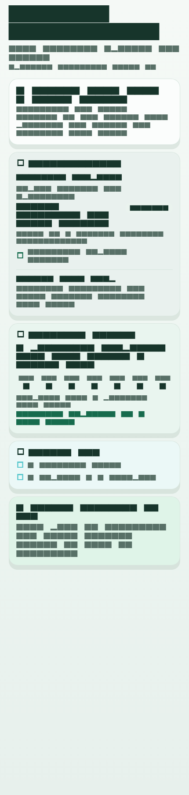
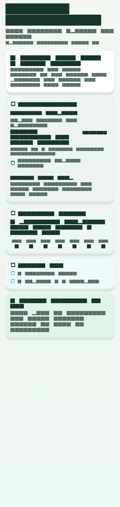
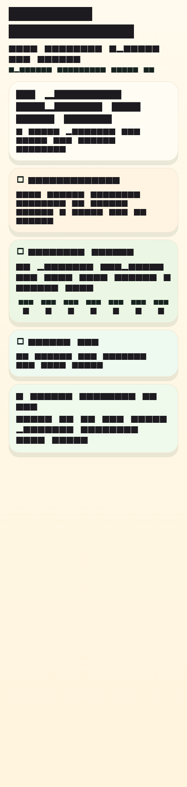
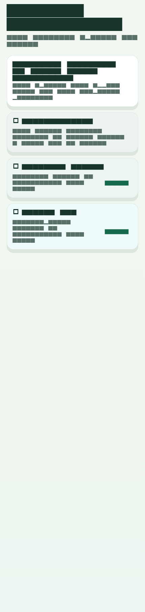
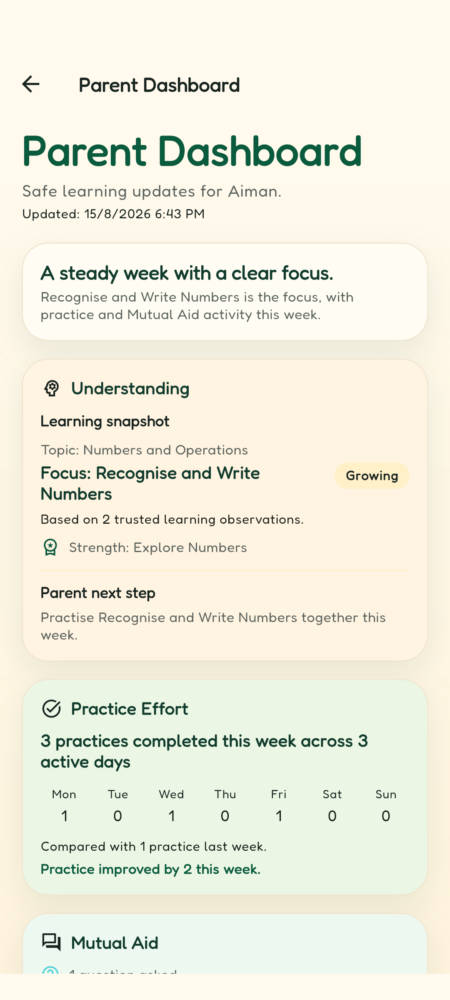
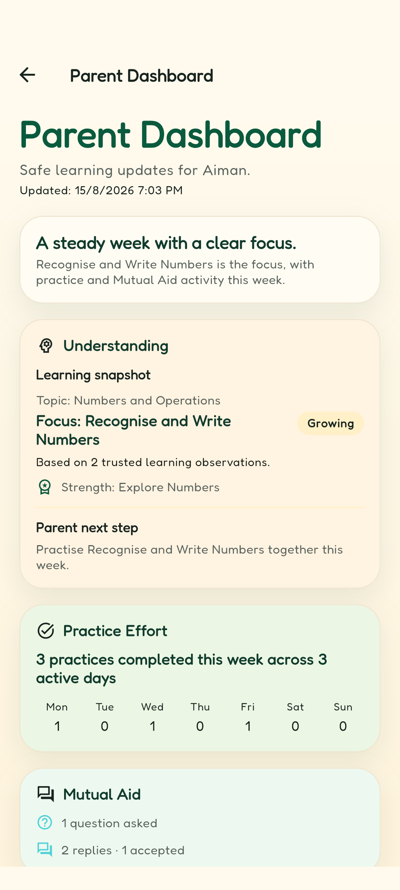
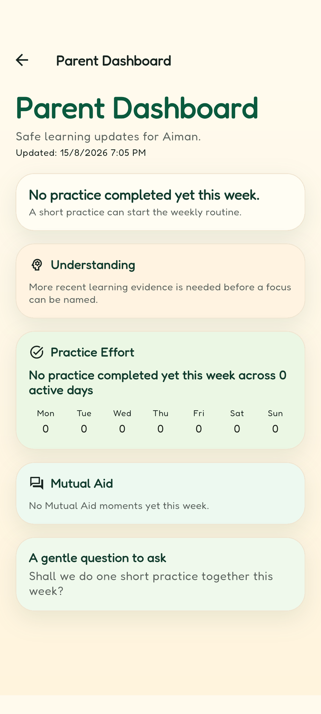
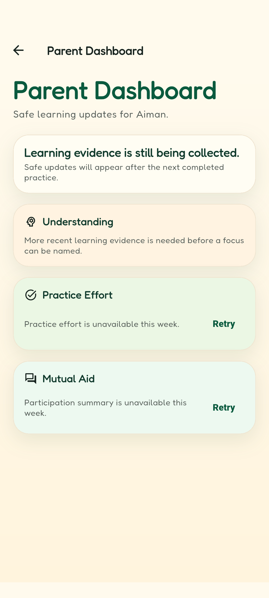
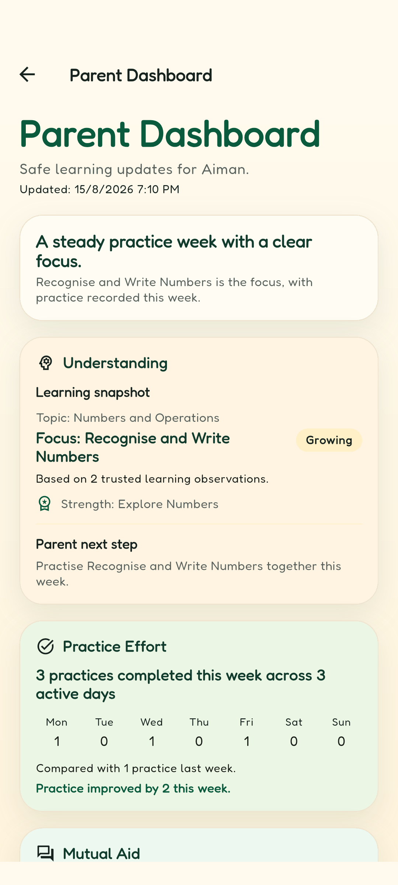
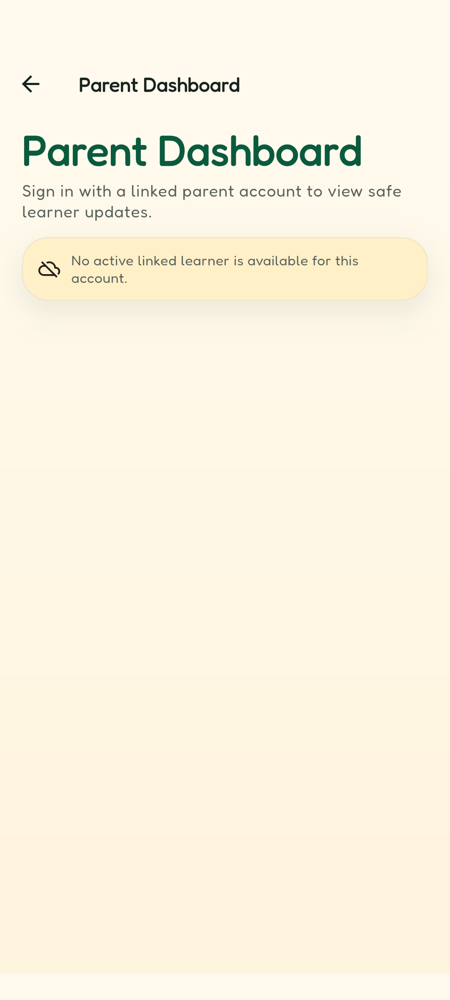

# U14 Parent Evidence Progress Map - Verification Record

Date: 2026-08-15

Branch: `codex/feat-u14-parent-evidence-progress-map`

Environment: Windows with Flutter/Dart, a Pixel 6 Android emulator, the
Firebase Emulator Suite (Auth on 9099, Firestore on 8080, Functions on 5001),
and the project's Python 3.11 Functions runtime (operator params in the
gitignored `functions/.env.logic-oasis-fyp`). Only temporary, disposable
identities and sanitized fixtures were used; no real student, parent,
supervisor, or production-learning data was touched.

Scope: canonical FYP1 unit U14 (parent Progress Map) - the approved screen
(weekly glance, Understanding, Practice Effort, Mutual Aid, one action and its
conversation starter), the projection-only privacy boundary, and every declared
availability/retry/revocation state.

## Automated gates

| Gate | Command | Result |
|---|---|---|
| Flutter full suite | `flutter test` | 231 passed |
| Flutter analyzer | `flutter analyze` | No issues |
| Functions suite | `python -m unittest discover -s functions/tests -t .` | 226 passed |
| Tools/release suite | `python -m unittest tools.tests.*` | 43 passed |

The focused model, repository, state, widget, localization, accessibility, and
golden gates are part of the Flutter suite; the parent-link Rules contract and
quiz-finalization regressions are part of the Functions suite.

## Authenticated emulator flow

The static Rules contract test is not sufficient on its own, so U14 adds an
authenticated Emulator flow that signs in a linked parent, an unrelated
parent, a revoked parent, and one student, seeds only the safe projections,
and proves the exact-child read matrix plus every denied path.

Command (from the repository root):

```powershell
$env:GCLOUD_PROJECT='logic-oasis-fyp'
firebase.cmd emulators:exec --only auth,firestore "node tools/run_parent_dashboard_emulator_flow.js"
```

Result (sanitized; all identities are random temporary emulator users):

```json
{
  "status": "passed",
  "step": "cleanup",
  "exactChildReads": {
    "subtopicMastery": true,
    "parentPracticeSummaries": true,
    "forumParticipationSummaries": true
  },
  "deniedReadsCount": 21,
  "deniedReads": [
    "cross-child subtopicMastery",
    "cross-child parentPracticeSummaries",
    "cross-child forumParticipationSummaries",
    "subtopicMastery collection enumeration",
    "parentPracticeSummaries collection enumeration",
    "forumParticipationSummaries collection enumeration",
    "raw quizAttempts read",
    "raw questionResponses read",
    "raw questionAnswerKeys read",
    "raw aiJobs read",
    "raw aiModelRuns read",
    "forum text question read",
    "forum text answer read",
    "parentLinks direct read",
    "client write to parentPracticeSummaries",
    "client write to forumParticipationSummaries",
    "client create of subtopicMastery",
    "unrelated parent exact-child subtopicMastery read",
    "unrelated parent exact-child practice read",
    "revoked parent exact-child practice read",
    "revoked parent exact-child mastery read"
  ],
  "callableContext": "covered-by-u9-live-verification",
  "fixtureCleanup": "deleted"
}
```

What this proves:

- A linked parent reads exactly the selected child's three safe projections
  (`subtopicMastery`, `parentPracticeSummaries/{studentId}`,
  `forumParticipationSummaries/{studentId}`) and nothing else.
- Collection/list enumeration is denied, so a parent cannot discover another
  child's records.
- Raw attempts, responses, answer keys, AI jobs/runs, forum text, parent-link
  documents, and all client writes to projections are denied.
- An unrelated parent and a revoked parent cannot read the child's
  projections.
- Controlled fixture cleanup is recorded (`fixtureCleanup: deleted`); every
  temporary user, profile, link, projection, and raw fixture was deleted.

The `getLinkedChildren` callable context (linked/unrelated/revoked parent
visibility) is additionally exercised live in this record: the Android
rehearsal below signs the linked parent in through the Auth emulator and calls
`getLinkedChildren` against the Functions emulator, which returns the active
linked child. The deployed-callable context from the U9 controlled live
verification (`docs/evidence/2026-07-19-u9-controlled-live-verification.md`)
remains the production-boundary reference. The Rules matrix itself is proven
by the Auth + Firestore flow above.

## UI state captures

Durable four-state captures are generated reproducibly by
`flutter test --update-goldens test/parent_dashboard_screenshot_test.dart`.
They render the approved hierarchy with the test font, so they evidence
layout, hierarchy, colour, and state differentiation; the live emulator
rehearsal captures (below) are the text-accurate screenshots for the
supervisor record.









Live capture commands (automated Android rehearsal against the emulators):

```powershell
firebase.cmd emulators:start --only auth,firestore,functions
node tools/seed_parent_dashboard_live.js --state full
flutter drive --driver=test_driver/u14_live_capture.dart `
  --target=integration_test/u14_live_capture_test.dart `
  --dart-define=USE_FIREBASE_EMULATORS=true `
  --dart-define=U14_STATE=full -d emulator-5554
```

The rehearsal seeds the approved fixtures with
`tools/seed_parent_dashboard_live.js` (linked parent
`parent-live@example.test`, an active link to the student profile, and the
four-state projections), then drives the real app on the Android emulator:
Login page -> "Parent Dashboard" button -> parent email/password sign-in -> the
Progress Map. Each run asserts the state's exact copy in the live widget tree
before capturing, so the PNGs are text-accurate evidence:









Bonus availability captures (AE7):





Verification per state (all runs passed):

- full: glance "A steady week with a clear focus", Learning snapshot, "3
  practices completed this week", prior-week comparison, Mutual Aid counts.
- partial: Learning snapshot and practice totals with no prior-week comparison
  sentence.
- zero: "No practice completed yet this week", "No Mutual Aid moments yet this
  week", and the insufficient-Understanding message.
- insufficient: "More recent learning evidence is needed" with Practice and
  Mutual Aid unavailable.
- card-missing: Understanding and Practice remain visible while Mutual Aid is
  unavailable with a retry (one-card partial availability, AE7).
- revoked: the link revocation leaves no active child, so the page shows the
  no-active-linked-learner state (AE7 auth boundary).

## Accessibility checks

- Screen-reader order is title -> glance -> Understanding -> Practice Effort
  -> Mutual Aid -> conversation starter (semantics test).
- Daily counts (`Mon: 1` ...) and Mutual Aid counts are announced; status uses
  icon plus text, never colour alone.
- English and Bahasa Melayu render titles, plural counts, and day labels.
- 320 px width and 200% text scale are exercised in the widget gates and the
  manual rehearsal checklist (AE8); no clipping or horizontal overflow is
  expected because the map stacks vertically inside a scrollable scaffold.

## Limitations

- Widget-rendered goldens use the test font at 430x1800; the live captures use
  the real device font and a 1080x2400 screen, so pixel parity with the goldens
  is not expected. Content parity is asserted in-app before each capture.
- The Android runtime logs benign `INVALID_REFRESH_TOKEN` warnings from the
  Google Play services auth component; the rehearsal itself proves the Auth,
  Firestore, and Functions emulator paths (sign-in, projection reads, and
  `getLinkedChildren` all succeed against the emulators).
- Bahasa Melayu and 200% text scale are verified by the localization and
  accessibility widget gates, not re-captured live in this rehearsal.
- No production or real learner data was used; fixtures were sanitized and
  deleted after the run.

## FYP1 exclusions (unchanged)

- Longitudinal trend charts, conversational coaching, AI Guard for parents,
  generative personalised advice, parent chat or forum-content previews, peer
  comparison/ranking, and client-side attempt aggregation remain outside
  FYP1 (deferred to FYP2 or excluded by the canonical plan).
- Quiz guided-step implementation (canonical U13), adaptive-bank comparison,
  Oasis stages, and onboarding are separate units, not part of U14.
