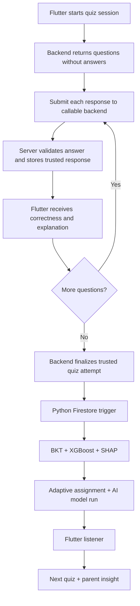
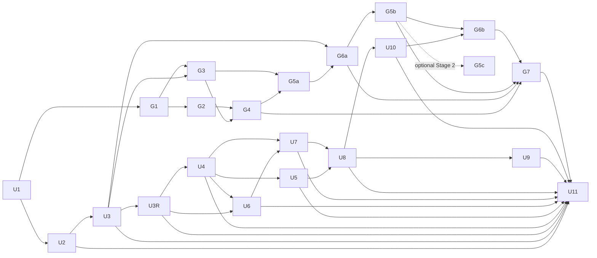

# Logic Oasis FYP1 Final Executable Implementation Plan

**Original plan:** 2026-07-05

**Revised:** 2026-07-17 after supervisor discussion, approved Oasis-game integration, Stage 3 architectural reservation, U3-R/U4-U8 reconciliation, and FYP1-focused U8 runtime simplification

**Document authority:** This is the canonical final executable plan. It supersedes `docs/plans/2026-07-05-001-feat-fyp1-prototype-development-plan.md`; the oldest file remains historical and must not be merged into this plan.

## Goal Capsule

Complete a defensible FYP1 prototype in which a Year 4-6 student receives questions without answer keys, submits each response for server-authoritative correctness and explanation, finalizes a trusted quiz attempt, and automatically triggers mastery, weakness prediction, SHAP explanation, and adaptive next-bank selection. The resulting explanation appears in the student mission and parent dashboard. For Objective 3, complete one AI-supported collaborative-learning feature: a Q&A Forum with an automatically invoked, versioned Naive Bayes explanation-quality pipeline. The final FYP1 architecture also replaces static Oasis restoration imagery with a persistent, portrait-oriented Flame game scene whose rewards and world mutations are backend-authoritative.

The prototype must no longer depend on manually running an AI script against seed records. Seed data may initialize question content, accounts, and tests, but supervisor-facing AI evidence must be produced from real quiz attempts or an explicitly identified real-attempt CSV export.

---

## 1. Decisions Confirmed After Supervisor Discussion

| ID | Supervisor decision | Planning consequence |
|---|---|---|
| S1 | Each topic/subtopic needs multiple question banks and the app should switch difficulty automatically. | Replace the fixed `score >= 80% -> next difficulty` rule with an explainable adaptive bank-selection service using mastery, recent performance, uncertainty, and struggle risk. |
| S2 | AI must use real records from CSV/`quizAttempts` after students complete quizzes. | Add per-question response storage, automatic Firestore-triggered inference, reproducible CSV export/import, model versioning, and status/error handling. Seeded `aiModelRuns` cannot be the final evidence. |
| S3 | The architecture must be compared with a simple Decision Tree and deeper neural learning. | Run a fair baseline experiment using the same student-grouped data split, features, labels, and metrics. Compare predictive quality, calibration, interpretability, data needs, latency, and deployment complexity. |
| S4 | Objective 2 already covers weak-topic detection and parent insight; 30-40% of Objective 3 must also be developed. | Fully implement Q&A Forum as the completed Objective 3 AI feature using Naive Bayes for explanation-quality classification. Team Challenge and Study Buddy move to the conditional FYP2 backlog. |
| S5 | The Oasis must become a game-like portrait scene rather than static restoration images, while retaining the final trustworthy architecture. | Use Flutter plus Flame, server-authoritative wallet/world commands, immutable technical scene IDs, and a versioned presentation manifest. Deliver the explicitly declared core FYP1 Oasis units; G5c alone is a conditional Stage 2 presentation enhancement. Team Challenge and Study Buddy remain FYP2-only reward sources. |
| S6 | Reserve the final Stage 3 onboarding architecture without increasing current FYP1 completion scope. | `reservation_approved` on 2026-07-15. The companion plan defines a presentation-only first-login narrative, scripted Guardian, matched Home transition, and contextual tours. UI3-1 through UI3-8, their estimate, dependencies, and completion gates are not admitted unless a later supervisor-approved `formally_admitted` decision is recorded before U11 closure. |

### Updated Priority

1. Make quiz data granular and trustworthy.
2. Implement adaptive question-bank selection.
3. Automate the BKT -> XGBoost -> SHAP inference workflow using real attempts.
4. Validate the proposed AI architecture against Decision Tree and a small neural-network baseline.
5. Complete the Q&A Forum and its automatic Naive Bayes workflow as the FYP1 Objective 3 evidence slice.
6. Deliver the persistent Oasis game workstream through the mandatory trusted Crystal vertical slice, then the four-zone and Q&A Energy workflow.
7. Defer Team Challenge and Study Buddy until FYP1 Definition of Done is met and timetable capacity is confirmed; otherwise carry them into FYP2.
8. Keep the approved Stage 3 final architecture as a non-blocking reservation; formally admit it only before U11 closure with supervisor approval, revised estimate, and complete verification scope.

### Current Repo State Versus Revised Target

| Area | Current state to treat as baseline | Revised target |
|---|---|---|
| Question-bank switching | The app supports topic -> subtopic -> quiz flow, but adaptive bank assignment is not yet a first-class data contract. | Add `questionBanks`, `bankId`, `difficultyLevel`, and `adaptiveAssignments`; complete at least one Year 4 subtopic across Easy, Moderate, and Hard banks. |
| Immediate quiz feedback | The current Flutter question model can expose answer data and calculate feedback locally. | Create authenticated backend quiz sessions; return questions without answers; validate, seal, and explain each response server-side before finalizing the attempt. |
| AI runtime | `ai_pipeline/run_ai_pipeline.py` is currently a manual/offline runner and there is no deployed `functions/` trigger path in the app repository. | A completed quiz automatically queues/runs inference and writes AI output without a manual model command in the normal demo path. |
| Real-data evidence | The notebook/training workflow must not rely on demo fallback rows as final evidence. | Export real pseudonymized quiz-attempt/response rows, or use an explicitly externally anonymized dataset, rerun training/evaluation top-to-bottom, and store metrics with dataset provenance. |
| Model comparison | Existing evidence is focused on the proposed XGBoost/SHAP path. | Add comparable Decision Tree and small MLP baselines using the same split, features, labels, and evaluation metrics. |
| Objective 3 | Collaboration pages are not yet part of the active core app shell. | Add one Home quick action that opens the Q&A Forum; complete Q&A + Naive Bayes as the FYP1 Objective 3 evidence slice. Team Challenge and Study Buddy are FYP2 improvements, not FYP1 deliverables. |
| Oasis gamification | The app has static damaged/repairing/restored PNG scene assets and no Flame dependency or persistent authoritative world. | Add the explicitly declared core FYP1 Oasis units: a persistent portrait world, trusted Crystals/Energy wallet, transactional restoration/build commands, and a presentation manifest that can retheme without changing saved world identity. G5c alone is a conditional Stage 2 enhancement. |
| State boundaries | `AppState` is the current UI-facing state center. | Keep `AppState` as the Flutter-facing coordinator, but move AI, adaptive policy, and collaboration logic into focused services/repositories. |

### FYP1 Minimum Slice

If time becomes tight, the non-negotiable supervisor-demo slice is:

1. One complete Year 4 adaptive subtopic with Easy, Moderate, and Hard question banks, while the shared schema and content loader remain valid for Year 4-6. A second adaptive subtopic is conditional, not part of the minimum gate.
2. One authenticated server-owned quiz session that returns answer-free questions, validates every response, provides immediate trusted feedback, and finalizes one real attempt with atomic per-question evidence.
3. One automatic cloud or Firestore-emulator-triggered AI inference job that writes mastery, SHAP-backed diagnosis, and the next bank assignment; a manually launched script does not satisfy this item.
4. Parent Dashboard reads the latest real AI run, not seeded evidence.
5. A model-comparison report compares the proposed architecture with Decision Tree and a small neural baseline, even if the dataset is small and limitations are stated.
6. Q&A Forum is complete with automatic Naive Bayes explanation-quality feedback and is evidenced as the 30-40% Objective 3 slice.
7. The Oasis game workstream passes its mandatory vertical slice (G1, G2, G3, G4, G5a, and G6a), then completes the four-zone Stage 1 world and Q&A Energy integration. The vertical slice is an early architecture gate, not a replacement for the approved core target; G5c remains a conditional Stage 2 enhancement.

### Declaration Levels

Use the following labels consistently in the report, presentation, and implementation evidence:

| Level | Meaning | Examples in this plan |
|---|---|---|
| **Target FYP1 declaration after Definition of Done** | Use `Implemented in FYP1` only after code, the real-data path, tests, and demo evidence are complete. Until then, the item remains `Planned for FYP1`. | Real quiz persistence, automatic BKT/XGBoost/SHAP inference, adaptive bank assignment, Parent Dashboard integration, Q&A + Naive Bayes, and the trusted persistent Oasis game workstream. |
| **FYP1 evaluation evidence** | An experiment/report is complete, but the model may not be deployed as the production choice. | Decision Tree and MLP baselines; BKT-feature ablation. |
| **Conditional FYP1 extension** | Implement only after the FYP1 Definition of Done passes and time/data are sufficient. | Additional subtopics, more question banks, broader user testing, deployed Cloud Function if an emulator is used first. |
| **Approved architectural reservation** | Record an agreed future architecture and its claim boundaries without adding implementation work to the current FYP1 Definition of Done. | Stage 3 narrative onboarding and guided tour; governed by `docs/plans/logic-oasis-stage3-onboarding-animation-plan(2).md` and `docs/plans/logic-oasis-stage3-canonical-integration-review-plan.md`. |
| **Future improvement / FYP2** | Useful work that is explicitly outside this executable FYP1 plan unless re-admitted after the FYP1 Definition of Done. | Team Challenge, Study Buddy, broader adaptive coverage, production hardening, and advanced collaboration/evaluation. |

This distinction prevents planned work from being reported as completed and future ideas from being mistaken for current functionality.

---

## 2. Architecture Review of the Current App

The current architecture described in `logic_oasis_feature_implementation_explanation.md` is suitable as the mobile foundation:

```text
Flutter page/widget
  -> AppState
  -> repository
  -> Firebase Auth / Firestore
  -> ChangeNotifier rebuild
```

Existing strengths that should be retained:

- Flutter keeps UI, navigation, localization, quiz interaction, rewards, and restoration presentation.
- `AppState` already connects topics, subtopics, quiz results, mastery, crystals, missions, and parent data.
- `TopicRepository` and `LearningRepository` already isolate much of the Firestore access.
- `quizAttempts`, `topicMastery`, `subtopicMastery`, and `aiModelRuns` already provide a base schema.
- Formula Forge already follows topic -> subtopic -> quiz -> result -> subtopic context.
- Parent Dashboard already knows how to display BKT, XGBoost, and SHAP-shaped outputs.
- Local fallback data is useful for UI resilience, provided it is not presented as AI evaluation evidence.

### Architectural Weaknesses to Correct

| Weakness | Why it matters | Required correction |
|---|---|---|
| `AppState` owns too many future responsibilities. | Adding AI orchestration, bank policy, and collaboration directly will make it difficult to test. | Keep `AppState` as UI-facing state; add focused services/repositories for adaptive selection, AI status, and collaboration. |
| Quiz persistence is attempt-summary oriented. | Score, wrong count, and time are insufficient for reliable BKT and detailed explanation. | Persist one response row/document per question, including skill, difficulty, correctness, response time, hints, and attempt ID. |
| Immediate feedback relies on client-visible answer data. | Bundled answers can be extracted or modified and cannot be treated as trusted evidence. | Use authenticated quiz-session endpoints so the backend validates each response from `questionAnswerKeys` and returns correctness/explanation without exposing the key. |
| Difficulty is currently effectively `Mixed`. | The model cannot learn or justify bank transitions. | Make `difficultyLevel`, `bankId`, and question calibration fields first-class and immutable for each attempt. |
| AI records can be seeded/offline displays. | This does not prove an end-to-end AI-driven workflow. | Trigger inference automatically after a real attempt and store lineage from `attemptId` to `modelRunId`. |
| Static mastery thresholds drive too much logic. | `>= 80` is a rule, not adaptive learning. | Use BKT posterior plus XGBoost struggle risk and guardrails to select the next bank. Retain rules only as transparent cold-start/failure fallbacks. |
| No explicit model lifecycle exists. | Training and live inference may be confused during evaluation. | Separate automatic inference after every quiz from controlled, versioned retraining after enough new real data exists. |
| Objective 3 features are absent from the active shell. | The prototype would under-deliver the collaborative and AI requirements. | Add one complete Q&A flow with real Naive Bayes training/inference evidence, accessible from Home without expanding the bottom navigation. |

### Target Architecture



Authenticated callable functions own quiz-session creation, per-response validation, and attempt finalization. Firebase supports Python Cloud Functions and Firestore document-create triggers, so the AI runtime can react when the backend creates a finalized `quizAttempts/{attemptId}` document. Flutter consumes immediate response feedback from the callable API and derived AI records through normal Firestore reads or listeners. The mobile client must not receive authoritative answer keys, train XGBoost, or calculate SHAP.

---

## 3. Updated Scope by Objective

### Objective 2 - AI Weakness Detection and Parent Insight

Must be end-to-end in FYP1:

- Persist actual attempt and answer data.
- Update BKT mastery for the attempted subtopic/skill.
- Apply a versioned XGBoost model to estimate struggle/weakness risk.
- Generate real SHAP feature contributions from that model.
- Convert technical results into supportive parent-facing language.
- Select the next question bank and recommended mission.
- Show processing, success, fallback, and failure states honestly.

### Objective 3 - Collaborative Learning: 30-40% Target

#### Complete AI Feature: Q&A Forum + Naive Bayes

The Q&A Forum is the recommended complete feature because it demonstrates collaboration, explanation sharing, peer support, and a second completed AI use case with less realtime infrastructure than a full multiplayer challenge. Naive Bayes is mandatory in this selected scope; it must be trained, evaluated, integrated into the automatic runtime, and visible through meaningful feedback.

Minimum complete workflow:

1. Student opens Q&A from a Collaboration entry point.
2. Student filters by year, topic, subtopic, and unresolved/resolved state.
3. Student posts a question with required context and an attempted explanation.
4. Peers submit answers; answers must include reasoning, not only a final number.
5. Deterministic safety/format checks run first, followed automatically by Naive Bayes explanation-quality inference.
6. The student receives supportive feedback such as `Explanation appears complete` or `Add the calculation steps or reason for your answer`.
7. Other students can mark an answer helpful.
8. Question owner accepts one answer.
9. Accepted answer grants limited Mutual Aid Energy once through the backend-owned Oasis reward policy.
10. Report/block controls and basic moderation status are present.
11. Parent-facing analytics show participation counts only; private answer text is not exposed by default.

Naive Bayes AI design for FYP1:

- **Task:** binary text classification: `explanation_sufficient` versus `answer_only_or_insufficient`.
- **Input:** the answer text plus its reasoning field. Topic IDs may be stored for analysis but should not dominate the text classifier.
- **Preprocessing:** normalize safe text, tokenize English/Bahasa Melayu content, and transform it with a versioned `CountVectorizer` or `TfidfVectorizer`.
- **Model:** begin with `MultinomialNB`; evaluate `ComplementNB` if the two labels are imbalanced. Select the final variant through validation evidence, not preference.
- **Training evidence:** use consented, de-identified, pseudonymized forum answers labelled independently with a written rubric. Synthetic examples may test code but must not be the final evaluation set.
- **Automatic inference:** every submitted answer triggers server-side creation of a `forumAiJobs` record; the backend loads the active Naive Bayes pipeline and writes the label, predicted probability, model version, and feedback reason.
- **Probability wording:** store the model's predicted probability, but call it `confidence` only if calibration has been evaluated and documented. Otherwise display a qualitative evidence state such as `clear`, `uncertain`, or `needs review`.
- **UI effect:** answers are saved safely before inference. A sufficient result can publish the answer; an insufficient result returns it for supportive revision. An uncertain result should allow revision or moderation review rather than silently reject the child.
- **Fallback:** deterministic checks still protect the workflow when the classifier is unavailable, but the final demo must show a successful Naive Bayes run.
- **Boundary:** Naive Bayes supports Q&A explanation quality only. It is not BKT and must never create `bktMasteryProbability` or select quiz difficulty.

Q&A AI acceptance flow:

```text
Answer submitted
  -> safety and required-field checks
  -> Naive Bayes preprocessing and inference
  -> sufficient: publish answer
  -> insufficient: return supportive revision prompt
  -> uncertain/low-evidence result: allow revision or moderation review
  -> save model version, predicted probability, decision, and feedback
```

### Scope Boundary

The 30-40% estimate should be evidenced through the complete Q&A workflow, Naive Bayes training/evaluation artifacts, tests, and demo screens; it should not be claimed only from screen count. Team Challenge and Study Buddy are not required for the FYP1 claim and remain FYP2 improvements unless the FYP1 Definition of Done is already complete and timetable capacity is confirmed.

### Collaboration Navigation Decision

Keep the approved Home/Forge/Settings bottom navigation. Add a `Collaboration` quick action on Home that opens the Q&A Forum. This keeps Objective 3 discoverable, avoids a fourth primary tab, and avoids presenting unfinished Team Challenge or Study Buddy routes during FYP1.

### Cross-Objective Gamification Workstream

The Oasis game supports sustained learning and peer contribution but does not replace the complete Q&A + Naive Bayes evidence required for the 30-40% Objective 3 claim. Its rewards are granted only after trusted quiz finalization or deterministic accepted-answer eligibility; the game client never decides correctness, awards resources, or commits permanent world state.

The approved Stage 3 reservation may later add a presentation-only first-login narrative, scripted Guardian, matched Home transition, and contextual component tours. It does not create rewards, restoration events, quiz/AI evidence, or durable world mutation, and it does not contribute to the current Objective 3 claim or FYP1 Definition of Done.

---

## 4. Adaptive Question-Bank Design

### 4.1 Content Hierarchy

```text
Year level
  -> Topic
    -> Subtopic / knowledge component
      -> Three FYP1 banks: Easy, Moderate, Hard
        -> 8-10 questions per bank
          -> Five-question quiz forms sampled without recent repeats
```

Each question must have:

- `questionId`, `bankId`, `topicId`, `subtopicId`, `skillId`
- `yearLevel`, `difficultyLevel`, `language`
- client-readable question prompt and options, with no correct answer or authoritative explanation
- server-only `answerIndex` and explanation in the matching `questionAnswerKeys` document
- `estimatedDifficulty` and `contentVersion`
- `isActive`, `createdAt`, and source/curriculum reference

For the FYP1 evidence slice, implement exactly three banks for one Year 4 subtopic: one Easy, one Moderate, and one Hard bank, each containing 8-10 validated bilingual questions. A quiz form samples five questions from the assigned bank and avoids recently seen questions where the pool permits. Parallel A/B banks and broader Year 4-6 content are deferred; do not claim full curriculum coverage from the scalable schema alone.

### 4.2 Initial Assignment and Cold Start

- New student/subtopic: start with a short diagnostic or Easy bank.
- Initialize BKT using a documented curriculum prior, not the student's final score.
- Until the student has enough observations, mark the result as `low_evidence` and use conservative movement of one difficulty level at a time.
- If the model service is unavailable, use the latest saved assignment; if none exists, use Easy. Record the fallback reason.

### 4.3 Automatic Selection Policy

The selector evaluates all eligible banks after each completed attempt:

1. Update BKT mastery probability from ordered per-question responses.
2. Build XGBoost features from current and historical real attempts.
3. Estimate `next_attempt_support_needed` risk for the same subtopic using the promoted XGBoost model.
4. Apply a versioned guarded policy: move up one level only when BKT mastery is sufficiently high, support risk is sufficiently low, and the minimum evidence count is met; move down one level when mastery is low or support risk is high; otherwise stay at the current level. Freeze the initial policy thresholds before the final evaluation.
5. Prefer an unseen or least-exposed bank at that difficulty.
6. Apply guardrails: move at most one level per attempt, avoid immediate oscillation, and require a minimum evidence count before Hard.
7. Save both the selected bank and human-readable reason.

Example explanations:

- `Moved Easy -> Moderate because mastery increased to 0.72 across two attempts and predicted struggle risk is low.`
- `Stayed Moderate because response time rose and fraction-equivalence errors remain the main SHAP contributor.`
- `Moved Moderate -> Easy temporarily because recent mastery declined; the student will receive a different Easy bank, not repeated questions.`

Do not hardcode `80% = move up` as the main decision. Score remains one feature, while mastery history, question difficulty, time, retries, and uncertainty influence the decision.

### 4.4 Student Experience

- Do not label a child as `Weak` in the main student UI.
- Use supportive states such as `Building`, `Practising`, and `Ready for a Challenge`.
- Difficulty changes happen automatically, but a short `Why this practice?` explanation is available.
- Parents may see more precise mastery and risk values with a plain-language explanation and confidence/evidence note.

---

## 5. Real-Data AI Workflow

### 5.1 Server-Authoritative Quiz and AI Runtime

1. `QuizPage` calls `startQuizSession` with the assigned bank and content version.
2. The backend authenticates the student, verifies the active `adaptiveAssignment` or creates the documented cold-start assignment, preallocates `attemptId`, creates `quizSessions/{sessionId}` with status `active`, and returns a five-question form containing prompts/options but no answer keys.
3. For each question, Flutter calls `submitQuizResponse` with `sessionId`, `questionId`, `selectedIndex`, sequence index, client-observed response time, the legacy `hintCount`, and an idempotency token. FYP1 has no hint interaction, so `hintCount` remains `0` and is not a model feature.
4. The backend verifies session ownership, expected question/order, content version, and first-submission state; reads the matching server-only `questionAnswerKeys` document; writes one immutable `questionResponses/{responseId}` record with trusted correctness, `responseTimeQuality: client_reported_unverified`, and `hintTelemetryStatus: not_supported`; and returns correctness plus the authoritative explanation.
5. Flutter displays the returned feedback. If the call fails, the response remains `pending_validation`, is retried idempotently, and no local answer key is used to reveal correctness.
6. After all expected responses are validated, Flutter calls `finalizeQuizSession`.
7. In one transaction, the backend verifies completeness, calculates trusted score/correct count, reads `studentSubtopicSequenceStates/{studentId}/subtopics/{subtopicId}`, allocates `sourceAttemptSequence = lastAllocatedSequence + 1`, marks the session `finalized`, creates one immutable `quizAttempts/{attemptId}` document at the preallocated ID linked to the session and ordered responses, then updates the state document to the allocated sequence. A duplicate finalization first finds the existing attempt and returns it without another allocation.
8. A Python Firestore trigger receives the finalized attempt and creates `aiJobs/{attemptId}` with status `queued`.
9. The feature builder reads the current student's validated real attempts and responses.
10. BKT updates mastery by `(studentId, subtopicId, skillId)` in chronological `(sourceAttemptSequence, sequenceIndex)` order. All responses in one quiz share its attempt sequence, so `sequenceIndex` is required to replay individual responses. A skill used in another subtopic is deliberately separate BKT state.
11. The promoted XGBoost model performs inference, and SHAP explains that prediction.
12. The adaptive policy selects the next bank.
13. One idempotent transaction writes `masterySnapshots`, `aiModelRuns`, `adaptiveAssignments`, and `aiJobs.status = completed`.
14. Flutter listens for the derived result and updates Recommended Mission, next quiz, and Parent Dashboard.

The server-authoritative response path is the normal architecture, not an FYP1-only enhancement. Client-observed response time is an untrusted behavioural input labelled `client_reported_unverified`; FYP1 hint telemetry is `not_supported` and excluded from the feature schema. Correctness, explanation, final score, rewards, sequence allocation, and AI evidence are backend-owned. An offline state may retain unsent selections for retry, but it must not bundle or disclose authoritative answer keys.

#### Execution-Environment Decision

- **Target architecture:** a Python Cloud Function entry point triggered by Firestore, runnable in the Firebase Emulator and deployable to Firebase without changing pipeline logic.
- **Development and automated integration testing:** Firebase Emulator Suite using the same function entry point.
- **Deployment contingency:** if cloud deployment is blocked by billing/project setup, demonstrate the automatic Firestore-emulator trigger and state the limitation explicitly; the function entry point and application workflow remain unchanged.
- **Not acceptable as the normal demo path:** manually running `run_ai_pipeline.py` after the quiz.

This is a deployment fallback, not an architectural redesign; production and emulator execution must call the same validated pipeline modules.

### 5.2 CSV Role

CSV is required for reproducibility and supervisor inspection, but it is not a substitute for the live workflow.

- `export_real_attempts.py` exports Firestore `quizAttempts` and responses to a versioned CSV.
- `import_attempts_csv.py` accepts a CSV using the same validated schema for offline evaluation.
- Both adapters feed the same feature-building functions.
- Generated exports include `exportedAt`, schema version, row count, pseudonymized student key, and source attempt IDs.
- Real exports must not be committed with identifiable student information.
- Seed CSVs are allowed for unit tests only and must be labelled `synthetic`.
- The existing notebook must be rerun from top to bottom after the final response schema and real/pseudonymized CSV are available. If `quiz_attempts_training_data.csv` is missing and the notebook falls back to demo rows, that output can support development only; it cannot be used as final supervisor evidence.
- The current `xgboost_logic_oasis_model.pkl`, `Weak/Moderate/Strong` runtime contract, and notebook `masteryLabel` outputs are legacy development evidence. They are incompatible with `next_attempt_support_needed` and must not be promoted as the final FYP1 model. U6/U7 replace them with a versioned artifact trained and evaluated against the frozen prediction contract.

### 5.3 Training Versus Inference

| Process | Trigger | Data | Output |
|---|---|---|---|
| BKT update | Every completed real quiz | Ordered responses for the student/subtopic/skill | New mastery posterior |
| XGBoost inference | Every completed real quiz after validation | Versioned feature vector | Weakness/struggle probability |
| SHAP explanation | Same inference run | XGBoost model + feature vector | Local feature contributions |
| Adaptive assignment | Same inference run | BKT, XGBoost, exposure history, guardrails | Next `bankId` and reason |
| Model retraining | Controlled command/schedule after enough new labelled data | Anonymized real dataset | New candidate model version and evaluation report |
| Model promotion | Manual approval after evaluation | Candidate metrics | Active model registry entry |

The model must not retrain after every quiz. Live inference is automatic; retraining is controlled so results are reproducible and a bad model cannot silently replace the validated model.

### 5.4 Failure and Audit Requirements

- Use `attemptId` as the idempotency key; repeated trigger delivery must not create duplicate AI outputs.
- Store `modelVersion`, `featureSchemaVersion`, `policyVersion`, source attempt IDs, `createdAt`, and processing duration.
- AI job statuses are `queued -> processing -> completed|fallback|failed`; terminal jobs never restart. Duplicate event deliveries may compute concurrently, but deterministic IDs and one final transaction prevent duplicate committed outputs.
- Retry transient runtime failures at most three event deliveries. Cloud deployment uses the platform event-retry mechanism and the Emulator uses a controlled automatic retry adapter around the same handler. Cloud Tasks, Scheduler recovery, distributed leases/fencing, and an outbox are deferred production hardening.
- The job contract records `attemptId`, `studentId`, `sourceAttemptSequence`, `status`, `attemptCount`, deterministic output IDs, package/model/schema/policy versions and hashes, sanitized `errorCode`, `createdAt`, `updatedAt`, `startedAt`, and `completedAt`.
- Runtime inference requires an active server-only `modelRegistry` record with supervisor approval metadata, evaluation-report hash, and compatible package, feature-schema, artifact, ranking-policy, and adaptive-policy hashes. Any missing/inactive/mismatched record produces the declared BKT/rule fallback. Signed approval/revocation infrastructure is deferred to production hardening.
- Never block saving the quiz result while AI is processing.
- If AI fails, retain the attempt and show the rule-based fallback with `fallbackReason`.
- Keep seed/demo reset code outside the normal runtime path.

---

## 6. Data Model Changes

### Existing Collections to Retain and Strengthen

| Collection | Changes |
|---|---|
| `topics` | Retain bilingual KSSR metadata and ordered subtopics. |
| `subtopics` | Add stable `skillIds`, content version, and active bank counts. |
| `questions` | Require `bankId`, `difficultyLevel`, `skillId`, estimated difficulty, and version. Firestore-delivered question documents expose prompts/options but not authoritative answers. |
| `quizAttempts` | Backend-created immutable final record with `sessionId`, `bankId`, assigned difficulty, `sourceAttemptSequence`, model/policy version used, processing status, validation status, trusted score/correct count, source content version, device/session IDs, and data-source flag. |
| `topicMastery` | Treat as derived output that can be regenerated. |
| `subtopicMastery` | Add BKT posterior, observation count, evidence level, BKT scope, last source attempt, and source sequence. |
| `aiModelRuns` | Server-only audit record. Remove dependence on manual seed evidence; add lineage, SHAP values, model version, policy reason, and status. It is never read directly by Flutter. |

### New Collections

| Collection | Purpose | Important fields |
|---|---|---|
| `questionBanks` | Defines reusable banks per subtopic/difficulty. | `topicId`, `subtopicId`, `difficultyLevel`, `questionIds`, `version`, `isActive`. |
| `questionAnswerKeys` | Server-only source for authoritative correctness and explanations. Client reads are denied. | `questionId`, `answerIndex`, `explanation`, `contentVersion`, `isActive`. |
| `parentLinks/{parentId}_{studentId}` | Authoritative audited parent-student relationship. Neither party can self-grant it. | `parentId`, `studentId`, `status: active|revoked`, `createdAt`, `linkedBy`, `revokedAt`, `revokedBy`, `linkVersion`. Only protected server/admin link management creates or revokes it; linked parties may read their own relationship only. |
| `quizSessions` | Controls authenticated quiz lifecycle and prevents the client from constructing trusted attempts. | `studentId`, `assignmentId`, `bankId`, `questionIds`, `contentVersion`, `status`, `validatedResponseCount`, `startedAt`, `finalizedAt`, `attemptId`. |
| `questionResponses` | Backend-written immutable answer evidence created by `submitQuizResponse`; response timing is explicitly untrusted and FYP1 has no hint telemetry. | `sessionId`, `attemptId`, `studentId`, `questionId`, `questionVersion`, `skillId`, `bankId`, `selectedIndex`, `serverIsCorrect`, `validationStatus`, `responseTimeMs`, `responseTimeQuality: client_reported_unverified`, `hintCount: 0`, `hintTelemetryStatus: not_supported`, `sequenceIndex`, `idempotencyKey`, `createdAt`. |
| `masterySnapshots` | Versioned BKT state per student/subtopic/skill. | `studentId`, `subtopicId`, `skillId`, `pKnown`, `pLearn`, `pGuess`, `pSlip`, `observationCount`, `sourceAttemptId`, `sourceAttemptSequence`, `modelVersion`. |
| `adaptiveAssignments` | Safe owner/linked-parent projection and source of truth for the next bank. | `studentId`, `subtopicId`, `bankId`, `difficultyLevel`, `reasonCode`, `reasonText`, `policyVersion`, `sourceAttemptId`, `sourceAttemptSequence`, `status`, `updatedAt`. |
| `studentSubtopicSequenceStates/{studentId}/subtopics/{subtopicId}` | Server-only counter for immutable attempt ordering. Clients and parents cannot read or write it. | `studentId`, `subtopicId`, `lastAllocatedSequence`, `updatedAt`. |
| `aiJobs` | Server-only automatic runtime/audit record. | `attemptId`, `studentId`, `sourceAttemptSequence`, `status`, `attemptCount`, `maxAttempts`, deterministic output IDs, package/model/schema/policy versions and hashes, sanitized `errorCode`, `startedAt`, `completedAt`. |
| `studentAiStatuses` | Safe owner/linked-parent analysis-status projection. | `studentId`, `attemptId`, `sourceAttemptSequence`, `analysisState`, `displayCode`, `updatedAt`. No error trace, retry, lease, model, or hash fields. |
| `modelRegistry` | Server-only active/candidate model selector and FYP1 approval record. | `modelName`, `version`, `featureSchemaVersion`, `predictionTarget`, `labelVersion`, `metrics`, `artifactPath`, package/schema/artifact/ranking/adaptive-policy hashes, `evaluationReportSha256`, `trainingDatasetVersion`, `isActive`, `approvedBy`, `approvedAt`, `promotedAt`. |
| `forumQuestions` | Q&A question metadata and moderation state. | `authorId`, `topicId`, `subtopicId`, `body`, `attemptedExplanation`, `status`, `acceptedAnswerId`, `createdAt`. |
| `forumAnswers` | Peer answers and current AI quality result. | `questionId`, `authorId`, `body`, `reasoningText`, `qualityStatus`, `predictedProbability`, `evidenceState`, `forumModelVersion`, `helpfulCount`, `isAccepted`. |
| `forumAiJobs` | Makes Naive Bayes inference automatic and observable. | `answerId`, `status`, `retryCount`, `modelVersion`, `errorCode`, `startedAt`, `completedAt`. |
| `forumAiRuns` | Stores auditable Q&A AI results. | `answerId`, `predictedLabel`, `predictedProbabilities`, `evidenceState`, `isCalibrated`, `feedbackCode`, `modelVersion`, `preprocessorVersion`, `createdAt`. |
| `forumParticipationSummaries/{studentId}` | Backend-derived, count-only safe parent projection. | `studentId`, `questionsPostedCount`, `answersSubmittedCount`, `acceptedAnswersCount`, `helpfulReceivedCount`, `lastParticipationAt`, `updatedAt`. It never contains forum text, question/answer IDs, peer identities, moderation fields, or model output. |
| `adminRoleAudits` | Server-only immutable audit of protected `parentLinkAdmin` bootstrap/grant/revocation decisions. | `targetUid`, `role`, `action: grant|revoke`, `supervisorApprovalRef`, `performedBy`, `createdAt`, `reasonCode`. |
| `studentWallets` | Backend-owned current Oasis balances and progression projection. | `studentId`, `crystals`, `mutualAidEnergy`, `todayRestorationDate`, `todayRestorationCount`, `totalRestorations`, `level`, `nextLevelThreshold`, `economyPolicyVersion`, `progressionPolicyVersion`, `updatedAt`. |
| `walletLedger` | Immutable credit/debit evidence for every Oasis resource movement. | `studentId`, `entryType`, `resourceType`, `amount`, `sourceId`, `idempotencyKey`, `economyPolicyVersion`, `createdAt`. |
| `oasisActionCatalog` | Read-only, versioned definition of permitted costs, slots, prerequisites, and restoration actions. | `catalogVersion`, `actionId`, `technicalSceneId`, `fromStage`, `toStage`, `resourceType`, `cost`, `allowedSlotIds`, `restorationUniquenessKey`, `styleVariantKey`. |
| `oasisWorlds` and `entities` subcollection | One committed persistent world per student. | World: `mapId`, `sceneSchemaVersion`, `contentCatalogVersion`, `economyPolicyVersion`, `progressionPolicyVersion`, `worldRevision`; entity: `entityType`, `technicalSceneId`, `slotId`, `restorationStage`, `styleVariantKey`. |
| `oasisRestorationEvents` | Immutable evidence for qualifying restoration/progression actions. | `studentId`, `worldActionId`, `eventType`, `targetType`, `targetId`, `uniquenessKey`, `localDate`, `totalRestorationsAfter`, `levelAfter`, `progressionPolicyVersion`, `createdAt`. |

For FYP1, promotion writes one server-only `modelRegistry` version only after the comparison report passes U7 and the supervisor approval is recorded. The record binds the exact package, `quiz-attempt-features-v2`, model artifact, weak-topic ranking policy, adaptive policy, evaluation report, target, label version, and training-dataset hashes. Clients cannot read or write the registry. U8 fails closed to the documented BKT/rule fallback when the record is inactive or any binding is missing or incompatible. Signed approvals, revocation documents, signing keys, and key rotation are deferred production hardening rather than prototype acceptance requirements.

Finalized raw records (`quizAttempts`, `questionResponses`) must be server-owned and immutable. `quizSessions` may transition only through valid backend-controlled states such as `active`, `finalizing`, `finalized`, and `expired`. Mastery, predictions, explanations, and recommendations are derived data and may be regenerated when model versions change.

Q&A training labels remain in a versioned, de-identified and pseudonymized offline CSV plus a rubric/manifest under `ai_pipeline/logic_oasis_ai/forum_ai/data/`; real labelled text is not committed to the repository or duplicated into Firestore for FYP1.

### Oasis Data Invariants and Presentation Boundary

- `fraction_bridge`, `decimal_waterway`, `percentage_garden`, and `market_corner` are immutable `technicalSceneId` values. They are not translated, used as curriculum-topic IDs, or changed merely because their displayed landmark changes.
- A read-only versioned presentation manifest supplies localised labels, visual roles, themes, palettes, asset sets, atlas metadata, and frame mappings. A compatible presentation-only change does not migrate saved world state. A new, removed, or structurally different zone requires a new technical ID or an approved versioned migration.
- The world stores one logical `styleVariantKey`, never an atlas-frame name or manifest-specific asset reference. A future curriculum linkage is a separate versioned `sceneLearningMappings` record after mathematics material review; FYP1 does not infer it from scene IDs or temporary Forge labels.
- Every resource balance equals the sum of committed `walletLedger` amounts for that resource. Any approved carried balance is represented exactly once by an idempotent `opening_balance` or `migration_balance` ledger entry linked to the migration audit record. The minimum FYP1 ledger types are `quiz_reward`, `qa_accepted_reward`, `world_action_debit`, `opening_balance`, and `migration_balance`. `totalRestorations` equals unique qualifying `oasisRestorationEvents`; Level and next threshold derive from the versioned progression policy; `worldRevision` increments once for each committed world command.
- Existing `oasisProgress` is untrusted prototype state. The idempotent migration tool must dry-run, record a backup/export reference and affected count, obtain named project-owner approval before writes, archive/reset by default, create no reward/events, and log its result.

---

## 7. AI Architecture and Model Comparison

### 7.1 Proposed Responsibility Split

| Component | Responsibility | Why it belongs |
|---|---|---|
| BKT | Maintain sequential probability of mastery for each student/subtopic/skill state. | Explicitly models learning over time without merging a skill used in different subtopics. |
| XGBoost | Predict weakness/struggle risk from tabular behavioural features. | Fits scores, timing, retries, difficulty, trend, and BKT state without requiring a very large dataset. |
| SHAP | Explain the XGBoost prediction locally and globally. | Converts model output into traceable feature contributions for parent insight and technical evaluation. |
| Adaptive policy | Convert model results into a safe next-bank decision. | Keeps pedagogical guardrails separate from statistical prediction. |
| Naive Bayes | Mandatory completed AI feature for Q&A explanation-quality classification. | Fits sparse word-count/TF-IDF text features, is efficient for a small prototype dataset, and remains separate from mastery tracking. |

### 7.2 Fair Comparison Design

Compare three weakness-prediction approaches:

1. **Decision Tree baseline** using the same engineered features.
2. **Proposed BKT-featured XGBoost + SHAP**.
3. **Small multilayer perceptron (MLP) baseline** representing deeper neural learning; keep architecture modest enough for the available sample.

Use a small regularized MLP with one or two hidden layers, fixed iterations, disabled early stopping, and the same input features/splits. Do not perform a large deep-network search on a small FYP dataset; the purpose is to provide a fair neural-learning baseline, not to force neural deployment.

BKT is a temporal mastery estimator, so report its mastery/calibration results separately and also evaluate whether adding BKT features improves each classifier. Do not present BKT alone as directly equivalent to a Decision Tree classifier.

### 7.3 Prediction Contract

Freeze the prediction contract before training so that Decision Tree, XGBoost, and MLP solve the same problem:

| Item | FYP1 declaration |
|---|---|
| Prediction unit | One student-subtopic attempt after server validation. |
| Observation window | Only attempts/responses available up to and including the current attempt. |
| Primary target | `next_attempt_support_needed`: whether the student's next attempt on the same skill/subtopic falls below a versioned `masteryCriterion`. Start with `0.60` only as the documented configuration default; change it before training if curriculum/supervisor evidence supports another value, and never tune it after viewing final test results. |
| Output | Probability of needing support on the next attempt, plus predicted class and model version. |
| Weak-topic ranking | Combine current BKT mastery gap, XGBoost next-attempt risk, and evidence count; do not call one low score an AI-detected weak topic. |
| Adaptive use | The policy uses risk together with BKT, bank exposure, and guardrails; XGBoost does not directly choose the bank. |
| Leakage exclusions | No next-attempt score, future responses, future mastery snapshot, post-outcome reward, or manually assigned final diagnosis may appear in current features. |
| Missing next attempt | Exclude from the supervised target dataset or treat as censored/missing; never label it automatically as success or failure. |

If the supervisor prefers a different weakness label, update the label definition and version before data collection rather than changing it after viewing test results.

#### Data-Sufficiency Gates

Do not declare one arbitrary sample count as universally sufficient. Use these operational gates:

| Gate | Minimum condition | Allowed conclusion |
|---|---|---|
| Pipeline/demo gate | At least one real validated attempt can travel through persistence, inference, explanation, and adaptive assignment. | The end-to-end architecture works; no comparative model-performance claim. |
| Preliminary comparison gate | Both target classes exist across multiple students, and grouped validation can run without placing the same student in train and validation groups. | Preliminary metrics with uncertainty and explicit small-data limitations. |
| Held-out comparison gate | Enough independent students exist to reserve a student-grouped test set containing both classes without destabilizing training. | A held-out comparison may be reported, still with sample size and confidence intervals. |
| Superiority gate | Repeated grouped/held-out results show a stable, practically meaningful advantage rather than a single better score. | A cautious advantage claim; never `proven superior` from one split. |

If a gate is not met, downgrade the claim instead of filling the gap with seed rows.

### 7.4 Dataset and Split Rules

- Use only consented pseudonymized real attempt data for final reported results.
- Split by student, not random response row, to prevent the same student leaking into train and test sets.
- Preserve chronology where next-attempt prediction is evaluated.
- Keep one untouched test set.
- Fit preprocessing on training data only.
- Address class imbalance with class weights or documented sampling on training data only.
- Report sample size and confidence intervals; if the dataset is too small, label the experiment preliminary.

### 7.5 Metrics

| Category | Metrics |
|---|---|
| Classification | Accuracy, precision, recall, F1, ROC-AUC or PR-AUC where appropriate, confusion matrix. |
| Probability quality | Log loss and Brier score/calibration curve. |
| Adaptive learning | Next-attempt correct rate, difficulty transition appropriateness, repeated-question rate, mastery gain over attempts. |
| Interpretability | Native tree rules, SHAP local/global explanations, parent/user explanation rating. |
| Operational | Inference latency, model size, memory, failure rate, and deployment complexity. |

### 7.6 Expected Advantages to Test, Not Assume

| Approach | Likely strength | Likely limitation |
|---|---|---|
| Decision Tree | Very easy to explain and fast; strong baseline. | Can be unstable and may underfit nonlinear interactions. |
| BKT + XGBoost + SHAP | Combines temporal mastery, strong tabular prediction, and local explanations. | More components, careful feature/version management, and SHAP computation cost. |
| MLP/deeper neural learning | Can learn complex interactions with sufficient data. | Usually needs more data/tuning, offers weaker native interpretability, and may be excessive for a small FYP dataset. |

The final conclusion must follow measured results. If Decision Tree performs similarly, the report should justify the proposed architecture through temporal mastery and explanation quality rather than claiming superior accuracy without evidence.

### 7.7 Separate Q&A Naive Bayes Evaluation

The Naive Bayes classifier solves a text-classification problem, whereas Decision Tree/XGBoost/MLP solve the learning weakness/struggle-prediction problem. Their headline scores must not be placed in one ranking as if they predict the same label.

For Q&A Naive Bayes:

- create a written annotation rubric defining `explanation_sufficient` and `answer_only_or_insufficient`;
- if annotators use four review categories, map them before training: `complete reasoning -> explanation_sufficient`; `partial reasoning`, `final-answer-only`, and `unclear/off-topic -> answer_only_or_insufficient`, while retaining the original sub-reason for feedback analysis;
- use at least two reviewers for a representative subset and record agreement/disagreements;
- split by answer author where possible so one student's writing style does not leak across training and testing;
- evaluate `MultinomialNB` and, if labels are imbalanced, `ComplementNB` using the same vectorizer and split;
- report per-class precision, recall, F1, confusion matrix, and probability calibration where the sample supports it; do not present an uncalibrated probability as reliable confidence;
- prioritize recall for insufficient explanations without making false rejection rates unacceptable;
- inspect common false positives/negatives in English and Bahasa Melayu;
- save the selected vectorizer and classifier together as one versioned pipeline;
- conduct a small user test to confirm the generated revision prompt is understandable and supportive.

The final Q&A demo must use the promoted Naive Bayes pipeline on a newly submitted answer. Hardcoded classifications or seed `forumAiRuns` may be used only for UI tests.

---

## 8. Recommended Project Structure

```text
lib/
  features/
    formula_forge/
    quiz/
    collaboration/
      qa_forum/
    oasis/
      domain/
      data/
      presentation/
      widgets/
  shared/
    models/
    repositories/
      learning_repository.dart
      collaboration_repository.dart
    services/
      quiz_session_service.dart
      adaptive_assignment_service.dart
      ai_status_service.dart
      forum_ai_status_service.dart
      oasis_world_service.dart

functions/
  main.py
  quiz_session.py
  oasis_commands.py
  oasis_rewards.py
  requirements.txt
  vendor/
    README.md
    logic_oasis_ai/        # generated deployment bundle; do not hand-edit
    model_manifest.json    # generated promoted-artifact metadata
  tests/

ai_pipeline/
  pyproject.toml
  logic_oasis_ai/
    schemas.py
    validators.py
    sources/
      firestore_source.py
      csv_source.py
    features.py
    bkt.py
    inference.py
    explain.py
    adaptive_policy.py
    sinks/firestore_sink.py
    model_registry.py
    forum_ai/
      preprocess.py
      train_naive_bayes.py
      evaluate_naive_bayes.py
      infer_explanation_quality.py
      feedback_mapper.py
      data/
        README.md
  training/
    export_real_attempts.py
    train_decision_tree.py
    train_xgboost.py
    train_mlp.py
    evaluate_models.py
  configs/
  notebooks/
  reports/
  tests/

tools/
  build_function_bundle.py
  validate_oasis_configuration.py
  deploy_oasis_configuration.py
  audit_oasis_state.py
  migrate_oasis_progress.py

config/
  oasis/
    catalogues/fyp1-v1.yaml
    economy/fyp1-v1.yaml
    progression/fyp1-v1.yaml
    presentation/technical_spike_v0.yaml
    presentation/stage1_theme_v1.yaml
    presentation/stage2_theme_v1.yaml

test/
  oasis/
    oasis_world_repository_test.dart
    oasis_build_page_test.dart
    oasis_game_widget_test.dart
    oasis_accessibility_test.dart

functions/tests/
  test_oasis_commands.py
  test_oasis_rewards.py
  test_oasis_migration.py

tools/tests/
  test_oasis_configuration.py
```

`ai_pipeline/logic_oasis_ai/` is the single hand-edited and tested package for validation, features, BKT, XGBoost/SHAP inference, adaptive policy, and Q&A inference. Offline training/evaluation scripts import that package directly. Before emulator integration or deployment, `tools/build_function_bundle.py` creates `functions/vendor/logic_oasis_ai/` and a promoted-model manifest from the same package; generated files are never edited manually. `functions/main.py` imports only that deployment bundle, and a parity test verifies its package version/hash, feature-schema version, and promoted artifact hash. This avoids runtime imports from outside the Firebase Functions source while keeping one authoritative implementation.

The Oasis paths above are proposed new files/directories. Version-controlled YAML is the source of truth for Oasis catalogues, economy, progression, and presentation manifests; Firestore console edits are not an authoring workflow. A validator checks technical IDs, action/slot references, reachable Level 1-4 thresholds, manifest coverage, and policy versions before the idempotent deployment tool writes a versioned configuration and audit record. The G2 spike selects the then-current stable Flame version that proves compatible with the project's Flutter/Dart SDK, records it as spike evidence, declares its compatible constraint in `pubspec.yaml`, and pins the tested version in `pubspec.lock`.

---

## Implementation Units

Existing static restoration visuals are baseline material, not the final Oasis implementation. U1-U11 remain the stable identifiers for the AI/Q&A sequence; the explicitly declared core FYP1 Oasis units below are an additional dependent FYP1 sequence and must not renumber them. G5c is a conditional Stage 2 enhancement.

### U1. Baseline and Contract Audit

**Goal:** Freeze current behavior and record the exact gaps between the app, Firestore, Python pipeline, and this plan.

**Requirements:** S1-S5. **Dependencies:** None. **Estimate:** 0.5-1 day.

**Files:** `docs/logic_oasis_feature_implementation_explanation.md`, `docs/plans/logic-oasis-interactive-game-summary-plan.md`, `lib/shared/state/app_state.dart`, `lib/shared/repositories/learning_repository.dart`, `ai_pipeline/README.md`, `test/app_state_test.dart`.

**Approach:** Confirm the existing login -> quiz -> result -> restoration -> parent flow, current seeded/manual AI boundary, three-tab shell, static Oasis asset baseline, and legacy model contract. Record only blocking gaps; do not redo completed visual work.

**Patterns to follow:** Existing `AppState`/repository boundary and current focused Flutter tests.

**Test scenarios:** Existing quiz/result and app-state tests still pass; a baseline checklist identifies `Mixed` difficulty, summary-only persistence, manual AI runtime, and absent collaboration/functions as open work.

**Verification:** The implementation explanation and gap checklist agree with the live repository and identify the legacy `.pkl` as non-final.

### U2. Question Banks and Trusted Content

**Goal:** Deliver one scalable Year 4 subtopic with exactly three FYP1 banks and a server-only answer-key source.

**Requirements:** S1. **Dependencies:** U1. **Estimate:** 2-4 days.

**Files:** `lib/shared/models/quiz_question.dart`, `lib/shared/models/question_bank.dart`, `lib/shared/repositories/topic_repository.dart`, `lib/shared/data/year4_chapter1_content.dart`, `firebase_seed/seed_data.json`, `firebase_seed/seed_firestore.js`, `firestore.rules`, `test/question_bank_test.dart`.

**Approach:** Define Easy/Moderate/Hard bank metadata, 8-10 validated bilingual questions per bank, five-question sampling, recent-exposure filtering, and content versions. Migrate authoritative `answerIndex`/explanations out of Flutter-bundled runtime content into server-seeded `questionAnswerKeys`; deny client reads. Client-readable question models and Firestore documents contain prompts/options only. Existing local content may remain as a migration or test fixture only after authoritative answers are removed.

**Test scenarios:** Each bank has 8-10 unique active questions; generated forms contain five valid questions; recent questions are avoided when alternatives exist; malformed bank/question links fail validation; client reads of `questionAnswerKeys` are denied; built Flutter assets and runtime question payloads contain no authoritative answer index or explanation.

**Verification:** One subtopic can produce distinct Easy/Moderate/Hard forms and all content/answer-key references validate.

### U3. Atomic Response Capture and Server Validation

**Goal:** Deliver server-authoritative immediate feedback, persist ordered responses, and create a trusted attempt only after backend finalization.

**Requirements:** S2. **Dependencies:** U2. **Estimate:** 4-6 days.

**Files:** `lib/features/quiz/quiz_page.dart`, `lib/shared/models/quiz_session.dart`, `lib/shared/models/quiz_attempt.dart`, `lib/shared/models/quiz_completion.dart`, `lib/shared/models/question_response.dart`, `lib/shared/repositories/learning_repository.dart`, `lib/shared/services/quiz_session_service.dart`, `functions/main.py`, `functions/quiz_session.py`, `ai_pipeline/logic_oasis_ai/schemas.py`, `ai_pipeline/logic_oasis_ai/validators.py`, `test/quiz_session_service_test.dart`, `test/learning_repository_test.dart`, `functions/tests/test_quiz_session.py`, `functions/tests/test_attempt_validation.py`.

**Approach:** Implement authenticated `startQuizSession`, `submitQuizResponse`, and `finalizeQuizSession` callable functions. Return questions without answers, validate and seal each response against `questionAnswerKeys`, return trusted immediate feedback, and create the final attempt only after every expected response is validated. `submitQuizResponse` is the only callable that accepts client `responseTimeMs`; it validates and server-stamps it on the sealed response. `finalizeQuizSession` accepts no response-time/telemetry fields and consumes sealed responses only. Use deterministic response IDs/idempotency keys so retries cannot duplicate or replace a sealed answer. Keep failed network submissions pending for retry without revealing a local answer.

**Test scenarios:** Only the assigned student can start/use a session; returned questions expose no answers; each valid response receives trusted correctness/explanation and is stored once; only `submitQuizResponse` accepts valid response-time telemetry; repeated idempotency keys return the same result; a second answer for a sealed question is rejected; out-of-order, foreign, expired, incomplete, or stale-version sessions fail safely; network retry preserves the pending selection; finalization rejects telemetry fields, creates exactly one attempt from sealed responses, and cannot be repeated; the client cannot supply trusted correctness, score, reward, or finalization status.

**Verification:** A real/emulator quiz provides immediate backend-validated feedback for every question, then creates one finalized attempt with ordered response lineage and no client-readable answer key.

### U3-R. Trusted Attempt Lineage Reconciliation

**Goal:** Reopen the U3 finalization boundary only to add server-owned ordering and exact FYP1 telemetry semantics required by the approved AI architecture.

**Requirements:** S2. **Dependencies:** Completed U3. **Estimate:** 1-2 days. **Blocks:** U4, U6, U7 real-data evaluation, and U8.

**Files:** `functions/main.py`, `functions/tests/test_quiz_session.py`, `functions/tests/test_attempt_validation.py`, `ai_pipeline/logic_oasis_ai/schemas.py`, `ai_pipeline/logic_oasis_ai/sources/firestore_source.py`, `ai_pipeline/logic_oasis_ai/sources/csv_source.py`, `ai_pipeline/tests/test_source_parity.py`, `firestore.rules`, and `docs/architecture/logic-oasis-firestore-database-schema.md`.

**Approach:** `submitQuizResponse` alone accepts `0..900000` milliseconds of client-observed response time and writes the sealed response with server-stamped `responseTimeQuality: client_reported_unverified`, `hintTelemetryStatus: not_supported`, and compatibility-only `hintCount: 0`; it ignores client quality/status values. `finalizeQuizSession` accepts no telemetry and transacts only over sealed validated responses. It then transacts against `studentSubtopicSequenceStates/{studentId}/subtopics/{subtopicId}`. If the session is already finalized, return the existing attempt before reading/updating the counter. Otherwise allocate `lastAllocatedSequence + 1`, create the attempt with immutable `sourceAttemptSequence`, and update the counter in the same transaction. Clients and parents have no read/write access to this state path. Pre-amendment attempts without a sequence are classified `legacy_no_sequence` by AI adapters and never backfilled.

**Test scenarios:** Consecutive attempts in one student/subtopic receive increasing sequences; another subtopic has its own sequence; duplicate finalization preserves the original attempt/sequence; only `submitQuizResponse` accepts/stamps telemetry; finalization rejects timing fields and cannot alter a sealed response; a client cannot provide or change sequence or telemetry status; values outside the timing range fail; Firestore and CSV preserve the same sequence; a sequence-less legacy attempt is excluded from final evidence; Rules deny every client/parent read/write of the counter.

**Verification:** Callable, source-parity, and Firestore Emulator Rules tests prove exact transaction, security, telemetry, and legacy-exclusion behaviour before U4 starts.

### U4. BKT Mastery Package

**Goal:** Produce reproducible mastery snapshots from ordered validated responses.

**Requirements:** S2. **Dependencies:** U3-R. **Estimate:** 2-4 days.

**Files:** `ai_pipeline/bkt.py`, `ai_pipeline/logic_oasis_ai/bkt.py`, `ai_pipeline/logic_oasis_ai/schemas.py`, `ai_pipeline/tests/test_bkt.py`.

**Approach:** Move BKT into the shared package, retain a compatibility wrapper only if needed, freeze documented priors, process each `(studentId, subtopicId, skillId)` sequence lexicographically by `(sourceAttemptSequence, sequenceIndex)`, and record evidence count/model version. `createdAt` is audit evidence, not an ordering tie-breaker. A skill in another subtopic has a distinct BKT state. Emit BKT ablation evidence with source attempt/response IDs, both ordering fields, model version, post-attempt mastery, and next-response probability.

**Test scenarios:** Known correct/incorrect sequences match expected posterior values; two responses in one attempt replay by `sequenceIndex`; empty, duplicate tuple-key, sequence-less, and out-of-order responses are handled; different subtopic/skill pairs maintain independent state; rerunning one source attempt does not double-update mastery; ablation evidence cannot include a future response.

**Verification:** Validated response fixtures produce versioned `masterySnapshots` with deterministic posteriors.

### U5. Guarded Adaptive Policy

**Goal:** Convert BKT, optional promoted-model risk, and exposure history into a safe next-bank assignment.

**Requirements:** S1, S2. **Dependencies:** U4. **Estimate:** 2-3 days.

**Files:** `ai_pipeline/logic_oasis_ai/adaptive_policy.py`, `ai_pipeline/configs/adaptive_policy_v1.yaml`, `lib/shared/models/adaptive_assignment.dart`, `lib/shared/services/adaptive_assignment_service.dart`, `functions/main.py`, `ai_pipeline/tests/test_adaptive_policy.py`, `test/adaptive_assignment_service_test.dart`.

**Approach:** Load immutable versioned move-up/stay/move-down thresholds, one-level movement, minimum evidence before Hard, anti-oscillation, unseen-bank preference, cold-start behaviour, fallback, and reason codes from `adaptive_policy_v1.yaml`. Before a promoted XGBoost model exists, use the documented BKT/rule fallback and record the reason. Python defaults are fixture-only after YAML loading exists.

**Test scenarios:** Cold start selects Easy; strong evidence moves up once; high support risk moves down once; mixed evidence stays; repeated attempts do not oscillate; missing model uses fallback; no eligible bank returns a transparent failure/fallback state.

**Verification:** Every policy fixture returns one assignment, policy version, reason code, and child-friendly explanation.

### U6. Real-Data Adapters and Model Lifecycle

**Goal:** Create one validated feature contract for Firestore inference, CSV evaluation, model versioning, and promotion.

**Requirements:** S2, S3. **Dependencies:** U3-R, U4. **Estimate:** 2-4 days.

**Files:** `ai_pipeline/pyproject.toml`, `ai_pipeline/logic_oasis_ai/sources/firestore_source.py`, `ai_pipeline/logic_oasis_ai/sources/csv_source.py`, `ai_pipeline/logic_oasis_ai/features.py`, `ai_pipeline/logic_oasis_ai/model_registry.py`, `ai_pipeline/training/export_real_attempts.py`, `ai_pipeline/training/delete_real_data_release.py`, `ai_pipeline/configs/feature_schema.yaml`, `tools/deploy_real_data_iam.py`, `tools/tests/test_real_data_iam_contract.py`, `ai_pipeline/tests/test_source_parity.py`, and `ai_pipeline/tests/test_real_data_release_governance.py`.

**Approach:** Export pseudonymized validated attempts/responses, reject unapproved, synthetic, or `legacy_no_sequence` rows from final evaluation, preserve pair-audit fields and BKT sequence lineage, build identical features from Firestore/CSV, and register candidate/promoted artifacts without automatic retraining after each quiz. The protected real-data release manifest includes consent/ethics, steward, storage, retention/deletion, collection window, and file hashes. Export uses HMAC-SHA-256 with the versioned Secret Manager secret `logic-oasis-export-pseudonymization-key-vN`, readable only by `logic-oasis-data-export@logic-oasis-fyp.iam.gserviceaccount.com`, and writes only to `gs://logic-oasis-fyp-protected-data/real-data-releases/{releaseId}/`. It records the key version, never the key material; the named data steward approves release/retention but has no secret access. `tools/deploy_real_data_iam.py` grants the export identity project `roles/datastore.viewer`, `roles/storage.objectCreator` only on `gs://logic-oasis-fyp-protected-data`, and `roles/secretmanager.secretAccessor` only on the HMAC secret. It grants `logic-oasis-data-retention@logic-oasis-fyp.iam.gserviceaccount.com` `roles/storage.objectAdmin` only on that release bucket and `roles/secretmanager.secretVersionManager` only on the matching HMAC secret; retention may destroy a key version only after the deletion certificate exists. The IAM contract test verifies every binding/resource and denies cross-secret, model-bucket, signing, and export/delete escalation. One key version serves one approved release series, rotates before a new series or immediately after suspected disclosure, and is disabled/destroyed only after the retention identity executes the approved deletion workflow, records its deletion certificate, and the steward verifies it.

**Test scenarios:** Firestore and CSV fixtures yield identical features and source sequences; missing/invalid fields fail validation; provenance and pair-audit labels survive export; sequence-less legacy attempts are rejected; duplicate attempts are rejected; raw IDs, secret material, and local output paths never appear in exports/manifests; missing steward approval is rejected; the release key version is recorded; export and retention identities have only the declared role/resource bindings and fail denied cross-resource operations; retention deletion records evidence before key destruction; an unpromoted or unapproved artifact cannot become the active runtime model.

**Verification:** A versioned pseudonymized dataset and feature schema can be reproduced from real/emulator records, with its export/retention IAM contract passing.

### U7. Prediction Contract and Fair Model Comparison

**Goal:** Replace the legacy mastery-label artifact and compare Decision Tree, XGBoost, and MLP on the same future-facing target.

**Requirements:** S3. **Dependencies:** U4, U6. **Estimate:** 3-5 days plus approved data collection time.

**Files:** `ai_pipeline/configs/feature_schema.yaml`, `ai_pipeline/logic_oasis_ai/features.py`, `ai_pipeline/logic_oasis_ai/prediction_contract.py`, `ai_pipeline/training/train_decision_tree.py`, `ai_pipeline/training/train_xgboost.py`, `ai_pipeline/training/train_mlp.py`, `ai_pipeline/training/evaluate_models.py`, `ai_pipeline/xgboost_training_validation.ipynb`, `ai_pipeline/models/README.md`, `ai_pipeline/reports/model_comparison.md`, `ai_pipeline/tests/test_prediction_contract.py`.

**Approach:** Replace the development-only five-feature schema with `quiz-attempt-features-v2`, containing only `correct_rate` and `mean_response_time_ms`; `mean_hint_count` is deferred until a privacy-safe hint interaction exists. Build `next_attempt_support_needed` chronologically from compatible pairs, report same-bank/cross-bank strata and immediate-question-repeat rate, freeze `masteryCriterion`, exclude future leakage, split/group by student, evaluate typed-evidence BKT ablation, and promote a new versioned XGBoost bundle only after evaluation and model-approval gates pass. MLP early stopping is disabled for FYP1. Preserve the current `.pkl` as explicitly legacy or archive it outside the active model path.

**Test scenarios:** The v1 schema cannot enter a v2 comparison; hint count cannot enter v2 features; future fields cannot enter features; missing next attempts remain missing; incompatible content/policy pairs and immediate repeats are censored; grouped splits share no students; all models use identical rows/features; MLP stopping is disabled; tiny data downgrades claims; the new bundle exposes the declared target/schema/version and loads successfully.

**Verification:** The report contains comparable metrics/limitations and `modelRegistry` points only to the evaluated replacement artifact.

### U8. Automatic AI Runtime

**Goal:** Automatically process each validated quiz through BKT, promoted XGBoost, SHAP, and adaptive assignment.

**Requirements:** S1-S3. **Dependencies:** U3-R, U5, U7. **Estimate:** 4-6 days.

**Files:** `firebase.json`, `functions/main.py`, `functions/ai_runtime.py`, `functions/requirements.txt`, `functions/vendor/README.md`, `functions/vendor/logic_oasis_ai/`, `tools/build_function_bundle.py`, `tools/deploy_u8_runtime_iam.py`, `tools/tests/test_function_bundle_parity.py`, `tools/tests/test_u8_runtime_identity_contract.py`, `ai_pipeline/logic_oasis_ai/inference.py`, `ai_pipeline/logic_oasis_ai/explain.py`, `ai_pipeline/logic_oasis_ai/sinks/firestore_sink.py`, `ai_pipeline/logic_oasis_ai/model_registry.py`, `ai_pipeline/configs/weak_topic_ranking_v1.yaml`, `ai_pipeline/configs/adaptive_policy_v1.yaml`, `ai_pipeline/tests/test_weak_topic_ranking.py`, `functions/tests/test_ai_runtime.py`, `functions/tests/test_quiz_trigger.py`, and `firestore.rules`.

**Approach:** Build the Functions vendor bundle from the authoritative AI package and expose one finalized-attempt Firestore trigger through `functions/main.py`. The same entry point must run in Firebase Emulator and cloud deployment; `run_ai_pipeline.py` remains an offline development command and is never the normal post-quiz path. On event delivery the handler creates or reuses deterministic `aiJobs/{attemptId}`, records `processing`, validates the trusted attempt, and executes BKT before attempting the promoted XGBoost/SHAP path. The job uses only `queued|processing|completed|fallback|failed`; `completed`, `fallback`, and `failed` are terminal. Event delivery may occur more than once, so all raw and projected output IDs are deterministic and the final Firestore transaction is idempotent. Concurrent duplicate computations may occur, but only the first compatible terminal transaction commits; later deliveries return the stored result.

The runtime loads XGBoost only when the bundled package, `quiz-attempt-features-v2`, artifact, weak-topic ranking policy, and adaptive policy hashes match the active server-only `modelRegistry` record. That record also contains the supervisor approval metadata and evaluation-report hash. Missing approval, an inactive model, any hash/version mismatch, an unsupported target, or a model-load error disables XGBoost and SHAP for that attempt and writes the declared versioned BKT/rule fallback. Cryptographic approval signatures, revocation-key rotation, Cloud Tasks, Cloud Scheduler, leases/fences, and a transactional dispatch outbox are production-hardening options and are not FYP1 acceptance requirements.

Transient runtime errors are retried through the platform's event-delivery retry when cloud deployment is used and through a controlled automatic retry adapter in the Emulator. `aiJobs.attemptCount` is incremented transactionally. After three runtime attempts, U8 writes `fallback` when compatible BKT/rule guidance exists, otherwise `failed`; it never leaves the quiz result unsaved or shows model output from an unverified bundle. The implementation stores sanitized error codes, not stack traces, in client-visible data.

Compute model inference and SHAP outside the final Firestore transaction, then reconcile deterministic raw IDs: `aiModelRuns/{attemptId}`, `masterySnapshots/{studentId}_{subtopicId}_{skillId}`, and safe projection IDs `studentAiStatuses/{attemptId}`, `adaptiveAssignments/{studentId}_{subtopicId}`, and `subtopicMastery/{studentId}_y{yearLevel}_{topicId}_{subtopicId}`. A projection write commits only when its `sourceAttemptSequence` is newer than the currently stored projection source. Flutter never reads `aiJobs`, `aiModelRuns`, SHAP arrays, feature vectors, model-registry records, artifact paths, hashes, or raw errors.

**Mandatory deployment spike:** During the first U8 day, deploy or emulate a minimal handler that imports the bundled package, XGBoost, and SHAP and executes one representative inference. Record dependency installation/deployment success, bundle size, cold-start duration, memory usage, and inference duration. If the selected cloud runtime cannot load the bundle reliably, preserve the same automatic entry point in Emulator for FYP1 and document cloud deployment as a limitation; do not redesign the system around unproven cloud services.

**Test scenarios:** A validated attempt creates one safe `processing` status and reaches exactly one matching `completed` status; duplicate event delivery creates no duplicate mastery, model-run, assignment, or status records; a delayed older attempt cannot overwrite a newer projection; transient claims one and two commit retry state then rethrow, while the third claim writes terminal fallback/failed state and returns success; invalid source evidence reaches `failed`; missing approval, inactive registry, incompatible hash/version/target, or model-load failure reaches `fallback`; a compatible promoted bundle produces XGBoost and SHAP evidence tied to the declared versions; terminal jobs do not restart; deployment configuration binds the named U8 service account and rejects the default compute/app-engine account; student and linked-parent reads expose only safe projections while raw jobs, runs, SHAP, registry, hashes, and errors remain server-only.

**Verification:** Completing one real/emulator quiz automatically produces one terminal AI job, one auditable run or declared fallback, one mastery update, and one next-bank assignment without launching a manual script. Bundle-parity tests cover package, feature schema, model artifact, weak-topic ranking policy, and adaptive policy. Firestore Rules tests prove that only safe projections are client-readable. The deployment-spike report records whether cloud execution was demonstrated or whether the same automatic Emulator entry point is the approved FYP1 evidence path.

#### U8 Completion Contract

1. **Dedicated Functions identity:** The finalized-attempt trigger is deployed with the Python `service_account` option set to `logic-oasis-ai-runtime@logic-oasis-fyp.iam.gserviceaccount.com`. `tools/deploy_u8_runtime_iam.py` creates/binds this account with only project `roles/datastore.user`, model-bucket `roles/storage.objectViewer`, and project `roles/logging.logWriter`; `tools/tests/test_u8_runtime_identity_contract.py` asserts the declared function option and deployed Cloud Run revision service account are this exact principal, never the default Compute Engine or App Engine account.
2. **Safe status lifecycle:** The job-start transaction creates `studentAiStatuses/{attemptId}` once with `analysisState: processing`, `displayCode: analysis_in_progress`, source lineage, and `updatedAt`. The single winning terminal transaction atomically changes the same safe document to exactly one of `completed`, `fallback`, or `failed`, with only the corresponding safe display code and updated lineage. Terminal status never regresses to `processing`; duplicate/stale deliveries return the stored state.
3. **Retry acknowledgement:** `attemptCount` means total server claims, starting at one. For a transient fault on claims one or two, the transaction records sanitized retry state and leaves the safe status `processing`, then the handler rethrows a retryable exception so platform event delivery retries it. On claim three, or for a non-retryable fault, the transaction writes terminal `fallback` when compatible BKT/rule guidance exists, otherwise `failed`, and the handler returns normal success. A delivery that observes a terminal job also returns normal success. This prevents platform retry from reprocessing a terminal outcome.

#### U8 FYP1 Security and Execution Boundary

| Boundary | FYP1 requirement |
|---|---|
| Runtime identity | Deploy the U8 trigger with Python `service_account="logic-oasis-ai-runtime@logic-oasis-fyp.iam.gserviceaccount.com"`; grant only project `roles/datastore.user`, model-bucket `roles/storage.objectViewer`, and project `roles/logging.logWriter`. Contract tests reject the default Compute Engine/App Engine identity and broad `Owner`/`Editor` roles. Emulator execution uses the same server code path. |
| Model approval | The server-only `modelRegistry` stores `isActive`, `approvedBy`, `approvedAt`, `evaluationReportSha256`, package/schema/artifact/policy hashes, target and label version. Clients cannot read or write it. |
| Duplicate/retry safety | Use `attemptId` and deterministic output document IDs. The final transaction accepts one terminal result and rejects stale projection updates. Maximum runtime attempts: three. |
| Client access | Students and linked parents read only `studentAiStatuses`, `adaptiveAssignments`, and `subtopicMastery`; all raw jobs, model runs, SHAP arrays, hashes, paths, and errors are server-only. |
| Failure behaviour | Preserve the trusted attempt, use the latest compatible BKT/rule guidance when possible, record a sanitized reason code, and display an honest fallback/failed state. |

#### U8 Deferred Production Hardening

The following are intentionally deferred from FYP1: Cloud Tasks dispatch, Cloud Scheduler recovery, distributed leases/fencing, a transactional outbox, signed approval/revocation documents, approval-key rotation, and a multi-service-account IAM matrix. They may be added for production scale when measured traffic, reliability requirements, or institutional deployment policy justify them. Their deferral does not weaken the FYP1 evidence requirement that the normal quiz path triggers AI automatically, uses a compatible approved artifact, writes deterministic auditable results, fails safely, and exposes only safe projections.

### U9. Student and Parent Integration

**Goal:** Make real AI processing, explanations, and next-bank results visible without breaking the existing learning flow.

**Requirements:** S1, S2. **Dependencies:** U8. **Estimate:** 2-3 days.

**Files:** `lib/shared/models/ai_diagnosis.dart`, `lib/shared/models/forum_participation_summary.dart`, `lib/shared/repositories/learning_repository.dart`, `lib/shared/services/ai_status_service.dart`, `lib/shared/state/app_state.dart`, `lib/features/quiz/result_page.dart`, `lib/features/home/home_page.dart`, `lib/features/parent_dashboard/parent_dashboard_page.dart`, `functions/main.py`, `functions/parent_link_admin.py`, `tools/bootstrap_parent_link_admin.py`, `firestore.rules`, `docs/architecture/logic-oasis-firestore-database-schema.md`, `test/ai_diagnosis_test.dart`, `test/result_page_test.dart`, `test/forum_participation_summary_test.dart`, `functions/tests/test_parent_link_admin.py`, and `functions/tests/test_parent_link_rules.py`.

**Approach:** Show immediate quiz results, `analysis in progress`, completed/fallback/failed states, supportive SHAP-derived reasons, evidence level, and the assigned next mission. Seeded AI remains test/fallback content, not the normal evidence path. The only authoritative relationship is `parentLinks/{parentId}_{studentId}` with `status: active`. `manageParentLink` and `revokeParentLink` are authenticated callable functions in `functions/parent_link_admin.py`, deployed with Python `service_account="logic-oasis-parent-link-admin@logic-oasis-fyp.iam.gserviceaccount.com"`; that identity has only project `roles/datastore.user` and `roles/logging.logWriter`, while the deployer receives scoped `roles/iam.serviceAccountUser` on it. `tools/bootstrap_parent_link_admin.py` is the only protected bootstrap/revocation procedure: `logic-oasis-identity-admin@logic-oasis-fyp.iam.gserviceaccount.com` has `roles/firebaseauth.admin` and writes immutable `adminRoleAudits/{id}` after a supervisor-approved request before granting/revoking the `parentLinkAdmin` custom claim; revocation invalidates refresh tokens. The callable verifies the token's revocation state and server-checked claim, verifies both UIDs, and creates an active link or changes it to `revoked` without deleting audit fields. Students and parents cannot create, update, reactivate, or choose links. U10 backend code owns a count-only `forumParticipationSummaries/{studentId}` projection containing `questionsPostedCount`, `answersSubmittedCount`, `acceptedAnswersCount`, `helpfulReceivedCount`, `lastParticipationAt`, and `updatedAt`; it contains no forum text, question/answer IDs, peer identities, moderation detail, or model output. Firestore Rules use the exact active link to permit a parent read only of the linked student's `studentAiStatuses`, `adaptiveAssignments`, `subtopicMastery`, and `forumParticipationSummaries/{studentId}`. Direct parent reads of raw attempts, AI jobs/runs, SHAP, model registry, forum text, or another student's projections are denied.

**Test scenarios:** Processing does not block results; completed records refresh both student and parent surfaces; fallback/failure is transparent; stale runs are not shown as latest; technical weak labels are translated into supportive child-facing language; an active linked parent reads each declared safe child projection and only their child's count-only forum participation summary; an unrelated parent, a parent linked to a different student, and a revoked link are denied; no student or parent can create, reactivate, update, or delete a link; bootstrap grant/revoke produces an immutable audit record, invalidates revoked tokens, and rejects missing/revoked claims; raw AI records, forum text, peer identity, and moderation data remain unreadable to all parents.

**Verification:** The manual demo traces one attempt ID from quiz submission to parent explanation and next bank.

### U10. Complete Q&A Forum and Naive Bayes Pipeline

**Goal:** Deliver the complete Objective 3 feature with automatic, versioned explanation-quality feedback.

**Requirements:** S4. **Dependencies:** U1, U8. **Estimate:** 6-9 days plus approved label collection time.

**Files:** `lib/features/collaboration/qa_forum/`, `lib/shared/models/forum_question.dart`, `lib/shared/models/forum_answer.dart`, `lib/shared/repositories/collaboration_repository.dart`, `lib/shared/services/forum_ai_status_service.dart`, `ai_pipeline/logic_oasis_ai/forum_ai/`, `ai_pipeline/logic_oasis_ai/forum_ai/data/README.md`, `functions/main.py`, `functions/forum_runtime.py`, `functions/tests/test_forum_trigger.py`, `functions/tests/test_forum_runtime.py`, `test/qa_forum_flow_test.dart`, `ai_pipeline/tests/test_naive_bayes.py`.

**Approach:** Implement post/filter/answer/reasoning/helpful/accept/report flows; keep labels in a pseudonymized, de-identified offline dataset and rubric; train/evaluate one vectorizer-classifier pipeline; trigger inference automatically through `functions/main.py` into `functions/forum_runtime.py`, deployed with Python `service_account="logic-oasis-forum-runtime@logic-oasis-fyp.iam.gserviceaccount.com"` and only project `roles/datastore.user` plus `roles/logging.logWriter`; the deployer receives scoped `roles/iam.serviceAccountUser` only on that runtime identity. The runtime writes deterministic `forumAiJobs/{answerId}` (`queued -> processing -> completed|fallback|failed`), immutable `forumAiRuns/{answerId}`, a safe answer-feedback state, and the count-only `forumParticipationSummaries/{studentId}` projection. It preserves uncertain and fallback states without exposing private answer text to parents. U10 ends at verified forum and advisory Naive Bayes behavior: it does not create wallet/ledger entries or award Mutual Aid Energy; the one-time accepted-answer Energy reward is owned by G6b and verified with the Oasis/U11 reward gates.

**Test scenarios:** Complete forum flow persists questions/answers, explanation-quality feedback, and count-only participation summaries without an Energy reward; answer-only text receives revision guidance; sufficient text publishes; uncertain output remains editable; duplicate trigger is idempotent; job/run/output IDs and `queued -> processing -> completed|fallback|failed` transitions are deterministic; the forum runtime identity is explicitly bound and rejects default/broad identities; bilingual examples are evaluated separately where data permits; uncalibrated probability is not labelled confidence.

**Verification:** A newly submitted answer receives a real versioned prediction and supportive feedback through the emulator/cloud function.

### U11. Security, QA, and Supervisor Evidence

**Goal:** Close rules, regression, emulator, evidence, and documentation requirements for the whole prototype.

**Requirements:** S1-S5. **Dependencies:** U2, U3, U3-R, U4-U10, G1, G2, G3, G4, G5a, G6a, G5b, G6b, G7. **Estimate:** 3-5 days.

**Files:** `firestore.rules`, `firebase.json`, `test/`, `test/oasis/`, `functions/tests/`, `ai_pipeline/tests/`, `tools/tests/`, `docs/logic_oasis_feature_implementation_explanation.md`, `docs/plans/logic-oasis-interactive-game-summary-plan.md`, `ai_pipeline/reports/model_comparison.md`.

**Approach:** Deny client reads of answer keys and direct client writes to trusted quiz/AI/model/Oasis records, enforce callable-function authentication plus ownership/privacy rules, run focused Flutter/Python/emulator/Oasis game gates, rehearse the end-to-end demo, and map evidence to objectives without unsupported claims.

**Test scenarios:** Unauthorized answer-key, wallet, ledger, world, and trusted-record writes fail; callable functions reject unauthenticated/foreign/expired sessions; students cannot award rewards, edit AI outputs, or mutate another student's world; all unit/integration gates pass; seed rows are absent from final metrics; the complete manual flow works from login through trusted immediate quiz feedback, parent evidence, Q&A evidence, and Oasis restoration.

**Verification:** The Definition of Done and Verification Contract are satisfied or every exception is explicitly documented with impact and fallback.

### Oasis Game Workstream: Core Stage 1 and Conditional Stage 2

**Goal:** Replace static restoration imagery with the approved final portrait-oriented 2.5D Oasis architecture: Flutter remains the accessible application shell, Flame owns scene rendering/input/animation, and callable backend functions plus Firestore own rewards, balances, progression, and durable world mutation. This workstream is governed in detail by `docs/plans/logic-oasis-interactive-game-summary-plan.md`; the requirements below make it part of this canonical FYP1 plan.

**Scope boundary:** The game has one persistent portrait map, a Home preview plus larger build page, the four immutable technical scene IDs, three stored stages (`damaged -> repaired -> flourishing`), slot-bound decoration placement, and no client-owned permanent mutation. It excludes open-world simulation, free rotation, multiplayer co-building, a parallel Unity implementation, and FYP1 Team Challenge/Study Buddy reward events. Flame is reconsidered only if the G2 spike proves a mandatory fixed-view 2.5D requirement unachievable.

#### FYP1 Economy and Progression Contract

| Event/action | Backend contract |
|---|---|
| Trusted finalized quiz | Credit one `quiz_reward` of +30 Crystals only after an authenticated assigned session validates every expected response and has no prior reward for `attemptId`. |
| Accepted Q&A answer | Credit one `qa_accepted_reward` of +10 Mutual Aid Energy only after different authors, required reasoning, owner acceptance, moderation eligibility, no matching ledger source, and the Malaysia-local daily cap of two successful rewards per author. Naive Bayes is advisory, not reward authority. |
| Zone action | `fraction_bridge`, `decimal_waterway`, and `percentage_garden` use Crystals; `market_corner` uses Mutual Aid Energy. The read-only `fyp1-v1` catalogue, not Flutter, defines exact costs, stages, slots, prerequisites, and restoration eligibility. |
| Team Challenge / Study Buddy | Reject their reward event types in FYP1. They remain FYP2-only until their verified completion, anti-duplicate, moderation, and privacy workflows exist. |

Only a committed zone transition keyed by `studentId + technicalSceneId + targetStage` or a first unique decoration placement qualifies as restoration. Home displays today's Malaysia-local restorations and lifetime total; Level 1-4 thresholds are 0, 2, 6, and 12 qualifying actions. Opening, previewing, moving, cancelling, rejected commands, and idempotent retries do not advance progression.

**Core FYP1 Oasis units:** G1, G2, G3, G4, G5a, G6a, G5b, G6b, and G7.

**Mandatory vertical slice:** G1, G2, G3, G4, G5a, and G6a.

**G7 dependencies:** G4, G5a, G6a, G5b, and G6b.

**Conditional Stage 2 unit:** G5c only.

#### Execution Sequence

| Unit | Dependencies | Output and executable boundary | Estimate |
|---|---|---|---:|
| G1. Contract, configuration, art guide | U1 | Immutable technical IDs, `fyp1-v1` catalogue/economy/progression YAML, technical-spike and Stage 1 presentation manifests, asset inventory, validator/deploy contract. | 2-3 days plus 1-2 asset days |
| G2. Flame capability spike | G1 | Portrait `GameWidget`, one zone, depth/input/clipping/lifecycle proof on named physical Android; select and pin the tested Flame version. | 2-3 days |
| G3. Wallet, catalogue, rules, migration | U3, G1 | Backend-owned wallet/ledger, action catalogue, world command validation, protected rules, migration dry-run/approval/audit. | 4-6 days |
| G4. Preview/build runtime | G2, G3 | One committed-world projection, Home preview/build-page boundary, accessible Flutter controls around Flame. | 4-6 days |
| G5a. One-zone world command | G3, G4 | One transactional technical-scene transition using the Stage 1 presentation contract, with pending/committed/rejected/retryable state. | 1-2 days |
| G6a. Crystal vertical-slice integration | U3, G3, G5a | Trusted quiz reward -> Crystal spend -> committed restoration -> reconstruction after reload. | 1-2 days |
| G5b. Four-zone Stage 1 world | G5a, G6a | Four-zone state, minimum slots, animation, and a production-acceptable `stage1_theme_v1` manifest; no debug-only or temporary placeholder presentation remains. | 3-5 days plus 1-2 asset days |
| G6b. Q&A Energy integration | U10, G3, G5b | The only owner of accepted-answer Energy credit: consume the verified U10 accepted/moderation output, write one idempotent `qa_accepted_reward` ledger entry under the daily cap, and expose one visible community action. This does not wait for Stage 2 visual approval. | 1-2 days |
| G5c. Conditional Stage 2 presentation enhancement | G5b and Stage 2 visual review | Optionally publish `stage2_theme_v1` as a presentation-only replacement; it is not an FYP1 completion gate. | 1-2 days plus 4-8 asset days |
| G7. Game quality and evidence | G4, G5a, G6a, G5b, G6b | Emulator/device/accessibility/offline/security/usability evidence that feeds U11. | 3-5 days |

The core FYP1 game workstream is 21-34 engineering days plus 2-4 Stage 1 asset-production days. The mandatory vertical slice must pass before G5b expands to the full four-zone Stage 1 world. The 2-4 Stage 1 asset-production days assume that the existing Oasis assets are reused, recomposed, and adapted into Flame-compatible sprites or atlases; they do not include a complete custom visual-theme redesign. A fully original asset pack requires a revised asset estimate. G5c is a conditional Stage 2 enhancement of 1-2 engineering days plus 4-8 asset-production days; it changes presentation only and never blocks G6b, G7, U11, or FYP1 completion.

**Files and test ownership:** G1/G3 use `config/oasis/`, `tools/validate_oasis_configuration.py`, `tools/deploy_oasis_configuration.py`, `tools/audit_oasis_state.py`, `tools/migrate_oasis_progress.py`, `functions/oasis_commands.py`, `functions/oasis_rewards.py`, `functions/tests/test_oasis_commands.py`, `functions/tests/test_oasis_rewards.py`, `functions/tests/test_oasis_migration.py`, and `tools/tests/test_oasis_configuration.py`. G2/G4-G7 use `lib/features/oasis/`, `lib/shared/services/oasis_world_service.dart`, `test/oasis/oasis_world_repository_test.dart`, `test/oasis/oasis_build_page_test.dart`, `test/oasis/oasis_game_widget_test.dart`, and `test/oasis/oasis_accessibility_test.dart`.

**Test scenarios:** Backend derives all action cost/resource/stage results from catalogue plus committed state; duplicate rewards or commands cannot double-credit/debit; offline users can inspect cached state but cannot queue permanent spending; stale `worldRevision` requires refresh/reconfirmation; rules deny direct wallet/ledger/world/catalogue writes; migration creates no rewards/events; compatible manifest changes require no migration; world state, ledger, events, progression, and revision satisfy the data invariants; Home/build do not create divergent worlds; large text, reduced motion, bilingual labels, and non-colour feedback complete the core flow; named Android device meets the approved frame/memory gates.

### Dependency Order



The combined core-FYP1 estimate is 52.5-86 working days plus 2-4 Stage 1 asset-production days, excluding approval/data-collection waiting time. Conditional G5c Stage 2 presentation work adds 1-2 engineering days plus 4-8 asset-production days only when separately approved. Some game configuration/art work can proceed in parallel with AI/data work, but this does not reduce the required evidence gates. U8 scaffolding may start only after U3-R verifies the secure sequence/telemetry contract, and G1/G2 may start after U1; final inference integration cannot complete until U7 promotes the replacement model. If cloud deployment is blocked, the Firebase Emulator must execute the same `functions/main.py` entry point automatically; a manual post-quiz script is not equivalent.

### Compression Rule if Time Is Short

Do not remove real-data automation, model comparison, or the complete Q&A + Naive Bayes workflow. Compress by:

- limiting adaptive content to one complete Year 4 demo subtopic with a Year 4-6-scalable schema;
- using a small MLP baseline rather than a deep architecture search;
- reducing optional Oasis decorations, animation variants, and Stage 2 presentation breadth while retaining Flame, the server-authoritative wallet, persistent-world commands, and the mandatory vertical slice;
- deferring broad Year 5-6 question volume.

Team Challenge and Study Buddy are already deferred to FYP2 and must not be reintroduced before the FYP1 Definition of Done is satisfied.

---

## Verification Contract

| Gate | What must pass |
|---|---|
| Flutter static analysis | `flutter analyze --no-pub` has no errors. |
| Question-bank validation | Every active bank has valid topic/subtopic/skill/difficulty links, sufficient active questions, no duplicate IDs, and bilingual fields required for the demo. |
| Client-content security | Runtime question payloads and built Flutter assets contain no authoritative answer index or explanation; clients cannot read `questionAnswerKeys`. |
| Quiz-session lifecycle | `startQuizSession -> submitQuizResponse x5 -> finalizeQuizSession` enforces authentication, assignment, version, order, immutable first answers, expiration, and idempotency. |
| Immediate feedback | Every accepted answer returns backend-derived correctness and explanation; failed calls remain pending/retryable and never reveal a local answer key. |
| Attempt ordering and telemetry contract | Only `submitQuizResponse` accepts/validates/server-stamps `responseTimeMs` on a sealed response; `finalizeQuizSession` accepts no telemetry and consumes sealed validated responses only. U3-R allocates exactly one immutable per-student/subtopic `sourceAttemptSequence`; duplicate finalization preserves it; the counter path denies all client/parent access. |
| Attempt persistence | Backend finalization produces exactly one trusted attempt and the expected ordered response records. Sequence-less pre-amendment attempts are excluded from final AI evidence. |
| Server validation | Correctness, explanation, trusted score, question/bank version, validation status, finalization, sequence allocation, and telemetry status are server-owned before the record becomes AI evidence. |
| BKT unit tests | Known response sequences produce expected posteriors within tolerance; each state replays by `(sourceAttemptSequence, sequenceIndex)`; empty/duplicate/sequence-less/out-of-order inputs are handled; BKT state is isolated by student/subtopic/skill. |
| Adaptive policy tests | Cold start, move up, stay, move down, no oscillation, unseen-bank selection, and fallback paths pass. |
| Trigger integration test | A new real attempt follows the U8 automatic state machine and writes one compatible approved-model outcome or declared fallback plus deterministic derived records. |
| U8 runtime, integrity, and access test | The same finalized-attempt entry point runs automatically in Emulator/cloud; duplicate deliveries and bounded automatic retries cannot duplicate outputs or restart terminal jobs; package, `quiz-attempt-features-v2`, artifact, ranking-policy, adaptive-policy, target, and label bindings match the active server-only registry before XGBoost/SHAP; missing or mismatched bindings produce fallback; stale attempts cannot overwrite newer projections; Firestore Rules expose only safe status, assignment, and mastery projections. The deployment spike records bundle load, cold start, memory, and inference duration. |
| Idempotency test | Reprocessing the same `attemptId` does not duplicate mastery, AI, reward, or assignment records; a delayed older attempt cannot overwrite a newer projection. |
| CSV parity and real-data custody | The same normalized rows from Firestore and CSV create the same feature vector. A release manifest records the protected export path, HMAC key version, steward approval, retention date, and deletion certificate; it contains no raw ID, secret material, or local path. |
| Model evaluation and approval | Student-grouped split, untouched test set, all required metrics, two-feature `quiz-attempt-features-v2`, disabled FYP1 MLP early stopping, and reproducible random seeds are recorded; the promoted artifact uses `next_attempt_support_needed`; the server-only registry records supervisor approval, evaluation-report hash, and all package/schema/artifact/policy bindings; the legacy `masteryLabel`/`Weak-Moderate-Strong` artifact is excluded. Missing, inactive, or mismatched registry evidence fails closed to the documented BKT/rule fallback. |
| Prediction-contract audit | Target horizon, label version, observation window, missing-next-attempt handling, and leakage exclusions are documented and tested. |
| Explanation validation | SHAP values correspond to the stored model/version and parent text reflects the top supported factors. |
| Q&A forum and Naive Bayes test | Post -> answer with reasoning -> helpful -> accept -> automatic advisory feedback and count-only participation projection work; answer-only submission receives guidance. No wallet or Energy reward is asserted here. |
| Q&A Naive Bayes unit test | Saved vectorizer/model loads correctly; known sufficient and insufficient examples return a label and probability; preprocessing is identical in training and inference. |
| Q&A Naive Bayes evaluation | Label/rubric mapping, dataset provenance, class balance, author-grouped train/test separation where possible, precision, recall, F1, confusion matrix, calibration status, and selected model version are recorded. |
| Q&A AI integration test | Answer submission progresses through `queued -> processing -> completed`; result updates the answer exactly once and produces supportive UI feedback. |
| Oasis command/reward test | One trusted quiz credits +30 Crystals once; G6b consumes one eligible accepted U10 answer and credits +10 Energy once within the daily cap; client overrides, repeat sources, self-answer, retries, and rejected commands cannot alter a wallet. |
| Oasis world/progression test | Catalogue permits only valid technical IDs/stages/slots; committed actions debit once, create one matching event where eligible, reconcile wallet/events/Level/revision, and reconstruct the same world after reload. |
| Oasis manifest/migration test | A compatible label/theme/asset change renders the same logical world without migration; a structural zone change fails clearly or requires an approved versioned migration with dry-run, backup, and audit. |
| Oasis runtime/accessibility test | Home/build share one committed projection; offline spending never persists; stale revision/retry cannot double-spend; bilingual labels, large text, reduced motion, semantic controls, and named-device performance gates pass. |
| FYP2 reward rejection test | Team Challenge and Study Buddy reward event types are rejected in FYP1; no Team/Buddy workflow is exposed as a completed FYP1 feature. |
| Parent-link authorization | `parentLinks/{parentId}_{studentId}` is the only parent-child authority. The protected identity-admin bootstrap writes immutable `adminRoleAudits` for each supervisor-approved `parentLinkAdmin` grant/revoke and invalidates revoked tokens. Emulator tests prove an active linked parent can read only that student's `studentAiStatuses`, `adaptiveAssignments`, `subtopicMastery`, and count-only `forumParticipationSummaries`; unrelated, cross-student, revoked, self-created, missing-claim, and revoked-token access are denied. |
| Security rules and safe projections | Students can read permitted safe learning/collaboration/Oasis projections and linked parents can read only safe child status/projection/assignment/count fields, but neither can read `questionAnswerKeys`, sequence state, raw `aiJobs`, `aiModelRuns`, `forumAiJobs`, `forumAiRuns`, model registry, SHAP, forum text, peer identities, hashes, or error traces, or directly create/finalize trusted quiz records, write correctness/model outputs, access another student's private data, mutate wallets/ledgers/worlds/catalogues, or award themselves rewards. Firestore Rules tests prove the client boundary; the deployment spike records the runtime identity/configuration used when cloud execution is demonstrated. |
| Ethics/data-source gate | Every final evaluation row has an approved source, pseudonymized identifier, consent/approval status, and `real`/`synthetic_test`/`seed_demo` provenance label. |
| Manual end-to-end demo | Real login -> server-created quiz session -> trusted immediate feedback for each answer -> finalized attempt -> automatic learning AI -> next bank -> parent explanation -> Q&A answer -> automatic Naive Bayes decision/feedback completes without local answer keys or seed AI records. |

---

## Data and Evaluation Safeguards

- Use pseudonymized IDs in HMAC-keyed exported datasets and reports.
- Treat consent/ethics approval as a mandatory data-collection gate before using children's real quiz attempts or forum text. If approval is unavailable, use an approved externally anonymized dataset and state that direct target-user evaluation was not performed.
- Store only data needed for learning and evaluation.
- Do not expose private forum text or student progress outside the users permitted to view it.
- Do not use protected/sensitive attributes as model features unless academically justified and approved.
- Check performance by year level and major content groups when sample size permits.
- Avoid punitive labels and irreversible automated decisions.
- Keep a rule-based fallback and a way to inspect why a bank was selected.
- Record dataset provenance and clearly separate `real`, `synthetic_test`, and `seed_demo` rows.
- De-identify and pseudonymize forum-answer training text, remove unnecessary personal details, and retain the label rubric/version with each Q&A dataset release.
- Oasis analytics use pseudonymous identifiers and exclude forum text, scene screenshots, and unnecessary personal data; reward/world data is retained only under the approved ethics/privacy process.

---

## Risks and Mitigation

| Risk | Mitigation |
|---|---|
| Too little real data for XGBoost/MLP evaluation | Treat findings as preliminary, use cross-validation grouped by student, report uncertainty, and avoid unsupported accuracy claims. Do not silently mix seed data into the final test set. |
| Multiple banks require too much content | Complete one strong Year 4 topic/subtopic path first and validate the scalable schema. |
| Firestore trigger cost/deployment issue | Develop with Firebase Emulator; keep a local event-runner adapter using the same function entry point. Deployment requires an appropriate Firebase billing plan. |
| Per-answer network latency or interruption | Keep callable payloads small, show a validating/pending state, use deterministic idempotency keys and bounded retry, and prevent finalization until all responses are server-validated. Do not fall back to client-visible answer keys. |
| AI processing delays result UI | Save result immediately, show `analysis in progress`, and refresh derived insight asynchronously. |
| Model and Flutter feature definitions drift | Version schemas and share a contract fixture tested in Dart and Python. |
| Client attempts to forge correctness or scores | Accept only selection and explicitly untrusted telemetry from the client; callable functions own correctness, explanations, score, rewards, response sealing, and final attempt creation. |
| Target leakage inflates comparison results | Freeze the prediction contract, split by student, preserve chronology, and audit every feature against the prediction timestamp. |
| Bilingual Q&A vocabulary is too sparse | Measure English/Bahasa Melayu performance separately where sample size permits, retain an uncertain state, and expand reviewed labels before increasing automation. |
| AppState becomes monolithic | Introduce focused services/repositories without a risky whole-state rewrite. |
| Adaptive difficulty harms confidence | Move one level at a time, use a target challenge zone, avoid labels, and allow recovery with different questions. |
| Q&A Forum creates safety/privacy concerns | Restrict profile exposure, provide report/block controls, avoid unrestricted messaging, and apply Firestore rules. |
| Objective 3 expands beyond schedule | Protect the complete Q&A + Naive Bayes scope; keep Team Challenge and Study Buddy in the FYP2 backlog unless FYP1 Definition of Done and timetable review permit their return. |
| Compact portrait game interaction is unclear | G2 proves clipping, touch targets, input, depth, lifecycle, and device performance; Home remains preview-only and Build is the only editing surface. |
| Wallet/world divergence or reward abuse | Backend-only writes, action catalogue validation, source IDs, idempotency, daily cap, transaction tests, and emulator rules. |
| Stage 2 visual review is delayed | G5b completes the production-acceptable `stage1_theme_v1`; G6b, G7, U11, and FYP1 completion do not wait for optional G5c. |
| Asset or schema change breaks saved worlds | Immutable technical IDs, logical style keys, presentation-manifest separation, version checks, and explicit migration/new-ID rules. |
| Neural baseline overfits | Use a small regularized MLP with FYP1 early stopping disabled, grouped validation, and an explicit limitation. |

---

## Definition of Done

### Core AI Workflow

- A real student starts an authenticated backend-owned quiz session and receives only questions/options.
- Every response is validated and sealed server-side before trusted correctness and explanation are returned to Flutter.
- Only `submitQuizResponse` accepts and server-stamps response-time telemetry; `finalizeQuizSession` accepts no telemetry and consumes sealed validated responses only.
- Failed response calls remain pending and retryable without exposing an authoritative local answer.
- The backend finalizes one immutable attempt only after all expected responses are validated.
- The attempt records the exact topic, subtopic, skill, bank, difficulty, content version, and immutable source-attempt sequence; duplicate finalization cannot allocate a new sequence.
- A backend trigger processes it automatically; no manual AI command is needed for normal inference.
- BKT mastery updates from the real response sequence scoped to student/subtopic/skill.
- BKT replays individual responses only in `(sourceAttemptSequence, sequenceIndex)` order; attempt sequence alone never orders responses inside one quiz.
- Versioned XGBoost inference and SHAP explanation are stored with source lineage.
- The app automatically selects a different or appropriate next bank using the adaptive policy.
- The next bank selection is explainable and has tested fallbacks.
- Parent Dashboard shows real derived insight and supportive action, not a manually seeded AI record.
- Flutter reads only safe status, assignment, and mastery/ranking projections; raw AI jobs/runs, SHAP, model-registry metadata, hashes, and error records remain server-only.
- CSV export/import reproduces the same normalized features for evaluation.
- Client response-time telemetry is labelled unverified and either passes its readiness audit or is excluded; FYP1 hint telemetry is not supported and cannot enter schema v2.
- U8 uses the same automatic finalized-attempt entry point in Emulator/cloud, bounded event-delivery retries, deterministic idempotent outputs, a server-only approved registry with package/schema/artifact/ranking/adaptive-policy hash bindings, transparent fallback, and projection-only student/parent access. The deployment spike records whether the XGBoost/SHAP bundle runs acceptably in the chosen cloud runtime.
- `parentLinks/{parentId}_{studentId}` is the only parent-child authority; active linked parents can read only their child's safe status, assignment, and mastery projections.
- A real-data release uses the declared protected storage path and HMAC-key version, records steward approval/retention, and produces deletion evidence before its export key is destroyed.

### Model Comparison

- Decision Tree, proposed XGBoost pipeline, and MLP use the same valid split and feature contract.
- BKT contribution is evaluated separately or through an ablation.
- Predictive, calibration, interpretability, and operational results are reported.
- Conclusions follow results and limitations are explicit.

### Objective 3

- Q&A Forum is complete end to end and requires reasoning-based peer answers.
- Naive Bayes is trained and evaluated using a documented labelled-data rubric and non-seed evaluation evidence.
- Every Q&A answer automatically receives a versioned explanation-quality prediction, predicted probability, evidence/calibration state, and supportive feedback.
- Q&A AI job status, idempotency, fallback, and uncertain/low-evidence handling are tested.
- The report maps the completed Q&A AI workflow, training/evaluation evidence, and collaborative peer-support flow to the claimed 30-40% of Objective 3.

### Interactive Oasis Game

- Flame renders one persistent portrait Oasis map; Flutter provides navigation, loading/error UI, accessible controls, and build sheets; backend callables/Firestore own rewards, balances, world commands, progression, and persistence.
- The four technical scene IDs remain stable while the versioned presentation manifest can change labels, visual roles, themes, palettes, and asset sets without world-state migration.
- Trusted quiz finalization credits one +30 Crystal ledger entry per attempt; eligible accepted Q&A credits +10 Energy once within the Malaysia-local cap; FYP1 rejects Team Challenge and Study Buddy reward events.
- The mandatory vertical slice proves credit -> spend -> committed restoration -> reload. G5b and G6b complete the production-acceptable four-zone Stage 1 and Q&A Energy workflows; optional G5c may later replace presentation without delaying functional delivery or FYP1 completion.
- Wallet, restoration-event, progression, world-revision, migration, offline/retry, security, accessibility, device-performance, and presentation-manifest verification gates pass.

### Prototype Quality

- Existing login, Formula Forge, quiz/result, restoration, Settings, and Parent Dashboard flows remain functional.
- Debug-only progress resets and seed AI evidence are excluded from the normal demo path.
- Firebase rules deny client reads of `questionAnswerKeys`; prevent direct client creation or mutation of trusted sessions, responses, attempts, correctness, rewards, and AI/model fields; and block unauthorized peer data access.
- Final evaluation data has documented approval/provenance; seed or synthetic rows are excluded from supervisor-facing model-performance claims.
- Analyzer, focused Dart/Python tests, emulator integration tests, and a full manual rehearsal pass, or any exceptions are honestly documented.

---

## Deferred Work and Claim Boundaries

Keep the following outside the FYP1 Definition of Done: Team Challenge, Study Buddy, additional adaptive subtopics/banks, broader user evaluation, production-grade parent authentication, realtime collaboration, advanced matching, and production monitoring. Cloud deployment is also deferred when the same automatic function is demonstrated through the Firebase Emulator and the limitation is disclosed.

Stage 3 implementation remains outside the current FYP1 Definition of Done under the approved `reservation_approved` state. The Stage 3 companion and integration-review plans reserve its final architecture and report boundaries only; no `UI3-*` unit, Stage 3 estimate, dependency edge, or completion claim is active unless a later supervisor-approved `formally_admitted` decision is recorded before U11 closure.

### Conditional FYP2 Improvements

- **FYP2-I1. Team Challenge:** Create/join by code for two-to-four students, asynchronous shared question set, deadline/completion state, team score, and one-time reward. No chat, sockets, or leaderboards in the initial slice. Estimated effort: 2-3 working days.
- **FYP2-I2. Study Buddy:** Opt-in rule-based matching by year level, overlapping topic, complementary mastery band, and recent activity; request/accept/decline lifecycle; no unrestricted messaging or direct contact details. Estimated effort: 2-3 working days.

Re-admit either feature to FYP1 only after U1-U11 and the explicitly declared core FYP1 Oasis units are complete, the Verification Contract passes, and timetable review confirms at least 4-6 additional working days. Neither feature contributes to the FYP1 Definition of Done unless formally re-admitted.

### Claims That Should Not Be Declared Yet

Do not state the following without direct evidence:

- `The adaptive AI improves mathematics achievement` before a learning-effect study.
- `XGBoost is more accurate than Decision Tree or neural learning` before the fair comparison is completed.
- `The Naive Bayes classifier understands mathematical reasoning`; it classifies text patterns associated with the labelled explanation-quality rubric.
- `The system is fully personalized for all Year 4-6 KSSR topics` when only a limited adaptive content slice is complete.
- `The AI is realtime and cloud deployed` when the demo uses an emulator/local event runner.
- `Predicted probability equals confidence` unless calibration has been evaluated.
- `The collaboration system is production-safe` before moderation, security, privacy, and child-safeguarding controls are validated.

---

## Appendix A. Requirement Traceability

| Requirement | Covered by |
|---|---|
| Server-authoritative immediate quiz feedback | U2, U3, U11 |
| Automatic question-bank switching | U2, U4, U5 |
| Real CSV/quiz-attempt evidence | U3, U6, U8 |
| No manual normal-path AI execution | U8, U9 |
| BKT -> XGBoost -> SHAP | U4, U7, U8 |
| Decision Tree and neural comparison | U7 |
| Parent AI insight | U9 |
| Complete Q&A Forum with Naive Bayes AI | U10 |
| Persistent Flame Oasis game and trusted reward loop | Core FYP1 Oasis units; conditional G5c |
| Security, privacy, and demo readiness | U11, G7 |

## Appendix B. Report Wording to Use

Use:

> Logic Oasis applies a hybrid, explainable adaptive-learning architecture. Authenticated backend quiz sessions validate and seal every response before returning immediate feedback. BKT then updates sequential mastery from the finalized real response sequence, XGBoost estimates struggle risk from tabular learning behaviour, SHAP identifies the factors contributing to each model prediction, and a guarded policy converts these outputs into the next question-bank assignment. Inference is triggered automatically after the backend finalizes a trusted quiz attempt, while model retraining remains a controlled and versioned process.

Avoid:

- `The AI changes difficulty because the student scored 80%.`
- `BKT is a Naive Bayes probability.`
- `Naive Bayes is optional in Q&A.`
- `The Q&A feature is AI-complete` when it only performs minimum-length rules or uses manually seeded predictions.
- `The model trains itself after every quiz.`
- `Seed data proves the model works with real students.`
- `The neural network is worse` unless the measured experiment supports that conclusion.

## Appendix C. Technical References

- Firebase Cloud Firestore triggers (Python `on_document_created`): https://firebase.google.com/docs/functions/firestore-events
- Firebase Cloud Functions getting started and supported Python runtime: https://firebase.google.com/docs/functions/get-started
- Cloud Firestore realtime listeners: https://firebase.google.com/docs/firestore/query-data/listen
- SHAP `TreeExplainer`: https://shap.readthedocs.io/en/latest/generated/shap.TreeExplainer.html
- scikit-learn `MultinomialNB`: https://scikit-learn.org/stable/modules/generated/sklearn.naive_bayes.MultinomialNB.html
- scikit-learn `ComplementNB`: https://scikit-learn.org/stable/modules/generated/sklearn.naive_bayes.ComplementNB.html
- scikit-learn `TfidfVectorizer`: https://scikit-learn.org/stable/modules/generated/sklearn.feature_extraction.text.TfidfVectorizer.html
- Flame GameWidget: https://docs.flame-engine.org/latest/flame/game_widget.html
- Flame camera and world: https://docs.flame-engine.org/latest/flame/camera.html
- Flame package: https://pub.dev/packages/flame

## Appendix D. Final Architectural Decisions

These decisions define the intended architecture. They are not temporary FYP1 shortcuts; an alternative is used only when implementation evidence shows the intended path is unachievable while preserving the same objective and trust boundary.

| Area | Final default decision | Reason | Override condition |
|---|---|---|---|
| Immediate quiz feedback | Use authenticated `startQuizSession`, `submitQuizResponse`, and `finalizeQuizSession`; only `submitQuizResponse` accepts/stamps response telemetry, and finalization consumes sealed responses. Return correctness/explanation from server-only `questionAnswerKeys`. | Preserves immediate feedback without exposing authoritative answers or trusting client scores. | Only replace if callable validation is proven unachievable; any replacement must remain server-authoritative. |
| AI execution | Target Python Cloud Functions; use the Firestore Emulator with the same function entry point for development/testing. A manual post-quiz script is not the normal workflow. | Preserves automatic, event-driven evidence without coupling the design to deployment availability. | Supervisor explicitly requires a deployed cloud demonstration. |
| Attempt ordering and BKT scope | U3-R allocates one immutable sequence per student/subtopic in its finalization transaction; BKT state is keyed by student/subtopic/skill. | This gives replay and delayed-job handling one deterministic ordering while avoiding accidental state sharing when a skill appears in multiple subtopics. | A curriculum model formally declares that a skill is intentionally shared across subtopics and supplies an approved migration/replay policy. |
| FYP1 feature telemetry | Use only correct rate and client-reported response time in `quiz-attempt-features-v2`; keep hint telemetry `not_supported` until the app records a real auditable hint interaction. | Prevents a constant default `hintCount: 0` from becoming misleading model evidence. | A later version implements privacy-safe hint collection, passes its readiness audit, and reruns the versioned comparison. |
| AI runtime integrity | Run U8 automatically from the finalized-attempt trigger with deterministic IDs, bounded event-delivery retries, server-only audit records, safe read projections, and active-registry hash compatibility before XGBoost/SHAP inference. | Provides trusted, explainable FYP1 evidence without requiring a distributed job platform that the prototype cannot fully exercise or explain. | Add Cloud Tasks, Scheduler recovery, leases/outbox, or signed approvals only when measured scale, reliability, or institutional policy requires production hardening. |
| Parent access | Use only active `parentLinks/{parentId}_{studentId}` records created/revoked by protected server/admin operations; allow parent reads only for the linked child's safe AI projections. | Prevents prototype passwords, self-linking, cross-student visibility, and raw AI access from becoming an authorization path. | A future authenticated relationship design preserves the same explicit link authority and projection-only boundary. |
| Real-data release custody | Export using the release-only versioned HMAC key to the protected release path; steward approval, rotation, retention, and service-account deletion are recorded. | Keeps pseudonymized evaluation data reproducible without exposing its re-identification key or making retention informal. | A university-approved data platform provides equivalent secret, access, retention, and deletion evidence. |
| Python deployment package | Keep one hand-edited AI package, generate a deterministic Functions bundle, and verify package/schema/model parity. | Ensures training, emulator, and cloud inference use the same versioned implementation and artifact. | Replace only if direct Firebase packaging provides the same single-source and parity guarantees. |
| Adaptive content scope | Complete one Year 4 subtopic across Easy/Moderate/Hard for the minimum FYP1 evidence slice; keep the model/schema valid for Year 4-6. | Proves the full mechanism before spending time on large content volume. | Supervisor requires a specific number of complete topics/subtopics. |
| Model data sufficiency | Apply pipeline, preliminary, held-out, and superiority gates; downgrade claims when a gate is not met. | Statistical adequacy depends on independent students, label balance, and split feasibility, not only row count. | Supervisor/ethics protocol specifies a required sample target. |
| XGBoost target | Predict versioned `next_attempt_support_needed`; configure `masteryCriterion` before training and freeze it for final evaluation. | Gives Decision Tree, XGBoost, and MLP the same meaningful future-facing task without post-test tuning. | Curriculum/supervisor evidence selects a different criterion before training. |
| Neural comparison | Use a small regularized MLP with fixed iterations, early stopping disabled, and identical features/splits for FYP1. | Prevents the current small dataset from using an invalid row-level internal validation split while retaining a fair neural baseline. | FYP2 has enough grouped real data for a viable inner student-grouped validation split and a new versioned evaluation plan. |
| Ethics and real data | Approval/provenance is mandatory before using children's quiz or forum data; otherwise use an approved externally anonymized dataset and disclose the limitation. HMAC-keyed project exports remain pseudonymized. | This cannot be treated as an optional technical choice. | Only the formal ethics/supervisor process can define the approved route. |
| Objective 3 scope | Complete Q&A Forum + Naive Bayes as the 30-40% FYP1 evidence slice; place Team Challenge and Study Buddy in FYP2. | Concentrates the FYP1 schedule on one complete, demonstrable collaboration and AI workflow. | U1-U11 and the explicitly declared core FYP1 Oasis units are complete, all FYP1 verification gates pass, and timetable review confirms 4-6 additional working days. |
| Collaboration navigation | Keep Home/Forge/Settings; Home opens the Q&A Forum during FYP1. | Preserves the approved child-facing navigation and contains Objective 3 scope. | Re-admitted FYP2 features or supervisor instruction justify expanding the Collaboration Hub. |
| Oasis game runtime | Use Flame for the portrait 2.5D scene, Flutter for accessible application/UI controls, and callable backend functions plus Firestore for rewards, wallet, progression, and persistent-world commands. | Preserves the final game-like architecture without trusting the client for permanent state. | A G2 spike proves a mandatory fixed-view requirement unachievable in Flame while an alternative preserves the same trust boundary. |
| Oasis identity and presentation | Keep four immutable technical scene IDs; use a versioned presentation manifest for localised labels, visual roles, themes, palettes, and assets. | Rethemes stay presentation-only and do not corrupt historical worlds or curriculum mapping. | A new, removed, or structurally different zone is introduced with a new technical ID or approved versioned migration. |
| Oasis rewards and progression | Credit trusted quiz and accepted-Q&A events through a server-owned ledger; derive restoration totals, Level, and world revisions from committed records; reject Team/Buddy reward events in FYP1. | Makes the game reward loop auditable, idempotent, and aligned with trusted learning/contribution events. | FYP2 implements and verifies the required Team Challenge or Study Buddy completion, anti-duplicate, moderation, and privacy workflows. |

These are implementation defaults, not repeated supervisor questions. Ask for confirmation only where an override condition applies.
