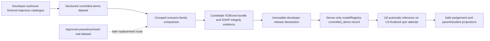

# Developer-Released Controlled-Demonstration XGBoost Model

## Goal Capsule

Activate a genuine XGBoost and SHAP prediction path for the FYP1 controlled demonstration without using unapproved learner data. The model trains on a versioned, developer-authored catalogue of fictional learning trajectories, then predicts from live U3-finalized quiz features during the demo.

This is a **controlled-demonstration model**, not a real-data evaluated model. It proves the automatic training, registration, inference, SHAP, adaptive-assignment, and parent-projection mechanisms. It must not support claims about accuracy for real students, learning improvement, or superiority over the baselines.

The canonical FYP1 plan controls scope and priority. This companion defines the new data provenance, activation controls, implementation units, and evidence boundary.

## Product Contract

### Requirements

- CDM-R1. Keep `quiz-attempt-features-v2` unchanged: `correct_rate` and `mean_response_time_ms` are the only XGBoost inputs. BKT remains a separately versioned mastery/ranking input.
- CDM-R2. Create a deterministic, versioned, expert-authored catalogue of fictional multi-attempt learning trajectories. It contains no real learner identity, free text, answer key, or copied protected attempt record.
- CDM-R3. Derive `next_attempt_support_needed` from the next compatible trajectory attempt, using the frozen `next-attempt-support-needed-v1` target and `0.60` mastery criterion. Do not label a row directly from its own current score.
- CDM-R4. Train a real XGBoost binary classifier and generate Tree SHAP explanations from the exact serialized model. The existing legacy `.pkl` is excluded.
- CDM-R5. Store and activate one developer-released XGBoost bundle only for `controlled_demo` deployment mode. Normal demonstration quiz completion must use this valid model rather than the missing-model fallback.
- CDM-R6. Keep BKT/rule fallback for technical faults, invalid registry evidence, or disabled controlled-demo mode. It is a safety path, not the normal controlled-demonstration recommendation path.
- CDM-R7. Preserve an explicit upgrade route: approved pseudonymized real data produces a separate `real_evaluated` candidate and may replace the controlled-demo model only after its own evaluation and separately governed release declaration.
- CDM-R8. Show safe, modest evidence wording. Student and parent projections may identify a demonstration-model basis, but never expose raw features, SHAP values, artifact paths, hashes, or scenario data.

### Decisions

| Decision | Chosen design | Reason |
| --- | --- | --- |
| Training evidence | Developer-authored fictional trajectories | Demonstrates real model mechanics without presenting simulated rows as learner-study evidence. |
| Runtime input | U3 server-finalized `runtime_callable` attempts only | The model predicts from the same trusted v2 features collected by the application. |
| Schema | Keep `quiz-attempt-features-v2` unchanged | Prevents an artificial feature expansion and preserves training/runtime parity. |
| Activation | `controlled_demo` environment gate plus one matching active registry record | Prevents a simulation-trained bundle from silently becoming a real-data production model. |
| Evaluation wording | Mechanics and scenario-fit evidence only | Metrics on fictional trajectories cannot establish real-world predictive accuracy. |
| Fallback | Retain only for invalid/missing bundle or technical failure | A valid controlled-demo registry makes XGBoost/SHAP the normal FYP1 demonstration path. |

### Non-goals

- No collection, export, or claim based on real learner data.
- No automatic retraining or automatic promotion after quiz completion.
- No change to the XGBoost feature schema, prediction target, BKT state scope, adaptive-policy rules, or parent access boundary.
- No claim that synthetic scenario metrics prove XGBoost is more accurate than Decision Tree or MLP.

## Architecture



The training catalogue provides fictional past and next attempts. The runtime never reads it. Runtime inference instead reads the authenticated learner's finalized attempt history, constructs the same v2 vector, verifies the released bundle, runs XGBoost and Tree SHAP, then applies the existing guarded adaptive policy.

## Implementation Units

### CDM-1. Controlled Dataset Contract

**Dependencies:** Existing U3-R, U4, and U6 contracts.
**Files:** `ai_pipeline/controlled_demo/README.md`, `ai_pipeline/controlled_demo/scenario_catalog_v1.yaml`, `ai_pipeline/controlled_demo/schema.py`, `ai_pipeline/controlled_demo/build_dataset.py`, `ai_pipeline/configs/controlled_demo_model_v1.yaml`, `ai_pipeline/configs/feature_schema.yaml`, `ai_pipeline/logic_oasis_ai/prediction_contract.py`, `ai_pipeline/tests/test_controlled_demo_dataset.py`, and `ai_pipeline/tests/test_prediction_contract.py`.

**Approach:** Define an immutable scenario catalogue with fictional profile IDs, scenario-family IDs, ordered compatible attempts, v2 values, bank/content context, and a developer-authored catalogue declaration. The builder derives labels only from the following eligible attempt and emits a dataset manifest with catalogue hash, schema hash, target/criterion, counts, scenario-family groups, and `trainingDataProvenance: expert_authored_controlled_demo`. Each scenario family must contain a coherent journey rather than independently random rows. Add `expert_authored_controlled_demo` as a named, schema-declared provenance route that is accepted only by a dedicated controlled-demo validation flag; it must not reuse `allow_synthetic_test`, `synthetic_test`, `emulator_verified`, or the final real-data export path.

**Test scenarios:** Missing next attempts are censored; current-score self-labelling is impossible; incompatible transitions and immediate repeated questions are censored; no raw learner fields can appear; generated rows contain exactly v2 features; controlled-demo provenance is accepted only by the named controlled-demo path and rejected by real-data export/default evaluation paths; generation is deterministic; modifying a source scenario changes the manifest hash.

### CDM-2. Demonstration Evaluation and Bundle

**Dependencies:** CDM-1 and U7 comparison helpers.
**Files:** `ai_pipeline/logic_oasis_ai/prediction_contract.py`, `ai_pipeline/training/common.py`, `ai_pipeline/training/evaluate_models.py`, `ai_pipeline/training/train_controlled_demo_xgboost.py`, `ai_pipeline/training/publish_controlled_demo_bundle.py`, `ai_pipeline/reports/controlled_demo_model_report.md`, `ai_pipeline/models/README.md`, `ai_pipeline/tests/test_controlled_demo_evaluation.py`, and `ai_pipeline/tests/test_prediction_contract.py`.

**Approach:** Reuse the frozen prediction contract and deterministic XGBoost trainer. Extend supervised examples with an explicit `evaluationGroupKey`; real-data rows use the existing pseudonymized student key, while controlled-demo rows derive it only from `scenarioFamilyId`. The grouped split consumes that key, never individual rows. Before training, the evaluator must fail closed when the grouped partition cannot place every required target class in both its required training and held-out evaluation partitions; it must report the catalogue insufficiency rather than manufacture rows or claim evaluation. Record the split, seed, model parameters, scenario limitations, and bundle hashes. Decision Tree and MLP may run as mechanics comparators on the same rows, but the report must state that their metrics are not real-world performance evidence. Save the XGBoost model plus a JSON artifact manifest; run Tree SHAP for representative low-, medium-, and high-support-risk cases and verify explanation reconstruction against the same artifact.

**Test scenarios:** All models use the same rows and v2 columns; scenario families never cross partitions; an insufficient or one-class grouped partition fails closed with a catalogue-insufficiency result; legacy and v1 artifacts are rejected; the report carries `claimLevel: controlled_demonstration_only`; SHAP values are non-empty, map only to declared features, and reconstruct the matching XGBoost output within tolerance; artifact and manifest hashes are reproducible.

### CDM-3. Developer Release and Controlled Activation

**Dependencies:** CDM-2 and existing U8 registry/bundle contracts.
**Files:** `ai_pipeline/logic_oasis_ai/model_registry.py`, `tools/promote_controlled_demo_model.py`, `tools/deploy_controlled_demo_model.py`, `tools/deploy_u8_runtime_iam.py`, `tools/tests/test_controlled_demo_registry_contract.py`, `tools/tests/test_u8_runtime_identity_contract.py`, `functions/main.py`, `functions/ai_runtime.py`, `functions/tests/test_ai_runtime.py`, and `firestore.rules`.

**Approach:** Extend the artifact and Firestore registry contract with `trainingDataProvenance`, `evidenceLevel`, `releaseScope`, `deploymentScope`, `scenarioCatalogueSha256`, and `controlledDemoConfigSha256`. `modelRegistry/{artifactId}` is the sole server-only release and promotion record; do not add a second release collection. A controlled-demo activation requires `lifecycleStatus: promoted`, `evaluationStatus: evaluated`, `promotionGateStatus: passed`, immutable `releaseId`, `releasedBy`, `releasedAt`, and `releaseRationale` fields, `trainingDataProvenance: expert_authored_controlled_demo`, `evidenceLevel: controlled_demonstration`, `releaseScope: fyp1_controlled_demo`, and `deploymentScope: controlled_demo`. The rationale must state that it is not real-world validated. The promotion tool creates the new immutable artifact record and, in the same privileged transaction, ensures that no other registry record remains `isActive: true`.

Publish the artifact and its JSON manifest under `controlled-demo/{modelVersion}/` in the one model bucket supplied to `tools/deploy_u8_runtime_iam.py --model-bucket`; the deploy tool verifies that `artifactPath` uses that declared bucket before writing the registry record. The deployment configuration explicitly supplies both `AI_MODEL_EVIDENCE_MODE` and the declared model-bucket identifier. Runtime accepts this record only when `AI_MODEL_EVIDENCE_MODE=controlled_demo`; `real_evaluated_only` rejects it. Registry selection still requires exactly one active matching record and every current package/schema/artifact/policy/target/label hash.

**Test scenarios:** A complete released controlled-demo record activates in `controlled_demo` mode; the same record is rejected in `real_evaluated_only` mode; activation transaction rejects two active registry records; an artifact path outside the declared model bucket is rejected; missing/invalid release declaration, wrong scope, wrong catalogue/config hash, inactive registry, legacy artifact, or mismatched package/schema/policy binding cannot run; client reads/writes of the registry are denied.

### CDM-4. Automatic Runtime and Safe Presentation

**Dependencies:** CDM-3 and U8/U9.
**Files:** `functions/ai_runtime.py`, `functions/main.py`, `lib/shared/models/ai_diagnosis.dart`, `lib/features/quiz/result_page.dart`, `lib/features/parent/parent_dashboard_page.dart`, `functions/tests/test_ai_runtime.py`, `test/ai_diagnosis_test.dart`, `test/parent_dashboard_time_test.dart`.

**Approach:** Preserve the U8 state machine and deterministic IDs. When the released controlled-demo bundle validates, write a completed XGBoost/SHAP model run and use its support risk in the existing adaptive policy. Add the exact bounded field `modelEvidenceState: controlled_demonstration` to the derived safe projections; client wording describes a supportive AI recommendation and identifies the evidence as demonstration-level where detailed methodology is shown. A bundle/configuration failure remains `fallback` or `failed`; it must never silently substitute the legacy model or hard-coded model weights.

**Test scenarios:** A finalized emulator/demo attempt completes through real XGBoost and SHAP without the missing-registry fallback; completed safe status contains no raw model fields; the next assignment records model-backed lineage; technical failure yields the existing visible fallback; parent/student screens distinguish demonstration evidence from a future real-data evaluated model without revealing protected data.

### CDM-5. Release Evidence and Replacement Route

**Dependencies:** CDM-4.
**Files:** `docs/evidence/2026-07-24-controlled-demo-xgboost-release.md`, `docs/architecture/logic-oasis-ai-pipeline-crisp-dm.md`, `docs/architecture/logic-oasis-firestore-database-schema.md`, `tools/tests/test_function_bundle_parity.py`.

**Approach:** Record the immutable developer release declaration, catalogue/report/artifact/config hashes, runtime mode, bundle parity, test evidence, SHAP samples, and an explicit claim boundary. The declaration includes `releaseId`, `releasedBy`, `releasedAt`, and a `releaseRationale` containing `not real-world validated`; it is created only after CDM-2 evidence passes and is never inferred from cloud deployment. Document the real-data replacement checklist: approved data governance, pseudonymized export, student-grouped evaluation, real-data report, separately governed release declaration, registry switch, and safe projection regeneration.

**Test scenarios:** Release evidence contains no scenario content that could be mistaken for real learner data; the deployment bundle references the selected artifact/configuration; a model registered as `real_evaluated` cannot be replaced by the demo bundle without an explicit registry change; the app remains functional when the demo mode is disabled.

## Sequencing

```text
CDM-1 -> CDM-2 -> CDM-3 -> CDM-4 -> CDM-5
                         \-> existing U10 may proceed independently
```

CDM work does not reopen U3-R through U7 behavior. It extends their existing contracts and the deployed U8/U9 path. U10 remains independently sequenced after U8 and does not wait for controlled-demo activation.

## Verification Contract

- Dataset generation proves deterministic, fictional, next-attempt-labelled v2 rows and no personal data.
- Grouped scenario-family evaluation proves train/test isolation and produces a clearly bounded mechanics report.
- XGBoost and SHAP use the same serialized artifact and declared feature order.
- Registry, bundle, package, feature-schema, target, label, ranking-policy, adaptive-policy, scenario-catalogue, and controlled-demo configuration hashes all match.
- `controlled_demo` is accepted only in a declared demonstration environment; `real_evaluated_only` rejects it.
- One finalized quiz automatically reaches `completed` with a genuine XGBoost/SHAP run and model-backed assignment when the complete controlled-demo registry is present.
- All existing invalid-registry and technical-failure paths still finish visibly as `fallback` or `failed`.
- Student and linked-parent reads remain projection-only; evidence wording never makes a real-world accuracy claim.

## Definition of Done

- The active FYP1 demonstration model is a versioned XGBoost artifact trained from the declared controlled catalogue using `quiz-attempt-features-v2`.
- It produces real XGBoost probabilities and Tree SHAP values automatically after a trusted finalized quiz attempt.
- Its protected registry entry contains an immutable developer release declaration, controlled-demo provenance/scope, dataset/report/catalogue/configuration hashes, and all existing runtime compatibility bindings.
- A normal controlled-demo quiz uses the XGBoost/SHAP path; fallback remains reserved for invalid or failed model execution.
- The report and UI label the evidence as controlled demonstration and make no real-student accuracy, learning-effect, or model-superiority claim.
- A separately governed `real_evaluated` model can replace it through the existing registry without app-architecture changes.

## Risks and Mitigations

| Risk | Mitigation |
| --- | --- |
| Fictional scenarios encode the author's assumptions | The developer documents scenario-family assumptions, and the report frames results as demonstration mechanics only. |
| Demo model is accidentally enabled for a real-data release | Runtime mode, registry scope, and deployment contract tests fail closed. |
| Scenario rows are too uniform for a meaningful code-path test | Require varied feature/risk pathways and scenario-family grouped partitions before developer release. |
| The model cannot load in Firebase Functions | Keep the established bundle/deployment spike and technical fallback; do not substitute the legacy `.pkl`. |
| Future real data differs from controlled scenarios | Train and approve a separate `real_evaluated` artifact; do not retune the demo model in place. |
