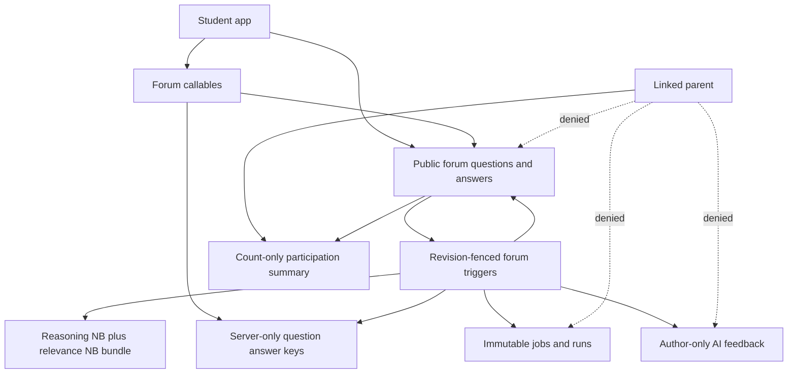
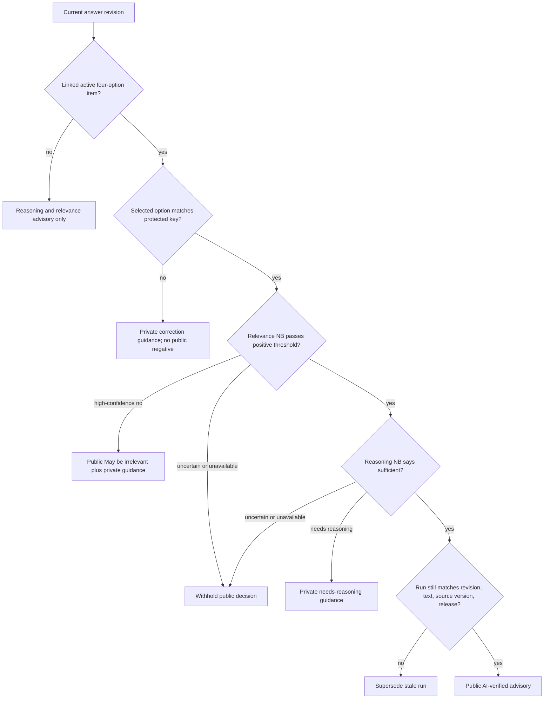
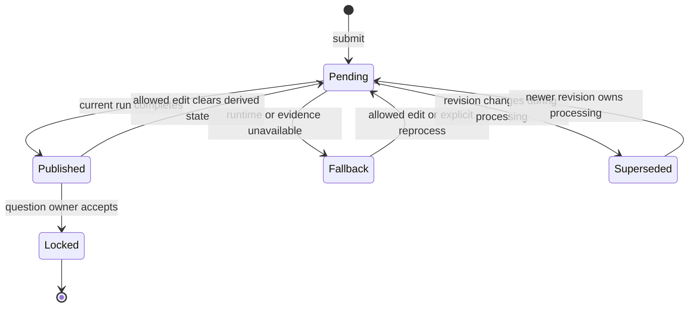

# FYP1 Forum AI Verification and Controlled Cloud Closure - Plan

## Goal Capsule

- **Objective:** Extend the completed U1-U6 forum with precision-first `AI-verified` support for approved question-bank discussions, preserve free-form Q&A and the existing reasoning Naive Bayes, close the known pagination/device gaps, and complete controlled cloud deployment, registry activation, production-environment verification, and rollback evidence.
- **Authority order:** Confirmed requirements in this plan; privacy and evidence boundaries in `docs/plans/2026-08-01-001-feat-u10-forum-production-closure-plan.md`; current release/runtime contracts; existing repository conventions.
- **Execution baseline:** Start from the latest approved U1-U6 forum baseline. Do not implement against an older `logic_oasis` checkout or rewrite the completed U1-U6 history.
- **Execution posture:** Characterize existing free-form, Helpful, Accepted, reporting, blocking, revision fencing, and parent privacy behavior before changing schemas. Add new domain behavior test-first.
- **Stop conditions:** Stop cloud mutation if the authenticated project is not `logic-oasis-fyp`, the operator lacks explicit authority, the deployed runtime cannot match the release dependencies and revision, the registry contains ambiguous active records, or the controlled candidate fails any precision/integrity gate.
- **Tail ownership:** The implementing agent owns code, tests, regenerated deterministic artifacts, emulator evidence, authorized cloud evidence, documentation, and cleanup. U10-R remains separate governed work.

---

## Product Contract

### Summary

The forum keeps unrestricted free-form student discussion while adding one canonical discussion per approved question-bank item and version. Linked responses use separate final-answer and explanation fields, and receive `AI-verified` only when trusted correctness, relevance Naive Bayes, and the preserved reasoning Naive Bayes all pass without uncertainty.

The same plan closes the remaining FYP1 operational gaps and activates only a controlled-demonstration release in the cloud. It does not collect learner text for training or claim real-learner model validity.

### Problem Frame

The completed forum provides authenticated collaboration, social Helpful and Accepted actions, reporting/blocking, bilingual UI, revision-safe background analysis, immutable runs, and parent count-only privacy. Its AI is an advisory reasoning classifier only. It cannot establish mathematical correctness, rank answers, or justify a public verification badge.

Question-bank answer keys already exist as server-only trusted data, but forum questions have no question-bank identity or canonical thread. Answers contain one text field, the question list is limited to the newest 40 items, physical devices cannot supply a custom emulator host, and the controlled model release is still pending cloud deployment. The committed release 4 was produced under CPython 3.12 while the deployed Firebase runtime contract is Python 3.11, so it must not be promoted to cloud as-is.

### Actors

- A1. Student author asks free-form questions, opens linked discussions, submits or edits responses, and receives private guidance.
- A2. Peer student reads public answers, sees advisory labels, and uses the separate human Helpful, Accepted, report, and block flows allowed by current rules.
- A3. Linked parent sees count-only participation summaries and no forum text, AI status, answer key, peer identity, report, block, job, run, or registry record.
- A4. Developer/evaluator authors fictional controlled scenarios, evaluates candidates, and records limitations without accessing real learner text for training.
- A5. Authorized release operator deploys the bounded cloud runtime, verifies IAM, promotes or revokes immutable registry records, and records sanitized evidence.
- A6. Dedicated forum runtime service account executes forum callables and triggers with least privilege.

### Requirements

#### Forum modes and linked discussions

- R1. Free-form and unsupported questions remain available with the existing collaboration, report, block, Helpful, and owner-Accepted behaviors.
- R2. An active approved question-bank item and content version has at most one canonical forum discussion, regardless of whether the student enters from quiz review or the forum.
- R3. A server-owned create-or-open operation accepts only the public question ID, reads the question/bank/key itself, validates active version and protected answer-key compatibility, and constructs the canonical source identity and snapshot without trusting client-supplied linkage.
- R4. A linked discussion stores immutable source identity and a server-validated client-safe prompt/options snapshot, never the answer key; client-supplied bank IDs, versions, prompts, options, snapshots, eligibility, timestamps, authors, revisions, releases, or derived states are rejected.
- R5. A deactivated or superseded question version remains readable as historical discussion but cannot produce new `AI-verified` outcomes; a new content version receives a new canonical discussion.
- R6. Linked responses present a four-option final-answer selector and a separate explanation field; unsupported question types remain free-form and ineligible for trusted correctness.
- R7. Quiz review offers linked discussion entry for reviewed question-bank items, and the Forum offers the same create-or-open path without creating duplicates.

#### AI decisions and presentation

- R8. The existing TF-IDF plus Naive Bayes reasoning classifier remains an independent component with `sufficient_reasoning`, `needs_reasoning`, and `uncertain`; it is not replaced or repurposed as a correctness classifier.
- R9. A separate TF-IDF plus Naive Bayes relevance component classifies question-response relevance and can abstain.
- R10. Trusted correctness compares the structured selected option with the active server-only answer key for the exact question and content version; the key is never copied into model input, training rows, forum documents, callable output, errors, logs, runs, client telemetry, fixtures, or evidence, and Naive Bayes never determines mathematical correctness.
- R11. `AI-verified` is public only when trusted correctness matches, relevance is positive above its release threshold, reasoning is sufficient above its release threshold, all components are non-abstaining, and results bind to answer ID, revision, selected option, explanation hash, source version, and a release that remains active through final publication. A later revocation blocks new/in-flight publication but does not rewrite completed historical runs or answer content.
- R12. `AI-verified` means the response passed the system's automated trusted-answer, relevance, and reasoning-quality gates. It does not imply human verification, universal mathematical validity, answer ranking, or educational effectiveness.
- R13. A trusted correctness mismatch produces author-only guidance and no public incorrect label.
- R14. A high-precision relevance failure may show the public advisory `May be irrelevant` and author-only guidance; it never hides, deletes, reports, blocks, demotes, or punishes content.
- R15. Reasoning failure produces author-only guidance; uncertainty, missing keys, unsupported types, stale versions, fallback, or component failure withholds `AI-verified` without a negative public claim.
- R16. Free-form responses may receive reasoning and relevance advice when context is sufficient, but never trusted correctness or `AI-verified`.
- R17. Editing an eligible unaccepted response atomically updates final answer and explanation, increments revision, removes all prior derived statuses immediately, and republishes only after the new revision completes. The existing prohibition on editing owner-accepted answers remains.
- R18. Human Helpful and question-owner Accepted remain separate server-controlled social actions. AI does not invoke them and no `AI-helpful` or `AI-accepted` state exists.
- R19. Public answer documents expose only allow-listed public advisory enums and non-sensitive current-revision/run references. Correctness details, reasoning guidance, probabilities, thresholds, and component diagnostics live in an author-only server-written feedback document; clients cannot write either projection's derived fields.

#### Evidence, learning, and privacy

- R20. The relevance dataset uses developer-authored fictional English, Bahasa Melayu, and mixed-language scenarios grouped by question/scenario family; generated rows are never edited manually.
- R21. Model selection and thresholds use grouped training/validation only. The untouched grouped test runs once after freeze and reports exact counts, confusion matrices, class metrics, abstention/coverage, language slices, and component/composite false positives.
- R22. The authoritative catalogue labels expected correctness, relevance, reasoning, and composite public decision separately. The untouched controlled test must contain at least eight verified-eligible cases, eight should-not-verify cases spanning the three failure gates, eight irrelevant cases, and eight relevant controls, with English, Bahasa Melayu, and mixed text represented in each applicable class. A release requires zero emitted false `AI-verified`, zero emitted false `May be irrelevant`, and non-zero emitted coverage for both public decisions; abstentions count against coverage but not emitted-decision precision, and any failed support/gate publishes no candidate.
- R23. The evaluation preserves and reports the reasoning component independently, reports deterministic correctness separately, and makes no Naive Bayes superiority claim when a baseline matches or outperforms it.
- R24. Runtime output and evidence remain `controlled_demonstration_only` and `not_established_on_real_learners`; probabilities are never presented as learner-calibrated confidence.
- R25. No online or automatic learning occurs. No real student text is exported, labelled, retrained, or promoted in FYP1.
- R26. The governed offline-learning workflow is documented for U10-R: consent and purpose approval, de-identification, quarantine, human dual review, author-grouped splits, a new immutable candidate, evaluation, approval, promotion, retention/deletion, and rollback. Helpful, Accepted, and reports may prioritize review only and are never ground-truth labels.
- R27. Existing parent count-only privacy extends to every new linked-discussion, private-feedback, verification, model, registry, and evidence field.

#### Discovery and development environments

- R28. Forum discovery supports cursor-based older-page loading beyond 40 questions with deterministic ordering, duplicate suppression, loading/error/end states, and filter reset behavior.
- R29. Canonical linked-discussion lookup is direct and does not depend on whether the discussion is loaded in the paged feed.
- R30. Emulator configuration keeps Android Virtual Device defaults but accepts one validated build-time host override used consistently by Auth, Firestore, Functions, and any other configured emulator client.
- R31. Physical-device instructions cover LAN-host access and `adb reverse`; release builds cannot silently target emulators.

#### Controlled cloud closure

- R32. Cloud deployment targets project `logic-oasis-fyp`, region `asia-southeast1`, second-generation Python 3.11 functions, and the dedicated runtime identity `logic-oasis-forum-runtime@logic-oasis-fyp.iam.gserviceaccount.com` for the versioned forum inventory only; quiz, parent, and policy functions retain their own existing identities.
- R33. The cloud release is rebuilt and evaluated under the exact Python 3.11 Linux dependency contract used by Functions. Direct and transitive Functions dependencies are resolved into a version-pinned lock/constraints artifact whose digest is release-bound, and runtime activation verifies the allow-listed deserialization package versions actually installed.
- R34. The new dual-component bundle uses a new immutable release ID and manifest schema. Release 4 remains unchanged and is never relabelled, overwritten, or promoted as the new feature release.
- R35. The release binds both Naive Bayes components, deterministic correctness policy, datasets, grouped splits, evaluation reports, thresholds, source/vendor/runtime hashes, bundle, dependency versions, and bounded code revision before deserialization.
- R36. The deployment tool defaults to read-only preflight/dry-run, rejects wrong project/account/revision/runtime/dependency/function inventory, refuses the runtime/default-compute identities as release operators, and requires an explicit authorized apply action. No service-account key file is created or committed.
- R37. Runtime code/options are the source of truth for region, service account, retry, and function inventory. Project-specific controlled-demo mode and release revision are operator-supplied, ignored local configuration generated from the selected manifest, never a stale committed `.env` value.
- R38. Deploy every entry in the authoritative forum function inventory before registry promotion. Every deployed entry must match the selected source revision, region, runtime identity, and expected options; any missing, failed, or mismatched entry records a partial deployment and prohibits promotion. With no compatible active release, the runtime fails closed while content and human actions continue.
- R39. Registry promotion transactionally creates one immutable scoped release, consumes a live-query deployment attestation matching the manifest/revision/bundle/inventory, and deactivates the prior active scoped release only when `supersedesReleaseId` matches. An empty registry requires `supersedesReleaseId: null`; an unexpected active release stops this first-cloud rollout for explicit operator review rather than silently superseding it.
- R40. Production-environment verification uses identifiable developer-controlled student/parent fixture accounts and fictional canary text to prove identity, trigger delivery, composite outcomes, privacy, immutable runs, safe logs, and no controlled-corpus mutation; fixture records are excluded from training/export and retained or deleted only under the runbook's predeclared evidence policy.
- R41. Rollback tooling identifies and revokes the exact active registry record without deleting it, proves new answers safely lose `AI-verified` while existing content/runs remain, and restores service only through a rebuilt/redeployed immutable successor rather than reactivating or mutating a revoked ID. Production uses a non-destructive live dry-run unless a destructive rehearsal or incident is separately authorized with a predeclared final state.
- R42. A sanitized immediate smoke record and a bounded 24-hour platform-health observation record function errors, retries, fallback rate, registry cardinality, runtime identity, and text-free logs without inspecting or exporting learner text.

### Key Flows

- F1. A student asks and answers a free-form question; reasoning/relevance may advise, trusted correctness is not eligible, and human actions remain unchanged.
- F2. A student selects a reviewed question in quiz results or the Forum, opens the canonical linked discussion, selects a final option, explains it, and receives revision-bound advisory results.
- F3. A response passes all three gates and displays one `AI-verified` badge while Helpful and Accepted remain independent.
- F4. An unaccepted response is edited; public and private derived states clear immediately, a stale run cannot republish, and only the new revision can regain a badge.
- F5. An authorized operator publishes a fresh controlled bundle, deploys the fail-closed runtime, verifies IAM/configuration, promotes exactly one release, and completes controlled production smoke.
- F6. An authorized operator revokes the active release; future processing falls back without data loss and the immutable audit history remains.

### Acceptance Examples

- AE1. Given a free-form fraction question, when a student submits a relevant explanation, then reasoning/relevance advice may appear to its author but no trusted-correctness result or `AI-verified` badge appears.
- AE2. Given an active four-option question-bank item, when two students enter from quiz review and the Forum, then both receive the same canonical discussion ID and no duplicate discussion is created.
- AE3. Given a linked response with the correct selected option, relevant explanation, sufficient reasoning, and all thresholds passed, when the current revision completes, then every student may see `AI-verified` and only the author may see component guidance.
- AE4. Given the correct option with insufficient explanation, when analysis completes, then no badge appears and the author receives needs-reasoning guidance.
- AE5. Given an incorrect selected option, when analysis completes, then no public incorrect label appears and only the author receives correction guidance.
- AE6. Given a high-confidence irrelevant response, when analysis completes, then `May be irrelevant` may appear publicly and no automatic moderation action occurs.
- AE7. Given a verified unaccepted response, when its author edits either field, then the badge disappears synchronously and cannot return from the prior run.
- AE8. Given a linked parent, when the new collections exist, then the parent can read only updated aggregate counts and is denied prompt snapshots, answers, feedback, jobs, runs, reports, blocks, and registry data.
- AE9. Given more than 40 discussions, when the student loads another page, then older unique discussions appear in deterministic order and canonical direct-open still works.
- AE10. Given a physical Android device with a configured emulator host, when debug emulator mode starts, then all Firebase clients use the same host; without explicit debug configuration, a release build uses cloud Firebase.
- AE11. Given a deployed runtime with no compatible active registry record, when a fictional answer is submitted, then content persists, fallback is advisory, and no verification badge appears.
- AE12. Given a compatible promoted release, when a fictional linked answer traverses production Functions, then one current-revision immutable run records the controlled claim and logs contain none of the submitted text.
- AE13. Given the active release is revoked, when a new fictional answer is submitted, then fallback occurs, the previous run/content remains immutable, and the revoked registry record remains auditable.

### Success Criteria

- Both forum modes are usable in English and Bahasa Melayu without duplicate linked threads or answer-key exposure.
- The composite gate is precision-first, revision-safe, private by default, and demonstrably separate from social Helpful/Accepted actions.
- The controlled candidate either passes every declared evidence/integrity gate or is not published; current reasoning-only behavior remains the safe fallback.
- Full Flutter, Functions, AI, Rules, emulator, release-parity, and cloud preflight gates pass.
- Authorized cloud evidence proves exact project, region, Python/runtime dependencies, dedicated identity, function inventory, release/revision, one-active registry state, controlled smoke, safe logs, rollback, and observation.

### Scope Boundaries

#### In scope

- Linked question-bank discussion, separate response fields, trusted four-option correctness, relevance Naive Bayes, preserved reasoning Naive Bayes, composite badge/advisories, private feedback, revision invalidation, pagination, emulator-host override, controlled release v2, cloud deployment/registry/verification, and governed offline-learning documentation.
- Regression verification of the already-fixed forum localization and unblock UI.

#### Deferred to Follow-Up Work

- U10-R consented/de-identified real learner dataset collection, human annotation, author-grouped real evaluation/calibration, `real_evaluated` release, and real-world model sign-off.
- Support for numeric-expression equivalence, symbolic algebra, multi-answer, proof, image, or arbitrary free-text trusted correctness beyond the current four-option question-bank contract.
- Full-text server search across all forum history; FYP1 pagination filters the pages the user has loaded.
- App Check enforcement rollout, if not already enabled project-wide, after monitoring impact on supported app clients; it is not silently enabled only for these new callables.

#### Outside this product's identity for FYP1

- Automatic/online learning, autonomous retraining/promotion, answer ranking, general inappropriate-content moderation, AI Helpful/Accepted actions, public incorrect labels, automated hiding/deletion/reporting/blocking, punishment, or real-learner accuracy/generalisation/effectiveness claims.

---

## Planning Contract

### Key Technical Decisions

- KTD1. **Two forum modes, one repository surface.** Free-form documents retain open discussion while linked documents carry a server-owned source contract. A mode discriminator prevents clients from forging verification eligibility.
- KTD2. **Canonical ID is question version scoped.** Derive the linked discussion identity from the trusted question ID and content version, and create-or-read it transactionally. Content changes never rewrite historical discussion meaning.
- KTD3. **Server owns linked trusted mutations.** Linked create/open, submit, and edit callables validate student role, strict field allow-lists, ID/text lengths, normalized explanation, integer option range `0..3`, discussion membership, accepted-answer immutability, concurrency, revision, and status invalidation. Legacy free-form writes keep their bounded schema for old-client compatibility; Rules deny direct linked or derived-field writes.
- KTD4. **Private and public AI projections are separate with a legacy transition.** Shared answer data contains only allow-listed public state and current release/revision binding. A one-time idempotent migration removes message/probability/diagnostic fields from historical embedded `aiFeedback`; it does not attempt to reconstruct private history. New author-only guidance is stored separately and denied to peers and parents.
- KTD5. **Specialists remain independent.** The existing reasoning classifier is preserved, the relevance classifier is separately trained/evaluated, and deterministic correctness remains code plus protected data. The runtime combines outcomes only at a policy gate.
- KTD6. **Positive evidence is conjunctive.** Every `AI-verified` input must pass; any missing, uncertain, stale, unsupported, or failed input withholds the badge. A public negative relevance label has its own higher precision threshold.
- KTD7. **Release schema v2 binds components.** Publish one immutable runtime bundle containing separately identifiable reasoning and relevance pipelines plus the deterministic policy contract. Do not stretch the release-4 scalar `modelType` schema or mutate an immutable release to record deployment state; deployment attestation is a separate artifact.
- KTD8. **Python 3.11 is the cloud contract.** Rebuild the new candidate under exact Python 3.11 dependency pins to match Firebase configuration and the deployment tool. Do not deploy the CPython-3.12 release-4 artifact into Python 3.11.
- KTD9. **Deploy before promote.** Deploy and inspect a fail-closed runtime first, then transactionally activate its exact release. This avoids exposing an incompatible new registry record to an older runtime.
- KTD10. **No committed controlled production environment.** Replace the stale tracked project `.env` with an ignored operator-generated configuration and a non-secret example. Post-deploy inspection, not local file presence, proves active values.
- KTD11. **Rollback means revoke to fallback.** Never delete, rewrite, or reactivate a revoked release ID. Recovery after revocation publishes a new immutable successor.
- KTD12. **Production verification is operational evidence.** Developer-authored smoke data can prove deployment mechanics; it cannot upgrade the evidence level or substitute for U10-R.
- KTD13. **Historical display and correctness authority differ.** A linked prompt/options snapshot preserves historical display, but correctness requires a currently matching protected key. Because keys are not version-retained today, a missing or version-mismatched historical key makes the response advisory-only.
- KTD14. **Paging order is frozen.** Pages order by `updatedAt` descending then document ID descending, and the cursor carries both values. An ordering-affecting live update invalidates/refetches accumulated pages rather than merging against a stale cursor.

### Assumptions

- The current approved question-bank contract remains four client-safe options plus one protected `answerIndex`; other question types are not eligible in this FYP1 plan.
- `logic-oasis-fyp` is the intended cloud project and its Firestore database location is compatible with `asia-southeast1`; the cloud preflight must verify rather than assume this.
- The authorized operator can use user credentials, Application Default Credentials, or approved service-account impersonation without downloading a long-lived key.
- The current rule that owner-accepted answers cannot be edited remains in force.
- Existing release 4 has not been promoted to the cloud forum registry. If preflight finds a different active compatible release, the new manifest must name that actual release as its predecessor.

### High-Level Technical Design

#### Component and privacy topology



#### Composite decision gate



#### Revision lifecycle



#### Cloud activation sequence

```mermaid
sequenceDiagram
  participant O as Authorized operator
  participant P as Release publisher
  participant F as Cloud Functions
  participant R as Firestore model registry
  participant S as Controlled smoke
  O->>P: Publish fresh Python 3.11 immutable candidate
  P-->>O: Manifest, bundle, revision, evaluation bindings
  O->>F: Deploy full forum inventory with dedicated identity
  O->>F: Inspect runtime, env, region, revision, IAM
  S->>F: Submit pre-promotion fictional answer
  F-->>S: Safe fallback; no badge
  O->>R: Transactionally promote exact release
  S->>F: Submit controlled linked cases
  F->>R: Resolve exactly one compatible active release
  F-->>S: Current-revision advisory outputs
  O->>R: Revoke during rollback rehearsal or incident
  S->>F: Submit post-revocation fictional answer
  F-->>S: Safe fallback; prior records preserved
```

### Evidence-mode matrix

| Runtime mode | Compatible release | Allowed result |
|---|---|---|
| `controlled_demo` | One exact v2 controlled release | Controlled advisory outcomes including `AI-verified` |
| `controlled_demo` | Missing, multiple, revoked, drifted, or incompatible | Safe fallback; no badge or public irrelevant label |
| `real_evaluated_only` | Controlled release | Reject before model load; safe fallback |
| Any mode | Unsupported/free-form correctness | Reasoning/relevance advisory only; never `AI-verified` |

### Execution Order

1. U1 establishes server-owned linked/free-form contracts and privacy before any UI or model consumes them.
2. U2 exposes the linked flows and separate fields against the U1 contract.
3. U3 creates and evaluates the relevance component while preserving the reasoning component.
4. U4 integrates the composite runtime, public/private projections, revision fencing, and app presentation.
5. U5 closes pagination and emulator-host gaps independently of release publication.
6. U6 aligns Python/dependencies, publishes the immutable v2 release, and hardens deployment/registry tooling.
7. U7 proves the complete local/emulator system and documents governed offline learning and cloud operations.
8. U8 performs only authorized cloud deployment, promotion, controlled verification, observation, and rollback evidence.

### System-Wide Impact

- **Data:** Adds source-version identity and structured response fields, plus an author-only feedback projection. Existing free-form documents remain readable through backward-compatible parsing.
- **Security:** Moves eligibility-bearing writes server-side, keeps keys server-only, preserves student-only raw forum access, and extends parent denials.
- **Reliability:** Firestore delivery remains at-least-once and unordered; existing logical inference IDs, revision/text fencing, idempotent jobs/runs, retry-safe counters, and safe fallback remain mandatory.
- **Model lifecycle:** One release now binds two Naive Bayes components and a deterministic policy. Registry history and release evidence must remain immutable apart from explicit lifecycle/active transitions.
- **Operations:** Cloud deployment becomes repeatable and inspectable, but promotion/revocation remains privileged and manual-by-approval. Normal app use requires no manual model loading after a compatible deployment and promotion.

---

## Implementation Units

### U1. Establish Linked Discussion, Structured Answer, and Privacy Contracts

- **Goal:** Add backward-compatible free-form/linked schemas, canonical server-owned discussion creation, structured response mutation, and separate public/private AI projections.
- **Requirements:** R1-R7, R17, R19, R27; F1-F4; AE1-AE2, AE7-AE8.
- **Dependencies:** Completed U1-U6 baseline.
- **Files:** `functions/main.py`, `functions/forum_runtime.py`, `firestore.rules`, `lib/shared/models/forum_question.dart`, `lib/shared/models/forum_answer.dart`, `lib/shared/repositories/collaboration_repository.dart`, new `tools/migrate_forum_feedback_projection.py`, `functions/tests/test_forum_callable.py`, `functions/tests/test_forum_runtime.py`, new migration test under `tools/tests/`, `firebase_seed/tests/question_answer_keys_rules.test.js`, `test/qa_forum_flow_test.dart`.
- **Approach:** Introduce explicit free-form and linked source contracts. Use one transactional create-or-open callable for linked questions and server-owned submit/edit callables for linked answers. Derive all authority server-side from the public question ID. Bind linked identity to question ID/content version and a client-safe prompt snapshot. Store public advisory fields on the answer and author-only guidance in a protected projection. Preserve old free-form parsing/writes while preventing clients from adding linked/derived fields. Add a dry-run-first, idempotent migration that redacts disallowed legacy embedded feedback and reports counts without content.
- **Patterns to follow:** Existing `_forum_call` authentication/error mapping, protected `questionAnswerKeys`, `ForumRuntimeGateway` transactions, immutable accepted-answer rule, and parent denial rules.
- **Test scenarios:** Concurrent create-or-open calls return one linked discussion; a stale/inactive/mismatched source is rejected; deterministic-ID collision fails closed; free-form creation remains valid; forged bank/version/snapshot/key/eligibility/author/revision/status fields are denied; unknown fields, oversized IDs/text, non-integer or out-of-range options, unauthenticated/parent/foreign calls, replay, and edit/accept races are rejected; direct linked writes fail; accepted response edit fails; allowed edit clears both projections and increments revision; legacy migration dry-run/apply is idempotent; peer and parent `get`, list/query, and guessed-ID reads of private feedback fail; parent retains count-only summary.
- **Verification:** Emulator rules and Functions tests prove canonicality, write authority, compatibility, privacy, and unchanged human actions.

### U2. Add Quiz-to-Forum and Forum-to-Linked Discussion User Flows

- **Goal:** Expose both canonical entry points and the linked final-answer/explanation composer with complete English/Bahasa Melayu states.
- **Requirements:** R2, R6-R7, R12-R19; F1-F4; AE1-AE7.
- **Dependencies:** U1.
- **Files:** `lib/features/quiz/quiz_page.dart`, `lib/features/quiz/result_page.dart`, `lib/features/collaboration/qa_forum/qa_forum_page.dart`, `lib/shared/models/quiz_completion.dart`, `lib/shared/models/question_response.dart`, `lib/shared/services/forum_ai_status_service.dart`, `lib/l10n/app_en.arb`, `lib/l10n/app_ms.arb`, generated `lib/l10n/app_localizations*.dart`, `test/result_page_test.dart`, `test/quiz_result_navigation_test.dart`, `test/qa_forum_flow_test.dart`.
- **Approach:** Retain reviewed question identity/outcome long enough to offer discussion entry without exposing the answer key. The linked composer renders four public options plus explanation; free-form remains one response field. Display one advisory badge, optional public irrelevant label, and author-only messages with accessible explanatory copy. Preserve draft/error behavior and avoid using raw English string branching for new text.
- **Patterns to follow:** Current localized forum helpers, quiz callable validation, mounted-state safeguards, repository injection, and widget-test fixtures.
- **Test scenarios:** Both entry points open the same thread; an existing thread opens without duplicate creation; linked fields validate independently; free-form form remains unchanged; public/author views differ correctly; edit removes badge immediately; incorrect private guidance never appears to peers; Accepted and Helpful remain visually distinct; English and Bahasa Melayu cover loading, errors, labels, dialogs, and tooltips.
- **Verification:** Focused widget tests prove the complete student flows, localization, accessibility semantics, and regression safety for report/block/unblock/edit actions.

### U3. Build and Evaluate the Relevance Naive Bayes Component

- **Goal:** Add a separately governed relevance classifier and produce precision-first controlled evidence while preserving the reasoning classifier.
- **Requirements:** R8-R9, R20-R24; AE3-AE6.
- **Dependencies:** U1 contract definitions.
- **Files:** `ai_pipeline/logic_oasis_ai/forum_ai/classifier.py`, new relevance classifier module under `ai_pipeline/logic_oasis_ai/forum_ai/`, `ai_pipeline/forum_controlled_demo/schema.py`, new authoritative verification catalogue under `ai_pipeline/forum_controlled_demo/`, `ai_pipeline/forum_controlled_demo/build_forum_dataset.py`, `ai_pipeline/training/evaluate_forum_classifier.py`, `ai_pipeline/training/train_forum_classifier.py`, `ai_pipeline/tests/test_forum_controlled_demo_dataset.py`, `ai_pipeline/tests/test_forum_evaluation.py`, `ai_pipeline/tests/test_forum_model_promotion.py`, generated controlled reports/manifests under `ai_pipeline/forum_controlled_demo/generated/` and `ai_pipeline/reports/`.
- **Approach:** Keep reasoning labels and evaluation visible as an independent component. Add authoritative correctness/relevance/reasoning/composite truth labels for grouped scenarios across supported languages and linked/free-form contexts. Freeze vectorizer, variant, thresholds, composite counting rules, and policy on training/validation; run test once. Precision is computed only over emitted public decisions, coverage over all applicable cases, and abstentions reduce coverage. Refuse publication when exact support, false-public-decision, coverage, leakage, provenance, or non-degeneracy gates fail.
- **Patterns to follow:** Authoritative YAML-to-canonical-JSONL rebuild, family-grouped split, comparator parity, test-once evidence, deterministic generated-artifact parity, and controlled claim limitations from the current U4 pipeline.
- **Test scenarios:** Catalogue rejects missing language/class/family support and forged rows; split prevents question/scenario family leakage; threshold selection never reads test; both NB components make non-degenerate predictions; controlled test reports false-public-decision counts; failed precision/support gate produces no candidate; deterministic baseline cannot be promoted; committed deterministic artifacts reproduce exactly.
- **Verification:** AI focused/full suites pass and the report states controlled-only limitations, current reasoning metrics, relevance metrics, composite precision/coverage, and no superiority claim.

### U4. Integrate Composite Verification, Revision Fencing, and Safe Presentation

- **Goal:** Run trusted correctness, relevance NB, and reasoning NB as a revision-bound composite without weakening existing retry, privacy, or fallback behavior.
- **Requirements:** R8-R19, R23-R24, R27; F2-F4; AE3-AE8.
- **Dependencies:** U1, U3.
- **Files:** `functions/forum_runtime.py`, `functions/main.py`, `functions/vendor/logic_oasis_ai/forum_ai/`, `lib/shared/models/forum_answer.dart`, `lib/shared/services/forum_ai_status_service.dart`, `lib/features/collaboration/qa_forum/qa_forum_page.dart`, `functions/tests/test_forum_runtime.py`, `functions/tests/test_forum_trigger.py`, `test/qa_forum_flow_test.dart`, `tools/run_forum_emulator_flow.js`.
- **Approach:** Fetch correctness authority server-side for eligible linked revisions, evaluate explanation relevance/reasoning through separately identified pipelines, and apply the composite policy after all components complete. Extend logical inference identity and run bindings with source version, structured-answer hash, explanation hash, component versions, thresholds, and policy version. Publish only if all fences still match; stale runs become superseded. Fail any bundle/component error to existing safe fallback with no positive/public-negative label.
- **Patterns to follow:** Current claim/lease/fencing lifecycle, immutable `forumAiRuns`, source/vendor/bundle parity checks before joblib load, sanitized logging, and current safe fallback.
- **Test scenarios:** Every decision-matrix branch; missing/inactive/mismatched key; component abstention/failure; duplicate/out-of-order delivery; edit during inference; swapped selected option/explanation; revoked/replaced release; old schema free-form answer; author/peer/parent projections; stale private feedback is not current; public payload contains only allowed fields; a canary key is absent from classifier inputs, documents, callable results, logs, artifacts, telemetry, and evidence; timeout/error logs omit canary prompt/answer/explanation/key strings; controlled corpus hashes remain unchanged.
- **Verification:** Functions and multi-emulator tests prove one current-revision outcome, immutable audit records, safe fallback, privacy, and exact public/private messaging.

### U5. Add Forum Pagination and Configurable Emulator Hosts

- **Goal:** Make older discussions discoverable and allow consistent emulator use from Android emulators and physical devices.
- **Requirements:** R28-R31; AE9-AE10.
- **Dependencies:** U1 for linked direct-open behavior.
- **Files:** `lib/shared/repositories/collaboration_repository.dart`, `lib/features/collaboration/qa_forum/qa_forum_page.dart`, `lib/shared/services/firebase_emulator_config.dart`, `test/qa_forum_flow_test.dart`, new focused emulator-config test under `test/`, `README.md` or the existing emulator runbook.
- **Approach:** Replace the fixed realtime-only list contract with pages ordered by `updatedAt` and document ID descending, using an opaque cursor containing both. Invalidate/refetch accumulated pages after ordering-affecting live changes so stale cursors cannot create gaps. Filters operate on loaded pages and reset paging state; canonical IDs open directly and reauthorize. Add one debug-only host override with AVD defaults and central validation; document LAN and `adb reverse` choices without changing cloud defaults.
- **Patterns to follow:** Repository injection, mounted-state checks, safe loading/error UI, and centralized Firebase emulator connection.
- **Test scenarios:** More than 40 items load without duplicate/skip at equal timestamps; malformed/stale cursor and reorder invalidation; load-more error preserves current page and retries; filter/reset/end states; blocked-author change across pages; direct canonical open before feed load and non-student denial; Android AVD default, physical LAN/`adb reverse` override, invalid/loopback physical host rejection, and release-mode cloud behavior.
- **Verification:** Focused Flutter tests prove paging and host selection, and the documented physical-device path is manually rehearsed once.

### U6. Publish Release v2 and Harden Cloud Deployment and Registry Tooling

- **Goal:** Produce a cloud-compatible immutable dual-component release and make deployment, IAM, promotion, inspection, and revocation safe and unambiguous.
- **Requirements:** R32-R39, R41; F5-F6; AE11-AE13.
- **Dependencies:** U3-U4.
- **Files:** `firebase.json`, `functions/requirements.txt`, `functions/.env.logic-oasis-fyp`, `.gitignore`, new non-secret Functions environment example, `functions/forum_model_manifest.json`, `functions/forum_model.joblib`, `functions/vendor/bundle_manifest.json`, `tools/build_function_bundle.py`, `tools/deploy_forum_runtime_iam.py`, `tools/promote_controlled_demo_model.py`, `ai_pipeline/training/publish_forum_controlled_demo.py`, `tools/tests/test_deploy_forum_runtime_iam.py`, `tools/tests/test_promote_forum_controlled_demo.py`, `tools/tests/test_function_bundle_parity.py`, `functions/tests/test_forum_runtime.py`.
- **Approach:** Keep cloud runtime Python 3.11 and resolve exact direct/transitive Functions dependencies into a digest-bound lock/constraints artifact. Publish manifest schema v2 with separate component/evaluation bindings and a new release ID. Remove stale committed controlled project env; generate ignored deploy values from the manifest. Make one versioned nine-entry forum inventory authoritative for deployment and inspection. Extend tooling with read-only preflight, explicit apply, project/account/API/runtime/function/IAM inspection, partial-deployment detection, live deployment attestation, exact empty-registry precondition for first rollout, sanitized evidence output, and no-key credential use. Treat release, deployment, promotion, and observation evidence as separate immutable records.
- **Patterns to follow:** Current bounded code revision, source/vendor/runtime/bundle hashing, one-active scoped transactions, release/revoke lifecycle, dry-run command construction tests, and fail-before-deserialize validation.
- **Test scenarios:** Python/direct/transitive dependency mismatch; stale env/revision; wrong project/account/region/runtime/operator/service account; runtime/default-compute identity used as operator; missing/broad IAM; incomplete/partial/mixed-revision function inventory; forged/stale deployment attestation; hash/component/policy drift; release-ID reuse; empty/unexpected/ambiguous registry and unrelated registry scopes; wrong supersession; revoke preservation; parity regeneration; release 4 remains byte-unchanged and unpromoted by the new publisher.
- **Verification:** A fresh local Python 3.11 release passes all integrity/parity tests, deployment preflight is read-only by default, and promotion/revocation fake-database tests prove exact lifecycle behavior.

### U7. Reconcile Full Local Evidence and Governed Offline-Learning Documentation

- **Goal:** Prove the complete feature locally and provide an operator-ready, claim-safe runbook before any cloud mutation.
- **Requirements:** R20-R31, R36-R42; all flows and acceptance examples locally where applicable.
- **Dependencies:** U1-U6.
- **Files:** `tools/run_forum_emulator_flow.js`, `firebase_seed/tests/question_answer_keys_rules.test.js`, `test/qa_forum_flow_test.dart`, `docs/evidence/u10-forum-emulator-validation.md`, new `docs/evidence/u10-forum-ai-verification-release.md`, new `docs/operations/forum-controlled-cloud-runbook.md`, new `docs/architecture/forum-governed-offline-learning.md`, `docs/evidence/u10-forum-fyp1-final-closure.md`.
- **Approach:** Expand the authenticated multi-user emulator flow to cover canonical linked/free-form cases, all composite branches, stale edit fencing, Helpful/Accepted separation, report/block/unblock, parent denials, paging, safe logs, legacy-feedback migration, and controlled-corpus non-mutation. Define stable sanitized evidence sections, redaction checks, fixture retention/cleanup ownership, and reviewer sign-off before U8. The cloud runbook names the exact project/region/API/IAM/function matrix, evidence mode/revision source, deploy-before-promote order, partial-deploy handling, live attestation, smoke observables, abort conditions, rollback authorization/final-state choices, and restoration rule. The offline document describes U10-R governance without collecting data.
- **Patterns to follow:** Existing sanitized canonical emulator evidence, pre/post corpus hashes, linked-parent count-only assertions, and controlled-vs-real evidence vocabulary.
- **Test scenarios:** Full Flutter/AI/Functions/Rules/tools suites; Auth/Firestore/Functions emulator with two students and one parent; forced fallback and forced timeout log scan; candidate drift; pre-promotion fallback; post-promotion behavior simulated in emulator; revoke fallback; rerun determinism.
- **Verification:** Every local gate is green, evidence contains no submitted text or secrets, and the runbook can be followed without inferring identity, release, mode, order, or claim scope.

### U8. Execute Authorized Controlled Cloud Deployment, Promotion, and Production Verification

- **Goal:** Complete the previously deferred cloud work and capture production-environment evidence without upgrading the model's evidence claim.
- **Requirements:** R32-R42; F5-F6; AE11-AE13.
- **Dependencies:** U7 and explicit operator authorization.
- **Files:** New sanitized evidence under `docs/evidence/` for cloud deployment and production verification; update `docs/evidence/u10-forum-fyp1-final-closure.md` and `docs/operations/forum-controlled-cloud-runbook.md` only when observed facts differ from planned values. No model/source edits are expected during the apply step.
- **Approach:** Preflight authenticated project/operator, required APIs, billing, Firebase/gcloud project agreement, Firestore and Eventarc locations, deployer authority, runtime and trigger identities, dependency/revision parity, authoritative inventory, fixture policy, rollback authorization/final state, and empty scoped registry. Deploy Firestore Rules and the full forum inventory first. On a partial deploy, prohibit promotion, record the state, and either complete the same revision or redeploy the prior known revision. Inspect every deployed entry and prove pre-promotion fallback with fictional content. Generate a live deployment attestation, promote the exact v2 manifest transactionally, then run the controlled smoke matrix. Record only release/bundle hashes, opaque run IDs, registry cardinality, configuration, timestamps, query definitions, and redacted summaries—never content hashes or raw logs. Production rollback defaults to live non-destructive dry-run while emulator supplies destructive evidence; an explicitly authorized destructive cloud revoke must predeclare a revoked/fail-closed terminal state until a rebuilt/redeployed successor exists. Observe the recorded final state for 24 hours using aggregate/sanitized telemetry only.
- **Patterns to follow:** Operator approval gates, least-privilege runtime identity, immutable registry history, no-text logs, developer-authored production smoke, and evidence-level wording from prior closure documents.
- **Test scenarios:** Wrong project/operator/API/region/IAM dry-run abort; partial/mixed inventory blocks promotion; deployed identity/config/dependency inspection; no-active fallback; attestation-bound promotion; duplicate event convergence; expected public/private/run state for every smoke branch; canary text/key absence from logs/evidence; peer/parent/raw-data denial; registry scoped one-active invariant with unrelated scopes unchanged; non-destructive revoke preflight or separately authorized revoke/post-revoke fallback; final state inspection; 24-hour zero-integrity-failure observation or explicit incident/rollback record.
- **Verification:** Cloud evidence proves observed—not assumed—project, identity, runtime, revision, dependencies, function inventory, registry state, controlled outcomes, privacy, safe logs, rollback, and final state. Any unmet cloud gate keeps closure explicitly incomplete.

---

## Verification Contract

| Gate | Applies after | Evidence of success |
|---|---|---|
| Focused Flutter forum/result | U1-U2, U5 | `flutter test --no-pub test/qa_forum_flow_test.dart test/result_page_test.dart test/quiz_result_navigation_test.dart` proves linked/free-form UX, privacy projections, pagination, and localization. |
| Flutter full | U7 | `flutter analyze --no-pub` and `flutter test --no-pub` pass without weakening existing tests. |
| Functions focused | U1, U4, U6 | Python 3.11 unit discovery for forum callable/runtime/trigger tests proves schema authority, decision matrix, fencing, release validation, and fallback. |
| Functions full | U7 | Python 3.11 discovery over `functions/tests` passes with exact production dependencies. |
| AI controlled evaluation | U3, U6 | Python 3.11 discovery over `ai_pipeline/tests` proves provenance, grouped isolation, freeze/test-once behavior, precision/support/coverage gates, component preservation, and deterministic artifact parity. |
| Rules | U1, U7 | Firestore Emulator rules tests prove new server-only fields/collections and complete parent/peer denials. |
| Tools and registry | U6 | Python 3.11 discovery over `tools/tests` proves dry-run safety, runtime/IAM inventory, immutable promotion/revocation, and bundle parity. |
| Multi-emulator | U4, U7 | Auth, Firestore, and Functions emulator rehearsal completes all student/parent/composite/rollback cases with sanitized logs and unchanged corpus hashes. |
| Release integrity | U6-U7 | Fresh v2 manifest, bundle, components, reports, dependencies, source/vendor/runtime hashes, and bounded revision all match; release 4 remains historical. |
| Cloud preflight | U8 | Authorized read-only inspection proves project, region, APIs, runtime, identity, roles, function inventory, revision, and registry preconditions before mutation. |
| Cloud deployment | U8 | Deployed configuration is inspected after apply and pre-promotion fictional processing fails safely without data loss. |
| Cloud promotion/smoke | U8 | Exactly one v2 controlled release is active and developer-authored cases produce current-revision controlled outcomes with no text in logs. |
| Cloud rollback/final state | U8 | Revocation produces fallback and preserves history; evidence names whether the final state is revoked or a new successor release is active. |
| Production observation | U8 | A 24-hour sanitized record scopes timestamps and metrics to the deployed revisions; any registry/identity/integrity/key/privacy/log-canary failure is zero-tolerance, controlled-smoke execution errors are zero, and operational error rate above 1% or three consecutive errors triggers incident/rollback. No-traffic periods are reported as no denominator, not as successful traffic validation. |

---

## Risks and Dependencies

| Risk or dependency | Treatment |
|---|---|
| Public badge overclaims model capability | Define `AI-verified` as a three-gate advisory, require positive evidence from all gates, show explanatory UI copy, and retain controlled-only claim metadata. |
| Incorrect or irrelevant false positive harms trust | Freeze precision-first thresholds before test; require zero false public decisions on adequately supported controlled test; publish nothing on failure. |
| Answer key leaks through linked flow | Keep key access inside server runtime; expose only client-safe options and selected option; add peer/parent/rules/log tests. |
| Private correction leaks from shared answer | Store author-only feedback separately and keep public answer projection minimal. |
| Canonical thread races or version drift | Use deterministic version-scoped identity and a server transaction; validate source/key at creation and again at inference. |
| Edit races republish stale badge | Extend logical identity and fencing with structured-answer/explanation/source-version/release bindings; clear derived state in the edit transaction. |
| Controlled catalogue is too small | Enforce minimum held-out support and language/class/family coverage; expand only developer-authored fictional scenarios; never weaken the gate after seeing test. |
| Current report field implies broad NB advantage | Replace ambiguous comparison wording in v2 evidence with stage-specific comparator results; explicitly retain the deterministic final-test win from release 4 history. |
| Python/artifact incompatibility | Rebuild v2 under Python 3.11 with exact pins and verify in the deployable bundle before registry promotion. |
| Firebase/gcloud configuration drift | Make source options and one bounded operator tool authoritative; inspect deployed state and reject stale committed/local env values. |
| At-least-once unordered Firestore events | Preserve idempotency, immutable runs, leases, revision fencing, and duplicate/out-of-order emulator tests; official Firebase guidance requires this posture. |
| IAM is too broad or wrong identity is attached | Use the dedicated runtime account with only Firestore user/log writer roles, require deployer `actAs` only on that account, and inspect each deployed function identity. |
| Promotion before compatible deploy causes outage | Enforce deploy-before-promote and require pre-promotion fallback smoke. |
| Registry rollback cannot reactivate revoked ID | Treat revoke as safe fallback; restore only through a fresh immutable successor and record the final state. |
| Partial deployment creates mixed revisions | Promotion remains forbidden until all nine forum entries match one attested revision; complete that revision or redeploy the prior known revision while registry remains unchanged/fail-closed. |
| Historical embedded feedback remains peer-readable | Run the bounded redaction migration before cloud smoke, verify zero disallowed shared fields, and never reconstruct private history from public data. |
| Cloud authority, billing, or APIs are unavailable | U8 stops without claiming cloud closure; all local work and evidence remain valid and the exact unmet prerequisite is recorded. |
| Real learner data is mistaken for training evidence | No FYP1 export/retraining; production smoke uses fictional text; U10-R governance is documented separately. |

### External operational guidance

- Cloud Firestore triggers are at-least-once and unordered, so idempotency and revision fencing are release gates: [Firebase Cloud Firestore triggers](https://firebase.google.com/docs/functions/firestore-events).
- Python 3.11 is a supported Cloud Run functions runtime, and the release must match its declared dependency contract: [Cloud Run functions runtime support](https://cloud.google.com/functions/docs/runtime-support).
- A user-managed runtime identity must be attached at deployment and inspected afterward: [Cloud Run functions identity](https://cloud.google.com/functions/docs/securing/function-identity).
- Function runtime options should remain source-controlled rather than silently preserved from console edits: [Firebase manage functions](https://firebase.google.com/docs/functions/manage-functions).
- Deployer `actAs` authority is granted with Service Account User on the specific runtime identity, not project-wide Owner: [Google Cloud service account attachment](https://cloud.google.com/iam/docs/service-accounts-actas).
- Firestore transactions retry under contention; canonical creation and registry switching must remain transaction-safe: [Firestore transactions](https://cloud.google.com/firestore/docs/manage-data/transactions).

---

## Documentation and Operational Notes

- Update the architecture/evidence vocabulary everywhere to distinguish `synthetic_test`, `controlled_demonstration`, and future `real_evaluated` evidence.
- The authoritative forum inventory is versioned and shared by source metadata, deployment tooling, post-deploy inspection, and evidence. It contains the planned linked callables `openOrCreateForumDiscussion`, `submitLinkedForumAnswer`, and `editLinkedForumAnswer`; existing callables `markForumAnswerHelpful`, `acceptForumAnswer`, and `reportForumContent`; and existing Firestore triggers `processForumQuestion`, `processForumAnswer`, and `reprocessForumAnswer`. Every entry uses `asia-southeast1` and the dedicated forum runtime identity; only the answer create/update triggers enable retry. If implementation must rename a planned callable, update the single inventory and every binding before publication rather than maintaining aliases by accident.
- The cloud API matrix verifies Cloud Functions, Cloud Run, Eventarc, Artifact Registry, Cloud Build, Firestore, IAM, Logging, Pub/Sub, Service Usage, and Cloud Resource Manager. Enabling a missing API is a separately approved mutation. Runtime roles remain `roles/datastore.user` and `roles/logging.logWriter`; the deployer requires only its approved function-deployment permissions plus `roles/iam.serviceAccountUser` on the dedicated account, never project Owner. Google-managed service-agent bindings are inspected rather than manually broadened by default.
- The cloud runbook must compare the authenticated Firebase and gcloud projects with `logic-oasis-fyp`; compare `firebase.json`, Gen2 function region, Eventarc trigger location, and Firestore database location; and verify exact runtime/trigger identity, Python/dependency lock digest, evidence mode, code revision, bundle, and registry scope for all nine entries.
- The v2 registry record includes immutable release/component/policy/data/report/bundle/dependency/deployed-revision/config-attestation bindings, promotion actor/time, controlled scope/claim, and explicit supersession fields. Only lifecycle/active transitions are mutable, unrelated registry scopes are untouched, clients are denied, and runtime application code exposes no promotion/revocation path.
- The smoke evidence matrix records expected public enum, author-private state, immutable run state, function revision, release ID, and retry expectation for each fictional case. Any answer-key/canary/privacy exposure, unexpected public label, stale publish, identity mismatch, or scoped registry cardinality violation aborts immediately.
- Permitted runtime logs contain stable error/event codes, opaque release/run identifiers, revision numbers, durations, and bounded counters only. They never dump requests, documents, exceptions containing payloads, identities, content hashes, or credential paths. Evidence commits log query definitions, resource/time scope, aggregate results, and redaction review—not raw log output.
- The 24-hour observation records UTC start/end, deployed revisions, sampling cadence, controlled versus unexpected fallback denominators, execution error count/rate, consecutive failures, registry cardinality, activation-integrity errors, and final intended state. Zero traffic is an explicit observation result, not proof of traffic behavior.
- Cloud fixture records use dedicated developer accounts and a fixture marker that is excluded from export/training. Before execution, the runbook selects retain-as-controlled-evidence or delete-after-evidence, names the owner and deadline, and proves cleanup/retention without storing text in repository evidence.
- Sanitized evidence uses stable sections for authorization, preflight, deployment attestation, registry transition, smoke matrix, privacy/key/log scan, rollback decision/result, observation, final state, redaction review, and reviewer sign-off.
- Never record access tokens, credential paths, environment secrets, submitted forum text, answer keys, learner identifiers, emails, or raw logs in repository evidence.
- Once compatible Functions are deployed and a release is active, normal answers are processed automatically by Firestore triggers. Developers do not manually start Python or load Naive Bayes for routine app use.
- Regression documentation should state localization and unblock are already delivered; this plan only verifies they remain intact.

---

## Definition of Done

- U1-U7 are completed in dependency order, and U8 is required before cloud closure can be claimed. If authorization or a cloud prerequisite stops U8, the plan remains incomplete and records the exact unmet prerequisite without mutating cloud state.
- Free-form Q&A remains functional and cannot obtain trusted correctness or `AI-verified`.
- One canonical linked discussion exists per approved question/content version and both entry points converge on it.
- Linked responses use separate selected final answer and explanation fields; server-only keys never reach clients, logs, public feedback, or parents.
- The existing reasoning Naive Bayes remains independently identifiable and evaluated; the new relevance Naive Bayes and deterministic correctness policy remain separate.
- The public decision matrix, author-only guidance, uncertainty, fallback, revision invalidation, and accepted-answer edit prohibition match R11-R19 and AE3-AE7.
- Helpful and owner-Accepted remain human social actions and are not inputs to current verification or automatic labels.
- Controlled evaluation passes provenance, grouping, selection freeze, precision/support/coverage, language slice, non-degeneracy, comparator, reproducibility, and no-superiority-claim gates before publication.
- No live learner-text collection, annotation, retraining, or automatic promotion exists; the governed U10-R workflow is documented and deferred.
- Parent count-only privacy and peer/private-feedback denial pass Rules, Functions, widget, and emulator tests.
- Older questions are reachable through pagination and physical-device emulator configuration is documented/tested without changing release-mode cloud behavior.
- A fresh Python 3.11 v2 release and exact dependencies match the bundled runtime; release 4 is unchanged and not reused.
- Cloud tooling is fail-closed, read-only by default, project/revision/identity aware, keyless, and transactionally enforces one compatible active scoped release.
- Authorized cloud evidence, when executed, proves deployed function inventory, dedicated identity/IAM, exact runtime/revision/bundle, pre-promotion fallback, promotion, controlled outcomes, privacy, safe logs, rollback, final state, and 24-hour platform observation.
- Evidence never upgrades `controlled_demonstration_only` to real validation and makes no real-student accuracy, calibration, generalisability, educational-effectiveness, or NB-superiority claim.
- Full Verification Contract gates pass, generated artifacts reproduce as declared, abandoned experiments are removed, and unrelated user changes remain untouched.

---

## Sources and Research

- Completed forum baseline and evidence ladder: `docs/plans/2026-08-01-001-feat-u10-forum-production-closure-plan.md`.
- Current controlled release bindings: `functions/forum_model_manifest.json` and `docs/evidence/u10-forum-controlled-demo-release.md`.
- Current runtime/revision/fallback contract: `functions/forum_runtime.py`, `functions/main.py`, and `tools/promote_controlled_demo_model.py`.
- Current reasoning classifier and controlled evaluation: `ai_pipeline/logic_oasis_ai/forum_ai/classifier.py`, `ai_pipeline/forum_controlled_demo/`, and `ai_pipeline/reports/forum_controlled_demo_report.json`.
- Current collaboration/rules/UI contracts: `lib/shared/repositories/collaboration_repository.dart`, `lib/features/collaboration/qa_forum/qa_forum_page.dart`, and `firestore.rules`.
- Current trusted answer source: `questionAnswerKeys/{questionId}` validation in `functions/main.py`; clients remain denied by `firestore.rules`.
- Current pagination/device gaps: `lib/shared/repositories/collaboration_repository.dart` and `lib/shared/services/firebase_emulator_config.dart`.
