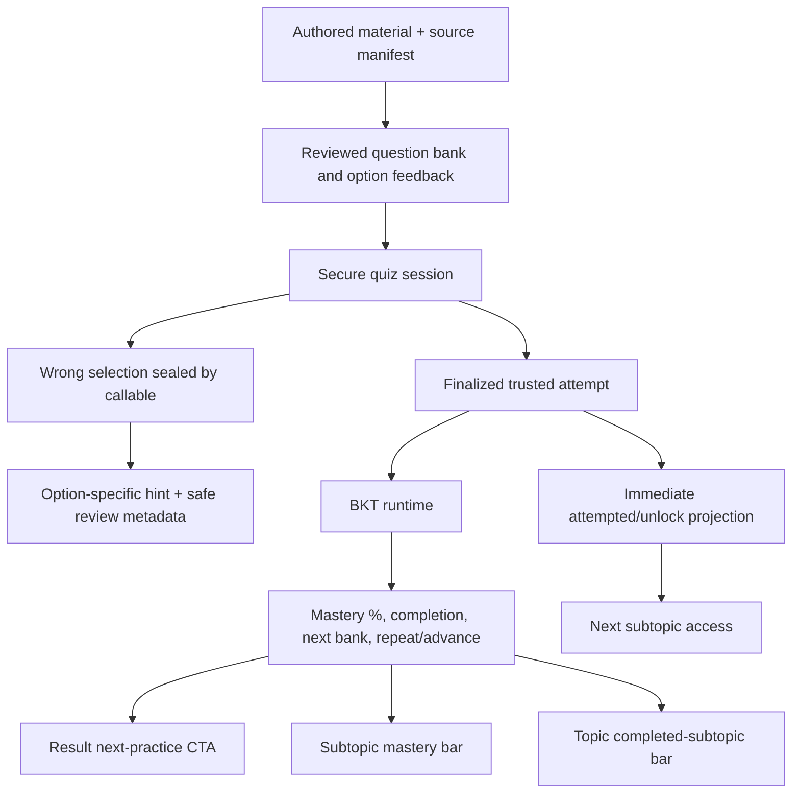

# Supervisor Quiz Learning Loop Refinements - Plan

## Goal Capsule

Refine the trusted quiz loop so a primary student receives simple, material-grounded help after a mistake, can see exactly what needs review, understands current BKT mastery and the next assigned practice level, and follows a clear repeat-or-continue action. Preserve server-authoritative answers, BKT/adaptive assignment ownership, bilingual delivery, and the topic-level completed-subtopic progress indicator.

Authority order is: the seven supervisor items in this plan, the current trusted quiz and CRISP-DM architecture, then the July FYP1 plan. This plan supersedes the July plan only where the two conflict about fixed guidance, score-gated unlocking, result wording, subtopic progress, or quiz-content governance.

Stop implementation if source teaching materials are unavailable for an active question bank or if a proposed hint would reveal the answer. Do not invent replacement questions or hints.

## Recommended Solutions

| Item | Recommended solution | Current finding |
|---|---|---|
| 1. Child-friendly wrong-answer help | Replace one fixed step list per question with authored feedback for each wrong option. Each feedback item is tied to a misconception and contains one plain-language hint plus an optional worked micro-example using different numbers. Keep English and Bahasa Melayu versions, avoid technical vocabulary, and never reveal the correct option. | The backend safely returns authored guidance, but `guidedStepsFor(...)` generates the same long review pattern for every wrong option in a question. |
| 2. Next attempt destination | Let the server project `repeat_subtopic` or `advance` after BKT processing. Repeat the same subtopic with the assigned fresh bank when BKT mastery is below the policy threshold; advance to the next subtopic, or the next topic after the last subtopic, when mastery and minimum evidence pass. Use trusted correct rate only as a documented fallback when BKT ends in fallback/failed state. | Adaptive bank difficulty already changes within the same subtopic, but the Result page uses local score wording and has no actionable destination. |
| 3. Exact review information | Show a review list with question number, safe question prompt, authored `questionType`, and child-friendly `reviewFocus`. Do not show only a count and do not expose the correct answer. | `ResultPage` currently renders only `N to review`. |
| 4. Meaningful difficulty differences | Define bank authoring rubrics: Easy is direct one-concept recognition, Moderate requires a linked step or misconception check, and Hard requires transfer, comparison, or multi-step reasoning. Validate cognitive demand, estimated-difficulty bands, distractor quality, and non-duplication before activation. Do not show difficulty badges on subtopic cards or during a quiz. | Three labeled banks exist for `read_write_numbers`, but labels and estimated values alone do not prove a clear cognitive distinction. Other subtopics currently have only Easy banks. |
| 5. Zero-percent unlocking | Treat the current lock as an implemented rule, not an external error: both finalization and AI projection use `bestCorrectRate > 0.5` for completion. Replace this hard gate with a soft progression rule: any valid finalized attempt unlocks access to the next subtopic, while `completed` remains a mastery outcome and the recommended CTA still repeats the weak subtopic. | A 0% attempt intentionally leaves `completed == false`, so `isSubtopicUnlocked()` keeps the next subtopic locked. |
| 6. BKT progress and next level | On each subtopic card, replace correct-rate progress with the latest safe BKT `masteryProbability`, displayed as a percentage and progress bar. Show an honest pending/fallback state and the next assigned difficulty only in a post-attempt/next-practice panel. Keep the topic bar as completed-subtopic coverage. | `subtopic.progress` is derived from `bestCorrectRate`; BKT exists in safe projections but is not joined into the subtopic page. |
| 7. Material-grounded questions | Introduce a source manifest and review state for every bank/question. Question text, distractors, type, review focus, and hints must be authored from the uploaded material's exercise or “try yourself” section where available, with standard/page traceability and human approval before `isActive: true`. Generative AI must not create or rewrite active quiz content. | Seed content records only broad KSSR references and lacks a review workflow or page-level material trace. |

## Product Contract

### Summary

The implementation extends the existing callable quiz, BKT runtime, adaptive assignment, and Flutter learning flow. It adds authored option-specific feedback and review metadata, separates access from mastery, and makes the server's mastery and next-practice recommendation visible and actionable.

### Problem Frame

The trusted backend already prevents answer-key leakage and calculates sequential BKT, but the learner experience still collapses mistakes into fixed steps, review into a count, mastery into correct rate, and next action into local score text. The same score threshold also controls both mastery and access, which makes a zero-percent attempt appear broken and blocks exploration even when the adaptive system recommends more practice.

Question-bank labels are present without an enforceable authoring rubric. Material provenance is too broad to demonstrate that active questions came from supplied learning materials rather than generated content.

### Requirements

- **R1 — Option-specific help:** For every wrong selection, return an authored bilingual hint tied to that distractor's misconception, using short primary-school language and no correct-answer reveal.
- **R2 — Worked example boundary:** A hint may include one simpler equation or example only when it uses different values from the live question and is traced to the source concept.
- **R3 — No generative quiz content:** Active questions, distractors, question types, review focuses, and hints must come from uploaded learning materials and pass human review.
- **R4 — Review details:** A finalized result must list each missed question by sequence/prompt and show its authored question type and review focus without exposing an answer key.
- **R5 — Adaptive next action:** The safe server projection must recommend repeat or advance from BKT mastery and evidence; trusted correct rate is used only when the BKT result is unavailable. A repeat uses the latest assignment for the attempted subtopic, while an advance targets the next subtopic's Easy cold start.
- **R6 — Actionable navigation:** Repeat starts a fresh server-assigned bank for the same subtopic. Advance opens the next subtopic, or returns to Formula Forge focused on the next topic after the final subtopic.
- **R7 — Soft unlock:** One finalized trusted attempt unlocks the next sequential subtopic even when the score is 0%; it does not mark the attempted subtopic complete.
- **R8 — Separate completion:** Subtopic completion is monotonic within a content/policy version and uses the independently versioned BKT completion criterion, initially mastery at least `0.72` with at least five validated observations. Topic progress remains the fraction of completed subtopics.
- **R9 — Subtopic mastery display:** Each attempted subtopic shows the latest BKT mastery percentage plus child-facing `Still learning` or `Ready to move on` evidence wording, and honest pending/fallback wording instead of best correct rate. Raw observation counts stay hidden from the learner.
- **R10 — Difficulty visibility:** Easy/Moderate/Hard must differ in authored cognitive demand. No difficulty label appears on a subtopic card or inside an active quiz; the next assigned difficulty may appear after completion as part of the next-practice explanation.
- **R11 — Content provenance:** Each active question carries a material ID, standard/unit, page or exercise locator, content version, author/reviewer state, question type, and review focus.
- **R12 — Bilingual parity:** English and Bahasa Melayu prompts, hints, examples, types, and review focuses must be meaning-equivalent and validated together.

### Acceptance Examples

1. A learner selects a distractor caused by placing `6` in the tens column. The backend returns “Look at the tens place” and a different-number example such as `342 = 300 + 40 + 2`; it does not name the correct live option.
2. A learner scores 0% on the first subtopic. The next subtopic becomes accessible, the first subtopic remains incomplete, and the result CTA recommends a fresh Easy practice for the same subtopic because mastery is low.
3. A learner misses questions 2 and 5. The result shows both prompts with types such as “Read a number” and “Place value,” plus their review focuses; no correct choices are shown.
4. BKT reaches the configured completion threshold with enough observations. The subtopic card shows the server mastery percentage, the topic bar increments by one completed subtopic, and the CTA continues to the next curriculum item.
5. BKT processing fails after retries. The UI labels the recommendation as based on quiz progress, uses the trusted correct-rate fallback, and never presents it as a BKT result.
6. A question without a page/exercise locator or approval state fails seed validation and cannot be activated.

### Success Criteria

- All seven supervisor items have an automated contract test and a demonstrable bilingual UI path.
- No callable payload, Firestore client-readable document, or Result page exposes `answerIndex`, `correctOptionIndex`, or a correct-answer sentence.
- The same BKT/adaptive policy configuration governs difficulty movement and mastery-based repeat/advance decisions.
- Zero-percent attempts unlock access without increasing completed-subtopic topic progress.
- Every active question passes material provenance, bilingual parity, difficulty-rubric, and human-review validation.

### Scope Boundaries

- Keep the existing one-answer-per-question flow; this plan does not add same-question retry, chat tutoring, generative hints, or hint telemetry.
- Do not display difficulty on each subtopic card, question header, or active quiz title.
- Do not use XGBoost alone to decide curriculum progression. It may continue to contribute support risk to bank selection.
- Do not replace the topic-level progress bar with an average BKT percentage.
- Do not activate new or rewritten question content before the source materials and reviewer decision are recorded.
- Question authoring for all Year 4–6 topics is rollout work. This plan's finite content slice is Year 4 Whole Numbers: Easy/Moderate/Hard banks for `read_write_numbers`, plus the currently playable Easy banks for `place_digit_value`, `compare_order_numbers`, `odd_even_numbers`, and `number_patterns`. Every other subtopic or additional bank remains follow-up rollout work.

## Planning Contract

### Key Technical Decisions

- **KTD1 — Access and mastery are separate state.** Add `attempted`/`accessUnlocked` to the safe subtopic projection. Keep `completed` for mastery. This removes the 0% dead end without falsely reporting learning completion.
- **KTD2 — BKT is the primary next-action authority.** The runtime writes `recommendedLearningAction` using `subtopic-completion-v1`, initially `masteryProbability >= 0.72` with at least five validated observations. This completion criterion is versioned separately from adaptive difficulty thresholds. The callable's correct-rate recommendation is explicitly provisional/fallback.
- **KTD3 — Feedback is selected-option authored content.** Store a feedback map beside the server-only answer key, keyed by wrong option index. The callable returns only the chosen safe entry after sealing the response.
- **KTD4 — Review payload is bounded and answer-free.** Finalization returns missed-question review items containing prompt, sequence, type, and focus. It never returns correct option data or the full answer-key record.
- **KTD5 — Difficulty is a content contract.** A bank validator checks structural differences and review approval; the UI does not infer difficulty from wording or show labels during play.
- **KTD6 — Flutter consumes safe projections.** Extend `TrustedSubtopicProgress`/`AiDiagnosis` and repository reads rather than calculating BKT or policy thresholds in `AppState`.
- **KTD7 — Post-result routing returns an intent.** `ResultPage` returns a typed repeat/advance/back action. Repeat waits for and consumes the latest same-subtopic assignment. Advance opens the next ordered subtopic through its Easy cold start; after the final subtopic it replaces the current route with the next topic's Subtopic page, or returns to Formula Forge when no next topic exists.

### High-Level Technical Design

### Data Contract Changes

- Server-only `questionAnswerKeys/{questionId}` gains `feedbackByOption`, where each wrong option has `misconceptionCode`, `hint`, `hintBm`, optional `example`, optional `exampleBm`, `reviewFocus`, and `reviewFocusBm`.
- A server-only content approval manifest stores the material filename/checksum, source-section class (`exercise`, `try_yourself`, or justified alternative), source locator, exact bilingual content digest, content version, author identity, reviewer identity, and approval timestamp. Any content change invalidates approval.
- Client-readable `questions/{questionId}` contains only the approved active projection plus `questionType` and `questionTypeBm`. Inactive drafts and detailed source/approval records remain server-only.
- `quizAttempts/{attemptId}` keeps answer-free `reviewItems` or deterministic references sufficient to rebuild them server-side.
- `subtopicMastery/{id}` gains `attempted`, `accessUnlocked`, monotonic `completed`, `completionCriterionVersion`, `masteryProbability`, `observationCount`, `evidenceLevel`, `recommendedLearningAction`, target topic/subtopic IDs, `recommendationBasis`, and the existing source sequence lineage.
- `adaptiveAssignments/{id}` remains the source of next `bankId` and `difficultyLevel`; the difficulty is shown only in post-attempt next-practice UI.

### Assumptions

- The supervisor accepts soft unlocking after one trusted attempt, with repetition recommended rather than forced.
- Uploaded source materials will provide stable page, exercise, or section locators. If they do not, the content reviewer must define an equivalent stable locator before activation.

### Sequencing

Implement U15 before code or content migration, then U16 and U17 in parallel only after the content/data contracts are frozen. U18 depends on U17. U19 depends on U16–U18. U20 closes the rollout and documentation gates.

## Implementation Units

### U15. Freeze Material, Hint, Review, and Difficulty Contracts

- **Goal:** Define the authoring contract that makes content source-grounded, child-friendly, bilingual, and meaningfully tiered.
- **Requirements:** R1–R3, R10–R12.
- **Files:** `firebase_seed/package.json`, `firebase_seed/year4_read_write_question_banks.js`, `firebase_seed/year4_whole_numbers_additional_banks.js`, `firebase_seed/seed_firestore.js`, `firebase_seed/validate_question_banks.js`, `firebase_seed/tests/question_answer_keys_rules.test.js`, new `firebase_seed/content_source_manifest.js`, new `firebase_seed/tests/question_bank_pedagogy.test.js`, `firestore.rules`.
- **Approach:** Record material filename/checksum, stable locator, source-section class, and exact bilingual content digest in a server-only approval manifest. Prefer `exercise` or `try_yourself`; another section requires reviewer justification. Define authored `questionType`, `reviewFocus`, per-distractor misconception/hint data, and explicit reviewed difficulty metadata: `cognitiveDemand`, `reasoningStepCount`, `transferRequired`, and misconception coverage. Automated validation checks declared metadata/bank alignment, duplication, provenance, approval digest, and bilingual parity; a human reviewer owns semantic quality and distractor judgment. Publish only approved active projections to the client-readable collection, keep drafts server-only, and add an executable `test` script for these checks. Migrate only the named finite content slice from supplied material.
- **Test scenarios:**
  1. An approved bilingual question with a valid source locator and feedback for every wrong option passes.
  2. Missing option feedback, reviewer state, source locator, or BM parity fails.
  3. A hint containing the correct live option or a worked example reusing the live values fails.
  4. Direct-recall Easy, linked-step Moderate, and transfer/multi-step Hard fixtures pass their declared metadata bands; relabeling without matching reviewed metadata fails.
  5. A question duplicated across active difficulty banks fails.
  6. Changing any approved prompt, option, hint, example, type, focus, or translation changes the digest and blocks activation.
  7. Authenticated clients cannot read inactive drafts or detailed source/approval records.
- **Verification:** `npm --prefix firebase_seed test` and `node firebase_seed/validate_question_banks.js` pass.
- **Dependencies:** None.

### U16. Return Option-Specific Hints and Exact Review Items

- **Goal:** Extend the trusted callable flow with answer-free, selected-option feedback and bounded review details.
- **Requirements:** R1, R2, R4, R12.
- **Files:** `functions/quiz_session.py`, `functions/main.py`, `functions/tests/test_quiz_session.py`, `functions/tests/test_attempt_validation.py`, `functions/tests/test_quiz_trigger.py`, `lib/shared/models/question_response.dart`, `lib/shared/models/quiz_completion.dart`, new `lib/shared/models/quiz_review_item.dart`, `test/quiz_session_service_test.dart`.
- **Approach:** Replace `guidedSteps` selection with lookup of the submitted wrong option in validated server-only `feedbackByOption`. Persist the safe misconception/review focus on the sealed response. Build final `reviewItems` in sequence order from wrong responses and client-safe question metadata. Keep idempotency behavior unchanged and validate payload bounds on Python and Dart sides.
- **Test scenarios:**
  1. Two different wrong options for the same question return different authored hints.
  2. A correct response returns only positive confirmation and no hint/review focus.
  3. A repeated idempotent submission returns the identical feedback; a conflicting retry remains rejected.
  4. Completion returns only missed questions, in quiz order, with prompt/type/focus in both languages.
  5. Payload inspection proves no answer index, correct option, generic explanation, or server-only material path is returned.
  6. Malformed or incomplete feedback fails closed before the response is written.
- **Verification:** `python -m pytest functions/tests/test_quiz_session.py functions/tests/test_attempt_validation.py functions/tests/test_quiz_trigger.py` and `flutter test test/quiz_session_service_test.dart` pass.
- **Dependencies:** U15.

### U17. Separate Attempt Access, BKT Completion, and Next Action

- **Goal:** Remove the 50% hard-lock rule while keeping mastery and next practice server-authoritative.
- **Requirements:** R5, R7, R8.
- **Files:** `functions/main.py`, `functions/ai_runtime.py`, `ai_pipeline/configs/adaptive_policy_v1.yaml`, `ai_pipeline/logic_oasis_ai/adaptive_policy.py`, `tools/build_function_bundle.py`, `ai_pipeline/tests/test_source_parity.py`, `tools/tests/test_function_bundle_parity.py`, `functions/tests/test_quiz_trigger.py`, `functions/tests/test_ai_runtime.py`, `functions/tests/test_start_quiz_session_adaptive.py`, `firestore.rules`.
- **Approach:** In the finalization transaction set `attempted: true` and `accessUnlocked: true` for every valid completed session, including 0%, while preserving an existing `completed: true`. During AI projection, `subtopic-completion-v1` may promote completion from false to true; only an explicit content/policy migration can reset it. Write `repeat_subtopic` for low/insufficient mastery and `advance` with target identifiers when the criterion passes. Repeat session start rejects a stale assignment sequence with a retryable analysis-pending response. Advance deliberately advertises and uses the target subtopic's Easy cold start. On terminal fallback/failed processing, write a clearly marked correct-rate fallback without claiming BKT. Preserve source-sequence last-write-wins and deterministic retries.
- **Test scenarios:**
  1. A 0% finalized attempt writes attempted/access true, completed false, and a provisional repeat recommendation.
  2. BKT below threshold keeps completed false and recommends repeat with the assigned same-subtopic bank.
  3. BKT at/above threshold with sufficient evidence sets completed true and recommends advance.
  4. High mastery without minimum evidence recommends repeat/build evidence rather than advance.
  5. Runtime fallback uses trusted correct rate, labels `recommendationBasis: correct_rate_fallback`, and remains deterministic.
  6. An older AI event cannot overwrite a newer access, mastery, assignment, or recommendation projection.
  7. Firestore rules allow only the owner to read safe fields and deny client writes.
  8. Reattempting a completed subtopic cannot temporarily or permanently reduce topic completion progress.
  9. Starting the same subtopic while its latest assignment is pending returns a retryable pending response; entering an unattempted next subtopic uses Easy cold start.
- **Verification:** Source adaptive-policy tests pass, `tools/build_function_bundle.py` regenerates the Functions vendor bundle, source/bundle parity tests pass, `python -m pytest functions/tests/test_quiz_trigger.py functions/tests/test_ai_runtime.py functions/tests/test_start_quiz_session_adaptive.py` passes, and Firebase rules tests pass.
- **Dependencies:** U15.

### U18. Present Real-Time BKT Mastery and Preserve Topic Completion Progress

- **Goal:** Make the subtopic page show safe BKT mastery while retaining topic coverage progress.
- **Requirements:** R8–R10.
- **Files:** `lib/shared/models/trusted_subtopic_progress.dart`, `lib/shared/models/subtopic.dart`, `lib/shared/repositories/learning_repository.dart`, `lib/shared/state/app_state.dart`, `lib/features/formula_forge/subtopic_page.dart`, `lib/shared/services/adaptive_assignment_service.dart`, `test/app_state_test.dart`, `test/learning_repository_test.dart`, new `test/subtopic_mastery_display_test.dart`.
- **Approach:** Add independent `completed`, `accessUnlocked`, and nullable `masteryProbability` fields to `Subtopic`; `isComplete` delegates only to server-derived `completed`. Parse evidence and recommendation separately from local progress. A subtopic card shows `Mastery 43%` and `Still learning` below the criterion, `Ready to move on` once complete, `Preparing mastery…` while pending, and honest quiz-progress fallback wording when applicable; raw observation counts remain hidden. Remove the difficulty badge from subtopic/quiz surfaces. Keep `_topicProgressFromSubtopics()` as completed count divided by total and change unlock checks to previous `accessUnlocked`, not previous `isComplete`.
- **Test scenarios:**
  1. A 0% attempted first subtopic leaves the topic bar at 0 completed but unlocks the second card.
  2. A BKT probability of 0.43 renders 43% and does not reuse `bestCorrectRate`.
  3. Pending analysis renders no invented percentage.
  4. Fallback is labeled as quiz-progress guidance rather than BKT mastery.
  5. Completing one of four subtopics renders topic progress at 25% regardless of their mastery percentages.
  6. No Easy/Moderate/Hard text appears on a subtopic card or active quiz header.
  7. Mastery semantics, dynamic status changes, text scaling, focus order, touch targets, and long BM copy remain accessible and overflow-safe.
- **Verification:** `flutter test test/app_state_test.dart test/learning_repository_test.dart test/subtopic_mastery_display_test.dart` passes.
- **Dependencies:** U17.

### U19. Build the Review List and Adaptive Next-Practice Navigation

- **Goal:** Replace count-only review and local score advice with specific review information and one actionable server-backed next step.
- **Requirements:** R4–R6, R10, R12.
- **Files:** `lib/features/quiz/quiz_page.dart`, `lib/features/quiz/result_page.dart`, `lib/features/formula_forge/subtopic_page.dart`, `lib/shared/models/ai_diagnosis.dart`, `lib/shared/models/adaptive_assignment.dart`, new `lib/shared/models/next_learning_action.dart`, `lib/l10n/app_en.arb`, `lib/l10n/app_ms.arb`, `test/quiz_feedback_guidance_test.dart`, `test/quiz_result_navigation_test.dart`, `test/ai_result_page_status_test.dart`, new `test/quiz_review_list_test.dart`.
- **Approach:** Immediately after a wrong answer, replace the fixed guided-steps surface with the selected-option hint and optional different-number example in the active language, then show a clear Continue action; correct answers retain positive confirmation. Render review cards from `QuizCompletion.reviewItems`, or a short localized success message when the list is empty. While analysis is queued/processing, disable the primary next-practice CTA, announce state changes accessibly, and keep Back to Forge available. Read errors/offline states provide localized status and Retry; no indefinite disabled state is allowed. When ready, show the target difficulty in this panel only: the server assignment level for repeat, or Easy for advance. Return a typed action from the result route. `SubtopicPage` resolves repeat to the current subtopic and advance to the next ordered subtopic/topic, then starts through the existing callable service so the client cannot choose a bank.
- **Test scenarios:**
  1. A two-error result renders two question/type/focus cards and no count-only summary.
  2. English and BM review cards use their matching fields.
  3. Processing status disables next practice but leaves Back to Forge usable.
  4. Repeat starts the same subtopic and consumes the server assignment; it cannot pass a client bank ID.
  5. Advance starts the next subtopic; advancing from the last subtopic returns focus to the next topic.
  6. Next assigned Moderate/Hard appears only in the result next-practice panel and not inside the quiz.
  7. Fallback recommendation is visibly labeled and navigates according to the trusted fallback action.
  8. A perfect score hides the review list and shows the localized success state.
  9. Wrong-answer hints, review cards, pending-to-ready announcements, disabled explanations, text scaling, focus order, touch targets, and long BM copy pass accessibility/responsive widget coverage.
  10. Advancing from the last subtopic opens the next topic's Subtopic page; when no next topic exists, it returns to Formula Forge with a completion message.
- **Verification:** `flutter test test/quiz_feedback_guidance_test.dart test/quiz_result_navigation_test.dart test/ai_result_page_status_test.dart test/quiz_review_list_test.dart` passes.
- **Dependencies:** U16, U17, U18.

### U20. Seed, Emulator, Documentation, and Supervisor Evidence

- **Goal:** Prove the complete bilingual learning loop with source-approved content and document the revised rule.
- **Requirements:** R1–R12.
- **Files:** `docs/architecture/logic-oasis-firestore-database-schema.md`, `docs/architecture/logic-oasis-ai-pipeline-crisp-dm.md`, `docs/logic_oasis_feature_implementation_explanation.md`, `firebase_seed/README.md`, new `docs/evidence/2026-08-11-supervisor-quiz-refinements-verification.md`.
- **Approach:** Update schema and CRISP-DM boundaries, seed only the enumerated approved material-grounded slice, and run an emulator journey covering wrong-option hints, exact/empty review states, 0% soft unlock, monotonic completion, BKT repeat, Easy cold-start advance, next difficulty, accessibility states, and topic progress. Record screenshots/IDs and distinguish automated evidence from manual child-language/content review.
- **Test scenarios:**
  1. Emulator seed validation rejects an unreviewed question and accepts the approved set.
  2. A 0% end-to-end attempt unlocks access, preserves incomplete status, and offers repeat.
  3. A mastery-passing attempt advances and displays its next assigned level only after the quiz.
  4. Security inspection confirms answer keys and raw AI/model data remain unreadable to Flutter.
  5. A human reviewer signs off that sampled English/BM hints use simple language, match the supplied material, and do not reveal answers.
- **Verification:** All unit gates pass, `flutter analyze --no-pub` reports no new issues, the Firebase emulator suite passes, and the evidence document contains the seven-item traceability table.
- **Dependencies:** U15–U19.

## Verification Contract

| Gate | Command/evidence | Proves |
|---|---|---|
| Seed/content contracts | `npm --prefix firebase_seed test`; `node firebase_seed/validate_question_banks.js` | Material provenance, reviewed activation, difficulty rubric, bilingual option feedback, no answer leakage. |
| Callable/runtime contracts | `python -m pytest functions/tests/test_quiz_session.py functions/tests/test_attempt_validation.py functions/tests/test_quiz_trigger.py functions/tests/test_ai_runtime.py functions/tests/test_start_quiz_session_adaptive.py` | Secure feedback, review payload, soft unlock, BKT completion/action, fallback, idempotency. |
| Flutter focused contracts | `flutter test test/quiz_session_service_test.dart test/quiz_feedback_guidance_test.dart test/quiz_review_list_test.dart test/quiz_result_navigation_test.dart test/subtopic_mastery_display_test.dart test/ai_result_page_status_test.dart test/app_state_test.dart test/learning_repository_test.dart` | Review UX, mastery UI, no difficulty labels during play, repeat/advance navigation, topic-progress preservation. |
| Static quality | `flutter analyze --no-pub` | No new Dart analysis errors or warnings introduced by this work. |
| Integration/security | Firebase emulator suite plus rules tests | End-to-end callable/Firestore behavior and client read/write boundaries. |
| Content quality | Signed checklist in `docs/evidence/2026-08-11-supervisor-quiz-refinements-verification.md` | Questions and hints follow uploaded material and primary-level bilingual wording. |

## Definition of Done

- Each supervisor item maps to a shipped behavior, an automated test, and evidence in the verification document.
- Wrong selections receive option-specific, simple, bilingual, source-approved help with no correct-answer leak.
- Results identify every missed question and authored question type/review focus.
- Easy, Moderate, and Hard banks pass the cognitive-demand rubric, while difficulty labels remain absent from subtopic cards and active quizzes.
- A 0% trusted attempt unlocks the next subtopic but does not mark the prior subtopic complete or increment topic completion progress.
- Subtopic cards show the latest safe BKT mastery percentage or an honest pending/fallback state.
- The primary result CTA repeats or advances from the server recommendation and displays the next assigned difficulty only after the quiz.
- Topic progress still represents completed subtopics, not average score or average BKT.
- No active question lacks a stable source locator and human review state; no generative content is introduced.
- Firestore and callable boundaries continue to hide answer keys, raw BKT evidence, model features, and internal errors.
- All Verification Contract gates pass, documentation reflects the new semantics, and abandoned experimental code or obsolete count/score-only UI paths are removed.
