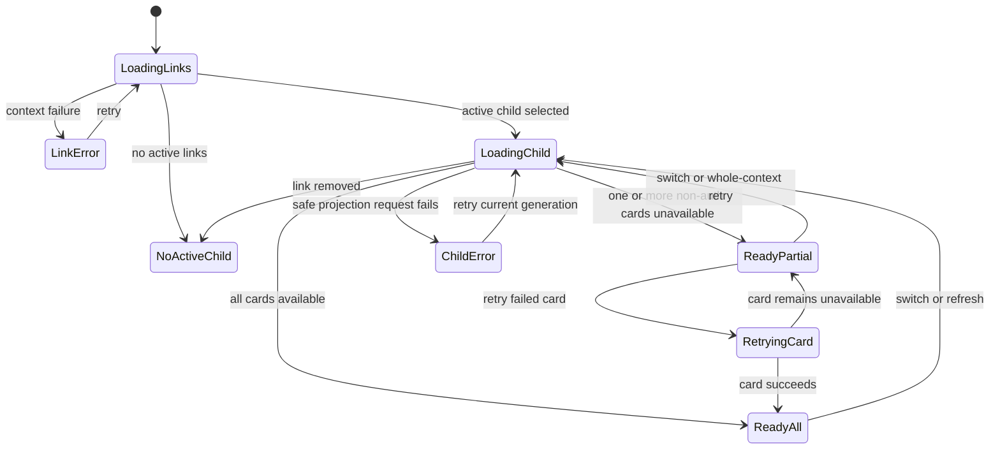
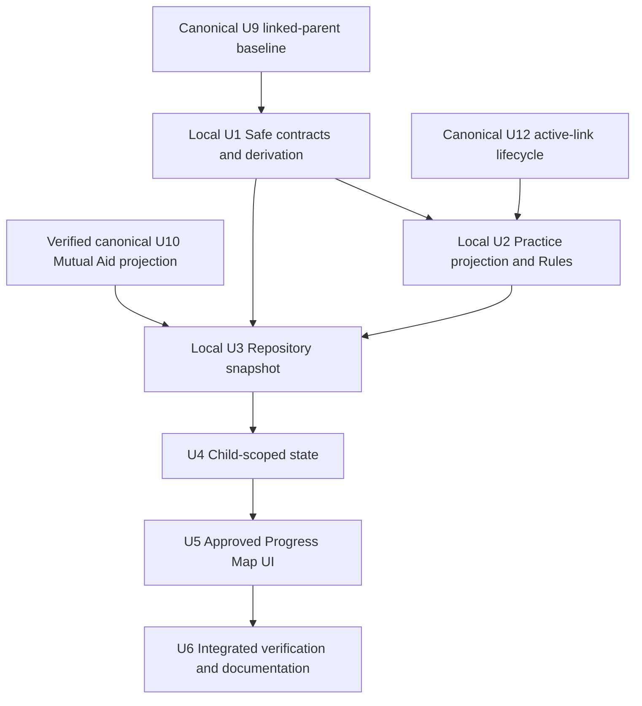

# U14 Parent Evidence Progress Map Implementation Plan

## Goal Capsule

Implement only canonical unit U14: replace the parent dashboard's technical analysis feed with an evidence-led Progress Map that a parent can understand in one scan. The finished screen presents a weekly glance, a primary Understanding focus, a distinct Practice Effort rhythm, count-only Mutual Aid moments, positive progress, and one simple conversation starter without exposing raw attempts, forum content, or AI/model internals.

This document is an independent execution artifact for U14. The canonical FYP1 plan remains the product and sequencing authority; if the two documents conflict, canonical S7/U14 wins. U9 and U10 are treated as verified baselines. U12 must provide an active linked-parent session for integrated verification.

**Target outcome:** A linked parent can answer five questions: What is my child's current learning focus? What current strengths or supported improvement can I recognise? How consistently are they practising? Are they asking or helping peers this week? What is one supportive thing I can say or do next?

**Estimate:** 3-4 working days, assuming the existing U9/U10 baselines remain green and U12 test accounts are available.

**Planning boundary:** This plan defines decisions, contracts, implementation units, and verification. It does not implement code or run tests.

---

## Product Contract

### Summary

The current dashboard shows protected data but explains it using implementation-oriented terms and several visually similar cards. Parents need a plain-language weekly view that combines difficulties and positive progress while keeping the existing privacy boundary. The approved design establishes six regions: header, weekly glance, Understanding, Practice Effort, Mutual Aid, and a final conversation starter.

### Actors

- A1. Linked parent: views one actively linked child's safe progress and receives one supportive action.
- A2. Student: generates trusted learning and count-only participation evidence but never has private answers or forum content exposed to the parent.
- A3. Trusted backend: owns quiz finalization, weekly aggregate writes, projection timestamps, and access authority.
- A4. U10 forum runtime: owns idempotent Malaysia-week Mutual Aid counters.

### Requirements

**Information and meaning**

- R1. The page identifies the selected child and states that information comes from protected learning activity.
- R2. A deterministic “This week at a glance” summary describes only facts supported by available cards; it must not claim growth, consistency, or peer connection when the required evidence is absent.
- R3. Understanding names one current topic and subtopic focus only when an eligible safe mastery record exists.
- R4. Understanding may show at most one eligible positive comparator from the same topic, so the parent sees both a focus and progress. The rows are labelled “Learning snapshot,” not “Skill snapshot,” because the current source is subtopic-level.
- R5. Practice Effort shows Monday-Sunday completion activity from a server-owned current-week summary. One practice activity means one trusted finalized quiz attempt, not one answered question.
- R6. Mutual Aid shows current-week questions, replies, accepted replies, and helpful marks only as non-negative whole-number counts in a fixed field set. It never shows text, peer identities, moderation, or classifier output.
- R7. The page presents one primary parent action. The bottom conversation starter is the spoken form of that same action, not a second recommendation.
- R8. Positive notes remain visible independently when supported by evidence. Mastery positives describe current state, not “improved this week,” because `subtopicMastery` is not a time series; week-over-week language is reserved for a valid Practice prior-week comparison.

**Evidence integrity**

- R9. An Understanding focus requires a valid selected-child/year/curriculum record, `evidenceLevel: established`, `observationCount > 0`, a mastery probability, and `updatedAt` no more than 14 days old.
- R10. Focus selection is deterministic: lowest mastery probability, then newest `updatedAt`, then stable `subtopicId`. The positive comparator is the strongest other eligible subtopic in the same topic; omit it when none exists.
- R11. Missing, stale, malformed, denied, and initialized-zero data are distinct states. Missing evidence must never be converted to zero or a weakness claim.
- R12. Weekly calculations use Asia/Kuala_Lumpur Monday 00:00 boundaries and trusted event timestamps.

**Privacy, usability, and safety**

- R13. Parents read only their selected linked child's declared projections. Client writes to summaries and parent reads of raw attempts, responses, answer keys, AI jobs/runs, SHAP, forum content, peers, and moderation remain denied.
- R14. Parent copy excludes server, AI, model, SHAP, evidence-level, controlled-demonstration, private-reason, and confidence/personality judgments.
- R15. Loading, no active child, partial availability, read failure, retry, insufficient evidence, current zero, and ready states are explicit and accessible.
- R16. English and Bahasa Melayu layouts remain usable at 320 logical pixels and 200% text scale; colour is never the only status cue.
- R17. Practice summaries retain only current-week counts and one previous-week total. Link revocation removes parent authorization immediately but preserves the student-owned rolling summary; controlled test-account cleanup deletes it. A future production student-account deletion workflow must include this collection before production-readiness is claimed.

### Key Flows

- F1. Load parent context: enter through the isolated parent session, load active linked children, select one child, clear prior content, and fetch safe projections.
- F2. Derive progress: validate projection identity and freshness, derive independent card states, select one focus/action, and build deterministic glance copy.
- F3. Review the map: read the glance, Understanding, Practice Effort, Mutual Aid, and the matching conversation starter in that semantic order.
- F4. Recover safely: retry the current child's failed load without showing stale content; ignore any late result from an older request generation.
- F5. Switch child: clear child A before requesting child B; no value, action, semantics label, or error from A may appear under B.

### Acceptance Examples

- AE1. Given eligible mastery, three current-week practices, and current Mutual Aid activity, when the parent opens the page, then all six regions use the approved hierarchy and the glance truthfully mentions both routine and one focus.
- AE2. Given only preliminary or stale mastery, when Understanding renders, then it says more recent learning evidence is needed and does not rank a weakest area.
- AE3. Given an initialized current-week practice summary with all seven counts at zero, when Practice renders, then it shows a neutral zero state; a missing or old-week document instead shows unavailable.
- AE4. Given a current Mutual Aid summary with one question, two replies, one accepted reply, and one helpful mark, when the timeline renders, then it shows factual counts without forum text or peer information.
- AE5. Given practice improved over the optional prior-week total, when the comparison sentence renders, then it states the exact supported difference; without a prior total, the comparison is omitted.
- AE6. Given child A is loading and the parent chooses child B, when A completes late, then B remains selected and no A content appears.
- AE7. Given one non-auth projection fails, when other cards have valid data, then valid cards remain visible and the failed card is unavailable with a current-child retry. An auth/revocation failure clears the entire child view.
- AE8. Given a screen reader or large text, when the page is explored, then headings, day counts, timeline counts, status text, and the conversation starter are announced in logical order without clipping.

### Scope Boundaries

**In scope**

- Safe parent-facing models and deterministic view-model derivation.
- Trusted weekly Practice Effort aggregation and parent read rules.
- Repository/snapshot migration away from parent-facing `AiDiagnosis` details.
- Explicit child-scoped view states, race protection, retry, three differentiated cards, glance, and conversation starter.
- English/Bahasa Melayu localization, accessibility, Rules tests, widget tests, emulator evidence, and documentation reconciliation.

**Deferred for FYP2**

- Longitudinal trend charts requiring more history.
- Conversational coaching or AI Guard for parents.
- Personalised generative advice beyond deterministic approved templates.

**Outside this feature**

- Parent chat, forum-content previews, peer comparison/ranking, personality/confidence scoring, client-side attempt aggregation, raw model explanations, and a new scheduled analytics system.
- Quiz guided-step implementation (canonical U13), adaptive-bank comparison, Oasis stages, and onboarding work.

---

## Planning Contract

### Source-of-Truth Order

1. Canonical S7/U14 and FYP1 boundaries in `docs/plans/2026-07-05-001-feat-fyp1-prototype-development-plan(2)(1).md`.
2. This standalone U14 execution plan.
3. Enforced code, Firestore Rules, and tests.
4. `docs/architecture/logic-oasis-firestore-database-schema.md`, after U14 reconciles its older parent-access text.
5. Descriptive feature documentation and evidence records.

### Key Technical Decisions

| ID | Decision | Rationale |
|---|---|---|
| KTD1 | Keep the linked-parent projection-only boundary. | Firestore Rules cannot redact fields from a readable document; safe information must live in bounded projections. |
| KTD2 | Derive all page wording from typed safe models and fixed templates. | Parents receive understandable guidance without a new model, prompt, unsupported inference, or variable wording. |
| KTD3 | Treat card availability independently after the parent/session context is authorized. | A missing practice summary should not hide valid Understanding or Mutual Aid evidence. |
| KTD4 | Treat auth, link revocation, or selected-child mismatch as whole-page failures. | Partial display is unsafe when the parent-child authority itself is invalid. |
| KTD5 | Use subtopic rows for the approved Understanding snapshot. | Current safe data is subtopic-level; calling these rows skills would overstate the data contract. |
| KTD6 | Use qualitative parent labels for mastery probabilities and expose an exact mastery value only in semantics when useful; keep Practice and Mutual Aid totals visibly numeric. | The mastery diagram avoids fake precision while factual activity counts remain clear. |
| KTD7 | Write Practice Effort inside trusted quiz finalization. | The existing idempotent finalization boundary is the only reliable source of completed practice activity. |
| KTD8 | Reuse U10's event-time Malaysia-week Mutual Aid projection. | U10 already provides idempotent, count-only current-week data; U14 is a reader, not a second aggregator. |
| KTD9 | Generate the conversation starter from the selected action ID. | The page gives one coherent suggestion rather than multiple competing recommendations. |
| KTD10 | Use a monotonically increasing request generation in addition to child ID. | It protects both cross-child switches and same-child retry/refresh races. |
| KTD11 | Do not backfill zero activity for existing links. | An already-active link with no summary remains unavailable until the next trusted finalization; manufacturing a historical zero would confuse absence with observed inactivity. |
| KTD12 | Use bounded rolling retention for Practice summaries. | The document holds only the current week and one previous total; revocation changes access, while controlled account cleanup deletes the student-owned projection. |

### Approved Screen Anatomy

| Region | Required information | Rendering rule |
|---|---|---|
| Header | Parent View, selected child's display name, protected-activity caption, latest timestamp actually used | Do not imply “updated today” unless a used projection timestamp is today in Malaysia time. |
| Weekly glance | One deterministic headline and one supporting sentence | Compose from available card states; partial evidence produces conservative copy. |
| Understanding | Topic, focus subtopic, optional positive comparator, qualitative status, evidence sentence, parent next step | Full-width primary card with warm focus treatment; omit unsupported comparator. |
| Practice Effort | Weekly total, active days, Mon-Sun markers/counts, optional previous-week comparison | Green rhythm card; never reuse a mastery bar. |
| Mutual Aid | Questions, replies, accepted replies, helpful marks | Blue count-only timeline; render nonzero moments and a neutral zero/unavailable state. |
| Conversation starter | One localized question tied to the selected action ID | Same recommendation as the Understanding/action system, phrased for conversation. |

### Safe Information Contract

| Information | Source | Required fields | Invalid/unavailable conditions | Parent output |
|---|---|---|---|---|
| Understanding candidates | `subtopicMastery` | child/year/topic/subtopic IDs, mastery probability, observation count, evidence level, `updatedAt` | Wrong identity/year, unknown curriculum ID, preliminary/unavailable evidence, zero observations, missing probability/time, older than 14 days | Named focus and optional positive comparator, or insufficient evidence |
| Practice rhythm | `parentPracticeSummaries/{studentId}` | schema version, child ID, timezone, `weekStart`, seven non-negative whole-number daily counts, total, active days, optional prior total, timestamps | Missing, wrong child/timezone/week, malformed shape, or inconsistent derived values | Weekly rhythm, zero, or unavailable |
| Mutual Aid | `forumParticipationSummaries/{studentId}` | child ID, current `weekStart`, four bounded counts, timestamps | Missing, wrong child/current week, malformed/negative counts | Count-only timeline, zero, or unavailable |
| Topic/subtopic labels | Current curriculum models passed to the repository | Matching stable IDs and localized names | Unknown or ambiguous IDs | Omit candidate rather than show a technical ID |
| Parent authority | U12 linked-child context and Rules | Active exact parent-child link | Missing, revoked, wrong parent/child | Whole-page no-link/unavailable state |

### Practice Summary Data Dictionary

`parentPracticeSummaries/{studentId}` is server-written and parent-readable only through the active exact link.

| Field | Contract |
|---|---|
| `schemaVersion` | Fixed U14 version used for strict parsing. |
| `studentId` | Exact document owner and linked-child authority key. |
| `timezone` | Fixed `Asia/Kuala_Lumpur`. |
| `weekStart` | Server timestamp for Monday 00:00 in Malaysia. |
| `dailyCompletionCounts` | Seven non-negative whole-number integers ordered Monday-Sunday. “Bounded” means the fixed seven-field shape, not an arbitrary maximum activity count. |
| `completedPracticeCount` | Sum of the seven daily counts. |
| `activeDayCount` | Number of days whose count is greater than zero. |
| `previousWeekCompletedPracticeCount` | Optional prior completed total carried only when the stored week is exactly seven days before the new Malaysia week; otherwise null. |
| `lastPracticeAt` | Optional trusted finalization timestamp of latest current-week practice. |
| `updatedAt` | Server update timestamp. |

The schema carries no attempt, session, question, response, score, answer, bank, model, or forum identifiers.

### Parent View State Model

On entry to `LoadingChild`, clear the previous snapshot, card view models, action, glance, update time, and semantics. Commit a result only when both selected child and request generation match. A permission-denied/revocation response clears the whole child view; a non-auth card failure may produce `ReadyPartial`. A card-level retry preserves already valid current-child cards, marks only that card as retrying, and commits only when its child and request generation still match.

### Deterministic Derivation Rules

1. Parse and filter eligible Understanding records using R9.
2. Select the focus using R10.
3. Select at most one strongest eligible comparator from the same topic; omit rather than substitute another topic.
4. Map mastery probability to one approved qualitative band shared by visual, copy, and semantics. Thresholds live in one tested parent view-model policy, not widgets.
5. Validate Practice and Mutual Aid against the exact current Malaysia week and non-negative whole-number field contracts.
6. Derive positive notes only from current/prior totals or factual nonzero contribution counts.
7. Select one action using the decision-policy table below; do not invent a separate “low activity” threshold.
8. Generate the conversation starter from the same action ID and localized curriculum label.
9. Generate the weekly glance from the available focus, positive practice, and positive Mutual Aid flags. Never infer improvement without a valid comparison.

### Parent Decision Policy

| Input boundary | Parent label/meaning | Action behavior |
|---|---|---|
| Eligible mastery `< 0.40` | Needs guided practice | Use the Understanding focus action. |
| Eligible mastery `>= 0.40` and `< 0.70` | Growing | Use the Understanding focus action with encouraging wording. |
| Eligible mastery `>= 0.70` | Current strength | If it is still the selected lowest eligible subtopic, use a maintain/build action and never call it weak. |
| No eligible Understanding; current Practice total `== 0` | No practice completed this week | Use the Practice routine action. |
| No eligible Understanding; current Practice total `> 0` | Practice recorded | Do not classify it as low; continue to Mutual Aid action evaluation. |
| No eligible Understanding action; current sum of all four Mutual Aid counters `== 0` | No community moment yet this week | Use the neutral Mutual Aid invitation. |
| No eligible Understanding action; Mutual Aid sum `> 0` | Current contribution recorded | Use “more activity is needed before a recommendation” unless another action above applies. |
| Required evidence unavailable | Unknown, not zero | Never select an action from that unavailable source. |

The 0.40/0.70 mastery bands follow the existing BKT display convention. Completion remains governed by its separate canonical threshold and is not redefined by U14.

### Dependency and Delivery Shape

### Required Inputs Before Execution

- An emulator or controlled environment with one parent, at least one active linked child, and a revoked/cross-child negative fixture.
- Current topic/subtopic labels for the selected Year 4-6 curriculum fixture in English and Bahasa Melayu.
- Fixed Malaysia-week test timestamps immediately before and after Monday 00:00.
- Safe Understanding fixtures covering eligible focus, positive comparator, preliminary, stale, malformed, and insufficient evidence.
- Practice fixtures covering current zero, nonzero/multiple completions per day, prior-week comparison, duplicate finalization, and rollover.
- U10 Mutual Aid fixtures covering current zero/nonzero, stale week, malformed counts, and delayed event time.
- Approved parent copy for status bands, neutral unavailable/zero states, action templates, and conversation starters in both languages. Copy can be refined during U5 without changing the decisions in this plan.

No launch-blocking product or architecture question remains.

---

## Implementation Units

U1-U6 below are local to this standalone plan. Every dependency on the larger FYP1 plan is explicitly prefixed `canonical` to avoid confusing, for example, this plan's U3 with canonical U3.

### U1. Safe Parent Models and Derivation Policy

**Goal:** Establish strict parent-safe inputs and deterministic outputs before modifying the screen.

**Requirements:** R2-R12, R14.

**Dependencies:** Canonical U9 safe projection baseline and current curriculum models.

**Files:** `lib/shared/models/trusted_subtopic_progress.dart`, `lib/shared/models/parent_practice_summary.dart` (new), `lib/shared/models/forum_participation_summary.dart`, `lib/shared/models/parent_dashboard_snapshot.dart`, `lib/features/parent_dashboard/parent_dashboard_view_models.dart` (new), `test/trusted_subtopic_progress_test.dart`, `test/forum_participation_summary_test.dart`, `test/parent_dashboard_view_models_test.dart` (new), `test/parent_dashboard_time_test.dart`.

**Approach:** Extend strict mastery parsing with `observationCount` and `updatedAt`. Make malformed weekly counts invalid/unavailable instead of silently turning them into zero. Introduce typed card availability and immutable view models for glance, Understanding, Practice, Mutual Aid, action, and conversation starter. Keep thresholds, tie-breakers, week validation, qualitative bands, grammar/plural rules, and forbidden-copy policy outside widgets.

**Execution note:** Implement new derivation behavior test-first because it is the trust boundary between safe records and parent advice.

**Patterns to follow:** Defensive `FormatException` parsing in `lib/shared/models/trusted_subtopic_progress.dart`; count-only boundary in `lib/shared/models/forum_participation_summary.dart`.

**Test scenarios:**

1. An eligible established/current record becomes a focus candidate; preliminary, unavailable, zero-observation, missing-probability, missing-time, and stale records do not.
2. Wrong child/year and unknown curriculum IDs are rejected before label mapping.
3. Lowest mastery wins; exact ties use newest timestamp then stable subtopic ID.
4. The strongest same-topic eligible comparator is selected once; no cross-topic or duplicate comparator appears.
5. Current practice zero is distinct from missing, stale, malformed, negative, wrong-length, inconsistent-total, or wrong-timezone data.
6. Mutual Aid malformed/negative values become unavailable, not false zero.
7. Monday boundary, daylight-independent Malaysia time, and 14-day freshness edges are deterministic.
8. Action, conversation starter, and glance resolve from the same state flags without unsupported improvement language.

**Verification:** Pure tests cover every information state without Firestore or widget dependencies.

### U2. Trusted Practice Projection and Parent Authorization

**Goal:** Create the only new server-side data source required by U14 and expose it through the existing active-link boundary.

**Requirements:** R5, R11-R13, R17.

**Dependencies:** U1 schema; canonical U3 secure quiz finalization; canonical U12 active-link lifecycle.

**Files:** `functions/main.py`, `functions/quiz_session.py`, `functions/parent_progress.py` (new), `functions/parent_link_invitation.py`, `functions/parent_link_admin.py`, `firestore.rules`, `functions/tests/test_quiz_session.py`, `functions/tests/test_parent_progress.py` (new), `functions/tests/test_parent_link_invitation.py`, `functions/tests/test_parent_link_admin.py`, `functions/tests/test_parent_link_rules.py`.

**Approach:** Put Malaysia-week/day calculation and summary validation in a small parent-progress helper rather than coupling quiz code to the forum runtime. Capture one trusted UTC finalization instant before entering the Firestore transaction and reuse it for every transaction retry, so a retry across Malaysia Monday midnight cannot move the same completion into another week. In the trusted quiz-finalization transaction, create or roll the current Malaysia-week summary and increment the finalized attempt's weekday once. Carry the previous weekly total only when the stored `weekStart` is exactly seven days before the new week; after a longer gap, leave the comparison null. During normal invitation acceptance and protected admin link creation, create a current-week zero summary only when no valid current-week summary already exists. Preserve an existing current-week nonzero summary, and fail closed for a malformed existing document rather than erasing it. Do not backfill existing active links: missing remains unavailable until the next trusted finalization. Add an exact-document linked-parent read rule and deny all client writes. Keep duplicate finalization idempotent through the existing attempt/finalization boundary rather than introducing a second claim system.

**Patterns to follow:** Transactional attempt creation in `functions/main.py`; `ownsOrActiveLinkedParent` in `firestore.rules`; U10 event-time week helpers where reuse does not couple forum and quiz domains.

**Test scenarios:**

1. One trusted finalized attempt increments the correct Malaysia weekday, weekly total, active days, and timestamps.
2. Two attempts on one day increment the day's count but keep one active day.
3. Duplicate/replayed finalization does not increment again.
4. Monday rollover starts seven zero counts, carries the immediately preceding week's total only, and applies the new event once; a multi-week gap leaves the prior comparison null.
5. A transaction retry that begins before and completes after Malaysia Monday midnight uses the single captured event instant and counts the completion once in one week.
6. Normal and admin link activation initialize a current-week zero summary without raw identifiers only when no valid current-week summary exists; they preserve an existing current-week nonzero summary and fail closed on malformed stored data. An existing pre-U14 link with no summary remains unavailable until trusted practice occurs.
7. Active linked parent exact-child read succeeds; unrelated, cross-child, revoked, and unauthenticated reads fail.
8. Student/parent direct writes and all reads of raw attempts/responses remain denied.
9. Collection/list queries cannot enumerate another child's summary, revocation takes effect immediately, and controlled test-account cleanup removes the summary document.

**Verification:** Functions and Emulator Rules tests prove idempotent aggregation and the exact safe-read matrix.

### U3. Safe Repository and Snapshot Assembly

**Goal:** Replace the parent snapshot's technical diagnosis shape with independently available safe card inputs.

**Requirements:** R1-R14.

**Dependencies:** U1, U2, verified canonical U10 current-week projection.

**Files:** `lib/shared/repositories/learning_repository.dart`, `lib/shared/models/parent_dashboard_snapshot.dart`, `lib/shared/models/parent_practice_summary.dart`, `lib/shared/models/forum_participation_summary.dart`, `lib/shared/state/app_state.dart`, `test/learning_repository_test.dart`, `test/app_state_test.dart`.

**Approach:** Fetch only safe mastery records, the exact practice document, and the exact Mutual Aid document using the isolated parent Firebase app; U14 does not need `studentAiStatuses` or `adaptiveAssignments` for its approved cards. Retain strict parsed mastery records and curriculum labels; remove parent-dashboard dependence on attempts, mastery record counts, and `AiDiagnosis` details. Resolve each non-auth projection independently so one unavailable card does not discard valid cards. Treat permission denied, revoked context, or selected-child identity mismatch as a whole-snapshot failure. Retire or clearly isolate the legacy `AppState.loadParentDashboardFromFirebase` path so raw/local attempt fallback cannot become parent evidence.

**Patterns to follow:** Server-source reads and malformed-projection rejection already used in `LearningRepository`; isolated parent session established by U9/U12.

**Test scenarios:**

1. The selected child's valid mastery, practice, and forum records assemble into a snapshot containing no raw maps or prohibited fields.
2. Malformed mastery entries are omitted and do not become advice.
3. Missing practice or forum documents produce independent unavailable cards while valid Understanding remains.
4. A permission/revocation failure clears the whole snapshot and is classified for parent-safe retry messaging.
5. No query reads `studentAiStatuses`, `adaptiveAssignments`, `quizAttempts`, `questionResponses`, `aiJobs`, `aiModelRuns`, forum content, or another child for U14.
6. The legacy AppState loader cannot populate the parent Progress Map with local attempts, seeded diagnosis data, or technical explanations.

**Verification:** Repository tests prove the allowlisted read set and partial-card behavior.

### U4. Child-Scoped Dashboard State and Race Safety

**Goal:** Make every loading, switching, failure, and retry transition safe and predictable.

**Requirements:** R1, R11, R13, R15.

**Dependencies:** U3.

**Files:** `lib/features/parent_dashboard/parent_dashboard_page.dart`, `lib/features/parent_dashboard/parent_dashboard_state.dart` (new if extraction improves clarity), `test/parent_dashboard_linked_child_test.dart`, `test/parent_dashboard_state_test.dart` (new).

**Approach:** Preserve dependency injection and linked-child selection, but use explicit view states and a monotonically increasing request generation. Clear all child-derived values before an initial load, child switch, authority refresh, or whole-context retry. A card-level retry preserves the other valid current-child cards and marks only the failed card as loading. If a linked-child refresh removes the selected child, choose the first remaining active child explicitly or enter no-active-child; never retain removed-child content.

**Execution note:** Add characterization coverage for existing child-switch behavior before replacing the current page state.

**Patterns to follow:** Existing injected linked-child gateway and stale child-ID guard in `lib/features/parent_dashboard/parent_dashboard_page.dart`.

**Test scenarios:**

1. Initial links loading, no active child, link error, child loading, ready-all, ready-partial, child error, and retry are visually distinct.
2. A-to-B selection clears A immediately; late A success and failure cannot overwrite B.
3. Two same-child refreshes completing out of order respect the newest request generation.
4. Retry targets the currently selected child and does not restore an older snapshot.
5. Revocation or child removal clears content, action, glance, update timestamp, and semantics.

**Verification:** Widget/state tests prove no stale-child flash or unsupported state conflation.

### U5. Approved Progress Map UI, Localization, and Accessibility

**Goal:** Implement the approved visual hierarchy and parent language from the typed view state.

**Requirements:** R1-R8, R14-R16; F3-F4.

**Dependencies:** U4.

**Files:** `lib/features/parent_dashboard/parent_dashboard_page.dart`, `lib/features/parent_dashboard/parent_dashboard_view_models.dart`, `lib/l10n/app_en.arb`, `lib/l10n/app_ms.arb`, generated localization output, `test/parent_dashboard_linked_child_test.dart`, `test/parent_dashboard_accessibility_test.dart` (new), `test/parent_dashboard_golden_test.dart` (new if the repository's golden-test environment is stable).

**Approach:** Replace `_AiDiagnosisDetails`, generic safe-analysis cards, and technical copy rather than stacking a second dashboard below them. Build the approved header, glance, full-width Understanding card, green weekly Practice rhythm, blue Mutual Aid timeline, and final conversation starter. Render timeline rows only for factual nonzero events; include accepted-answer information in the reply row to preserve the approved three-row anatomy. Use localized plural forms and locale-aware dates. Mark headings semantically, announce exact daily/timeline counts, exclude decorative icons, support keyboard/focus order, and use icon plus text for status.

**Test scenarios:**

1. Full evidence renders focus, positive comparator, weekly rhythm, Mutual Aid moments, one action, and its matching conversation starter.
2. Insufficient Understanding, Practice zero, Mutual Aid zero, and per-card unavailable each use distinct neutral copy and visuals.
3. Prior-week comparison appears only with a valid prior total and states the supported direction accurately.
4. English and Bahasa Melayu handle zero/one/many counts and curriculum labels.
5. At 320-pixel width and 200% text scale, content stacks without clipping, overflow, or horizontal scrolling.
6. Screen-reader order is title, glance, Understanding, Practice, Mutual Aid, conversation starter; daily and timeline counts are understandable without colour.
7. Existing widget expectations for controlled-demonstration/model wording are replaced with parent-language and forbidden-copy assertions.
8. A forbidden-copy scan finds no model/server/AI/SHAP/evidence-level/controlled-demo/private-reason or personality-deficit wording.

**Verification:** A parent can identify focus, current strengths or supported Practice improvement, weekly effort, contribution, and one supportive action in one scan in both languages.

### U6. Integrated Verification, Documentation, and Evidence

**Goal:** Close U14 with reproducible privacy, data, UX, and supervisor evidence.

**Requirements:** R1-R16; AE1-AE8.

**Dependencies:** U2-U5.

**Files:** `functions/tests/test_parent_link_rules.py`, `functions/tests/test_quiz_session.py`, `tools/run_parent_dashboard_emulator_flow.js` (new), `test/learning_repository_test.dart`, `test/parent_dashboard_view_models_test.dart`, `test/parent_dashboard_state_test.dart`, `test/parent_dashboard_linked_child_test.dart`, `test/parent_dashboard_time_test.dart`, `test/parent_dashboard_accessibility_test.dart`, `docs/architecture/logic-oasis-firestore-database-schema.md`, `docs/logic_oasis_feature_implementation_explanation.md`, `docs/evidence/2026-08-xx-u14-parent-progress-map-verification.md` (new; replace `xx` with execution date).

**Approach:** Run focused model, Functions, Rules, repository, widget, localization, and accessibility gates, then use an authenticated Emulator flow to demonstrate exact linked-child reads and every denied path; the existing static Rules contract test alone is insufficient. Reconcile stale documentation: remove prototype parent-password/raw-attempt descriptions, document `parentPracticeSummaries`, and make the canonical FYP1 plan's authority explicit. Capture screenshots for full, partial, zero, and insufficient-evidence states without relying on the temporary clipboard image as a durable artifact.

**Test scenarios:**

1. Active link to full three-card data produces the approved screen and correct action.
2. Practice and Mutual Aid zero/nonzero/unavailable combinations preserve truthful glance copy.
3. Read failure/retry, child switch, same-child refresh race, revoked link, and no-active-child behave safely.
4. Authorization matrix proves exact-child direct reads, denies unauthorized collection/list enumeration and all raw/cross-child/client writes, and records controlled fixture cleanup.
5. Existing U9 linked-parent and U10 forum aggregation regressions remain green.
6. Evidence record identifies environment, sanitized fixtures, commands/results, screenshots, accessibility checks, limitations, and FYP1 exclusions.

**Verification:** The U14 evidence record demonstrates the complete parent flow and every declared privacy/availability boundary.

---

## System-Wide Impact

- **Backend:** Quiz finalization gains one bounded, idempotent weekly projection write; parent-link activation gains zero-summary initialization.
- **Database/Rules:** One new server-owned collection and linked-parent read rule; no raw access is widened.
- **Flutter models:** Parent snapshot moves from technical diagnoses/counts to strict safe projection models and derived card view models.
- **UI:** The current dashboard is replaced in place; navigation and isolated parent session remain unchanged.
- **U10 integration:** U14 consumes the already verified current Mutual Aid summary and does not modify forum text or classifier flows.
- **Documentation/evidence:** Schema, feature explanation, and a dedicated U14 verification record are updated together.

---

## Risks and Mitigations

| Risk | Mitigation |
|---|---|
| A missing summary is displayed as zero | Strict typed parsing and explicit availability states; malformed counts fail closed. |
| Parent advice overstates weak evidence | Established/current eligibility, deterministic selection, and insufficient-evidence fallback. |
| Approved “Skill snapshot” implies unavailable skill-level data | Use focus/comparator subtopics and label the region “Learning snapshot.” |
| Practice aggregate double-counts retries | Write inside existing trusted/idempotent finalization transaction and test replay. |
| Partial fetch hides all useful information | Independent card results after authority is established; auth failures still clear the whole page. |
| Child-switch or refresh race leaks stale content | Clear on load and require both child ID and monotonic generation match. |
| Positive copy implies an unsupported trend | Only a valid Practice prior-week comparison may use trend language; Understanding comparators use factual current-strength language. |
| Localization or text scaling breaks the tall layout | ARB pluralization plus 320-pixel/200% text and semantics tests. |
| Documentation reintroduces legacy parent-password/raw-data claims | Reconcile schema and feature explanation in U6 and cite canonical authority. |
| Rolling child activity outlives its intended account | Store only current plus one prior total; revoke parent reads immediately; delete the projection during controlled account cleanup and bind any future production account-deletion flow to this collection. |

---

## Verification Contract

| Gate | Coverage | Completion signal |
|---|---|---|
| Safe model/view-model tests | Parsing, eligibility, tie-breakers, qualitative bands, action/glance/conversation mapping, zero vs unavailable | All deterministic cases and boundaries pass. |
| Functions tests | Practice increment, multiple same-day attempts, idempotency, Malaysia rollover, link zero initialization | Aggregate fields match the data dictionary under retries and rollover. |
| Firestore Emulator Rules | Exact linked child, revoked/cross-child/unrelated parent, server-only writes, raw data denials | Authorization matrix has no unexpected allow. |
| Repository tests | Allowlisted queries, strict parsing, partial cards, whole-page auth failure, no raw fallback | Snapshot contains only typed safe inputs. |
| State/widget tests | Loading/no-child/ready/partial/error/retry, A-to-B, same-child race, revocation | No stale content or incorrect state conflation. |
| Localization/accessibility | EN/MS plurals, 320-pixel width, 200% text, semantics/focus order, non-colour cues | No overflow and semantic labels communicate all facts. |
| Integrated emulator demo | Full, zero, unavailable, insufficient, retry, and child-switch flows | Sanitized screenshots and results recorded in the U14 evidence file. |
| Documentation regression | Schema, feature explanation, evidence record, canonical authority | Documents match implemented fields, ownership, and FYP1 boundaries. |

---

## Definition of Done

- U1-U6 are implemented in dependency order and every unit's test scenarios pass.
- The current technical parent dashboard is replaced rather than duplicated.
- Understanding names a valid focus or renders insufficient evidence; it never invents a weakest topic.
- The Learning snapshot uses subtopic evidence honestly and omits unsupported comparator rows.
- Practice Effort is sourced only from the server-owned current Malaysia-week summary and distinguishes zero from unavailable.
- Mutual Aid is sourced only from U10 count-only current-week data and exposes no private forum information.
- Weekly glance, positive notes, primary action, and conversation starter are deterministic and mutually consistent.
- Parent switching, same-child retries, link revocation, partial failure, and no-active-child states expose no stale data.
- Linked-parent Rules allow only the exact child's declared projections and deny all client writes/raw data.
- Practice retention is bounded to current week plus one prior total; revocation blocks parent access immediately and controlled account cleanup removes the projection.
- English and Bahasa Melayu layouts and semantics satisfy the accessibility gates.
- No parent-visible or semantic text exposes technical AI/model/server language or unsupported confidence/personality claims.
- Schema and feature documentation reflect the final implementation, and the dedicated U14 evidence record is complete.
- Canonical U14's 3-4 day scope remains intact; no FYP2 or unrelated UI work has entered the implementation.

---

## Sources and Research

- Canonical source: `docs/plans/2026-07-05-001-feat-fyp1-prototype-development-plan(2)(1).md`, S7/U14 and its detailed sub-plan.
- Database contract: `docs/architecture/logic-oasis-firestore-database-schema.md`.
- U9 baseline evidence: `docs/evidence/2026-07-19-u9-controlled-live-verification.md`.
- U10 baseline evidence: `docs/evidence/u10-forum-emulator-validation.md` and `docs/evidence/u10-forum-fyp1-final-closure.md`.
- Approved visual direction reviewed on 2026-08-14: header and weekly glance; primary Understanding card; green Practice rhythm; blue Mutual Aid timeline; final conversation starter. The temporary clipboard path is intentionally not a plan dependency.
- Local code research: parent page, safe repository, mastery/forum models, Functions finalization/forum aggregation, Firestore Rules, and existing parent/U10 tests.
