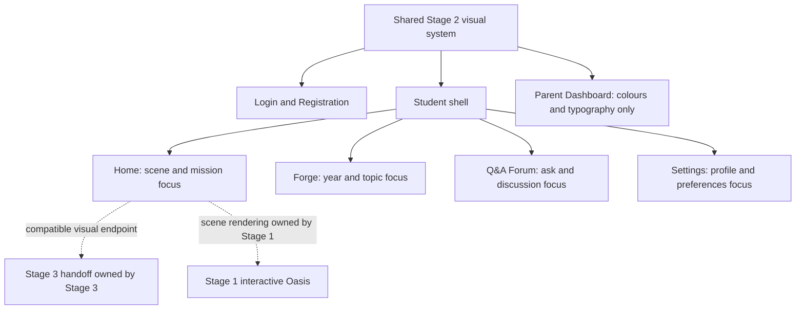
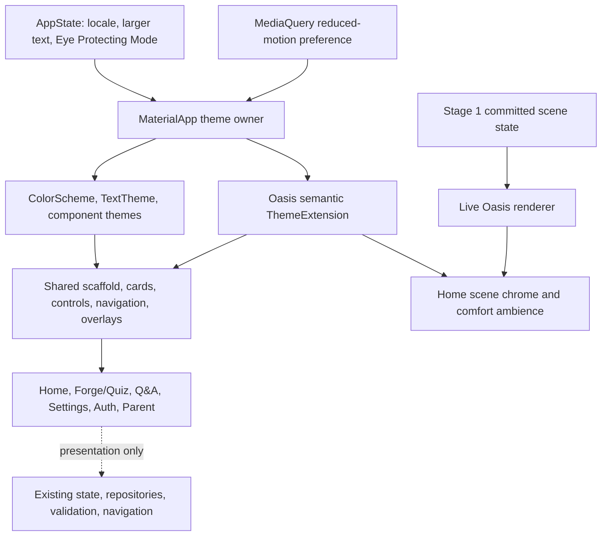

# Visual Theme Refactor - Plan

## Goal Capsule

- **Objective:** Refactor Logic Oasis into a comfortable, playful, and consistent mobile visual system that connects the interactive Oasis experience with the upcoming story introduction without changing completed product behavior.
- **Product authority:** This Product Contract controls UI Improvement Stage 2. The Interactive Oasis UI plan controls Stage 1 gameplay, while the Stage 3 onboarding plan will control cinematic animation and the final transition into Home.
- **Functional authority:** The latest main application is the feature baseline. Visual sketches and older planning worktrees are directional references and must not be treated as exhaustive component inventories.
- **Open blockers:** None before technical planning. Exact design-token values may be finalized during planning as long as they preserve the roles and constraints in this contract.
- **Execution profile:** Code execution against `codex/integrate-forum-cloud-supervisor-plans` commit `a2484ef` or a verified descendant that still exposes the same four-tab and feature contracts.
- **Stop conditions:** Stop and reconcile before visual work if the execution branch lacks Q&A Forum, Forge Year 4/5/6, current authentication and parent flows, or if a proposed change would alter Stage 1 gameplay state or Stage 3 animation behavior.
- **Tail ownership:** The final implementation unit owns cross-page cleanup, full regression verification, accessibility and portrait checks, and removal of abandoned styling experiments.

---

## Product Contract

### Summary

Logic Oasis will replace its yellow-and-cream-dominant presentation with a cool Living Canopy interface while preserving desert-to-oasis progression inside the game scene. All current student features remain, with focused improvements to hierarchy, consistency, typography, and visual comfort across portrait-mobile surfaces.

### Problem Frame

The current interface uses warm cream and yellow across page backgrounds, cards, and primary actions. Repetition of the same warm treatment makes screens visually tiring, weakens page hierarchy, and gives progress numbers more emphasis than the changing Oasis world.

The upcoming Stage 3 introduction already establishes deep forest, mint, water, and ecological-green imagery. The current application chrome does not yet provide a convincing visual continuation into that experience, and the newer Q&A Forum uses a more conventional Material presentation than Home, Forge, and Settings.

The application features are already close to complete. A broad page rewrite would add risk without improving the core learning flows, so Stage 2 must refine presentation while preserving the existing information, controls, states, and navigation behavior.

### Actors

- A1. **Student:** Uses Login, Registration, Home, Forge, quizzes, Q&A Forum, Settings, and profile surfaces in portrait mobile mode.
- A2. **Parent:** Uses the existing Parent Dashboard, which participates in the shared palette and typography but retains its established layout.

### Key Decisions

- **Living Canopy application shell:** Cool botanical neutrals, white surfaces, deep forest text and controls, mint, leaf, and water accents replace the dominant warm cream treatment.
- **Desert remains in the world:** Sand, clay, dry plants, and restrained warmth communicate early Oasis states inside the scene rather than colouring the entire application.
- **Hierarchy refinement, not recomposition:** Existing navigation, content, and feature responsibilities remain. Stage 2 reduces unnecessary card nesting, improves grouping, and creates one clear focal area per primary page.
- **Shared foundation with page accents:** Home uses forest and water, Forge uses emerald and topic-status colours, Q&A Forum uses violet and mint, and Settings uses calm teal and botanical green. Navigation remains forest green across tabs.
- **Child-friendly mixed typography:** Fredoka provides playful short-form emphasis. Nunito carries longer instructional, discussion, safety, and settings text.
- **Restrained rounded surfaces:** Friendly rounded shapes remain, but cards indicate meaningful grouping or action rather than wrapping every piece of content.
- **Low-glare botanical comfort mode:** Eye Protecting Mode changes brightness, saturation, shadow, and ambient effects without applying a heavy yellow cast or altering the perceived restoration state.
- **Existing illustration language:** Rounded low-poly and storybook Oasis artwork remains the foundation, recoloured to express dry-to-restored state changes and the Living Canopy palette.

### Surface Structure



### Requirements

**Scope and behavior preservation**

- R1. Stage 2 must preserve the current four-tab student navigation: Home, Forge, Q&A Forum, and Settings.
- R2. The navigation label and page header must both retain the name `Q&A Forum`.
- R3. Existing student content, actions, state handling, validation, loading states, error states, and navigation paths must remain available unless this contract names a presentation adjustment.
- R4. The latest main application must be inventoried before implementation so components absent from older plans or sketches are not removed.
- R5. Visual sketches must be treated as directional layouts rather than exhaustive product specifications.
- R6. Profile access must remain within Settings rather than becoming a fifth primary tab.

**Shared colour and surface system**

- R7. Default page backgrounds must use a cool botanical neutral that supports long viewing without losing the Oasis identity.
- R8. Primary text and primary actions must use deep forest tones with accessible contrast against their surfaces.
- R9. White or lightly botanical surfaces must replace repeated cream cards for primary content containers.
- R10. Yellow must be reserved for crystals, rewards, achievements, sunlight, and small moments of emphasis rather than page-wide chrome.
- R11. Sand and clay must remain visible in damaged and early-restoration scene artwork without becoming the default interface background.
- R12. Warning and error states must use a coral-red family, while also presenting text and icon or shape cues.
- R13. Borders must use quiet botanical-grey tones and shadows must remain soft enough that content grouping does not resemble stacked floating panels.
- R14. Page accents must follow the agreed roles: forest and water for Home, emerald and topic-status accents for Forge, violet and mint for Q&A Forum, and teal and botanical green for Settings.
- R15. The bottom navigation must retain one shared forest-green selected treatment across all pages rather than adopting the current page accent.

**Typography and visual language**

- R16. Fredoka must be used for page titles, student names, topic and mission titles, resource numbers, progress emphasis, buttons, and short game labels.
- R17. Nunito must be used for quiz questions, Q&A posts and answers, explanations, settings descriptions, safety information, and other long-form text.
- R18. Fredoka must use medium or semi-bold weights for ordinary highlighted text, with heavier emphasis reserved for short high-priority labels and values.
- R19. Long-form Nunito text must provide comfortable line spacing and must not rely on weight alone to establish hierarchy.
- R20. Existing rounded low-poly and storybook illustrations must remain the visual foundation for the Oasis, topic thumbnails, landmarks, and supporting motifs.
- R21. Guardian and sprout motifs may support welcome, safety, or guidance moments but must not repeat often enough to create decorative clutter.
- R22. Icon backgrounds must use restrained page-accent tints and remain visually consistent across equivalent actions.

**Layout hierarchy and component treatment**

- R23. Each primary page must have one dominant focal region: the interactive Oasis on Home, the current learning journey on Forge, asking and finding help on Q&A Forum, and the profile and preferences hierarchy on Settings.
- R24. Major interactive cards may use approximately 18–20 px visual corner radii, while compact controls and status containers use a smaller rounded treatment.
- R25. Informational content must sit directly on the page when an enclosing card would not communicate grouping, interaction, or importance.
- R26. Settings rows must remain grouped in quiet section surfaces with separators rather than appearing as individually elevated cards.
- R27. Temporary overlays, dialogs, sheets, and draggable Stage 1 objects may use stronger elevation than ordinary page content.
- R28. Existing modal sheets, dialogs, and transient states must adopt the shared palette and typography without changing their decisions or outcomes.

**Home**

- R29. Home must retain its greeting, student identity, notification and settings shortcuts, crystal, energy and streak summaries, Oasis hero, restoration progress, and recommended mission.
- R30. The Oasis scene must remain Home's visual focus, with resource summaries and the recommended mission supporting rather than competing with it.
- R31. Scene artwork must communicate dry-to-restored progression through land, water, vegetation, and constructed elements while committed gameplay state remains owned by Stage 1.

**Forge and quiz journey**

- R32. Forge must retain switching between Year 4, Year 5, and Year 6, including the selected-year state and year-specific topic presentation.
- R33. Forge must retain its guidance and persistence banners, topic sequence, prerequisites, locked states, progress, mastery, status labels, subtopic navigation, quiz flow, and results flow.
- R34. Topic cards must keep their Oasis-linked objective, thumbnail, progress, mastery, and status while using the restrained card and typography system.
- R35. Learning-status meanings must remain stable: green for strong progress, amber for continued practice, coral-red for needs help, and neutral for locked.
- R36. Every learning status must retain a readable label and icon or shape cue in addition to colour.

**Q&A Forum**

- R37. Q&A Forum must adopt the same page background, header rhythm, typography, spacing, surface treatment, and bottom-navigation integration as the other primary pages.
- R38. Q&A Forum must retain question filtering, pagination, question creation, blocked-student management, empty, loading and error states, and navigation into discussions.
- R39. Discussions must retain answers, linked-answer forms, accepted-answer and helpful states, AI feedback states, editing, deletion, reporting, and blocking behavior.
- R40. Violet must remain the distinguishing Q&A Forum accent, while mint communicates safety, accepted answers, and constructive participation.
- R41. Longer questions, answers, and feedback must use Nunito and increased line spacing rather than heavy Fredoka.

**Settings, Profile, and Parent Dashboard**

- R42. Settings must retain the profile summary and editing flow, resource statistics, sound, language, larger text, notifications, Eye Protecting Mode, screen time, parent access, privacy and safety, and logout.
- R43. Profile must remain the focal summary at the top of Settings, followed by grouped Learning and Parent & Safety preferences.
- R44. Parent Dashboard must receive the shared colour and typography tokens without changing its established layout or information hierarchy.

**Login and Registration**

- R45. Login and Registration must use a compact botanical Oasis or Guardian illustration as a welcoming focal region without introducing animated storytelling.
- R46. Authentication forms must remain on a quiet botanical-neutral page and must not require a large enclosing card.
- R47. Login must retain email and password entry, password visibility, remembered-profile behavior, account creation, Google and Facebook sign-in, parent guidance, and Parent Dashboard entry where available.
- R48. Registration must retain student name, email and password entry, Year 4, Year 5 and Year 6 selection, remembered-profile behavior, account creation, back navigation, validation, and account-safety information.
- R49. Authentication errors, loading states, provider-setup messages, and success confirmation must adopt the shared system without losing their current meaning.

**Eye Protecting Mode and motion**

- R50. Eye Protecting Mode must use a lower-glare botanical palette rather than the current strong warm-yellow treatment.
- R51. Enabling the mode must visibly soften surface brightness, saturation, shadows, decorative gradients, and nonessential ambient effects while preserving text contrast.
- R52. The mode transition must remain observable through a coordinated crossfade of approximately 300–400 ms under ordinary motion settings.
- R53. Eye Protecting Mode must not change structures, vegetation, water level, restoration percentage, placed objects, or any other gameplay state.
- R54. Stage 2 micro-interactions must remain limited to brief feedback for presses, chips, selected year, selected tab, and expanding controls.
- R55. Stage 2 must not add page-entry cinematics, particles, camera movement, story sequences, or Oasis construction animation.
- R56. Reduced-motion preference must shorten or remove nonessential motion while retaining understandable state feedback and an observable comfort-mode change.

**Responsive and accessible presentation**

- R57. Portrait mobile must be the primary and only dedicated layout target for Stage 2.
- R58. Supported phone sizes must remain usable through responsive spacing and scrolling without horizontal clipping.
- R59. Existing larger-text mode must remain usable across navigation labels, cards, forms, Q&A content, settings, sheets, and dialogs.
- R60. Four-item navigation must keep comfortable touch targets and display the full `Q&A Forum` label without renaming the feature.
- R61. English and Bahasa Melayu content must remain readable without truncating essential instructions, status meaning, or actions.
- R62. Colour must never be the sole indication of selection, progress status, validity, warnings, success, or disabled state.

### Acceptance Examples

- AE1. **Covers R1–R6.** Given the current main application includes four tabs and Forge year switching, when Stage 2 is completed, then those controls and their existing behavior remain even if a directional sketch omitted them.
- AE2. **Covers R7–R15.** Given the default theme is active, when a student moves between Home, Forge, Q&A Forum, and Settings, then the pages share one cool botanical foundation while their restrained accents remain distinguishable.
- AE3. **Covers R16–R19 and R41.** Given a Q&A discussion contains a long question and answer, when it is displayed, then playful emphasis remains in short labels while the reading content uses a lighter, comfortably spaced body style.
- AE4. **Covers R32–R36.** Given a student selects Year 5 in Forge, when the topic list updates, then the selected-year control, topic prerequisites, progress, mastery, locks, and labelled status meanings remain present.
- AE5. **Covers R37–R41.** Given Q&A Forum is selected, when its list or discussion is displayed, then it looks part of the shared Logic Oasis system while retaining its violet identity and all moderation and answer actions.
- AE6. **Covers R50–R56.** Given Eye Protecting Mode is turned on, when the transition completes, then the interface is visibly lower-glare but the Oasis restoration state and all balances are unchanged.
- AE7. **Covers R57–R62.** Given a supported small phone uses larger text or Bahasa Melayu, when a student navigates and completes an action, then essential labels and controls remain reachable and understandable without relying on colour.
- AE8. **Covers R44.** Given a parent opens the Parent Dashboard, when Stage 2 styling is applied, then colours and typography match the new system while the dashboard layout and information remain unchanged.

### Success Criteria

- Students can identify all four primary pages as one application while recognising the subtle accent identity of each page.
- The default interface no longer appears dominated by yellow or cream, and yellow communicates rewards or meaningful highlights.
- Home remains scene-first and the desert-to-oasis transformation remains visually credible.
- Q&A Forum no longer appears as an unrelated Material screen.
- Highlighted text remains playful without appearing uniformly heavy, and long-form content remains comfortable to read.
- Eye Protecting Mode creates an observable lower-glare presentation without changing or obscuring game progress.
- Existing automated and manual feature checks find no removed student capability attributable to the visual refactor.

### Scope Boundaries

- Stage 1 owns interactive Oasis construction, placement, camera behavior, committed scene changes, and construction animation.
- Stage 3 owns story animation, cinematic camera work, the continuous scene-to-Home handoff, and route-transition behavior.
- Stage 2 provides compatible colours, typography, and the final Home visual endpoint but does not implement the Stage 3 handoff.
- A dedicated tablet layout, landscape redesign, or desktop-specific composition is not included.
- Parent Dashboard layout redesign is not included.
- Primary navigation information architecture and feature naming are not being reconsidered.
- New learning, forum, authentication, parent, or gameplay features are not included.

### Dependencies and Assumptions

- Stage 2 depends on the current main application being available to the implementation worktree before feature-preservation checks are finalized.
- Stage 1 and Stage 3 may consume the shared visual tokens, but their behavioral delivery remains independently planned.
- Existing English and Bahasa Melayu localization behavior remains authoritative for supported copy.
- Existing original or licensed illustration assets may be recoloured or recomposed where suitable; replacement artwork must preserve the agreed rounded ecological-village language.

### Sources and Research

- `docs/plans/2026-08-16-001-feat-interactive-oasis-ui-plan.md` defines the adjacent Stage 1 interactive Oasis scope.
- `docs/preview/stage3_onboarding_demo.html` provides the Stage 3 forest, mint, water, and ecological-scene direction; its animation behavior is contextual input, not a Stage 2 requirement.
- `lib/app/logic_oasis_design.dart` and `lib/app/theme.dart` show the current shared palette and typography foundations.
- `lib/app/logic_oasis_shell.dart` defines the current primary navigation surface.
- `lib/features/home/home_page.dart`, `lib/features/formula_forge/formula_forge_page.dart`, `lib/features/collaboration/qa_forum/qa_forum_page.dart`, and `lib/features/settings/settings_page.dart` define the current primary-page responsibilities in the latest main application.
- `lib/features/onboarding/login_page.dart` and `lib/features/onboarding/register_page.dart` define the authentication content and actions that Stage 2 must preserve.

---

## Planning Contract

Product Contract unchanged. The following implementation decisions enrich it without redefining the confirmed product behavior.

### Baseline and Change Posture

- The executable baseline is `codex/integrate-forum-cloud-supervisor-plans` at `a2484ef` or a verified descendant. The planning worktree predates the current four-tab shell, Forge year switching, and Q&A Forum and must not be used as the application-code source.
- Copy or merge this plan into the execution branch before implementation. Do not copy older application files from the planning worktree into the current branch.
- Begin with characterization checks for the current shell, Forge, Q&A Forum, Settings, authentication, quiz, and parent flows. Presentation changes may proceed only after those checks pass or any pre-existing failures are recorded.
- Limit the refactor to reachable presentation code. Do not spend Stage 2 effort restyling the unused `OasisMap` or legacy `Figma*` compositions unless the latest baseline makes one reachable.
- Preserve repositories, persisted state, Firebase behavior, domain models, progress calculations, resource balances, and navigation decisions. Stage 2 may change widget composition only where needed for responsive visual hierarchy.

### Key Technical Decisions

- KTD1. **One app-level theme owner.** Select the default or Eye Protecting `ThemeData` at `MaterialApp` from `AppState.eyeComfortMode`. Remove the nested theme and hardcoded scaffold-background decision from the student shell so authentication, parent, student, dialogs, and sheets share the same transition.
- KTD2. **Material roles plus one Oasis extension.** Keep standard foreground, background, error, outline, and component roles in `ColorScheme`, `TextTheme`, and component themes. Add one immutable `ThemeExtension` for Oasis-specific semantic roles and visual policies; register the same extension type in both variants and implement complete `copyWith` and `lerp` behavior.
- KTD3. **Semantic roles replace literal chrome colours.** Active widgets resolve canvas, surface, grouped surface, border, primary ink, secondary ink, forest action, mint, water, reward, sand, coral, forum violet, status, and shadow roles from the current theme. Scene-local dry land, clay, water, vegetation, and restoration interpolation remain renderer-owned.
- KTD4. **Shared primitives migrate before pages.** Retheme the active scaffold, header, cards, icon controls, stat cards, chips, progress bars, settings rows, buttons, bottom navigation, dialogs, and sheets before applying page-specific refinements. Do not create a second palette or parallel component library.
- KTD5. **Mixed type is role-based.** Use Fredoka Medium/SemiBold for display, title, value, label, and button roles; reserve heavier weight for very short high-priority values. Use Nunito Regular/Medium/SemiBold for body, question, answer, explanation, settings, safety, form-support, and error text.
- KTD6. **Fonts are release assets.** Keep the resolved `google_fonts` 8.1.x API, bundle only the requested Fredoka and Nunito weights under Flutter assets using their upstream filenames, disable runtime font fetching at startup, and register the bundled OFL licences. Do not plan against APIs introduced only in `google_fonts` 8.2.x without first upgrading the Flutter/Dart baseline.
- KTD7. **One coordinated motion policy.** Let `MaterialApp` perform the approximately 350 ms theme interpolation with a restrained curve. Derive component durations from `MediaQuery.disableAnimationsOf(context)`; reduced motion uses an immediate or materially shortened presentation change while retaining textual/state feedback.
- KTD8. **No second app-wide animation wrapper.** Do not wrap the whole application in another `AnimatedTheme`. Bespoke press, selection, expansion, and ambient animations must consume the shared motion policy separately.
- KTD9. **Q&A keeps its functional layout model.** Reuse the shared visual foundation, header rhythm, typography, controls, and navigation treatment without forcing the forum into the single-column shared scaffold. Preserve its paginated list, filtering, FAB, discussion state, repositories, moderation, linked-answer, and AI-feedback seams.
- KTD10. **The Oasis scene is a protected boundary.** Retheme only the live Home scene's surrounding chrome, overlays, text, controls, shadow, and comfort ambience. Do not change repair calls, progress inputs, image/state selection, celebration outcomes, or dry-to-restored meaning.
- KTD11. **Responsive behavior is intrinsic.** Use available width, wrapping, flexible layout, and vertical scrolling rather than fixed text-scaled dimensions. Preserve platform text scaling and combine it with the existing larger-text preference; do not globally clamp or disable scaling.
- KTD12. **Accessibility has an equivalent non-colour cue.** Selected tabs and years, progress statuses, validation, success, warning, disabled, and accepted/helpful states retain text plus icon, shape, border, or semantic state. Interactive semantic bounds meet Android 48 px and iOS 44 px guidance.
- KTD13. **Verification is contract-based, not golden-first.** Extend existing feature tests and add focused theme, transition, responsive, and accessibility widget tests. Use a manual visual matrix for textured scenes, gradients, illustrations, shadows, and perceived glare; do not introduce a new golden-test framework in Stage 2.

### Initial Semantic Token Contract

The implementation may adjust these starting values to satisfy contrast and device review, but it must preserve the role meanings and keep one canonical definition.

| Role | Default starting value | Eye Protecting intent | Primary use |
|---|---:|---|---|
| Canvas | `#F2F7F1` | Slightly darker, lower-luminance botanical neutral | Page and shell backgrounds |
| Surface | `#FFFFFF` | Soft botanical off-white without a yellow cast | Primary cards, forms, sheets |
| Grouped surface | `#EDF5F0` | Lower-contrast cool green-grey | Settings groups, quiet panels |
| Primary ink | `#17352B` | Preserve at least normal-text contrast | Titles, values, active controls |
| Secondary ink | `#587067` | Preserve readable body contrast | Explanations and metadata |
| Forest | `#176B4D` | Slightly muted, still clearly selected | Primary action and navigation |
| Leaf | `#48A979` | Lower saturation | Positive progress and Forge accent |
| Mint | `#DFF4E8` | Reduced brightness | Accepted, safe, selected surfaces |
| Water | `#5BC8CE` | Reduced saturation/ambient intensity | Home and ecological accents |
| Reward | `#F1C84A` | Use sparingly; lower glare | Crystals, achievement, sunlight |
| Sand | `#D7B36A` | Retain inside the world and thumbnails | Damaged Oasis context |
| Coral | `#EB6D62` | Maintain contrast with text/icon cue | Warning, error, needs-help states |
| Forum violet | `#8A58D2` | Muted but distinguishable | Q&A identity and primary forum action |
| Outline | `#DCE8E1` | Quiet but visible against both surfaces | Borders, dividers, focus grouping |

Status colours are semantic aliases, not page-specific literals: strong progress maps to leaf/forest, continued practice to amber/reward with dark text, needs help to coral, and locked to neutral. Every status also carries a label and a non-colour visual cue.

### High-Level Technical Design



Theme interpolation is a presentation projection: both theme variants expose identical semantic roles, and `ThemeData.lerp` plus the extension's `lerp` produces intermediate colours. The saved boolean remains the only preference state; no transient theme value is persisted.

```mermaid
stateDiagram-v2
  [*] --> Default
  Default --> Transitioning: Enable Eye Protecting Mode
  Transitioning --> Comfort: Theme interpolation completes
  Comfort --> Transitioning: Disable Eye Protecting Mode
  Transitioning --> Default: Theme interpolation completes
  Default --> Comfort: Reduced motion requests immediate swap
  Comfort --> Default: Reduced motion requests immediate swap
  note right of Transitioning
    Navigation, form values, resources,
    progress, and scene state do not change.
  end note
```

### Implementation Constraints

- Keep `AppState.updateEyeComfortMode` and its persistence path behaviorally unchanged; root theme selection observes it rather than adding another preference store.
- Preserve the existing `MaterialApp.builder` accessibility scaling behavior and compose it with the platform `TextScaler`; do not replace it with deprecated `textScaleFactor` arithmetic.
- Avoid changing `opening_animation_page.dart` and `plot_intro_page.dart`; they are Stage 3-owned. They may inherit the application theme only where this happens automatically and does not alter their timing or route behavior.
- Do not refactor Firebase repositories, forum models, learning state, authentication providers, or parent-session services merely to support colours or typography.
- Treat `logic_oasis_figma_components.dart` as the current shared-component seam. Splitting the file is permitted only when it directly reduces risk for the touched components; a broad component-library reorganization is deferred.
- Update active hardcoded styles deliberately. Preserve intentional artwork colours and do not perform a mechanical repository-wide colour replacement.
- Keep four navigation destinations, their order, selected index, and labels. The full `Q&A Forum` label must remain visible at supported portrait widths and enlarged text, with a non-colour selected cue.
- Keep the Forge `SegmentedButton<int>` behavior and Year 4/5/6 content source intact while restyling the control and cards.
- Keep Login and Registration controls and validation intact. The botanical focal artwork must be static and either reuse/recompose licensed project assets or add original/licensed assets with provenance.
- Parent Dashboard accepts shared theme and text roles only; do not reorganize its cards, metrics, or hierarchy.
- Keep the lockfile committed. Any deliberate dependency or SDK update requires a separate compatibility decision and rerun of all gates.

### Sequencing and Dependency Rules

1. Establish a passing functional baseline and characterize behavior that sketches omitted.
2. Add semantic theme, type, font assets, and motion foundations without page redesign.
3. Move theme ownership to the application boundary and migrate shared primitives.
4. Migrate active pages by domain, protecting the Stage 1 scene boundary and Q&A state model.
5. Complete responsive, localization, accessibility, and visual-comfort verification across the integrated application.

Do not begin broad page colour replacement before the shared tokens and component defaults exist. Do not remove old constants until a reachability scan confirms no active consumer needs them. Each page unit depends on the foundation and shared-component units, but page units may otherwise be implemented independently.

### Risks and Mitigations

| Risk | Consequence | Mitigation |
|---|---|---|
| Planning worktree used as code baseline | Q&A Forum or Forge years disappear | Execute from the pinned functional branch/descendant and run characterization tests first |
| Literal `const` styles bypass theme roles | Mixed warm/cool UI and incomplete comfort transition | Inventory active literal colours and text styles; migrate active chrome to semantic tokens |
| Missing extension role or incomplete `lerp` | Null access or visible jumps during mode switch | Register one extension type in both variants and unit-test endpoint and midpoint interpolation |
| Global component changes leak into unrelated screens | Dialog, auth, or forum regressions | Migrate shared primitives in small batches and run targeted feature tests after each batch |
| Global Fredoka remains on long content | Heavy, tiring questions and discussions | Assert role-family assignments and migrate long-form call sites to Nunito body styles |
| Font asset/weight mismatch triggers network fetch | First-render swap or offline failure | Bundle every requested filename, disable runtime fetching, and smoke-test release/offline rendering |
| Fixed heights and ellipsis meet enlarged text | Hidden actions or truncated `Q&A Forum` | Add small-width and elevated-scaling widget matrices; prefer flexible/wrapping/scrollable layouts |
| Colour is the only state cue | Inaccessible selection/status meaning | Pair colour with text, icon, border, shape, and semantics; run guideline tests in both modes |
| Automated contrast test misreads artwork | False assurance around scene and gradients | Use automated checks as regression gates plus manual device review of textured surfaces |
| Scene colour sweep crosses into Stage 1 | Restoration meaning or gameplay feedback changes | Restrict Stage 2 to live renderer chrome/ambience and assert progress/resources/scene inputs remain stable |
| Reduced motion only affects theme animation | Other micro-interactions or ambience continue | Centralize motion policy and audit custom controllers/implicit animations separately |

### Planning Sources

- Flutter `ThemeExtension` and theme extension registration: [ThemeExtension](https://api.flutter.dev/flutter/material/ThemeExtension-class.html), [ThemeData.extensions](https://api.flutter.dev/flutter/material/ThemeData/extensions.html), and [ThemeData.lerp](https://api.flutter.dev/flutter/material/ThemeData/lerp.html).
- Flutter app-level theme transition controls: [MaterialApp.themeAnimationStyle](https://api.flutter.dev/flutter/material/MaterialApp/themeAnimationStyle.html) and [MaterialApp.themeAnimationDuration](https://api.flutter.dev/flutter/material/MaterialApp/themeAnimationDuration.html).
- Flutter reduced-motion and nonlinear text-scaling APIs: [MediaQuery.disableAnimationsOf](https://api.flutter.dev/flutter/widgets/MediaQuery/disableAnimationsOf.html), [MediaQuery.textScalerOf](https://api.flutter.dev/flutter/widgets/MediaQuery/textScalerOf.html), and [textScaleFactor deprecation](https://docs.flutter.dev/release/breaking-changes/deprecate-textscalefactor).
- Flutter accessibility verification: [Accessibility testing](https://docs.flutter.dev/ui/accessibility/accessibility-testing), [accessible UI styling](https://docs.flutter.dev/ui/accessibility/ui-design-and-styling), and [`meetsGuideline`](https://api.flutter.dev/flutter/flutter_test/meetsGuideline.html).
- Bundled-font behavior and version-compatible API: [`google_fonts` 8.1.0](https://pub.dev/packages/google_fonts/versions/8.1.0) and the [package source](https://chromium.googlesource.com/external/github.com/flutter/packages/+/HEAD/packages/google_fonts).

---

## Implementation Units

### U1. Pin the Functional Baseline and Characterize Preserved Behavior

- **Goal:** Make the latest four-tab application the unquestioned execution baseline and capture behavior that the visual sketches omit.
- **Requirements:** R1–R6, R32–R33, R37–R39, R42, R47–R49.
- **Dependencies:** None.
- **Files:** `test/logic_oasis_shell_test.dart`, `test/forge_year_switch_test.dart`, `test/qa_forum_flow_test.dart`, `test/onboarding_flow_test.dart`, `test/settings_logout_test.dart`, `test/app_state_test.dart`, `test/parent_dashboard_linked_child_test.dart`, `test/quiz_feedback_guidance_test.dart`, `test/quiz_result_navigation_test.dart`, `test/result_page_test.dart`.
- **Approach:** Verify the execution branch contains Home, Forge, Q&A Forum, and Settings in order; Forge Years 4/5/6; current forum list/discussion/moderation states; settings/profile actions; authentication and parent entry; quiz and results behavior. Add only missing characterization assertions needed to detect feature loss during later presentation work.
- **Test scenarios:** Full `Q&A Forum` label and tab order; Home shortcut navigation; year selection and year-specific topics; forum loading/empty/error/retry/filter/pagination and discussion actions; login/register/provider/parent-entry controls; persisted larger-text and Eye Protecting preferences; logout outcomes; quiz feedback/results navigation.
- **Verification:** Run all listed test files on the functional baseline. Record and resolve any baseline failure before proceeding; do not weaken existing expectations to accommodate the refactor.

### U2. Build the Semantic Theme, Typography, Font, and Motion Foundation

- **Goal:** Create the single source of truth for Living Canopy colours, low-glare comfort values, mixed typography, component styling, and restrained motion.
- **Requirements:** R7–R22, R24, R27–R28, R50–R56, R62.
- **Dependencies:** U1.
- **Files:** `lib/app/theme.dart`, `lib/app/logic_oasis_design.dart`, `lib/main.dart`, `pubspec.yaml`, `pubspec.lock`, `assets/fonts/`, `assets/fonts/OFL-Fredoka.txt`, `assets/fonts/OFL-Nunito.txt`, `test/visual_theme_test.dart`.
- **Approach:** Add one immutable Oasis semantic `ThemeExtension` with default and comfort values, complete `copyWith`/`lerp`, and documented semantic aliases. Rebuild `ThemeData` around a common factory so both variants expose identical Material and Oasis roles. Compose Fredoka into display/title/label roles and Nunito into body roles from the base `TextTheme`; bundle the exact used weights and disable runtime fetching before app startup. Centralize normal and reduced motion durations/curves for consumers.
- **Test scenarios:** Both variants expose every role; endpoint and midpoint interpolation are non-null and expected; component themes use semantic colours; Fredoka/Nunito families and weights match their roles; warning/status roles have non-colour contracts; reduced motion returns zero or shortened nonessential durations; all requested fonts resolve while runtime fetching is disabled.
- **Verification:** Run `flutter pub get`, `flutter analyze`, and `flutter test test/visual_theme_test.dart`. Perform one offline debug/profile launch to catch missing font assets before page migration.

### U3. Move Theme Ownership to the App and Migrate Shared Primitives

- **Goal:** Apply both theme variants consistently across all entry stages and make active shared components consume semantic roles.
- **Requirements:** R1–R2, R7–R15, R22–R28, R50–R56, R59–R60, R62.
- **Dependencies:** U2.
- **Files:** `lib/app/logic_oasis_app.dart`, `lib/app/logic_oasis_shell.dart`, `lib/shared/widgets/logic_oasis_figma_components.dart`, `lib/shared/widgets/mastery_chip.dart`, `lib/shared/widgets/metric_card.dart`, `lib/shared/widgets/recommendation_box.dart`, `lib/shared/widgets/section_card.dart`, `test/logic_oasis_shell_test.dart`, `test/visual_theme_test.dart`.
- **Approach:** Select the theme at `MaterialApp`, configure the agreed transition and reduced-motion behavior, and remove shell-local theme/background ownership. Convert active shared scaffold, header, surface, button, chip, progress, navigation, and overlay defaults from literal colours to theme lookups. Preserve constructor behavior where callers provide intentional page or status accents. Make four navigation items intrinsically responsive while retaining full labels, semantics, hit targets, order, and selected state.
- **Test scenarios:** Theme reaches Login, Registration, Parent, and student shell; toggling comfort mode changes presentation at start/mid/end without changing selected tab, navigation stack, resource values, progress, or form state; all four navigation labels remain visible at supported widths/scales; selected navigation uses forest plus a non-colour cue; reduced motion avoids a long transition.
- **Verification:** Run `flutter analyze`, `flutter test test/logic_oasis_shell_test.dart test/visual_theme_test.dart`, and the persisted-preference case in `test/app_state_test.dart`.

### U4. Restyle Home While Protecting the Interactive Oasis Boundary

- **Goal:** Make Home scene-first under the Living Canopy system without changing restoration or repair behavior.
- **Requirements:** R20–R23, R29–R31, R50–R56, R58–R59, R62.
- **Dependencies:** U3.
- **Files:** `lib/features/home/home_page.dart`, `lib/shared/widgets/logic_oasis_figma_components.dart`, `lib/shared/widgets/restoration_celebration.dart`, `test/logic_oasis_shell_test.dart`, `test/repair_icon_asset_contract_test.dart`, `test/visual_theme_test.dart`.
- **Approach:** Retheme the greeting, identity, shortcuts, stat summaries, hero chrome, restoration label, marker controls, mission card, and transient confirmation/celebration surfaces. Reduce competing elevation and weight so the live Oasis remains dominant. Pass comfort/motion presentation only to the scene boundary when needed; leave area IDs, progress, overlays, image selection, repair callbacks, costs, and resource state untouched.
- **Test scenarios:** Required Home information remains; hero dominates at supported portrait sizes; marker and repair confirmation still reach the same callbacks; scene progress and balances are identical before/after comfort toggle; reduced motion suppresses or shortens nonessential ambience without hiding state feedback; sand/clay remain in damaged artwork while app chrome is botanical.
- **Verification:** Run the Home/shell, repair-asset, AppState repair, and visual-theme tests. Manually compare damaged, repairing, and restored states in both themes at normal and reduced motion.

### U5. Restyle Forge, Subtopics, Quiz, and Results as One Learning Journey

- **Goal:** Apply the restrained shared system and mixed typography throughout the learning journey while retaining years, prerequisites, progress, secure quiz behavior, and results.
- **Requirements:** R14, R16–R19, R22–R25, R32–R36, R54, R58–R59, R61–R62.
- **Dependencies:** U3.
- **Files:** `lib/features/formula_forge/formula_forge_page.dart`, `lib/features/formula_forge/widgets/topic_card.dart`, `lib/features/formula_forge/subtopic_page.dart`, `lib/features/quiz/quiz_page.dart`, `lib/features/quiz/result_page.dart`, `lib/features/quiz/widgets/answer_tile.dart`, `lib/shared/widgets/mastery_chip.dart`, `test/forge_year_switch_test.dart`, `test/subtopic_mastery_display_test.dart`, `test/quiz_feedback_guidance_test.dart`, `test/quiz_result_navigation_test.dart`, `test/quiz_review_list_test.dart`, `test/result_page_test.dart`, `test/visual_theme_test.dart`.
- **Approach:** Restyle the Year 4/5/6 selector, banners, topic cards, subtopics, question/answer surfaces, guidance, progress, review, and results using semantic roles. Keep Fredoka on short titles and values and use Nunito for questions, explanations, feedback, and review text. Preserve each labelled green/amber/coral/neutral status, objective, thumbnail, progress, mastery, lock, prerequisite, selection, and navigation contract.
- **Test scenarios:** Switching every year produces the same topics and selection; prerequisites and locks remain; status labels/icons remain understandable without colour; quiz answer/feedback/retry/result navigation is unchanged; small-width, larger-text, and Bahasa Melayu layouts remain scrollable with no essential truncation.
- **Verification:** Run every listed Forge/quiz test and the visual-theme responsive cases. Manually inspect one unlocked, one needs-help, and one locked topic plus correct/incorrect quiz feedback in both themes.

### U6. Integrate Q&A Forum into the Shared Visual System

- **Goal:** Give Q&A Forum the same shell, hierarchy, typography, and surface language while preserving its independent list/discussion architecture and full feature set.
- **Requirements:** R1–R3, R14, R16–R19, R23–R25, R37–R41, R54, R58–R62.
- **Dependencies:** U3.
- **Files:** `lib/features/collaboration/qa_forum/qa_forum_page.dart`, `test/qa_forum_flow_test.dart`, `test/logic_oasis_shell_test.dart`, `test/visual_theme_test.dart`.
- **Approach:** Restyle the Forum header, safety/guardian message, filters, question cards, list states, FAB/ask action, discussion header, answers, linked forms, moderation actions, accepted/helpful/AI surfaces, dialogs, sheets, and snackbars in place. Use violet as the restrained identity accent, mint for safe/accepted/constructive states, and Nunito for reading content. Retain the existing `Scaffold`/paginated-list structure and injected repository/stream seams.
- **Test scenarios:** Loading, empty, denied/error, retry, filter, pagination, creation, edit, delete, report, block, blocked-student management, discussion navigation, linked answer, accepted/helpful, and AI-feedback states behave unchanged; long English/Bahasa Melayu content wraps; icon-only actions are labelled; the page retains the full `Q&A Forum` name.
- **Verification:** Run `flutter test test/qa_forum_flow_test.dart test/logic_oasis_shell_test.dart test/visual_theme_test.dart`. Manually exercise list-to-discussion-to-answer flow at small and typical portrait widths in both themes.

### U7. Restyle Settings, Profile, Authentication, Parent, and Ancillary Overlays

- **Goal:** Complete shared-system coverage for preferences, entry flows, parent surfaces, and reachable transient UI without changing their decisions or layout responsibilities.
- **Requirements:** R16–R28, R42–R49, R50–R56, R58–R62.
- **Dependencies:** U3.
- **Files:** `lib/features/settings/settings_page.dart`, `lib/features/settings/parent_access_page.dart`, `lib/features/settings/parent_invitation_page.dart`, `lib/features/settings/parent_invitation_accept_page.dart`, `lib/features/onboarding/login_page.dart`, `lib/features/onboarding/register_page.dart`, `lib/features/parent_dashboard/parent_dashboard_page.dart`, `lib/features/progress/progress_page.dart`, `lib/features/progress/widgets/topic_progress_row.dart`, `lib/shared/widgets/attempt_row.dart`, `lib/shared/widgets/metric_card.dart`, `lib/shared/widgets/recommendation_box.dart`, `lib/shared/widgets/section_card.dart`, `assets/illustrations/`, `test/settings_logout_test.dart`, `test/onboarding_flow_test.dart`, `test/parent_access_page_test.dart`, `test/parent_invitation_page_test.dart`, `test/parent_dashboard_linked_child_test.dart`, `test/parent_dashboard_time_test.dart`, `test/visual_theme_test.dart`.
- **Approach:** Retheme Settings while retaining profile-first hierarchy and quiet grouped rows; revise the Eye Protecting status presentation from warm-yellow language to low-glare botanical feedback. Give Login and Registration a compact static botanical focal composition and quiet uncarded forms, preserving all controls and validation. Allow Parent Dashboard and progress/parent support surfaces to inherit shared colours and typography without structural redesign. Retheme reachable dialogs, sheets, snackbars, and provider/error messages.
- **Test scenarios:** Settings rows and all toggles remain; profile edit, language, larger text, eye mode, screen time, parent, privacy, and logout paths remain; login/register/provider/parent-entry controls and errors remain; Year 4/5/6 registration selection remains; parent dashboard content/layout boundary remains; keyboard and enlarged-text views keep actions reachable.
- **Verification:** Run all listed settings/onboarding/parent tests, the AppState persistence tests, and relevant visual-theme responsive cases. Manually inspect authentication with the keyboard open and Parent Dashboard in both themes.

### U8. Complete Integrated Accessibility, Localization, Visual, and Cleanup Gates

- **Goal:** Prove the refactor is consistent, accessible, low-glare, behavior-preserving, and free of abandoned or conflicting styling paths.
- **Requirements:** R1–R62 and AE1–AE8.
- **Dependencies:** U4, U5, U6, U7.
- **Files:** `test/visual_theme_test.dart`, all affected tests under `test/`, active files under `lib/app/`, `lib/features/`, and `lib/shared/widgets/`, `pubspec.yaml`, `pubspec.lock`.
- **Approach:** Run the complete automated suite, add representative semantic-guideline checks for both themes, and execute the portrait/localization/manual matrix. Inventory remaining active warm chrome, global heavy Fredoka, colour-only cues, fixed-height overflows, and unthemed overlays. Remove superseded constants and experimental components only after proving they are unused; preserve intentional scene colours and unrelated user work.
- **Test scenarios:** 320, 360, and 412 px portrait widths; normal platform text plus existing larger-text mode and elevated OS scaling; English and Bahasa Melayu; default and Eye Protecting themes; normal and reduced motion; Home scene states; all primary tabs; auth forms with keyboard; representative sheets/dialogs; Parent Dashboard. Automated semantics cover labels, contrast, Android/iOS hit targets, and non-colour status cues.
- **Verification:** Pass every command and manual gate in the Verification Contract. Review the final diff for behavior changes, dead code, stale warm-token consumers, missing font licences, and unrelated modifications.

---

## Verification Contract

### Automated Gates

Run from the Flutter application root on the execution branch.

| Gate | Command | Passing evidence |
|---|---|---|
| Dependency resolution | `flutter pub get` | Lockfile resolves with the supported Flutter/Dart baseline and all bundled assets are declared |
| Static analysis | `flutter analyze` | Zero analyzer errors or warnings introduced by the refactor |
| Theme foundation | `flutter test test/visual_theme_test.dart` | Token variants, interpolation, typography, transition, reduced motion, responsive layouts, and semantics contracts pass |
| Shell and feature preservation | `flutter test test/logic_oasis_shell_test.dart test/forge_year_switch_test.dart test/qa_forum_flow_test.dart` | Four tabs, full Forum name, year switching, and forum behavior remain |
| Learning journey | `flutter test test/subtopic_mastery_display_test.dart test/quiz_feedback_guidance_test.dart test/quiz_result_navigation_test.dart test/quiz_review_list_test.dart test/result_page_test.dart` | Progress, locks, guidance, answers, and results remain |
| Settings, auth, and parent | `flutter test test/app_state_test.dart test/settings_logout_test.dart test/onboarding_flow_test.dart test/parent_access_page_test.dart test/parent_invitation_page_test.dart test/parent_dashboard_linked_child_test.dart test/parent_dashboard_time_test.dart` | Preferences, entry flows, parent access, and dashboard behavior remain |
| Full regression | `flutter test` | Entire repository test suite passes |

`test/visual_theme_test.dart` must use representative real widgets with `tester.ensureSemantics()` and Flutter accessibility guidelines for labelled controls, Android 48×48 targets, iOS 44×44 targets, and text contrast. Run those checks under both theme variants. Automated contrast is not sufficient for text over illustrations or gradients; those cases remain manual gates.

### State-Invariance Gate

The Eye Protecting Mode test must capture selected tab, selected Forge year, locale, larger-text state, authentication form values where applicable, restoration percentage, each Oasis area's progress, crystals, energy, and streak before toggling. At transition midpoint and completion, presentation tokens may differ, but all captured functional values and the navigation stack must remain equal.

### Portrait and Localization Matrix

| Dimension | Required coverage |
|---|---|
| Width | 320 px, 360 px, 412 px portrait |
| Text | Platform default; existing larger-text mode; elevated OS text scaling |
| Locale | English and Bahasa Melayu |
| Theme | Living Canopy default and Eye Protecting |
| Motion | Normal and reduced motion |
| Surfaces | Login, Registration, Home, Forge, Subtopic, Quiz, Results, Q&A list, Q&A discussion, Settings/Profile, Parent Dashboard, representative dialog and sheet |

Passing requires no horizontal overflow, no hidden primary action, no essential one-line truncation, full `Q&A Forum` labelling, scroll-reachable form actions with the keyboard present, and stable content ordering.

### Manual Visual and Device Gates

- Use a physical mid-range Android phone in profile mode as the primary visual/performance check; optionally repeat on iOS when available.
- Compare default and Eye Protecting presentations on the same screens. The comfort variant must visibly lower glare, saturation, shadow, and ambient intensity without becoming yellow, muddy, or low-contrast.
- Inspect Home at damaged, repairing, and restored states. World colours and progress meaning must remain credible and unchanged by comfort mode.
- Inspect representative Forge strong/continue/needs-help/locked states and Q&A accepted/helpful/error states. Each must remain understandable without colour.
- Verify Fredoka appears only in short playful emphasis and Nunito carries long questions, answers, explanations, settings, safety, and form-support copy.
- Exercise presses, chips, year/tab selection, and expansion feedback. Motion remains within the restrained Stage 2 scope; reduced motion removes or shortens nonessential movement.
- Use Android Accessibility Scanner or the platform equivalent to review labels, contrast, and touch targets. Record any artwork-related false positives and resolve the underlying visual issue rather than suppressing the check without explanation.
- Launch once with network unavailable after assets are installed. Every declared Fredoka/Nunito weight must render without runtime fetching or fallback-induced layout changes.

### Failure Policy

- A missing current feature, changed repository/domain behavior, mutated gameplay state, inaccessible essential action, or Stage 1/Stage 3 scope crossing blocks completion.
- A contrast or overflow failure may change exact token values or responsive composition without reopening the confirmed role system.
- Do not accept a visual snapshot that passes while the corresponding feature test fails. Functional state is authoritative over sketch resemblance.

---

## Definition of Done

- The implementation runs on the latest functional baseline and retains Home, Forge, Q&A Forum, and Settings in the confirmed order with the full Forum name.
- Both default and Eye Protecting themes expose the same complete semantic role set and interpolate without nulls, jumps, or a second app-wide theme wrapper.
- Eye Protecting Mode creates an observable approximately 300–400 ms low-glare transition under ordinary motion and an immediate/materially shortened accessible alternative, with no gameplay or navigation mutation.
- Active shared primitives and all in-scope reachable surfaces consume semantic theme and text roles; intentional scene colours are documented and preserved.
- Fredoka and Nunito are bundled with licences, runtime fetching is disabled, and every requested weight renders offline.
- Home remains scene-first; Forge retains Year 4/5/6 and the entire learning journey; Q&A retains all list, discussion, answer, AI, and moderation behavior; Settings/Profile, authentication, and parent behavior remain intact.
- Parent Dashboard receives only shared colour and typography changes, with its established layout and information hierarchy unchanged.
- Portrait widths, larger text, OS text scaling, English, and Bahasa Melayu pass without essential clipping or unreachable actions.
- Selection, status, validity, warning, success, accepted/helpful, and disabled states are not communicated by colour alone; labelled semantic bounds meet platform touch-target guidance.
- `flutter analyze`, every targeted command, and the full `flutter test` suite pass.
- Manual visual, reduced-motion, accessibility, scene-state, keyboard, and offline-font gates are completed and any findings resolved or explicitly documented as pre-existing and out of scope.
- No abandoned experiments, duplicate palette systems, obsolete active warm-chrome paths, unused replacement assets, or unrelated user changes remain in the final diff.
