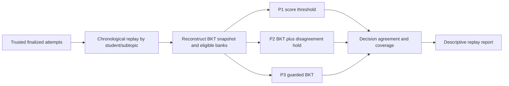
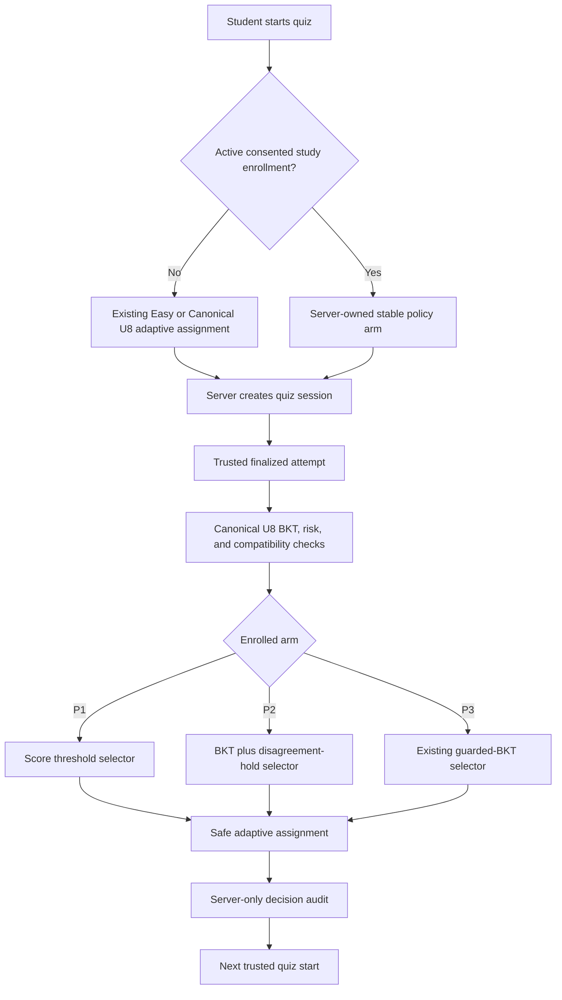

# Adaptive question bank comparison and selection

Created: 2026-07-22

## Purpose

This protocol evaluates whether the Logic Oasis adaptive question-bank selector is safer and more educationally useful than a conventional score threshold and a BKT-plus-score-disagreement policy.

It must not be used to claim that BKT, XGBoost, or Logic Oasis is better until consented, pseudonymized, real runtime evidence satisfies the gates in this document.

The central claim being tested is narrower than “AI is better”:

> For eligible difficulty decisions, the Logic Oasis guarded-BKT policy reduces false promotions without an unacceptable increase in false demotions, while maintaining learner success and reducing unstable difficulty changes.

## Scope and boundaries

### In scope

- A reproducible comparison of three declared bank-selection policies.
- Offline chronological replay using only trusted, finalized runtime attempts.
- A later consented, controlled live pilot to assess causal learning outcomes.
- Explainable charts and pseudonymized decision records suitable for the FYP report and supervisor review.
- A versioned decision, dataset, outcome-window, and reporting contract.

### Out of scope

- Automatic retraining, automatic model promotion, or changing the active adaptive policy during an evaluation run.
- Seed, synthetic, emulator, legacy client-created, or manual AI records as evidence for a performance claim.
- Diagnosis, grading automation, or a claim that one quiz proves a learner is weak or has mastered a topic.
- Raw student identifiers, answer text, answer keys, raw SHAP arrays, or model artifacts in charts or reports.
- A claim that offline replay alone proves that one policy causes better learning.

## Existing contracts to preserve

| Contract | Required use in this protocol |
| --- | --- |
| `docs/architecture/logic-oasis-ai-pipeline-crisp-dm.md` | Controls trusted evidence, frozen prediction target, grouped comparison, BKT/XGBoost/SHAP responsibilities, and claim boundaries. |
| `ai_pipeline/configs/adaptive_policy_v1.yaml` | Controls the current guarded-policy version: BKT thresholds, support-risk thresholds, minimum evidence, one-level movement, reversal protection, fresh-bank preference, and Easy cold start. |
| `ai_pipeline/logic_oasis_ai/adaptive_policy.py` | Is the authoritative executable meaning of the current policy. |
| `ai_pipeline/logic_oasis_ai/prediction_contract.py` | Controls `next_attempt_support_needed`, pseudonymized source rows, compatible pair checks, student grouping, and existing data-sufficiency claim levels. |
| `ai_pipeline/configs/feature_schema.yaml` | Limits the FYP1 classifier features to `quiz-attempt-features-v2` and forbids future information, raw text, IDs, and answer keys. |
| `ai_pipeline/training/evaluate_models.py` | Provides the existing model-comparison report and BKT-feature ablation; it does not itself prove adaptive-policy superiority. |

## Policies under comparison

All policies share the same non-negotiable delivery safety envelope: only active compatible banks, a maximum one-level movement, and no direct client selection of trusted assignments. This evaluation does not add learner-help, parent-dashboard, content-authoring, retraining, or model-promotion UI.

This common envelope isolates the decision logic. It avoids making a baseline artificially unsafe merely to make the candidate look good.

| ID | Policy | Promotion and demotion rule | Role in comparison |
| --- | --- | --- | --- |
| P1 | Traditional score threshold | `correctCount / totalQuestions >= 0.80` moves up one level; otherwise hold. It never automatically demotes. At the Hard bound or with no eligible next bank it holds. | Conventional baseline. |
| P2 | BKT plus score-disagreement hold | The BKT-only direction uses the current `adaptive-policy-v1` BKT thresholds, evidence limits, one-level bound, reversal protection, and Hard-evidence rule, but never support risk. Latest score direction is up at `>= 0.80`, down at `<= 0.40`, otherwise neutral. A BKT up is delivered only with score-up; a BKT down only with score-down; every other combination holds. | Conservative hybrid baseline. |
| P3 | Logic Oasis guarded BKT | Use BKT mastery, evidence count, support risk when a compatible promoted model exists, one-level movement, reversal protection, hard-level evidence requirement, and fresh-bank selection. If no promoted risk model is valid, use the declared BKT/rule fallback and record it. | Candidate policy. |

`policy_evaluation_v1.yaml` must define every branch above, its canonical reason code, unavailable-bank behaviour, and a hash included in the immutable manifest; implementation defaults are forbidden. P3 is deliberately an interpretable BKT estimate with safety guardrails, rather than BKT without rules.

P3 is not “BKT without rules.” Its guardrails are deliberate rules applied to an interpretable BKT estimate. The comparison therefore tests whether well-designed, evidence-aware guardrails are safer than a single-score rule or an extra score veto.

### P3 analysis strata

P3 results must be separated, never silently pooled:

- **P3a: BKT-only guarded policy.** It forcibly bypasses support-risk inference even when a compatible promoted XGBoost artifact exists. Its protected audit records `selectionEvidenceMode: bkt_only_study` and `usedBktFallback: true`.
- **P3b: model-assisted guarded policy.** A compatible, approved XGBoost support-risk artifact was active.

The primary FYP policy claim is P3a versus P1 and P2. P3b is an additional model-assisted analysis only after the Canonical U7 promotion gates are met. This prevents a later model artifact from being mistaken for evidence that BKT alone caused an improvement.

## Questions and pre-registered hypotheses

| ID | Question or hypothesis | Decision rule |
| --- | --- | --- |
| H1 | Does P3a reduce false-promotion burden versus P1? | Confirmatory superiority test with multiplicity control. |
| H2 | Does P3a reduce false-promotion burden versus P2? | Confirmatory superiority test with multiplicity control. |
| H3 | Does P3a avoid an unacceptable increase in false demotions and preserve challenge opportunity versus P1 and P2? | Safety and progression non-inferiority guards. |
| H4 | Does P3a maintain or improve next-level success and reduce oscillation? | Secondary practical-value outcomes. |
| H5 | Does the BKT mastery probability remain calibrated against later eligible outcomes? | Explainability and estimation-quality outcome, not a classifier-superiority claim. |
| H6 | When a promoted model is available, does P3b improve P3a without harming safety? | Separate, exploratory or confirmatory only after its sample-size gate is met. |

Before the first real-data analysis, record the approved false-demotion tolerance (`deltaFD`), confidence level, power target, outcome window, and minimum sample size in an immutable evaluation manifest. Do not choose them after inspecting results.

## Trusted data and eligibility

### Source gate

Include a decision only when its evidence derives from:

- `quizAttempts` with `finalizationStatus: finalized`, `validationStatus: finalized`, and `dataSource: runtime_callable`;
- matching `questionResponses` with `validationStatus: validated`;
- immutable `sourceAttemptSequence`, with response order replayed by `(sourceAttemptSequence, sequenceIndex)`;
- approved real-data provenance and the declared consent/retention status.

Export only HMAC-keyed pseudonymous student identifiers. The HMAC-keyed export is pseudonymized, not anonymous.

### Decision eligibility

An evaluated decision must have a current attempt, source BKT snapshot, current difficulty, eligible active banks, policy version, and an assignment or a recorded safe hold/fallback reason.

Censor and report separately:

- no later eligible attempt in the pre-declared outcome window;
- incompatible year, topic, subtopic, skill, curriculum/content version, or policy-pair transition;
- immediate identical-question repeat;
- revoked or invalidated trusted lineage;
- missing required telemetry or policy/model compatibility metadata.

Same-bank and cross-bank observations are both valid only when their contract compatibility check passes. They must be reported as separate strata.

## Outcome definitions

The outcome window is the first eligible later attempt in the same learner/subtopic sequence, bounded by the pre-registered maximum number of later attempts and calendar duration. The selected bounds must be identical for every policy and must be fixed before the dataset cut.

| Measure | Definition |
| --- | --- |
| Promotion | A decision that assigns the next higher difficulty. |
| Demotion | A decision that assigns the next lower difficulty. |
| Hold | A decision that keeps the current difficulty because evidence is insufficient, conflicting, or within the target zone. |
| Next-level success | In Stage B this is the frozen `next_attempt_support_needed` complement only for an assignment-matched observed later attempt. In Stage C it is the pre-registered policy-independent readiness-probe outcome. |
| False-promotion burden | The proportion of **all eligible randomized index decisions** for which the common Stage-C readiness probe records `support_needed` after an up decision. Report the conditional promoted-learner risk separately, never as the sole primary metric. |
| False demotion / unnecessary hold | A hold or demotion followed by a challenge-ready common probe outcome. In Stage B, without that probe, this is descriptive only and policy-specific assessment/censoring rates are reported. |
| Challenge opportunity | The proportion of all eligible randomized index decisions that receive an up decision. It prevents a policy appearing safer merely by holding everyone. |
| Correct support decision | A pre-registered Stage-C classification from the index decision and common probe, not a value fed back into BKT or a feature vector. |
| Oscillation | A move up followed by a move down, or the reverse, inside the pre-declared decision window. |
| Calibration | The difference between BKT-predicted mastery bands and observed later eligible success bands. |

The `next_attempt_support_needed` label retains its frozen Canonical U7 meaning. Future outcomes label an earlier decision; they must never enter the earlier BKT state, feature vector, score, or assignment decision.

## Evaluation design

### Stage A: mechanics and data-readiness audit

Use emulator, fixture, and synthetic data only to verify determinism, leakage prevention, report generation, and chart rendering.

Required output: a clearly labelled **pipeline demonstration only** report. It must contain no superiority or educational-effect claim.

### Stage B: offline chronological reconstruction and descriptive replay

Replay trusted real learner histories chronologically. At each eligible decision point, reconstruct the state visible at that moment and ask P1, P2, and P3a what they would have decided.

Use a student-grouped split and student-clustered confidence intervals. Keep all attempts from one student in one split. Freeze the random seed, dataset version, BKT version, bank metadata version, feature schema version, model registry status, and policy versions in the evaluation manifest.

Stage B has two explicitly non-causal outputs. **Historical reconstruction** reports proposed transitions, agreement/disagreement, bank availability, and censoring for every eligible historical decision. **Observed-assignment-matched analysis** may report a later outcome only where the candidate-selected difficulty equals the difficulty actually delivered and all compatibility checks pass; every other row is censored as `counterfactual_difficulty_mismatch`. It cannot establish that another policy would have caused a different learning result and must not use off-policy weighting or a causal superiority label.

### Stage C: consented controlled live pilot

Run only after Stage B passes the data-readiness and safety review.

- Allocate each consented learner/subtopic sequence to P1, P2, or P3a using blocked randomization by year level, subtopic, and starting difficulty.
- Keep the assigned policy stable for that learner/subtopic during the study. Do not switch policies after seeing a score.
- Use the shared safety envelope for all arms.
- Measure the primary outcome with a server-selected, policy-independent held-out readiness probe. Forms must be curriculum/content-version matched, balanced across arms, and record form, target difficulty, blueprint, and calibration/equating version. If adequate form overlap/equivalence is unavailable, Stage C stops at feasibility evidence.
- Mark every probe session/attempt `evaluationOnly`. It must never update normal BKT, mastery, adaptive assignments, XGBoost training, model promotion, or parent/student projections.
- Persist server-owned enrollment, decision audit, and probe/outcome records. Clients cannot write or read them.
- Analyse participants by assigned policy (intention-to-treat), including safe holds and withdrawals in the stated censoring report.
- Introduce P3b only in a separately approved phase after a compatible promoted model, model governance, and sufficient data are available.

Stage C is the evidence needed to make a causal statement about learning outcomes. If the pilot is too small, report it as feasibility/safety evidence rather than superiority.

## Statistical and claim protocol

### Confirmatory comparison

The confirmatory comparisons are P3a versus P1 and P3a versus P2 on false-promotion burden per all eligible randomized index decisions. Apply the pre-declared Holm correction to these two comparisons.

Report the absolute risk difference:

`falsePromotionBurden(P3a) - falsePromotionBurden(comparator)`

P3a is superior to a comparator only when the adjusted test and upper bound of the pre-declared 95% student-clustered confidence interval support a reduction below zero, its false-demotion guard passes, and challenge opportunity is non-inferior. It may be described as better than **both** comparators only when these gates pass for both P1 and P2.

### Safety guard

P3a must also satisfy the pre-declared false-demotion non-inferiority bound:

`falseDemotionRate(P3a) - falseDemotionRate(comparator) <= deltaFD`

The value of `deltaFD` must be approved before any result is viewed. A lower false-promotion rate cannot justify an undisclosed or material increase in unnecessary holds/demotions.

### Secondary outcomes

- next-level success, promotion coverage, conditional promoted-learner false-promotion risk, and probe completion rate;
- oscillation rate;
- mean eligible attempts to stable mastery;
- BKT calibration error, Brier score, and reliability curve;
- model-assisted P3b results, when applicable;
- outcomes by year level, starting difficulty, evidence band, same-bank/cross-bank stratum, and sufficient-size consented groups.

Use student-clustered bootstrap confidence intervals. Report intention-to-treat as the primary analysis and a protected, explicitly labelled per-protocol analysis as supplementary; protocol deviations must never be silently dropped.

Before the live pilot, calculate required sample size from the observed baseline false-promotion rate, the smallest meaningful reduction, the planned false-demotion tolerance, clustering by learner, target power of at least 80%, and two-sided alpha of 0.05. Do not use the current Canonical U7 “four students” mechanics gate as a sample-size justification for a superiority claim.

## Explainable evidence package

The final report must publish aggregate/pseudonymized outputs only.

| Visual or table | What it proves or explains |
| --- | --- |
| Policy decision table | Exact policy version, input availability, reason code, assigned difficulty, and later eligible outcome for each pseudonymous decision. |
| Promotion-safety forest plot | False-promotion differences and confidence intervals for P3a versus P1/P2. This is the primary evidence chart. |
| Safety-benefit quadrant | False-promotion difference on one axis and false-demotion difference on the other. P3 is preferable only in the lower-left/safety-acceptable region. |
| Next-level success and oscillation bars | Shows practical learner experience beyond a single accuracy metric. |
| BKT reliability diagram | Compares predicted BKT mastery bands with observed later success rates. |
| Pseudonymized learner timelines | Shows response sequence, BKT posterior, policy reason, assigned level, and later outcome for representative pre-declared cases. |
| Policy transition matrix | Shows Easy/Moderate/Hard movements and identifies excessive back-and-forth changes. |
| Fairness and censoring table | Shows counts, outcome rates, confidence intervals, and censored rows by approved strata. |
| Limitations panel | States sample size, missingness, policy/model fallback rate, content-version coverage, and whether the result is demonstration, preliminary, held-out, or causal-pilot evidence. |

Student and parent interfaces should receive only safe explanatory projections such as “fresh practice is recommended while the system gathers more evidence.” They must not receive counterfactual policy tables, raw probabilities, SHAP values, artifacts, or individual error traces.

## Planned deliverables

| Deliverable | Intended repository location | Minimum contents |
| --- | --- | --- |
| Policy-evaluation manifest | `ai_pipeline/evaluation/` | Dataset version/hash, dates, consent status, policy versions, outcome window, `deltaFD`, randomization/split seed, exclusions, and claim level. |
| Replay evaluator | `ai_pipeline/evaluation/` | Deterministic P1/P2/P3 reconstruction, eligibility/censoring audit, clustered metrics, and no-future-leakage checks. |
| Controlled-pilot allocator | `functions/` and `ai_pipeline/evaluation/` | Server-owned blocked allocation and immutable audit record; no client write path. |
| Aggregate-report generator | `ai_pipeline/evaluation/` and `ai_pipeline/reports/` | Markdown/CSV/figure-ready aggregate report, confidence intervals, calibration, transition, and limitations outputs. |
| Focused tests | `ai_pipeline/tests/` and `functions/tests/` | Determinism, policy isolation, grouping, censoring, leakage denial, access denial, and aggregation safety. |
| FYP evidence appendix | `docs/architecture/` or `docs/reports/` | Supervisor-readable methodology, figures, definitions, results, and claim level. |

These paths are planned locations, not implementation authorization. The canonical implementation plan remains the authority for unit sequencing and scope changes.

## Implementation-ready technical plan

### Architecture decision

Keep the current production path unchanged for non-participants:

The public Flutter contract remains the existing safe `adaptiveAssignments` projection. During a study its public `policyVersion` is the neutral `assignment-delivery-v1`, and its reason code is one of the arm-neutral values `advance_ready`, `build_evidence`, `practice_support`, or `no_eligible_bank`. It must not reveal experiment arm, study ID, audit ID, raw BKT probability, support-risk probability, allocation seed, detailed error, model hash, or counterfactual decisions. A projection allowlist test is mandatory because Firestore Rules cannot redact fields from a readable document.

### Firestore additions and changes

All new collections are server-owned. They require explicit terminal-deny Rules even though the default deny rule would also protect them.

| Collection / document | Required fields | Writer and reader boundary | Purpose |
| --- | --- | --- | --- |
| `policyEvaluationStudies/{studyVersion}` | `studyVersion`, `status` (`draft`, `enrolling`, `active`, `closed`, `archived`), immutable manifest hash, policy versions, outcome/probe protocol versions, `deltaFD`, randomization version, approval reference, lifecycle timestamps | Dedicated evaluation admin only; no client read/write | Frozen study configuration and approval record. |
| `policyEvaluationConsents/{studentId}_{studyVersion}` | `studentId`, `studyVersion`, `status` (`active`, `revoked`, `expired`), `consentRecordRef`, `expiresAt`, `recordedBy` | Dedicated evaluation admin only; no client read/write | Documented approved consent, separate from enrollment. |
| `policyEvaluationEnrollments/{studentId}_y{yearLevel}_{topicId}_{subtopicId}_{studyVersion}` | `studentId`, `yearLevel`, `topicId`, `subtopicId`, `startingDifficulty`, `contextVersion`, `studyVersion`, `assignedArm`, `allocationBlockId`, `allocationVersion`, `consentRef`, `status`, `assignedAt`, `revokedAt` | Dedicated evaluation admin only; no client read/write | Stable blocked-randomized arm for one precise learner/context sequence. |
| `policyEvaluationAllocationBlocks/{studyVersion}_{yearLevel}_{topicId}_{subtopicId}_{startingDifficulty}` | immutable stratum fields, per-arm counts, `updatedAt` | Server-only enrollment transaction | Makes allocation balanced without exposing or trusting a client-side random choice. |
| `policyEvaluationDecisionAudits/{decisionId}` | `decisionId`, `studyVersion`, `enrollmentId`, `attemptId`, `studentId`, `sourceAttemptSequence`, `assignedArm`, `deliveredArm`, `protocolDeviation`, selector/config versions, redacted input snapshot, reason code, selected difficulty/bank, `createdAt` | Canonical U8 runtime only; no client read/write | Create-only evidence for replay and intention-to-treat/per-protocol reporting. |
| `policyEvaluationProbes/{decisionId}` and `policyEvaluationOutcomes/{decisionId}` | probe form/blueprint/target/calibration and separate outcome eligibility, censoring, later probe attempt, result, `computedAt`, outcome version | Canonical U8 runtime only; no client read/write | Policy-independent outcome measurement; retried computation is idempotent. |
| `policyEvaluationAdminAudits/{auditId}` | actor UID, action, study/enrollment reference, supervisor approval reference, rationale, timestamp | Admin callable only; no client read/write | Audits study creation, enrollment, revocation, and closure. |

Do not add the arm or audit ID to `adaptiveAssignments`, `subtopicMastery`, `studentAiStatuses`, `quizAttempts`, or any client-readable document. Firestore Rules cannot redact fields from an otherwise readable document. Server-side export joins audit records to trusted attempts by `attemptId`.

Update `docs/architecture/logic-oasis-firestore-database-schema.md` during implementation with the collection table, explicit client-denial boundary, retention owner, and the fact that these records are pseudonymized on export rather than anonymous.

### Configuration, identity, and package contract

| Change | Concrete location | Required behaviour |
| --- | --- | --- |
| Evaluation-policy manifest | `ai_pipeline/configs/policy_evaluation_v1.yaml` | Declares the complete P1/P2/P3a/P3b decision table, score denominator/threshold inclusivity, neutral and unavailable-bank branches, common safety envelope, probe/outcome version, claim labels, and study status. It is immutable after an approved study starts. |
| Allocation secret | Firebase Secret Manager value `POLICY_EVALUATION_ALLOCATION_KEY` | A dedicated HMAC key for allocation tie-breaking and audit verification. Never reuse the real-data-export HMAC key and never expose the value to clients, reports, or logs. |
| Authoritative evaluation package | `ai_pipeline/logic_oasis_ai/policy_evaluation.py` and related modules | Holds typed policy decisions, deterministic IDs, manifest validation, P1/P2 selectors, and common eligibility checks. |
| Functions bundle parity | `tools/build_function_bundle.py`, `functions/vendor/`, `functions/vendor/bundle_manifest.json` | Copies the authoritative evaluation package/configuration into the deployed Functions boundary and hashes it with the existing feature, ranking, and adaptive-policy contracts. |
| Study administration | `functions/policy_evaluation_admin.py`, `tools/bootstrap_policy_evaluation_admin.py` | A dedicated `policyEvaluationAdmin` Firebase custom claim manages study, consent, enrollment, revocation, and closure. The bootstrap identity grants/revokes that claim, revokes refresh tokens, and writes append-only admin audits; it never reuses parent-link administration. |
| Function configuration | `functions/main.py` and deployment manifest tests | `managePolicyEvaluationEnrollment` runs as `logic-oasis-policy-evaluation-admin@logic-oasis-fyp.iam.gserviceaccount.com` and alone receives `POLICY_EVALUATION_ALLOCATION_KEY`; it allocates at enrollment. `startQuizSession`, submit/finalize callables, and the U8 trigger only read immutable enrollment and receive no allocation secret. An inactive study leaves normal quiz starts operational. |
| Export identity and retention | `tools/export_policy_evaluation_release.py`, dedicated release bucket/prefix | `logic-oasis-policy-evaluation-export@logic-oasis-fyp.iam.gserviceaccount.com` uses short-lived impersonation, may read Firestore and only the export HMAC secret, and may write only the dedicated release prefix under an IAM condition. Lifecycle retention deletes releases; a server/admin cleanup writes a non-sensitive deletion audit. |

The active model-registry compatibility check remains unchanged. P3a must explicitly record the BKT/rule fallback when no valid promoted risk model exists. P3b may run only when the existing artifact, feature-schema, ranking-policy, and adaptive-policy compatibility checks pass.

### Implementation units

### AQC-1. Freeze the policy-evaluation manifest and typed policy contract

**Goal:** Create one immutable contract for P1, P2, P3a, P3b, outcome definitions, study status, and common safety limits.

**Dependencies:** Existing `ai_pipeline/configs/adaptive_policy_v1.yaml`, `ai_pipeline/logic_oasis_ai/adaptive_policy.py`, and the Canonical U7 prediction contract.

**Files:**

- Create `ai_pipeline/configs/policy_evaluation_v1.yaml`.
- Create `ai_pipeline/logic_oasis_ai/policy_evaluation.py`.
- Modify `ai_pipeline/logic_oasis_ai/__init__.py` only if package exports are an established convention.
- Create `ai_pipeline/tests/test_policy_evaluation_contract.py`.
- Modify `tools/build_function_bundle.py`.
- Regenerate `functions/vendor/logic_oasis_ai/policy_evaluation.py`, `functions/vendor/configs/policy_evaluation_v1.yaml`, and `functions/vendor/bundle_manifest.json` through the bundle builder only.
- Modify `tools/tests/test_function_bundle_parity.py`.

**Approach:** Define typed immutable records for study configuration, eligibility, candidate decision, allocation arm, and decision-audit payload. Implement P1 and P2 as pure selectors over the same server-derived context used by P3. P1 and P2 must implement the complete normative table above, including bounds, unavailable banks, equality, neutral score, hard-evidence, and canonical reason-code branches. P3a forcibly bypasses model-risk inference; P3b is a separately versioned/approved phase. Each selector receives eligible banks and the shared one-level/fresh-bank safety envelope rather than selecting arbitrary questions.

**Test scenarios:**

- P1 promotes exactly at the configured threshold and stays below it; it cannot jump more than one level.
- P2 holds on each declared promotion and demotion disagreement, and otherwise follows its declared BKT direction.
- P3a and P3b carry their distinct fallback/model-assisted status and never share a claim label.
- Invalid, missing, or altered manifest fields fail closed; hard-coded defaults cannot silently start a study.
- A repeated input produces the same policy decision ID and canonical reason code.
- Bundle-parity testing proves the deployed package/configuration hashes match the authoritative source.

**Verification:** A fixture-only test report can reproduce all policy decisions, but is labelled demonstration-only and cannot produce a performance claim.

### AQC-2. Build the offline reconstruction, descriptive outcome, and metrics pipeline

**Goal:** Compare P1, P2, and P3 on the same chronological trusted histories without future leakage.

**Dependencies:** AQC-1; `ai_pipeline/logic_oasis_ai/sources/firestore_source.py`; the Canonical U7 prediction contract; `ai_pipeline/training/export_real_attempts.py`.

**Files:**

- Create `ai_pipeline/evaluation/__init__.py`.
- Create `ai_pipeline/evaluation/manifest.py`.
- Create `ai_pipeline/evaluation/replay.py`.
- Create `ai_pipeline/evaluation/outcomes.py`.
- Create `ai_pipeline/evaluation/metrics.py`.
- Create `ai_pipeline/evaluation/reporting.py`.
- Create `ai_pipeline/evaluation/run_policy_comparison.py`.
- Modify `ai_pipeline/training/export_real_attempts.py`.
- Modify `ai_pipeline/logic_oasis_ai/sources/csv_source.py` and `ai_pipeline/logic_oasis_ai/sources/firestore_source.py` only to validate/export the new server-only audit join fields.
- Create `ai_pipeline/tests/test_policy_replay.py`.
- Create `ai_pipeline/tests/test_policy_outcomes.py`.
- Create `ai_pipeline/tests/test_policy_metrics.py`.
- Create `ai_pipeline/tests/test_policy_export_contract.py`.

**Approach:** Create an immutable run manifest that records data-release hash, HMAC namespace, source/feature/BKT/policy versions, outcome-window settings, censoring rules, random seed, and claim level. Reconstruct each decision using attempts ordered by `(sourceAttemptSequence, sequenceIndex)`. Produce all three counterfactual decisions from the state available before the later attempt is read. Stage-B output is limited to reconstruction/coverage and observed-assignment-matched descriptive outcomes; a candidate-selected difficulty that differs from the actual delivered difficulty is censored as `counterfactual_difficulty_mismatch`. Store later outcomes only in a separate outcome record.

The replay must join policy decision audits by server attempt ID, create a complete censoring audit, and retain same-bank/cross-bank strata. Existing `next_attempt_support_needed` remains the frozen label for later support need; it is not added as a current feature.

**Test scenarios:**

- Attempts from one student never appear in both train and held-out groups.
- A later response, score, bank, or content version cannot change an earlier reconstructed policy decision.
- Each censor reason in this protocol produces a counted, non-scored audit row.
- Same-bank and compatible cross-bank rows are separately reported; incompatible transitions and immediate repeats are excluded from primary outcomes.
- Identical trusted exports and manifest produce identical ordered decisions and report hashes.
- Seed, synthetic, legacy, missing-lineage, raw-ID, raw-answer-text, and answer-key inputs are rejected from real-data runs.
- HMAC pseudonymization remains stable for the same protected key and differs across namespaces.
- An observed later outcome is never attributed to a candidate policy whose selected difficulty differs from the actually delivered difficulty.

**Verification:** The evaluator emits a machine-readable result plus a human-readable aggregate report containing policy counts, outcome/censoring counts, metrics, confidence intervals, and explicit claim level.

### AQC-3. Generate calibration, safety, and explainability evidence

**Goal:** Produce the visuals and tables required to assess P3 without exposing protected data or overstating causality.

**Dependencies:** AQC-2 and the existing Canonical U7 model-comparison report contract.

**Files:**

- Create `ai_pipeline/evaluation/visualizations.py`.
- Create `ai_pipeline/evaluation/report_templates.py`.
- Create `ai_pipeline/reports/policy_comparison_template.md`.
- Create `ai_pipeline/tests/test_policy_reporting.py`.
- Modify `ai_pipeline/reports/model_comparison.md` only to cross-link the separate policy comparison and preserve its existing model-only claim boundary.

**Approach:** Generate aggregate markdown/CSV/figure-ready data for the promotion-safety forest plot, safety-benefit quadrant, next-level success/oscillation bars, BKT reliability curve, transition matrix, decision audit table, fairness/censoring table, and limitations panel. Use student-clustered bootstrap intervals. The report must distinguish offline observational replay from a randomized pilot and must treat P3b as separate from P3a.

**Test scenarios:**

- A report with insufficient real data prints `pipeline_demo_only` or `preliminary_comparison`, never “superior.”
- The primary risk difference, false-demotion guard, confidence interval, and sample denominator appear consistently in machine and markdown outputs.
- Calibration bins with too few observations are suppressed or labelled insufficient rather than plotted as reliable.
- Report output contains no raw student ID, answer text, answer key, SHAP array, artifact hash, email, or internal error trace.
- Figure data and tabular metrics reconcile to the same decision and censoring totals.

**Verification:** Reviewers can trace every plotted aggregate to a pseudonymized, versioned manifest and can see why a claim was permitted, downgraded, or rejected.

### AQC-4. Add study control, consented enrollment, and server-side allocation

**Goal:** Enrol only approved students, allocate a stable balanced policy arm per learner/subtopic, and keep allocation hidden from clients.

**Dependencies:** AQC-1 to AQC-3; a recorded Stage-B go/no-go decision; the existing Firebase Auth custom-claim pattern in `functions/parent_link_admin.py`; existing server-owned quiz start flow in `functions/main.py`.

**Files:**

- Create `functions/policy_evaluation.py`.
- Create `functions/policy_evaluation_admin.py` and `tools/bootstrap_policy_evaluation_admin.py`.
- Modify `functions/main.py`.
- Modify `functions/requirements.txt` only if a required dependency is not already available.
- Modify `firestore.rules`.
- Modify `docs/architecture/logic-oasis-firestore-database-schema.md`.
- Create `functions/tests/test_policy_evaluation_enrollment.py`.
- Create `functions/tests/test_policy_evaluation_rules.py`.
- Modify `functions/tests/test_start_quiz_session_adaptive.py`.

**Approach:** Add audited `managePolicyEvaluationStudy`, `recordPolicyEvaluationConsent`, and `managePolicyEvaluationEnrollment` callables protected by a new dedicated `policyEvaluationAdmin` Firebase custom claim. The control plane owns draft/enrolling/active/closed/archived study lifecycle, freezes the manifest when active, requires supervisor approval reference and rationale, records only documented active/revoked/expired consent, and creates/revokes only the declared enrollment. A separate bootstrap identity grants/revokes the claim, revokes refresh tokens, and writes append-only admin audits. Do not reuse the parent-link administrator claim.

At protected enrollment, an Admin SDK transaction captures year level, topic, subtopic, starting difficulty, and context version; writes the deterministic enrollment; updates the appropriate allocation-block counter; and selects the lowest-count arm, using the dedicated HMAC allocation key only to break ties. `startQuizSession` only reads the immutable enrollment. A learner who is not enrolled follows the unchanged production adaptive path.

The allocation must be server-owned and immutable after the learner starts that study/subtopic. Revocation stops future experimental decisions and safely returns the learner to the current production P3 path; it does not rewrite historical audit evidence.

**Test scenarios:**

- An unauthenticated, student, parent, or token without `policyEvaluationAdmin` cannot enroll, revoke, inspect, or alter a study allocation.
- Active consent plus valid approval creates one stable enrollment; duplicate calls return the original enrollment and do not increment an allocation block twice.
- Revoked/expired consent, closed study, missing allocation secret, and invalid policy version fail safely without changing the active adaptive assignment.
- Concurrent enrollments keep allocation-block counts consistent and never assign two arms to one learner/subtopic/study key.
- A non-enrolled learner receives the exact pre-existing cold-start/runtime-adaptive behaviour.
- Emulator Rules deny direct client reads/writes for every evaluation collection while preserving existing safe reads of `adaptiveAssignments`.

**Verification:** A disposable emulator account can be enrolled and revoked through the protected callable; direct Firestore access is denied and normal students remain unaffected.

### AQC-5. Integrate live arms and policy-independent probes into finalized-attempt processing

**Goal:** Use the allocated policy to generate the next safe assignment and immutable audit at the existing U8 finalization boundary.

**Dependencies:** AQC-1, AQC-4, existing Canonical U8 `functions/ai_runtime.py`, `functions/main.py`, and `functions/quiz_session.py`.

**Files:**

- Modify `functions/ai_runtime.py`.
- Modify `functions/main.py`.
- Modify `functions/quiz_session.py` only if server session metadata needs a non-client-readable internal link.
- Modify `functions/tests/test_ai_runtime.py`.
- Modify `functions/tests/test_quiz_trigger.py`.
- Modify `functions/tests/test_attempt_validation.py`.
- Create `functions/tests/test_policy_evaluation_runtime.py`.
- Modify `tools/build_function_bundle.py` and parity tests if U1 did not already cover the runtime import.

**Approach:** Extend the existing finalization boundary so it first runs the unchanged trusted-source, BKT, model-registry, feature-schema, ranking-policy, and adaptive-policy compatibility checks. When no active enrollment exists, persist the current P3 result unchanged. When an enrollment exists, invoke the selected P1/P2/P3 selector using the same eligible-bank list and persist one blinded safe `adaptiveAssignments` projection plus one create-only server-only decision audit. It also schedules a balanced server-selected evaluation-only probe and later writes a separate idempotent outcome record; probe attempts are excluded from BKT, mastery, adaptive assignment, training, and promotion inputs.

The audit records the source attempt, arm, selector/configuration versions, redacted input values, reason code, selected bank/difficulty, fallback state, and deterministic decision ID. Retried triggers must return the same terminal job and audit without duplicate assignments, audit rows, or block-count changes.

**Test scenarios:**

- P1, P2, and P3 choose only compatible active banks and preserve one-level/fresh-bank rules.
- P2 hold behaviour uses the declared BKT-versus-score disagreement and records a safe reason.
- P3a records `usedBktFallback: true` when a promoted model is unavailable; P3b cannot run with an incompatible registry/artifact/configuration bundle.
- The transaction creates one assignment and one audit on first finalization; retry, duplicate Eventarc delivery, and delayed older attempt are idempotent and cannot replace a newer projection.
- A failed evaluation selector leaves the learner with the declared existing safe P3 fallback and a protected error/audit state; no raw error reaches a client.
- Attempt finalization, question sealing, correct-answer validation, and client answer-key denial continue to pass unchanged.
- Probe forms are balanced across arms; they expose no study arm and cannot contaminate normal learning or AI evidence.

**Verification:** An emulator integration test completes a five-question quiz for one disposable enrolled learner, confirms the assigned arm drives the next bank, and verifies P3 remains unchanged for a disposable non-participant.

### AQC-6. Secure real-data export, probe outcomes, and controlled-pilot reporting

**Goal:** Export only approved evaluation evidence and make live-pilot outcomes available to the offline evaluator without exposing raw operational records.

**Dependencies:** AQC-2 to AQC-5, existing `ai_pipeline/training/export_real_attempts.py`.

**Files:**

- Modify `ai_pipeline/training/export_real_attempts.py`.
- Create `ai_pipeline/training/export_policy_evaluation_release.py`.
- Create `ai_pipeline/tests/test_policy_evaluation_release_governance.py`.
- Modify `ai_pipeline/tests/test_real_data_release_governance.py`.
- Create `tools/verify_policy_evaluation_live.py`.
- Create `tools/tests/test_verify_policy_evaluation_live_contract.py`.
- Create `tools/deploy_policy_evaluation_export_iam.py` and a release-retention cleanup contract/test.

**Approach:** Require an approved closed or bounded study manifest, a dedicated export HMAC key, and server-only joins between trusted attempts, create-only policy-audit records, and separate probe/outcome documents. The dedicated export identity runs only through short-lived impersonation, accesses only its export HMAC secret, and writes only a dedicated release bucket/prefix protected by an IAM condition and lifecycle retention. Export only pseudonymous assigned/delivered arm, policy version, decision/probe/outcome/censoring fields, protocol-deviation flags, and aggregate-compatible bank metadata. Exclude raw user IDs, email, raw response/answer text, answer keys, AI job errors, SHAP arrays, and model artifact paths. Produce a release manifest with hashes for every CSV/report source and append-only deletion/retention evidence.

**Test scenarios:**

- An export fails if consent, provenance, decision audit, attempt lineage, policy version, or HMAC key is missing or inconsistent.
- A synthetic, emulator, seed, legacy, or manually inserted audit cannot enter a final release.
- The export contains no prohibited personal, answer, model-artifact, or internal-error fields.
- Re-running an approved export is deterministic for the same immutable data cut and manifest.
- A revoked enrollment remains represented only as historical pseudonymous audit evidence and cannot receive new study decisions.
- A disposable export identity may create only its dedicated release prefix; lifecycle/cleanup deletion produces a non-sensitive audit and no Functions/client identity can read the release artifact.

**Verification:** A controlled release produces a manifest, validated CSV inputs, aggregate report, and a deletion/retention audit suitable for supervisor review.

### AQC-7. Deploy in stages and verify the end-to-end study boundary

**Goal:** Release the policy-comparison system without disrupting the normal adaptive-learning path.

**Dependencies:** AQC-1 through AQC-6 and explicit supervisor approval of the study manifest, consent process, probe/form feasibility, sample-size calculation, secrets, IAM, retention configuration, and deployment window.

**Files:**

- Modify `firebase.json` only if emulator/deployment configuration needs the new callable discovery or deployment hook.
- Create `tools/deploy_policy_evaluation_iam.py` and `tools/tests/test_policy_evaluation_iam_contract.py`.
- Create `tools/tests/test_policy_evaluation_deployment_contract.py`.
- Create `docs/reports/` output only after a real approved run; do not commit participant-level exports.

**Approach:** Build and verify the Functions vendor bundle before deployment. Apply the allocation-secret accessor only to the dedicated evaluation-admin runtime; retain existing Canonical U8 runtime identity for finalization without that secret. Apply separate impersonation/export-HMAC/release-prefix IAM only to the export identity. Deploy Functions and Firestore Rules together, then run a disposable-account verification before enrolling a real participant. Deploy no model artifact merely to start P1/P2/P3a; P3b remains blocked by the existing Canonical U7/U8 model promotion contract.

**Test scenarios:**

- The deployment-contract test fails when the generated bundle omits the evaluation package/configuration hash or binds the allocation secret to an unrelated Function.
- The IAM-helper test fails when the dedicated evaluation-admin identity lacks the allocation-secret accessor, when any unrelated callable receives it, or when an identity receives a broader role.
- Firestore Rules emulator tests deny every evaluation collection to student, parent, unrelated, revoked, and unauthenticated identities.
- A disposable admin can create a study/consent/enrollment and a disposable student can complete a quiz; the next assignment and server audit use the allocated arm.
- A disposable non-participant completes the same flow and receives the existing production P3/cold-start behaviour.
- Duplicate start/finalize/trigger deliveries do not duplicate allocation, audit, assignment, or aggregate counts.

**Deployment verification:**

- The generated Functions manifest contains the evaluation package/configuration hashes and the allocation secret only where required.
- Firestore Rules deployment matches the passing emulator source and compiles successfully.
- The authenticated disposable-account smoke test is run against the deployed project and then fully cleaned up.
- Exported disposable data is marked test-only and deleted; no result from it is included in a real comparison report.

**Verification:** Record deployment revision, bundle hash, Rules emulator result, callable result, protected-access denials, non-participant regression result, and cleanup evidence in the study release record.

## Stage-B go/no-go and implementation sequence

1. AQC-1 establishes the immutable policy and package contract.
2. AQC-2 and AQC-3 make offline reconstruction and descriptive evidence reporting reproducible before any live allocation exists.
3. Before AQC-4, record a supervisor-approved go/no-go finding that confirms: trusted-source/compatibility readiness; frozen P1/P2/P3a and outcome/probe protocol; adequate calibrated/balanced probe-form feasibility; a feasible clustered power calculation; approved study/consent/retention procedure; and deployment authorization.
4. If that gate fails, stop cleanly after AQC-1 to AQC-3 and publish only a pipeline demonstration or preliminary descriptive report. Do not create live enrollments or make a superiority claim.
5. AQC-4 and AQC-5 add the consented, server-owned pilot as a sidecar: only the Canonical U8 finalization branch changes for enrolled learners; all non-participant U3–U12 behaviour stays unchanged.
6. AQC-6 controls approved real-data release and AQC-7 deploys/verifies the pilot boundary. Only then can Stage C collect evidence.

## Acceptance gates

### Mechanics gate

- Replaying the same manifest and trusted dataset produces identical decisions and aggregate report hashes.
- Every decision exposes its policy version and safe reason code.
- Tests prove no future attempt, answer key, raw answer text, student ID, seed data, or client-created record influences a decision or final claim.
- Rules deny clients direct reads/writes of evaluation assignments, raw decision records, and protected evaluation artifacts.
- Tests prove normal non-participant start/finalize behaviour is unchanged; only an enrolled finalization can branch to the sidecar selector.
- Client-readable assignments contain only the neutral delivery version and arm-neutral reason codes.
- Evaluation-only probes cannot alter normal BKT, mastery, adaptive assignments, training data, or model promotion.

### Real-data evaluation gate

- Data is consented, approved, HMAC-pseudonymized, trusted, and passes the declared source/lineage audit.
- All policy versions, data cut, content compatibility, censoring rules, outcome window, and statistical settings are frozen before analysis.
- Both outcome classes and enough independent learners exist for the pre-calculated sample-size requirement.
- The report includes all primary, secondary, fairness, calibration, censoring, and limitation outputs.
- Stage-C reports intention-to-treat false-promotion burden over all eligible decisions, conditional promoted-learner risk, challenge opportunity, probe completion, protocol deviations, and per-arm censoring.

### Superiority-claim gate

The final report may state that P3a outperformed both comparators only if both multiplicity-adjusted false-promotion-burden superiority criteria pass, both false-demotion and challenge-opportunity non-inferiority guards pass, and the result comes from the approved controlled live pilot. Stage B may only make an explicitly descriptive observed-assignment-matched decision-quality statement.

If a gate fails, the correct conclusion is a feasibility, calibration, or preliminary comparison finding. It is not evidence that the candidate policy is superior.

## Risks and mitigations

| Risk | Mitigation |
| --- | --- |
| Small FYP sample produces unstable results | Perform a power calculation; publish confidence intervals; downgrade the claim level rather than overstate results. |
| Historical replay is treated as causal evidence | Label Stage B observational; reserve causal learning claims for Stage C randomization. |
| A policy wins by holding most learners | Use false-promotion burden over all eligible randomized decisions; also require non-inferior challenge opportunity and report conditional promoted-learner risk. |
| Outcome form effects are mistaken for policy effects | Use a policy-independent balanced/calibrated readiness probe; stop at feasibility evidence when form equivalence or overlap is inadequate. |
| Policies are compared with unequal safety controls | Apply the same bank availability and one-level delivery envelope to every arm. |
| Future information leaks into a decision | Reconstruct every state chronologically and test that later attempts are label-only. |
| XGBoost confounds a BKT-policy claim | Separate P3a fallback from P3b model-assisted strata. |
| Missing later attempts bias outcomes | Report censoring by policy and stratum; do not convert missing outcomes into success or failure. |
| Content differences, repeats, or bank exposure distort results | Use compatible-pair checks, immediate-repeat censoring, and same-bank/cross-bank reporting. |
| Parent/student privacy is weakened by evidence reporting | Use aggregate or HMAC-pseudonymous outputs and retain protected raw records server-side only. |
| Evaluation access becomes a broad production privilege | Use dedicated study-admin and export identities, secret bindings, release prefix, retention lifecycle, and terminal Rule denies. |

## Definition of a successful comparison

The comparison is successful when it produces reproducible, explainable, privacy-safe evidence for or against the guarded-BKT policy.

Success does not require P3 to win. A credible result may show that the score-only baseline is adequate, that P2 is safer in this dataset, or that more data is needed. The FYP value is the transparent, fair method for making that conclusion rather than an unsupported opinion that “BKT is better.”
